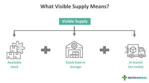

## Table of Contents

## What is visible supply?

Visible supply refers to the amount of a product that is available and can be seen in the market at any given time. This includes goods that are stored in warehouses, displayed in stores, or being transported. It is important for businesses because it helps them understand how much of their product is readily available to customers.

Knowing the visible supply helps companies make decisions about production and distribution. If the visible supply is low, a company might need to produce more goods to meet demand. On the other hand, if the visible supply is high, the company might slow down production to avoid having too much stock that doesn't sell. This balance is crucial for keeping customers happy and the business running smoothly.

## How does visible supply differ from invisible supply?

Visible supply is the amount of a product that you can see and count in the market. This includes products in stores, in warehouses, or on trucks being moved around. It's easy to keep track of because you can see it and know exactly how much is available for people to buy.

Invisible supply, on the other hand, is trickier. It's the amount of a product that isn't in the market yet but will be soon. This can be products that are still being made in factories or goods that are on their way from far away places. You can't see this supply, so it's harder to know exactly how much is coming, but it's still important because it will affect how much product will be available in the future.

## What are the main components of visible supply?

Visible supply includes the products that you can see and count easily. This means the goods that are sitting on the shelves in stores where customers can buy them. It also includes the products that are stored in warehouses, waiting to be sent to stores or directly to customers. These are all part of the visible supply because they are already made and ready to be sold.

Another part of visible supply is the products that are being moved around. This includes goods that are on trucks, ships, or trains, traveling from one place to another. Even though they are not in a store yet, they are still counted as visible supply because they are finished products that will soon be available for customers to buy.

## How is visible supply measured?

Visible supply is measured by counting all the products that you can see and easily find. This means adding up all the goods that are sitting on store shelves, ready for customers to buy. It also includes counting the products that are stored in warehouses, waiting to be sent out. These are all part of the visible supply because they are already made and ready to be sold.

Another way to measure visible supply is by tracking the products that are being moved around. This includes goods that are on trucks, ships, or trains, traveling from one place to another. Even though they are not in a store yet, they are still counted as visible supply because they are finished products that will soon be available for customers to buy. By keeping track of all these different places, businesses can know exactly how much of their product is out there and ready to be sold.

## What role does visible supply play in market analysis?

Visible supply is really important when people are trying to understand what's going on in the market. It's like a snapshot of how much of a product is out there right now. By looking at the visible supply, businesses can figure out if there's enough of their product for everyone who wants to buy it. If the visible supply is low, it might mean that the product is popular and selling fast, which could be a good sign for the business. But if it's too low, it could also mean that they need to make more to keep up with demand.

On the other hand, if the visible supply is high, it might mean that there's more of the product than people want to buy right now. This can help businesses decide if they need to slow down making new products or maybe even offer sales to get rid of extra stock. By keeping an eye on visible supply, companies can make smarter choices about how much to produce and how to price their goods. This helps them stay competitive and meet customer needs better.

## How does visible supply impact commodity pricing?

Visible supply can have a big impact on how much people have to pay for commodities. When there's a lot of a commodity available, like a lot of wheat in the warehouses and stores, the price usually goes down. This is because there's more than enough for everyone who wants to buy it, so sellers might lower the price to get people to buy it. But if there's not much of the commodity around, like if there's only a little bit of oil in the market, the price can go up. People who need the commodity might be willing to pay more because it's hard to find.

Knowing about visible supply helps businesses and traders decide what to do. If they see that the visible supply of a commodity is going down, they might think the price will go up soon. So, they might buy more now to sell later at a higher price. On the other hand, if they see a lot of the commodity around, they might wait to buy it, expecting the price to drop. This way, they can make better decisions about when to buy and sell, which can affect how much they earn.

## Can visible supply data be used to predict market trends?

Visible supply data can help people guess what might happen in the market. When you know how much of a product is out there, you can see if there's a lot or a little of it. If there's a lot, it might mean that prices could go down because there's enough for everyone. But if there's not much, prices might go up because people will have to pay more to get it. By watching how the visible supply changes over time, people can make guesses about where prices might be headed.

For example, if the visible supply of a product like wheat starts to get smaller and smaller, it might mean that there will be less wheat available soon. This could make the price of wheat go up because farmers and stores might not have enough to sell. On the other hand, if the visible supply of wheat starts to grow, it might mean that there will be more wheat around, which could make the price go down. By keeping an eye on these changes, businesses and traders can try to predict what the market will do next and make plans accordingly.

## What are the challenges in accurately tracking visible supply?

Tracking visible supply can be hard because it involves keeping an eye on products in many different places. You have to count the goods in stores, in warehouses, and even on trucks and ships. This means you need a good system to keep track of everything, and sometimes the information might not be up to date or correct. For example, if a truck with goods gets delayed, the visible supply might look smaller than it really is.

Another challenge is that different parts of the supply chain might use different ways to track things. Some might use computers and scanners, while others might still use paper and pencils. This can make it tough to get a clear picture of the whole visible supply. Also, if the information from one place doesn't match with another, it can be confusing and lead to mistakes in planning and decision-making.

## How do businesses use visible supply information in their planning?

Businesses use visible supply information to plan how much of their product they need to make and when. By knowing how much of their product is out there in stores, warehouses, and on the way, they can see if they have enough to meet customer demand. If the visible supply is low, it might mean they need to make more products quickly to avoid running out. But if the visible supply is high, they might decide to slow down production because there's already plenty of the product available.

This information also helps businesses decide on pricing and sales strategies. If they see that the visible supply is going down, they might think prices will go up soon, so they could plan to buy more materials now to make more products later at a higher price. On the other hand, if the visible supply is high, they might offer sales or discounts to move the extra stock and keep the business running smoothly. By using visible supply data, businesses can make smarter choices to keep customers happy and stay competitive in the market.

## What technologies are used to monitor visible supply?

Businesses use many technologies to keep track of visible supply. One common technology is inventory management systems. These are computer programs that help businesses see how much of their product is in stores, warehouses, and on the move. They use scanners and barcode readers to keep everything updated in real-time. This way, companies can know exactly how much of their product is out there at any time.

Another technology is RFID, which stands for Radio Frequency Identification. RFID tags are small chips that can be put on products. These tags can be read by special scanners without needing to be seen, making it easier to track goods in warehouses and on trucks. GPS technology is also used to monitor the location of products that are being shipped. By using these technologies, businesses can get a clear picture of their visible supply and make better decisions about production and sales.

## How has the concept of visible supply evolved over time?

The idea of visible supply has changed a lot over time. In the past, keeping track of how much product was available meant counting things by hand. People would go to stores and warehouses to see how much was on the shelves and in storage. This was slow and could be wrong if they missed counting something. As businesses grew bigger and spread out over more places, it became harder to know exactly how much product was out there just by looking.

Now, with new technology, it's much easier to keep track of visible supply. Businesses use computers and special systems to watch how much product is in stores, warehouses, and even on trucks and ships. These systems update all the time, so companies can see exactly how much of their product is available right now. This helps them make better decisions about making more products or offering sales, and it's all much faster and more accurate than the old ways of counting by hand.

## What are the global differences in visible supply management and reporting?

Visible supply management and reporting can be different around the world because each country might have its own ways of doing things. In some places, businesses might use very advanced computer systems to keep track of their products. They can see exactly how much is in stores, warehouses, and on trucks. But in other places, they might still use simpler methods like writing things down on paper. This can make it harder to know how much product is out there and can lead to mistakes. Also, some countries have strict rules about how businesses need to report their supply, while others might be more relaxed.

These differences can make it tricky for companies that work in many countries. They need to use different systems and follow different rules in each place. For example, a company in the United States might use high-tech scanners and computers to manage visible supply, while the same company in a smaller country might rely on people counting products by hand. This means the company needs to find ways to make sure all the information comes together correctly, so they can make good decisions about how much to make and where to sell their products.

## What is the role of visible supply in algorithmic trading?

Algorithmic trading utilizes sophisticated computer programs to automatically execute trades based on established criteria, leveraging speed and efficiency to capitalize on market opportunities. A crucial element in refining these strategies is the incorporation of visible supply data, which refers to the readily quantifiable amount of goods available for sale or in transit. This data serves as a pivotal input, aiding traders in predicting market trends and identifying optimal trading opportunities.

Visible supply data plays an influential role in market forecasting by providing insights into supply-demand dynamics. For instance, in the commodity markets, an abundance of visible supply might indicate potential price suppression due to oversupply, thereby prompting [algorithmic trading](/wiki/algorithmic-trading) systems to sell positions in anticipation of price drops. Conversely, a shortage in visible supply might signal scarcity, leading to price increases and a prospective buying opportunity. 

Integrating visible supply data into algorithmic models can enhance trading strategies through predictive analytics. Traders can utilize regression analysis or [machine learning](/wiki/machine-learning) techniques to discern patterns linking visible supply levels with price movements. For example, consider a basic linear regression model:

$$
\text{Price Change} = \beta_0 + \beta_1 \times \text{Visible Supply} + \epsilon
$$

where $\beta_0$ is the intercept, $\beta_1$ is the coefficient that measures the change in price for each unit change in visible supply, and $\epsilon$ represents the error term. This model can help predict how changes in visible supply might affect prices, supplying actionable insights that can be incorporated into trading algorithms.

Illustrative case studies underscore the efficacy of visible supply data in algorithmic trading. For instance, in the municipal bond market, visible supply figures often indicate upcoming bond issuances, impacting interest rates and pricing structures. Algorithm-driven models that incorporate this data can adjust bond portfolios dynamically, optimizing yield based on anticipated market shifts due to supply changes.

A practical example of applying algorithmic trading with visible supply data can be seen in Python's Pandas and scikit-learn libraries. Using these tools, traders can develop models to analyze historical supply data against price movements and set automated triggers for executing trades. Here is a simple example of implementing a linear regression model in Python:

```python
import pandas as pd
from sklearn.linear_model import LinearRegression

# Load the dataset containing visible supply and price data
data = pd.read_csv('supply_price_data.csv')

# Define the predictor and target variables
X = data[['Visible_Supply']]
y = data['Price_Change']

# Initialize and fit the linear regression model
model = LinearRegression()
model.fit(X, y)

# Predict price changes based on visible supply 
predicted_price_change = model.predict(X)

# Display the predicted price change values
print(predicted_price_change)
```

The inclusion of visible supply metrics can significantly enhance the effectiveness of algorithmic trading approaches. By carefully analyzing and correctly interpreting this data, traders gain a potent tool for navigating the complexities of financial markets, enabling more precise and timely investment decisions. The continuous refinement and adaptation of models to incorporate such data reflect an advanced trading practice that embraces both quantitative and qualitative insights.

## References & Further Reading

[1]: Bergstra, J., Bardenet, R., Bengio, Y., & Kégl, B. (2011). ["Algorithms for Hyper-Parameter Optimization."](https://dl.acm.org/doi/10.5555/2986459.2986743) Advances in Neural Information Processing Systems 24.

[2]: ["Advances in Financial Machine Learning"](https://www.amazon.com/Advances-Financial-Machine-Learning-Marcos/dp/1119482089) by Marcos Lopez de Prado.

[3]: ["Evidence-Based Technical Analysis: Applying the Scientific Method and Statistical Inference to Trading Signals"](https://www.amazon.com/Evidence-Based-Technical-Analysis-Scientific-Statistical/dp/0470008741) by David Aronson.

[4]: ["Machine Learning for Algorithmic Trading"](https://github.com/stefan-jansen/machine-learning-for-trading) by Stefan Jansen.

[5]: ["Quantitative Trading: How to Build Your Own Algorithmic Trading Business"](https://www.amazon.com/Quantitative-Trading-Build-Algorithmic-Business/dp/1119800064) by Ernest P. Chan.