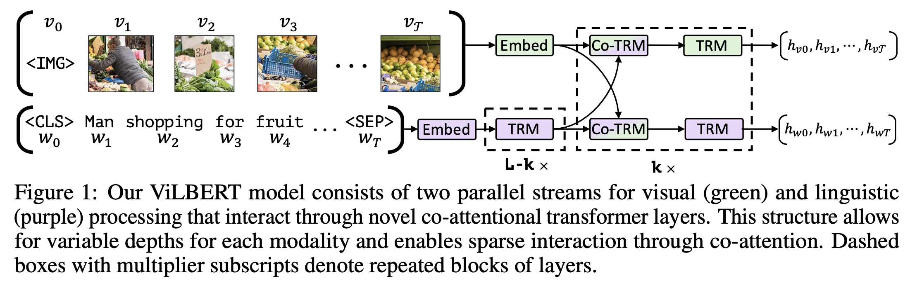

## Table of Contents

## What are Vision and Language Pre-Trained Models?

Vision and Language Pre-Trained Models are a type of artificial intelligence model that can understand and process both visual and textual information at the same time. These models are trained on large amounts of data that include images and their corresponding text descriptions. By learning from this data, the models can recognize objects in pictures, understand the context of the images, and even generate text that describes what they see. This makes them very useful for tasks like image captioning, where the model generates a description of an image, or visual question answering, where the model answers questions about an image.

These models work by combining two types of neural networks: one for processing visual information and another for processing language. The visual part of the model, often called a vision encoder, breaks down an image into features that the model can understand. The language part, called a language encoder, processes text in a similar way. These two parts are then combined in various ways, depending on the model's architecture, to allow the model to understand the relationship between images and text. This combination enables the model to perform tasks that require understanding both types of data, making it a powerful tool in fields like artificial intelligence and computer vision.

## How do Vision and Language Pre-Trained Models work?

Vision and Language Pre-Trained Models work by using two main parts: one for understanding pictures and another for understanding words. The picture part, called a vision encoder, looks at an image and turns it into a set of numbers that the model can understand. These numbers represent different features of the image, like colors, shapes, and objects. The word part, called a language encoder, does the same thing but with text. It turns words into numbers that the model can work with. By combining these two parts, the model can understand how pictures and words relate to each other.

Once the model has turned the pictures and words into numbers, it uses these numbers to do different tasks. For example, if you show the model a picture and ask it to describe what it sees, the model will use the numbers from the vision encoder to understand the picture. Then, it will use the language encoder to turn those understandings into words that make sense. The model learns how to do this by looking at lots of pictures and their descriptions, figuring out patterns and relationships between them. This way, it can do things like answer questions about pictures or create captions for them.

## What are some common applications of Vision and Language Pre-Trained Models?

Vision and Language Pre-Trained Models are used in many everyday applications. One common use is image captioning, where the model looks at a picture and writes a description of what it sees. This can be helpful for people who can't see the pictures or for organizing large collections of images by describing what's in them. Another use is visual question answering, where the model answers questions about what's in a picture. For example, if you show the model a picture of a dog and ask what kind of animal it is, the model can answer that it's a dog.

These models are also used in areas like helping visually impaired people navigate the world. By describing what's around them, the models can help people understand their surroundings better. In addition, they're used in smart home devices and virtual assistants, where they can understand commands that involve both images and text. For example, you could show a picture of a room and ask the device to turn on the lights in that room, and the model would understand what you mean. Overall, these models make technology more helpful and interactive by combining what they see with what they know about language.

## What is the difference between ALIGN and CLIP models?

ALIGN and CLIP are both Vision and Language Pre-Trained Models, but they have some differences in how they work and what they're used for. ALIGN, which stands for "A Large-scale ImaGe and text matching model," was made by Google. It learns by looking at lots of pictures and their descriptions at the same time. ALIGN is good at matching images with their text descriptions, and it's used for things like finding similar images or understanding what's in a picture based on a text query. It uses a method called contrastive learning, where it tries to bring the right image and text pairs closer together in its understanding, while pushing wrong pairs further apart.

CLIP, which stands for "Contrastive Language–Image Pretraining," was made by OpenAI. Like ALIGN, CLIP also uses contrastive learning to understand the relationship between images and text. But CLIP is trained on a different set of data and focuses more on being able to understand a wide variety of text descriptions for images. This makes CLIP very good at tasks like zero-shot learning, where it can recognize new things it hasn't seen before just by using text descriptions. For example, if you show CLIP a picture of a new type of fruit and describe it, CLIP can understand what it is without being specifically trained on that fruit.

## How does LXMERT integrate vision and language processing?

LXMERT, which stands for "Learning Cross-Modality Encoder Representations from Transformers," is a model that helps computers understand both pictures and words at the same time. It works by using special parts called transformers, which are good at understanding language. LXMERT has three main parts: one for understanding pictures, one for understanding words, and one for connecting the two. The picture part looks at an image and turns it into numbers that the model can understand. The word part does the same with text. Then, the connecting part brings these two sets of numbers together, helping the model see how the picture and the words relate to each other.

Once LXMERT has these numbers, it can do tasks like answering questions about pictures or describing what's in them. For example, if you show LXMERT a picture of a dog and ask, "What is in the picture?" it can use the numbers from the picture part and the word part to say, "There is a dog in the picture." This is helpful because it lets the model understand and talk about the world in a way that's closer to how people do. By learning from lots of pictures and their descriptions, LXMERT gets better at understanding how pictures and words fit together, making it a powerful tool for tasks that need both vision and language.

## What makes OSCAR unique among other Vision and Language models?

OSCAR, which stands for "Object-Semantics Aligned Pre-training," is special because it uses something called object tags to help it understand pictures better. Object tags are words that describe things in a picture, like "dog," "tree," or "car." When OSCAR looks at a picture, it uses these tags to learn more about what's in the picture and how it relates to the words that describe it. This makes OSCAR really good at understanding the details in pictures and matching them with the right words.

What makes OSCAR different from other models is that it focuses on these object tags during its training. Other models might just look at the whole picture and the whole description, but OSCAR pays attention to specific things in the picture. This helps OSCAR do better at tasks like describing pictures or answering questions about them, because it can understand the small details that other models might miss.

## Can you explain the architecture of ViLBERT?

ViLBERT, which stands for "Vision-and-Language BERT," is a model that helps computers understand both pictures and words at the same time. It uses two main parts: one for understanding pictures and another for understanding words. The picture part, called the visual stream, looks at an image and turns it into numbers that the model can understand. The word part, called the language stream, does the same thing but with text. These two parts work together but stay separate until the end, which is why it's called a "co-attention" model. This means that ViLBERT pays attention to both the picture and the words at the same time, but it doesn't mix them up until it needs to.

The way ViLBERT works is by using something called transformers, which are good at understanding language. In ViLBERT, there are two sets of transformers: one for the visual stream and one for the language stream. Each set of transformers helps the model understand the details in the pictures and the words. At the end, ViLBERT combines what it learned from the pictures and the words to do tasks like answering questions about pictures or describing what's in them. This way, ViLBERT can understand and talk about the world in a way that's closer to how people do.

## What are the key features of the OFA model?

The OFA model, which stands for "One For All," is a special kind of model that can do many different things with pictures and words. It's designed to be flexible, so it can handle tasks like describing pictures, answering questions about them, and even helping with tasks that only use words. OFA does this by using a single way of working that can be adjusted to fit different tasks. This means you don't need to make a new model for each task; OFA can learn to do them all. This makes OFA really useful because it can save time and effort when you need to work on different kinds of problems.

OFA works by first turning pictures and words into numbers that it can understand. Then, it uses these numbers to figure out what the task is and how to do it. For example, if you show OFA a picture and ask it to describe what it sees, it will look at the picture, turn it into numbers, and then use those numbers to create a description in words. OFA is good at understanding the details in pictures and how they relate to words, which helps it do well on different tasks. By learning from lots of examples, OFA gets better at understanding and working with both pictures and words, making it a powerful tool for many different kinds of jobs.

## How does ALBEF improve upon previous Vision and Language models?

ALBEF, which stands for "ALign BEfore Fuse," is a model that tries to do a better job at understanding pictures and words together. It does this by first looking at the pictures and words separately and then bringing them together. This is different from some other models that mix pictures and words right away. By doing it this way, ALBEF can understand the details in the pictures and the words better before trying to connect them. This helps ALBEF do well on tasks like describing pictures or answering questions about them.

One big way ALBEF improves on other models is by using something called contrastive learning. This means ALBEF learns by comparing lots of pictures and their descriptions to find the right matches. It tries to bring the right picture and word pairs closer together and push the wrong ones further apart. This helps ALBEF understand how pictures and words relate to each other more accurately. By doing this, ALBEF can do a better job at tasks that need both vision and language, making it a powerful tool for understanding the world around us.

## What is the role of contrastive learning in models like CLIP and ALIGN?

Contrastive learning plays a big role in models like CLIP and ALIGN. It helps these models understand how pictures and words relate to each other. The way it works is by showing the model lots of pictures and their descriptions. Then, it tries to find the right matches between the pictures and the words. If a picture and its description match well, the model brings them closer together in its understanding. If they don't match, the model pushes them further apart. This helps the model learn what goes together and what doesn't.

By using contrastive learning, models like CLIP and ALIGN can do a better job at tasks like finding similar images or understanding what's in a picture based on a text query. For example, if you show CLIP a picture and ask it to find similar ones, it can use what it learned from contrastive learning to find pictures that match the description you gave. This makes these models very useful for things like searching through large collections of images or helping with tasks that need both vision and language understanding.

## How do models like Florence and InternVideo handle video data?

Models like Florence and InternVideo are designed to understand and work with video data, which is different from just looking at pictures. They do this by breaking down videos into smaller parts, like individual frames or short clips. Then, they use these parts to learn about what's happening in the video. For example, Florence looks at the frames of a video and tries to understand the actions and objects it sees. It uses this understanding to do tasks like describing what's happening in the video or answering questions about it. This way, Florence can handle the complex information in videos and make sense of it.

InternVideo works in a similar way but focuses on understanding the flow of actions over time. It looks at how things change from one frame to the next, helping it understand the sequence of events in a video. This is important for tasks like predicting what will happen next or recognizing different activities. By paying attention to the details in each frame and how they connect, InternVideo can provide a more complete understanding of videos. Both models use advanced techniques to handle the extra information that comes with video data, making them useful for a wide range of video-related tasks.

## What are the latest advancements in Vision and Language Pre-Trained Models and their potential future directions?

The latest advancements in Vision and Language Pre-Trained Models have focused on improving their ability to understand and process complex data. One key advancement is the development of models that can handle video data, like Florence and InternVideo. These models break down videos into frames and use them to understand actions and sequences of events. Another important advancement is the use of more advanced training techniques, like contrastive learning, which helps models like CLIP and ALIGN better match images with their text descriptions. These improvements have made Vision and Language models more versatile and effective at tasks like image captioning, visual question answering, and even understanding video content.

Looking to the future, Vision and Language Pre-Trained Models are likely to become even more powerful and useful. One potential direction is the integration of these models with other types of data, like audio or 3D information, to create even more comprehensive AI systems. Another exciting possibility is the development of models that can learn from much smaller amounts of data, making them easier to train and use in real-world applications. As these models continue to evolve, they could play a bigger role in areas like education, healthcare, and entertainment, helping people understand and interact with the world in new and exciting ways.

## References & Further Reading

[1]: Radford, A., Kim, J. W., Hallacy, C., Ramesh, A., Goh, G., Agarwal, S., ... & Sutskever, I. (2021). ["Learning Transferable Visual Models From Natural Language Supervision."](https://arxiv.org/abs/2103.00020) arXiv preprint arXiv:2103.00020.

[2]: Jia, C., Yang, Y., Xia, Y., Chen, Y. T., Parekh, Z., Pham, H., ... & Le, Q. V. (2021). ["Scaling Up Visual and Vision-Language Representation Learning With Noisy Text Supervision."](https://arxiv.org/abs/2102.05918) arXiv preprint arXiv:2102.05918.

[3]: Li, J., Selvaraju, R. R., Gotmare, A., Joty, S., Xiong, C., & Hoi, S. (2021). ["Align before Fuse: Vision and Language Representation Learning with Momentum Distillation."](https://arxiv.org/abs/2107.07651) arXiv preprint arXiv:2107.07651.

[4]: Chen, Y. C., Li, L., Yu, L., Kholy, A. E., Ahmed, F., Gan, Z., ... & Wang, L. (2020). ["UNITER: UNiversal Image-TExt Representation Learning."](https://arxiv.org/abs/1909.11740) European Conference on Computer Vision (ECCV).

[5]: Huang, Z., Zeng, Z., Chen, B., Tan, M., Rong, Y., & Zhang, T. (2021). ["Florence: A New Foundation Model for Computer Vision."](https://www.sciencedirect.com/science/article/pii/S138589472501633X) Microsoft Research Blog.