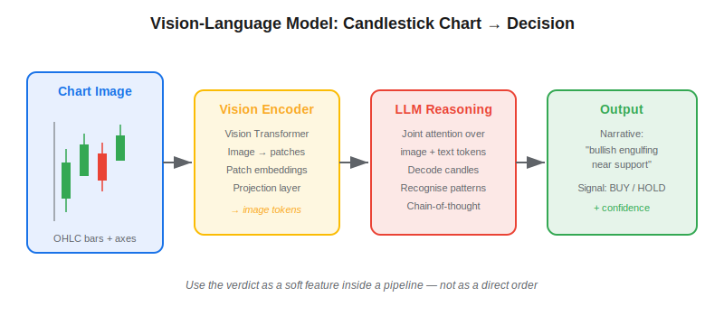
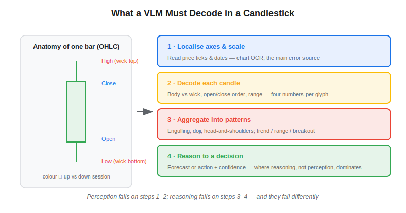
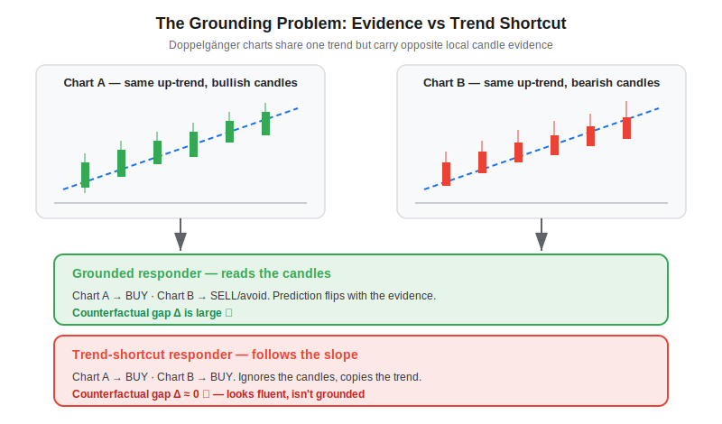

**Vision-language models (VLMs)** are multimodal neural networks — GPT-4V, Claude, Gemini, Qwen-VL, LLaVA — that ingest an image alongside text and reason about both in a single forward pass. Pointed at a candlestick chart, a VLM can describe the trend, name patterns ("a bullish engulfing near support"), and even output a next-bar direction or a buy/sell call. The appeal for systematic traders is obvious: decades of technical analysis live in chart *pictures*, not tidy numeric tables. But a 2026 result, the *Martingale Doppelgänger-Eval* benchmark, exposes a subtle trap — a fluent chart narrative may be grounded in the actual candles, or it may just be extrapolating the visible trend, and a naive accuracy score cannot tell the two apart. This article explains how VLMs read charts, why that identification problem matters, and how to use these models responsibly in an algo-trading stack.

## Table of Contents

## What Are Vision-Language Models for Chart Analysis?

A vision-language model couples a **vision encoder** (typically a Vision Transformer) with a large language model through a learned projection layer. The encoder slices the image into patches — a 1024×768 chart becomes a few hundred patch embeddings — and the projection maps those embeddings into the token space the LLM already understands. The model then attends jointly over image tokens and the text prompt, so a question like *"What does this chart suggest for the next session?"* is answered with the candlesticks in working memory. Modern instruction-tuned VLMs descend from the visual instruction-tuning recipe introduced by Liu et al. (2023) for LLaVA and the early GPT-4V explorations of Yang et al. (2023).

Applied to markets, the chart-analysis use case sits next to text-only [LLM trading agents](https://paperswithbacktest.com/wiki/llm-trading-agents) and [NLP sentiment analysis](https://paperswithbacktest.com/wiki/nlp-sentiment-analysis-trading): instead of reading a 10-K or a news headline, the model reads a price image. The promise is that a VLM can absorb context a feature vector throws away — the *shape* of consolidation, the relative length of wicks, the visual density of volume bars — much the way a human chartist does.

## How a VLM Reads a Candlestick Chart

Reading a candlestick chart is harder than it looks, because it demands both precise perception and abstract pattern reasoning. The model has to:

- **Localise axes and scale** — read the y-axis price ticks and x-axis dates, then map pixel heights back to price levels. This is effectively chart OCR, and it is where most errors originate.
- **Decode each candle** — distinguish body from wick, infer open/close ordering from colour, and gauge range. A single bar encodes four numbers (OHLC) in one glyph.
- **Aggregate into patterns** — recognise multi-candle structures (engulfing, doji, head-and-shoulders) and higher-level regimes such as trend, range, or breakout.
- **Reason to a decision** — translate the visual read into a forecast or an action with some notion of confidence.

The catch is that perception and reasoning fail differently. On structured chart-QA tasks such as ChartQA (Masry et al., 2022), frontier VLMs answer simple value-lookup questions with reasonable accuracy but degrade sharply on dense, multi-series, or unlabelled charts — often hallucinating a clean round-number price the axis never showed. A model can produce a confident "resistance at 152.00" while having mislocated the axis by 5%. For a chartist this is a rounding error; for an execution algo keyed to that level, it is a wrong trade.

## The Grounding Problem: Evidence vs Trend Shortcut

The deepest issue is not raw accuracy — it is **identification**. The *Martingale Doppelgänger-Eval* framework (2026) makes the point formally. On real market histories, the local candlestick *evidence* and the overall *trend* are tightly coupled: an uptrend tends to contain more bullish candles. So a model that genuinely reads the candles (a *grounded responder*) and a model that ignores them and simply extrapolates the visible slope (a *trend-shortcut responder*) can produce **the same answers** on observational data — and therefore earn the same score.

The authors prove an impossibility result: when evidence and trend are perfectly coupled in the data, no scoring functional computed from observational chart–label pairs can separate the two responders. Intuitively, if a grounded model $g$ and a shortcut model $s$ agree wherever the data has support, then for any score $\sigma$:

$$\mathbb{E}_{P_\text{obs}}\big[\sigma(\hat y, y)\mid g\big] = \mathbb{E}_{P_\text{obs}}\big[\sigma(\hat y, y)\mid s\big].$$

The fix is an **intervention**, not a better metric. The benchmark builds *doppelgänger* charts — pairs engineered to share an identical trend while carrying opposite local evidence (and vice versa). Grounding is then measured by a counterfactual gap: how much the model's prediction moves when you change the candles but hold the trend fixed,

$$\Delta = \mathbb{E}\big[\hat y \mid \text{do(evidence}=+)\big] - \mathbb{E}\big[\hat y \mid \text{do(evidence}=-)\big].$$

A grounded model shows a large $\Delta$; a trend-shortcut model shows $\Delta \approx 0$. The recurring empirical finding across VLM chart studies is sobering: once the trend cue is decoupled, next-candle directional accuracy collapses toward the 50% coin-flip baseline, even for models that looked impressive on coupled, observational test sets. The fluent technical-analysis prose was, in many cases, sophisticated trend-following dressed up as chart reading.

## Benchmarks: Coupled vs Decoupled Performance

The table below sketches the qualitative pattern reported across chart-reasoning evaluations. Treat the figures as illustrative ranges, not precise leaderboard numbers — they vary by model, chart density, and prompt.

| Task | Typical VLM behaviour | Reliability |
|---|---|---|
| Axis / value OCR (clean chart) | ~70–85% exact-value accuracy | Moderate; degrades on dense charts |
| Named pattern recognition | Fluent labels, frequent over-calling | Low — high false-positive rate |
| Next-bar direction (trend coupled) | Often 55–65%, flatters the model | Misleading — trend shortcut |
| Next-bar direction (trend decoupled) | Drops toward ~50% | Reveals weak grounding |

The gap between the third and fourth rows is the entire story. It is the same trap as [look-ahead bias in LLM trading](https://paperswithbacktest.com/wiki/look-ahead-bias-llm-trading) and classic [backtesting overfitting](https://paperswithbacktest.com/wiki/backtesting-pitfalls-overfitting): a number that looks like skill but is an artefact of how the test was constructed. Any quant evaluating a VLM chart reader must build decoupled, counterfactual tests before trusting a single accuracy figure.

## Practical Considerations in Algo Trading

**Treat VLM output as a soft feature, never a hard signal.** Even when a VLM reads a chart correctly, it returns text, not a calibrated probability. The pragmatic pattern is to use the model's structured judgement — "consolidation", "breakout attempt", "exhaustion wick" — as one feature among many feeding a downstream model, the way [neural networks are used in quantitative trading](https://paperswithbacktest.com/wiki/how-are-neural-networks-used-in-quantitative-trading), rather than routing its verdict straight to an order.

**Latency and cost rule out fast trading.** A VLM call takes roughly 1–5 seconds and costs far more per query than computing OHLC features numerically. That confines chart-reading agents to daily or hourly horizons; for anything intraday, parsing the raw price series — or a clean [Heikin-Ashi](https://paperswithbacktest.com/wiki/heikin-ashi-strategy) transform — is faster, cheaper, and exact.

**Rendering choices leak into results.** A VLM is sensitive to colour scheme, candle width, gridlines, and resolution. Two charts of identical data can yield different reads, so any backtest must fix a single rendering pipeline and stress-test it — otherwise you are measuring the chart library, not the market.

**Realistic expectations.** On decoupled tasks current VLMs add little directional edge; their value is qualitative context and triage, not alpha on their own. A reasonable null hypothesis is that a well-engineered numeric feature set matches or beats the VLM at a fraction of the cost — and the burden of proof sits with the chart reader.

## Conclusion

Vision-language models bring the long tradition of chart reading within reach of automated systems, but the *Martingale Doppelgänger-Eval* result is a useful cold shower: fluency is not grounding, and observational accuracy cannot tell them apart. The right way to deploy a VLM on candlesticks is to verify grounding with counterfactual, trend-decoupled tests, then use the model as a contextual feature inside a disciplined, cost-aware pipeline. As multimodal models keep improving, the open question is whether the next generation can read the candles rather than the slope — and the only honest way to find out is to test them where evidence and trend disagree.

## References & Further Reading

[1]: [Martingale Doppelgänger-Eval: An Identification Framework for Auditing Candlestick Understanding in Vision-Language Models](https://arxiv.org/abs/2606.17423)
[2]: [The Dawn of LMMs: Preliminary Explorations with GPT-4V(ision) (Yang et al., 2023)](https://arxiv.org/abs/2309.17421)
[3]: [ChartQA: A Benchmark for Question Answering about Charts (Masry et al., 2022)](https://arxiv.org/abs/2203.10244)
[4]: [Visual Instruction Tuning — LLaVA (Liu et al., 2023)](https://arxiv.org/abs/2304.08485)
