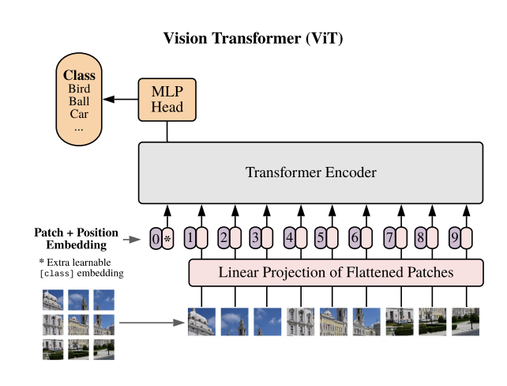

## Table of Contents

## What is a Vision Transformer and how does it differ from traditional CNNs?

A Vision Transformer (ViT) is a type of neural network that uses the transformer architecture, originally designed for natural language processing, to process images. Unlike traditional Convolutional Neural Networks (CNNs) that use convolutional layers to capture local patterns in an image, ViTs divide an image into fixed-size patches and treat these patches as a sequence of data, similar to how words are treated in a sentence. Each patch is then linearly embedded and positionally encoded before being fed into the transformer, which uses self-attention mechanisms to understand the relationships between different parts of the image.

The key difference between ViTs and CNNs lies in their approach to feature extraction and processing. CNNs rely on a series of convolutional layers to progressively extract features from an image, starting with low-level features like edges and gradually building up to high-level concepts. This hierarchical approach is effective but can be limited by the fixed receptive field of the convolutional kernels. In contrast, ViTs use self-attention to consider all parts of the image simultaneously, allowing them to capture global dependencies more effectively. This can lead to better performance on tasks where understanding the overall context of an image is important, although ViTs typically require more data and computational resources to train effectively compared to CNNs.

## How does the self-attention mechanism work in Vision Transformers?

The self-attention mechanism in Vision Transformers helps the model understand how different parts of an image relate to each other. Imagine you have a picture divided into small squares, called patches. Each patch is like a word in a sentence. The self-attention mechanism looks at all these patches at once and figures out which patches are important for understanding the whole picture. It does this by calculating a score for each pair of patches, showing how much one patch should pay attention to another. This score is used to create a weighted sum of the patches, allowing the model to focus on the most relevant parts of the image.

To be more specific, the self-attention mechanism works by transforming each patch into three different vectors: Query, Key, and Value. For each patch, the model computes a score by taking the dot product of its Query vector with the Key vectors of all other patches. This score is then passed through a softmax function to get attention weights. These weights are used to compute a weighted sum of the Value vectors, which gives the final output for that patch. This process can be described by the formula $$ \text{Attention}(Q, K, V) = \text{softmax}\left(\frac{QK^T}{\sqrt{d_k}}\right)V $$, where $Q$, $K$, and $V$ are the Query, Key, and Value matrices, and $d_k$ is the dimension of the Key vectors. This allows the model to dynamically weigh the importance of different patches, capturing complex relationships within the image.

## What are the key components of a Vision Transformer architecture?

A Vision Transformer (ViT) has several important parts that work together to understand images. First, the image is split into small squares called patches. Each patch is turned into a number that the computer can understand, and these numbers are put into a line, like words in a sentence. This line of numbers is then given a special code that tells the computer where each patch is in the image. This step is called positional encoding. After that, the line of numbers goes into the main part of the ViT, which is called the transformer encoder.

The transformer encoder is where the magic happens. It uses something called self-attention to look at all the patches at the same time and figure out how they relate to each other. The self-attention mechanism works by turning each patch into three different sets of numbers: Query, Key, and Value. It then calculates how much each patch should pay attention to every other patch using a formula like $$ \text{Attention}(Q, K, V) = \text{softmax}\left(\frac{QK^T}{\sqrt{d_k}}\right)V $$. This helps the model focus on the most important parts of the image. The transformer encoder repeats this process many times, getting better at understanding the image with each step. At the end, the model can use what it learned to do things like classify the image or find objects in it.

## What is the Swin Transformer and how does it improve upon the original Vision Transformer?

The Swin Transformer is a type of Vision Transformer that makes some smart changes to work better with images. It uses a special way of looking at images called a hierarchical structure, which is a bit like how traditional CNNs work. Instead of looking at the whole image at once, the Swin Transformer looks at small parts of the image first and then slowly looks at bigger parts. This is done using something called shifted windows, which helps the model understand how different parts of the image fit together without needing too much computer power. By using these shifted windows, the Swin Transformer can focus on local details and then zoom out to see the bigger picture, making it more efficient and effective than the original Vision Transformer.

One big improvement of the Swin Transformer over the original Vision Transformer is how it handles the size of the image. The original Vision Transformer splits the image into fixed-size patches and looks at all of them at the same time, which can be slow and use a lot of computer power. The Swin Transformer, on the other hand, uses a method called patch merging to gradually combine smaller patches into bigger ones as it goes through the layers. This means it can handle different sizes of images more easily and use less computer power. Overall, the Swin Transformer can work better on tasks like recognizing objects in images or understanding what's happening in a scene, making it a powerful tool for working with visual data.

## How does DeiT (Data-efficient Image Transformers) make Vision Transformers more practical for smaller datasets?

DeiT, which stands for Data-efficient Image Transformers, makes Vision Transformers more practical for smaller datasets by using a special training method called knowledge distillation. Knowledge distillation is like teaching a student by having them learn from a smart teacher. In this case, the smart teacher is a big CNN that has already learned a lot about images. The student is the DeiT model, which learns to understand images by copying what the teacher does. This helps the DeiT model learn faster and with less data than the original Vision Transformer, which usually needs a lot of images to work well.

Another way DeiT makes Vision Transformers more practical is by using a simpler version of the transformer architecture. This simpler version is easier to train and works well even when there are not many images to learn from. By combining these smart training methods and simpler architecture, DeiT can do a good job at understanding images, even if the dataset is small. This makes it a lot more useful for people who don't have access to huge collections of images.

## What is DINO and how does it use self-supervised learning in Vision Transformers?

DINO, which stands for "DIstillation with NO labels," is a way to train Vision Transformers without needing labeled data. It uses a method called self-supervised learning, where the model learns by itself from the images it sees. Imagine you're trying to learn a new language by watching movies without subtitles. You start to understand the language by noticing patterns and how words relate to each other. DINO does something similar with images. It looks at different parts of an image and tries to figure out how they fit together, all without anyone telling it what the image is about.

To do this, DINO uses two versions of the same Vision Transformer: a teacher and a student. The teacher model looks at the whole image and tries to predict what the student model will see when it looks at a smaller part of the image. They keep teaching each other back and forth, getting better at understanding images without any labels. This method helps the model learn useful features from images, making it good at tasks like recognizing objects or understanding scenes, even if it was never told what those objects or scenes are.

## What are the differences between DETR and Deformable DETR in object detection tasks?

DETR, or Detection Transformer, is a new way to find objects in pictures. It uses a Vision Transformer to look at the whole image at once and guess where objects are. DETR works by turning the image into a bunch of small squares, then using self-attention to figure out how these squares relate to each other. It's good at finding objects because it can see the whole picture and how all parts fit together. But, DETR can be slow because it has to look at every part of the image every time.

Deformable DETR improves on DETR by making it faster and more accurate. Instead of looking at every part of the image all the time, Deformable DETR focuses on the most important parts. It does this by using something called deformable attention, which lets the model pay attention to specific spots in the image that might have objects. This makes Deformable DETR quicker and better at finding objects, especially when there are a lot of them or they are hard to see. By being smarter about where to look, Deformable DETR can do a better job with less work.

## How does the MobileViT series adapt Vision Transformers for mobile and edge devices?

The MobileViT series makes Vision Transformers work well on small devices like phones and tablets. It does this by making the transformer part smaller and simpler, so it uses less power and runs faster. MobileViT combines the good parts of traditional CNNs, which are already good at working on small devices, with the powerful features of Vision Transformers. This mix helps MobileViT understand images well without needing a lot of computer power. By doing this, MobileViT can do things like recognize objects or understand scenes on devices that don't have big computers inside them.

One key way MobileViT saves power is by using fewer steps to process the image. It starts by using CNN layers to quickly look at the image and find important parts. Then, it uses a smaller version of the Vision Transformer to understand how these parts fit together. This two-step process helps MobileViT be both fast and smart. By carefully balancing the use of CNNs and transformers, MobileViT makes it possible to use advanced image understanding on small devices, making it easier for people to use these technologies on the go.

## What are the advancements introduced by PVT (Pyramid Vision Transformer) and its subsequent versions?

The Pyramid Vision Transformer (PVT) makes Vision Transformers better by using a pyramid structure, which is a bit like how traditional CNNs work. It starts by looking at small parts of the image and then slowly looks at bigger parts. This helps PVT understand images in a way that's both detailed and big-picture. PVT does this by using something called spatial reduction attention, which makes the model faster and use less computer power. By combining these ideas, PVT can do a good job at tasks like recognizing objects or understanding scenes, even on smaller datasets.

Later versions of PVT, like PVTv2, make it even better. PVTv2 uses a simpler way of looking at the image called linear complexity attention, which makes it even faster and more efficient. It also adds a special layer that helps the model understand the image better by mixing information from different parts. These changes make PVTv2 work well on a wide range of tasks, from finding objects in pictures to understanding what's happening in a scene. By making these improvements, PVT and its versions help make Vision Transformers more useful for many different kinds of image understanding jobs.

## How do Focal Transformers enhance the efficiency and performance of Vision Transformers?

Focal Transformers make Vision Transformers better by focusing on the most important parts of an image. They do this by using something called focal attention, which looks at both the big picture and the small details at the same time. Instead of looking at every part of the image equally, like the original Vision Transformer does, Focal Transformers pay more attention to the areas that matter most. This makes them faster and more accurate because they can quickly find what's important in the image without wasting time on less important parts.

In addition to focal attention, Focal Transformers also use a special way to process the image called a hierarchical structure. This structure helps the model understand the image in layers, starting with small parts and then looking at bigger parts. By doing this, Focal Transformers can capture both the fine details and the overall context of the image, which helps them perform better on tasks like recognizing objects or understanding scenes. Overall, these improvements make Focal Transformers more efficient and effective, allowing them to work well even on complex images.

## What is the role of LV-ViT in improving the scalability and performance of Vision Transformers?

LV-ViT, which stands for Large-scale Vision Transformer, makes Vision Transformers better by making them work well with lots of images and be more accurate. It does this by using a special way of training called knowledge distillation. Imagine you're learning from a smart teacher who already knows a lot about images. LV-ViT learns from this teacher, which helps it understand images faster and with less data than the original Vision Transformer. This makes LV-ViT more useful for people who don't have huge collections of images to train their models.

Another way LV-ViT improves Vision Transformers is by using a simpler version of the transformer architecture. This simpler version is easier to train and works well even when there are not many images to learn from. By combining these smart training methods and simpler architecture, LV-ViT can do a good job at understanding images, even if the dataset is small. This makes it a lot more useful for people who want to use Vision Transformers in real-world situations where data might be limited.

## How do CrossTransformers and CrossViT integrate multi-modal learning with Vision Transformers?

CrossTransformers and CrossViT are ways to make Vision Transformers work with different types of information, like pictures and words, at the same time. They do this by using a special part called a cross-attention mechanism. Imagine you're looking at a picture and reading a description of it. Cross-attention helps the model understand how the words in the description relate to the parts of the picture. By doing this, the model can learn from both the image and the text together, making it better at understanding what's going on.

CrossViT, in particular, uses this cross-attention to mix information from images and text in a smart way. It starts by turning the image into small squares and the text into numbers that the computer can understand. Then, it uses cross-attention to figure out how these squares and numbers fit together. This helps CrossViT do a better job at tasks like answering questions about pictures or describing what's happening in a scene. By combining different types of information, CrossTransformers and CrossViT make Vision Transformers more powerful and useful for real-world applications.