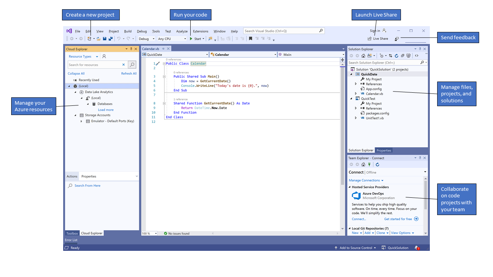

Algorithmic trading utilizes automated systems to conduct trades based on predefined criteria, allowing for efficiency and precision in financial markets. These systems employ algorithms that consider variables such as timing, price, and volume to execute buy or sell orders at optimal moments, minimizing human error and capitalizing on market opportunities. Algorithmic trading is prevalent across various asset classes, including equities, commodities, and foreign exchange, due to its ability to process large volumes of data rapidly and execute trades at speeds unattainable by human traders.

Visual Basic, a programming language developed by Microsoft, can play a significant role in algorithmic trading. Known for its simplicity and ease of use, Visual Basic is part of the Microsoft .NET framework, which supports robust integration with numerous technologies. This makes it an appealing choice for traders who need a user-friendly programming language that can interface seamlessly with other Microsoft Office applications such as Excel, often used for data analysis and modeling in trading scenarios.

This article explores the application of Visual Basic in algorithmic trading, examining its potential benefits and limitations. Understanding how Visual Basic can be employed effectively in developing algorithmic trading systems requires considering its strengths, such as integration capabilities and familiar syntax, and its constraints, particularly in handling high-frequency and high-volume data efficiently. By evaluating its applicability within the context of the algorithmic trading ecosystem, traders and developers can better assess Visual Basic's suitability for their specific needs, leveraging existing Microsoft-based infrastructure or considering hybrid approaches that combine Visual Basic with other technologies.

## Table of Contents

## Understanding Visual Basic

Visual Basic (VB) is a programming language developed by Microsoft that emphasizes simplicity and accessibility, making it a suitable starting point for beginners. As part of the Microsoft .NET framework, VB benefits from robust integration capabilities, which enhance its utility across various applications. The .NET framework provides a comprehensive environment that supports a wide range of programming needs, offering a vast library of pre-coded solutions to common programming challenges and enabling seamless integration with other Microsoft technologies.

One of the defining features of Visual Basic is its user-friendly syntax, which facilitates ease of learning and development. This feature is particularly beneficial for individuals new to programming, as it allows them to quickly grasp programming concepts and start building applications. The language’s design prioritizes readability and simplicity, enabling developers to write code that is both clear and easy to maintain.

Visual Basic excels in building applications that require graphical user interfaces (GUIs). It offers a range of tools for designing rich and interactive user interfaces, which can be a significant advantage when developing applications intended for end-users, who benefit from intuitive and visually appealing interfaces. The use of GUIs in applications allows users to interact with the software in a more intuitive and engaging manner, enhancing the overall user experience.

While VB is most commonly associated with GUI development, its application extends into niche areas, including [algorithmic trading](/wiki/algorithmic-trading). In this context, Visual Basic's strengths lie in its integration capabilities with Microsoft Office products such as Excel. This integration allows for the development of applications that can seamlessly manipulate and analyze financial data, providing a foundation for creating algorithmic trading systems. The ability to interact with Excel is particularly valuable, as many traders rely on Excel for data management and analysis. By leveraging VB’s capabilities, developers can create custom functions and automate tasks within Excel, thus streamlining trading processes.

Although Visual Basic is not traditionally associated with high-performance computing tasks, its application in algorithmic trading serves as an intriguing example of how accessible technologies can be adapted to meet specialized needs. This adaptability demonstrates VB’s potential as a versatile tool within the broader software development landscape, providing opportunities for innovation in fields that might not initially seem to align with its fundamental design.

## Why Consider Visual Basic for Algorithmic Trading?

Visual Basic is an appealing choice for algorithmic trading due to its user-friendly syntax and integration capabilities. Unlike more complex programming languages, Visual Basic offers a straightforward coding environment that can be advantageous for individuals and small firms beginning their venture into algorithmic trading. The language's ease of use reduces the learning curve, allowing traders with limited programming experience to automate trading strategies effectively.

One of the major advantages of using Visual Basic for algorithmic trading is its seamless integration with Microsoft Office tools, particularly Excel. Excel is widely used in the financial industry for its powerful data analysis and visualization capabilities. Visual Basic for Applications (VBA) allows traders to automate Excel, creating custom functions and interfaces directly within spreadsheets. This integration can significantly enhance productivity by enabling real-time data processing and automated trading signals generation using live data feeds connected to Excel.

Furthermore, Visual Basic can interface with a variety of databases, a critical feature for trading applications that require accessing large datasets for analysis. The language supports connections to SQL databases, among others, enabling traders to fetch historical data, update trade records, or analyze market conditions efficiently. This feature ensures that trading strategies can be executed based on comprehensive and up-to-date information.

For traders or firms with an existing Microsoft-based infrastructure, using Visual Basic for algorithmic trading might lead to cost savings. By leveraging the pre-existing systems and expertise within the Microsoft ecosystem, firms might avoid the expenses associated with training on new platforms or migrating to entirely new programming environments. Visual Basic can be seen as an extension of the existing technological stack, allowing firms to explore algorithmic trading without incurring significant costs related to infrastructure overhaul or staff retraining.

In conclusion, Visual Basic provides a pragmatic option for algorithmic trading applications, especially for those already embedded in the Microsoft ecosystem. Its integration with Excel and databases, coupled with cost-effective scaling, offers significant advantages. However, it's essential to acknowledge its limitations and weigh these against specific trading requirements before full-scale implementation.

## Key Components of an Algorithmic Trading System

An effective algorithmic trading system comprises several essential components, each fulfilling a critical role in achieving efficient and profitable trades. These components include research tools, portfolio optimizers, risk managers, and execution engines. The interplay between these parts ensures the trading system operates seamlessly, effectively utilizing available data and executing strategies under varying market conditions.

Research tools form the foundation of any algorithmic trading system, as they provide the necessary infrastructure for developing and testing trading strategies. These tools are used to analyze historical data, identify patterns, and simulate potential strategies before they are deployed in live markets. They typically require access to historical market data, fundamental data, and sometimes [alternative data](/wiki/best-alternative-data) sources. The performance requirements for research tools can vary; some tasks might necessitate complex computations and thus demand robust computational resources.

Portfolio optimizers are essential in managing the allocation of assets within a trading strategy. They are designed to balance expectations of return against the associated risk, using models and techniques such as the Modern Portfolio Theory, which uses mathematical frameworks to support decision-making processes:

$$
\text{Maximize: } \frac{E(R_p) - R_f}{\sigma_p}
$$

Here, $E(R_p)$ represents the expected portfolio return, $R_f$ is the risk-free rate, and $\sigma_p$ denotes the portfolio's standard deviation, representing risk. Portfolio optimizers must effectively handle various data types, including real-time price feeds and asset correlation matrices.

Risk managers are critical for identifying, assessing, and mitigating potential risks associated with trading activities. They utilize a range of tools to monitor exposure and ensure adherence to predefined risk thresholds, protecting against significant financial loss. Risk management systems might need real-time data to evaluate various risk metrics, such as Value at Risk (VaR) and stress testing scenarios, to maintain the robustness of a trading strategy.

Execution engines are the components that interface with financial markets to execute trades based on signals generated by the preceding systems. They must operate with speed and precision, navigating through different market conditions. Execution engines require up-to-date market data and can benefit from low-latency infrastructures to reduce slippage and transaction costs.

Visual Basic, although not traditionally associated with high-frequency trading due to potential performance limitations, can effectively manage some of these tasks, particularly for individuals or small firms utilizing existing Microsoft-based infrastructure. When integrated with databases, Visual Basic can facilitate data retrieval and processing tasks necessary for research, and its compatibility with Microsoft Excel can assist in portfolio optimization and risk management functionalities. By combining Visual Basic with other sophisticated tools and technologies, traders can enhance the overall efficiency and capabilities of their algorithmic trading systems.

## Implementation Challenges with Visual Basic

Visual Basic, while historically significant for its simplicity and integration capabilities, presents notable limitations when applied to algorithmic trading, particularly in high-frequency trading scenarios. One key limitation is its relative inefficiency in terms of performance when compared to languages like C++ or Python. These languages are optimized for speed, enabling them to handle rapid data processing and trade execution, essential features for high-frequency trading operations. In contrast, Visual Basic's execution speed is often slower, which can result in latency and reduced performance in fast-paced trading environments.

The handling of large volumes of financial data is another challenge for Visual Basic. Financial markets generate vast amounts of data, and the ability to process and analyze this data in real-time is crucial for successful trading strategies. Visual Basic is traditionally an interpreted language, which might struggle with efficiency when managing substantial datasets. This can lead to slower data processing times, delaying trade decisions and potentially impacting profitability.

Furthermore, traders using Visual Basic may face difficulties integrating with modern APIs and technologies designed for high throughput and scalability. Many contemporary trading systems and platforms are built using languages and frameworks that prioritize seamless integration and data flow. Visual Basic, which is rooted in older paradigms, might lack the advanced frameworks and libraries that facilitate connection to cutting-edge APIs, potentially hindering the trading system's overall functionality and adaptability to new technologies.

Addressing such challenges often requires adopting a hybrid approach, where Visual Basic is combined with other technologies to handle specific tasks. For instance, while Visual Basic might be used for certain interface-driven aspects or data management tasks, more performance-critical components could be implemented in Python or C++, thereby ensuring that the trading system combines ease of use with the necessary performance capabilities. This strategy allows traders to leverage the unique strengths of Visual Basic while mitigating its limitations.

## Alternative Technologies and Visual Basic

Visual Basic (VB) has been a longstanding member of the programming languages used in various software development applications, including algorithmic trading. However, when compared to languages such as Python, R, and C++, it presents both distinctive advantages and certain drawbacks.

Python is renowned for its simplicity and readability, making it a popular choice for algorithmic trading. The language's extensive libraries such as NumPy, pandas, and SciPy contribute significantly to data analysis and computational tasks essential in trading algorithms. Python’s integration with [machine learning](/wiki/machine-learning) frameworks like TensorFlow and PyTorch further enhances its utility in predictive analytics, giving it an edge in developing sophisticated trading strategies. Furthermore, Python’s wide adoption has fostered a vast, active community which provides robust support, abundant resources, and frequent updates making it an attractive option for traders aiming for ongoing innovation.

R is another language frequently used in algorithmic trading, especially for statistical analysis and data visualization. R offers a plethora of packages designed for time-series analysis, econometrics, and quantitative finance, making it particularly suitable for developing and testing complex financial models. The language’s ability to visualize intricate data patterns allows traders to gain insights which are critical for decision-making processes. R’s community, though not as large as Python’s, is specialized and provides substantial support in financial analytics contexts.

C++ is valued for its high performance and speed, which is crucial for high-frequency trading where execution time is paramount. While C++ may present a steeper learning curve due to its complexity, the language's efficiency in processing large volumes of financial data quickly can lead to significant advantages in trading environments where milliseconds can make a difference. Consequently, C++ is often employed in the development of core trading infrastructure where performance is critical. 

Incorporating Visual Basic within a hybrid approach can be beneficial, especially for traders already using Microsoft systems extensively. VB can manage tasks such as data manipulation and interfacing with Microsoft Office products efficiently, while other languages handle more performance-intensive processes. For instance, Visual Basic can be employed to automate data entry or report generation in Excel, a common scenario in many trading houses, while Python or C++ executes the real-time data analysis and trading execution.

Community support and resources for Visual Basic are available, particularly within the Microsoft ecosystem. However, VB does not possess the same level of community engagement or resource availability as Python or C++. Developers using Visual Basic might find fewer tutorials, discussion forums, or libraries specifically tailored for high-frequency or machine-learning-based trading applications. Nonetheless, with the right skill set, VB can still serve as a stepping stone into more complex trading applications, particularly when integrated with more contemporary technologies.

## Case Studies and Real-World Applications

Visual Basic, traditionally associated with developing Windows applications, has been successfully utilized in various algorithmic trading initiatives. One illustrative example is a small financial firm that initially operated using Microsoft Excel for manual trading strategies. They transitioned to algorithmic trading by leveraging Visual Basic for Applications (VBA), a subset of Visual Basic integrated within Excel. This approach allowed them to automate repetitive trading tasks, such as updating market data and executing trades based on set conditions.

The firm faced several challenges during this transition. A significant one was performance-related, primarily due to the limitations of VBA in handling large volumes of financial data. To overcome this, they employed a hybrid system where data-intensive functions were delegated to more efficient languages like C#. This move allowed for intensive calculations and data handling to execute outside the VBA environment, thus enhancing performance.

Another noteworthy aspect of their evolution involved the adaptation of legacy systems. Many financial institutions have existing systems constructed using Visual Basic due to its historical popularity and ease of use. Transforming these systems to meet modern algorithmic trading demands required creative integration solutions. Leveraging .NET interoperability features, the firm managed to extend older VBA modules to communicate effectively with current technologies such as REST APIs for market data feeds and order execution.

Practitioners in the field have reported that one of the main advantages of using Visual Basic in algorithmic trading is its seamless integration with Microsoft Office tools. This integration is particularly beneficial for small trading teams that require quick visual analysis, often using Excel to plot trends or simulate trading scenarios. The ease of creating user interfaces for trading dashboards is another reported benefit, allowing traders to visualize data insights rapidly.

In overcoming integration hurdles with modern infrastructures, adopting a modular programming approach has proven to be beneficial. Professionals often compartmentalize their trading system's functionalities, using Visual Basic for its strengths in interface and interaction handling while utilizing languages like Python or C++ for back-end processing and data analytics.

These real-world examples underscore Visual Basic's role in facilitating the transition of firms from manual to semi-automated trading systems. Although the language may pose certain limitations, such as performance inefficiency for high-frequency trading scenarios, its ease of use and integration capabilities with existing Microsoft systems provide a pragmatic path for many firms venturing into algorithmic trading. The strategic use of Visual Basic, particularly when complemented by other programming languages, can effectively bridge legacy systems to meet evolving trading infrastructure needs.

## Conclusion

Visual Basic provides a viable option for certain algorithmic trading applications, especially for traders already familiar with the Microsoft ecosystem. Its user-friendly syntax and integration capabilities with databases and Microsoft Office products, such as Excel, allow for the development of effective trading systems tailored to individual or organizational needs. By leveraging these predefined tools and functionalities, traders can automate data analysis, manage portfolios, and execute trades more efficiently.

However, it is important to be mindful of Visual Basic's limitations. Despite its practicality for certain applications, it may lack the performance benefits of other programming languages like C++ or Python, particularly in high-frequency trading scenarios where speed and data handling capabilities are crucial. These obstacles necessitate traders to seek complementary technologies or hybrid approaches, combining the accessibility of Visual Basic with the advanced functionalities of other languages to handle more demanding tasks.

Ultimately, the key to maximizing Visual Basic's effectiveness in algorithmic trading lies in recognizing its strengths and limitations. Its ability to integrate seamlessly within existing Microsoft infrastructures offers cost-effective solutions, while strategic supplementation with other technological tools can address its shortcomings. By adopting such a balanced approach, traders can harness Visual Basic's potential while navigating the complexities of modern trading environments.

## References & Further Reading

[1]: Dorsey, T. J. (1996). ["Point and Figure Charting: The Essential Application for Forecasting and Tracking Market Prices."](https://www.amazon.com/Point-Figure-Charting-Application-Forecasting/dp/047111961X) New York: John Wiley & Sons.

[2]: Hull, J. C. (2018). ["Options, Futures, and Other Derivatives."](https://www.pearson.com/nl/en_NL/higher-education/subject-catalogue/finance/Options-Futures-and-Other-Derivatives-Hull.html) Pearson Education.

[3]: Joshi, M. (2008). ["C++ Design Patterns and Derivatives Pricing."](https://assets.cambridge.org/97805217/21622/frontmatter/9780521721622_frontmatter.pdf) Cambridge University Press.

[4]: Lospinoso, J. (2019). ["C# in Depth: Fourth Edition."](https://www.manning.com/books/c-sharp-in-depth-fourth-edition) Manning Publications.

[5]: Walkenbach, J. (2015). ["Excel 2016 Power Programming with VBA."](https://onlinelibrary.wiley.com/doi/book/10.1002/9781119415503) Wiley.