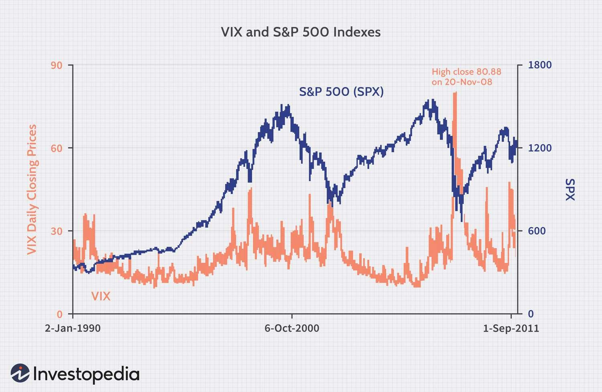

## Table of Contents

## What are VIX options?

VIX options are financial tools that let people bet on how much the stock market might move in the future. The VIX, or Volatility Index, measures how much people expect the stock market to go up or down over the next 30 days. When people think the market will be calm, the VIX is low. When they think the market will be wild, the VIX is high. VIX options let traders make money if they guess right about whether the VIX will go up or down.

These options are different from regular stock options because they don't depend on a single company's stock price. Instead, they are based on the VIX, which is like a thermometer for the whole market's nervousness. People use VIX options to protect their investments from big market swings or to make money if they think the market will get more or less nervous. It's like buying insurance for your other investments or betting on how scared or calm the market will be.

## How does the VIX index work?

The VIX index, also known as the Volatility Index, is like a fear gauge for the stock market. It measures how much people expect the stock market to move up or down over the next 30 days. The VIX goes up when people think the market will be more unpredictable and wild, which usually happens when there's a lot of worry or bad news. On the other hand, the VIX goes down when people think the market will be calm and stable, which often happens during good times or when there's not much news.

The VIX is calculated using the prices of options on the S&P 500, which is a big group of stocks that represents the overall market. These options are like bets people make on where they think the S&P 500 will be in the future. By looking at these bets, the VIX can tell us how much the market expects to move. A higher VIX means bigger expected moves, and a lower VIX means smaller expected moves. It's a useful tool for investors because it helps them understand how nervous or confident the market feels about the future.

## What is the purpose of trading VIX options?

Trading VIX options is a way for people to make money or protect their investments based on how much they think the stock market will move in the future. The VIX, or Volatility Index, measures how much people expect the market to go up or down over the next 30 days. When traders think the market will be more unpredictable and wild, they might buy VIX options to make money if the VIX goes up. On the other hand, if they think the market will be calm, they might sell VIX options to make money if the VIX stays low or goes down.

VIX options are also used as a kind of insurance for other investments. If someone has a lot of money in the stock market and is worried about big drops, they can buy VIX options to help protect their money. If the market does get wild and the VIX goes up, the money they make from the VIX options can help cover losses from their other investments. This way, VIX options help people manage the risk of big market swings and make more informed decisions about their investments.

## How are VIX options different from other options?

VIX options are different from other options because they are based on the VIX, which is a measure of how much people expect the stock market to move in the future. Most other options are tied to the price of a single stock or a group of stocks, like the S&P 500. But VIX options are about the market's nervousness or calmness, not about the price of any specific stock. This means that when you trade VIX options, you're betting on how much the whole market might move, not on whether one company's stock will go up or down.

Another big difference is that VIX options are used to protect against big swings in the market, not just changes in a single stock's price. People buy VIX options as a kind of insurance to help them if the market gets wild and unpredictable. If the market does start to move a lot, the VIX goes up, and the VIX options can make money to help cover losses from other investments. This makes VIX options a useful tool for managing risk in a way that regular stock options can't do as well.

## What are the key features of VIX options?

VIX options are special because they're based on the VIX, which is a measure of how much people expect the stock market to move in the future. Unlike regular options that focus on the price of a single stock or a group of stocks, VIX options are all about the market's nervousness or calmness. When people think the market will be wild and unpredictable, they might buy VIX options to make money if the VIX goes up. If they think the market will be calm, they might sell VIX options to make money if the VIX stays low or goes down.

Another key feature of VIX options is that they can act like insurance for other investments. If someone is worried about big drops in the stock market, they can buy VIX options to help protect their money. If the market does get wild and the VIX goes up, the money they make from the VIX options can help cover losses from their other investments. This makes VIX options a useful tool for managing the risk of big market swings, something that regular stock options can't do as well.

## How can beginners start trading VIX options?

If you're new to trading and want to start with VIX options, the first step is to learn about the VIX and how it works. The VIX is like a fear gauge for the stock market, showing how much people expect the market to move in the next 30 days. When people think the market will be wild, the VIX goes up, and when they think it will be calm, the VIX goes down. You can find lots of free resources online, like articles and videos, that explain the VIX in simple terms. Once you understand the basics, you can start looking at VIX options, which are bets on whether the VIX will go up or down.

Next, you'll need to open an account with a brokerage that lets you trade options. Not all brokerages offer VIX options, so make sure to choose one that does. Once your account is set up, you can start practicing with a small amount of money. It's a good idea to start small because trading VIX options can be risky. You can buy VIX options if you think the market will get more nervous, or sell them if you think it will stay calm. Remember, it's important to keep learning and stay updated on market news, as this can help you make better decisions when trading VIX options.

## What are the common strategies used in VIX options trading?

One common strategy for trading VIX options is called "buying VIX calls." This means you're betting that the VIX will go up, which usually happens when the market gets more nervous or unpredictable. If you think there's going to be a big event or some bad news that will make the market move a lot, you might buy VIX calls to make money if the VIX does go up. It's like buying insurance for your other investments, because if the market does get wild, the money you make from the VIX calls can help cover any losses.

Another strategy is "selling VIX puts." This is when you think the VIX will stay the same or go down, which often happens when the market is calm and stable. By selling VIX puts, you're betting that the market won't get too nervous, and you can make money if the VIX stays low. This strategy can be a bit riskier because if the VIX does go up a lot, you could lose money. But if you're confident that the market will stay calm, selling VIX puts can be a way to make some extra money.

A third strategy is using VIX options as a hedge. This means you're using VIX options to protect your other investments from big market swings. If you have a lot of money in the stock market and you're worried about a big drop, you can buy VIX options to help cover any losses. If the market does get wild and the VIX goes up, the money you make from the VIX options can help make up for the money you lose from your other investments. This way, you're not just betting on the VIX going up or down, but using it to manage the risk of your overall portfolio.

## How do market conditions affect VIX options?

Market conditions play a big role in how VIX options work. The VIX, or Volatility Index, goes up when people think the market will be wild and unpredictable. This often happens during times of bad news, like economic problems or big events that make people nervous. When the VIX goes up, the value of VIX options that bet on the VIX going up (like VIX calls) also goes up. So, if you bought VIX calls and the market gets more nervous, you could make money. On the other hand, if you sold VIX puts (betting the VIX won't go up), you might lose money because the VIX going up means the market is not as calm as you thought.

When the market is calm and stable, the VIX goes down. This usually happens during good times or when there's not much news to worry about. If you think the market will stay calm, you might sell VIX puts to make money if the VIX stays low or goes down. But if you bought VIX calls betting on the VIX going up, you could lose money because the VIX going down means the market is not as nervous as you expected. So, understanding the current market conditions and how they might change is really important when trading VIX options.

## What are the risks associated with trading VIX options?

Trading VIX options can be risky because the VIX can move a lot and in ways that are hard to predict. The VIX goes up when the market gets nervous, and it can go up really fast if there's bad news or a big event. If you bought VIX options betting on the VIX going up and it doesn't, you could lose all the money you spent on those options. On the other hand, if you sold VIX options betting on the VIX staying the same or going down, and the VIX goes up a lot, you could lose a lot more money than you expected. This is because selling options can lead to big losses if the market moves against you.

Another risk is that VIX options are based on how people expect the market to move, not on the actual price of a stock. This means that even if you think you understand the market, it can still surprise you. The VIX can be affected by things like economic reports, world events, or even just what people are feeling about the market. If you're not ready for these surprises, you could lose money. It's important to always be learning and watching the market closely when you trade VIX options, because the market can change quickly and in ways you might not expect.

## How can advanced traders use VIX options to hedge their portfolios?

Advanced traders can use VIX options to hedge their portfolios by buying VIX calls when they think the market might get nervous or unpredictable. This means they're betting that the VIX will go up, which often happens when there's bad news or a big event that makes people worried about the market. If the market does get wild and the VIX goes up, the money they make from the VIX calls can help cover any losses they might have from their other investments. It's like buying insurance for their portfolio, so if the market drops, the VIX options can help make up for the money they lose.

Another way advanced traders use VIX options to hedge is by using them to balance out their other investments. If a trader has a lot of money in stocks and is worried about a big drop in the market, they can buy VIX options to protect their money. This way, if the market does go down and the VIX goes up, the gains from the VIX options can help offset the losses from their stocks. It's a way to manage risk and make sure that their overall portfolio doesn't lose too much money, even if the market gets really wild.

## What are the tax implications of trading VIX options?

Trading VIX options can have tax implications that you need to know about. When you make money from trading VIX options, it's usually considered a capital gain. If you hold the options for less than a year before selling them, the gain is a short-term capital gain, which is taxed at your regular income tax rate. If you hold them for more than a year, it's a long-term capital gain, which is taxed at a lower rate. This means that if you're planning to trade VIX options, you should think about how long you'll hold them, because it can affect how much tax you'll have to pay.

If you lose money on VIX options, you can use those losses to reduce your taxes. You can deduct these losses from your other income, which can lower the amount of tax you owe. But there are rules about how much you can deduct and how you report these losses on your tax return. It's a good idea to keep good records of all your trades, including when you bought and sold the options, how much you paid, and how much you got when you sold them. This way, you can make sure you're following the tax rules and getting the most out of any losses you might have.

## How can one analyze the performance of VIX options over time?

To analyze the performance of VIX options over time, you can look at how the VIX itself has moved and how that affected the value of your options. The VIX goes up when the market gets nervous or unpredictable, and it goes down when the market is calm. If you bought VIX calls betting on the VIX going up, you'd want to see if the VIX did go up during the time you held the options. If it did, your options would likely have made money. If you sold VIX puts betting on the VIX staying the same or going down, you'd want to see if the VIX stayed low or went down. If it did, your options would likely have made money too. By comparing the VIX's movements to the performance of your options, you can see if your bets on the market's nervousness were right.

Another way to analyze the performance of VIX options is by looking at historical data and charts. You can find charts that show how the VIX has moved over time and how VIX options have performed. These charts can help you see patterns and understand how different market conditions affect VIX options. For example, you might notice that VIX options tend to do well during times of big market swings or bad news. By studying these patterns, you can get a better idea of when to buy or sell VIX options in the future. Keeping track of your own trades and how they performed can also help you learn from your past decisions and improve your trading strategy over time.

## References & Further Reading

[1]: Whaley, R. E. (2000). ["The investor fear gauge."](https://www.semanticscholar.org/paper/The-Investor-Fear-Gauge-Whaley/37ea262fb99beb8bf9dcb8406400d491aab40a0b) The Journal of Portfolio Management, 26(3), 12-17.

[2]: ["Options, Futures, and Other Derivatives"](https://drive.google.com/file/d/0B156xe8jOD8kOXJhWWpEeU9aY2M/view?usp=drive_web&resourcekey=0-vUbkwTB86kemjpdRPeu_kw) by John C. Hull

[3]: ["Trading Volatility: Trading Volatility, Correlation, Term Structure and Skew"](https://trading-volatility.com/Trading-Volatility.pdf) by Colin Bennett

[4]: Black, F., & Scholes, M. (1973). ["The Pricing of Options and Corporate Liabilities."](https://www.cs.princeton.edu/courses/archive/fall09/cos323/papers/black_scholes73.pdf) Journal of Political Economy, 81(3), 637-654.

[5]: ["Options, Futures, and Exotic Derivatives: Theory, Application, and Practice"](https://archive.org/details/optionsfuturesex0000unse) by Eric Chin and Dian Nel

[6]: Geman, H. (2005). ["Commodities and Commodity Derivatives: Modelling and Pricing for Agriculturals, Metals and Energy"](https://download.e-bookshelf.de/download/0000/5675/90/L-G-0000567590-0015270354.pdf) 

[7]: Gatheral, J. (2006). ["The Volatility Surface: A Practitioner's Guide"](https://github.com/PlamenStilyianov/Quant/blob/master/Gatheral%20J.%20The%20volatility%20surface..%20A%20practitioner%27s%20guide%20(Wiley%2C%202006)(ISBN%200471792519)(210s)_FD_.pdf) 

[8]: ["Algorithmic Trading: Winning Strategies and Their Rationale"](https://www.wiley.com/en-us/Algorithmic+Trading%3A+Winning+Strategies+and+Their+Rationale-p-9781118460146) by Ernie Chan