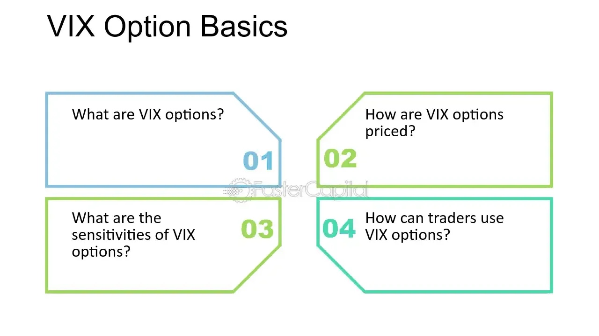

## Table of Contents

## What are VIX options and how do they differ from other options?

VIX options are options contracts based on the CBOE Volatility Index, often called the VIX. The VIX is a measure of the stock market's expectation of volatility over the next 30 days. When you buy or sell VIX options, you're betting on whether the expected volatility of the market will go up or down. These options are unique because they are based on a volatility index rather than a stock or an ETF. They are used by investors to hedge against big swings in the market or to speculate on future market volatility.

VIX options differ from other options in a few key ways. First, while most options are based on stocks or ETFs, VIX options are based on the VIX index, which itself is derived from the prices of S&P 500 options. This makes them a bit more complex because they are a step removed from actual stocks. Second, VIX options settle in cash rather than in the underlying asset. This means that when a VIX option expires, you don't get shares of stock; instead, you get a cash payment based on the VIX's value at expiration. This cash settlement feature makes VIX options more straightforward for managing and settling trades.

## What is the VIX index and why is it important for market volatility?

The VIX index, also known as the CBOE Volatility Index, is a measure that shows how much the stock market is expected to move in the next 30 days. It's like a fear gauge for the stock market. When the VIX is high, it means people expect big changes in stock prices, which usually happens when there's a lot of uncertainty or worry in the market. When the VIX is low, it means people expect the market to stay pretty calm and not move around much.

The VIX is important because it helps investors understand how nervous or confident people are about the stock market. If the VIX goes up, it might mean that investors are getting worried and might start selling their stocks, which could lead to more ups and downs in the market. On the other hand, if the VIX goes down, it might mean that investors feel more relaxed and are more likely to buy stocks, leading to a more stable market. By keeping an eye on the VIX, investors can make better decisions about when to buy or sell, and how to protect their investments from big swings in the market.

## How can VIX options be used in a basic options strategy?

VIX options can be used in a basic options strategy to protect against big market swings or to bet on future market [volatility](/wiki/volatility-trading-strategies). One simple way to use VIX options is to buy a call option when you think the market is going to get more volatile. If the VIX goes up because of increased market fear, the value of your call option will go up too. You can then sell the option for a profit before it expires or hold onto it until it expires and get a cash payment if the VIX is above the strike price.

Another basic strategy is to buy a put option on the VIX when you think the market is going to calm down. If the VIX goes down because people feel more confident, the value of your put option will increase. You can sell the put option for a profit before it expires or hold it until expiration and get a cash payment if the VIX is below the strike price. Both of these strategies are ways to make money from your predictions about how nervous or calm the market will be in the future.

## What are the key features of VIX options that traders should know?

VIX options are special because they are based on the VIX index, which measures how much the stock market is expected to move in the next 30 days. This is different from regular options, which are usually based on stocks or ETFs. When you trade VIX options, you're betting on whether the market will get more nervous or calm down. This makes VIX options a useful tool for investors who want to protect their investments from big market swings or make money from their guesses about future market volatility.

Another important thing to know about VIX options is that they settle in cash, not in the underlying asset like stocks. This means that when your VIX option expires, you don't get any shares; instead, you get a cash payment based on the VIX's value at that time. This makes VIX options easier to manage and settle. Also, VIX options can be traded during regular market hours, but they're based on the VIX futures, which trade during a different time. So, the prices of VIX options can change a lot during the day, depending on what's happening in the market.

## How does the pricing of VIX options work, and what factors influence it?

The pricing of VIX options is based on the VIX index, which measures how much the stock market is expected to move in the next 30 days. When you buy or sell VIX options, you're betting on whether the VIX will go up or down. The price of a VIX option depends on several things, like how far away the expiration date is, how much the VIX is expected to move, and the strike price of the option. The more time there is until the option expires, the more it might be worth because there's more time for the VIX to change. Also, if people expect the VIX to move a lot, the option will be more expensive because it's riskier.

The price of VIX options can also change a lot during the day because they are based on VIX futures, which trade at different times than the regular stock market. If something big happens in the market, like a big drop in stock prices, the VIX might go up quickly, and this can make VIX options more expensive. On the other hand, if the market stays calm, the VIX might go down, and VIX options might become cheaper. So, the price of VIX options is influenced by what's happening in the market, how much time is left until the option expires, and how much people expect the VIX to move.

## What are the common strategies for trading VIX options?

One common strategy for trading VIX options is to buy a call option when you think the market is going to get more volatile. If the VIX goes up because of increased market fear, the value of your call option will go up too. You can then sell the option for a profit before it expires or hold onto it until it expires and get a cash payment if the VIX is above the strike price. This strategy is useful if you expect a big event or news that might shake up the market, like an election or a big economic report.

Another strategy is to buy a put option on the VIX when you think the market is going to calm down. If the VIX goes down because people feel more confident, the value of your put option will increase. You can sell the put option for a profit before it expires or hold it until expiration and get a cash payment if the VIX is below the strike price. This can be a good move if you think the market is going to settle down after a period of high volatility.

A third strategy is to use VIX options as a hedge. If you have a lot of stocks and you're worried about a big drop in the market, you can buy VIX call options. If the market does drop and the VIX goes up, the value of your VIX options will go up, helping to offset any losses from your stocks. This way, you can protect your investments from big swings in the market.

## How can VIX options be used to hedge a portfolio against market downturns?

VIX options can be used to hedge a portfolio against market downturns by buying VIX call options. When you think the market might go down and become more volatile, you can buy these options. If the market does drop and the VIX goes up, the value of your VIX call options will also go up. This can help make up for any losses you might have in your stocks or other investments. It's like having an insurance policy for your portfolio that pays out when the market gets really shaky.

For example, if you have a lot of stocks and you're worried about a big market drop, you can buy VIX call options as a safety net. If the market stays calm, the VIX call options might not be worth much, and you might lose the money you paid for them. But if the market does get volatile and the VIX goes up, the value of your VIX call options will go up too. This can help balance out the losses in your stock portfolio, making it a smart way to protect your investments from big market swings.

## What are the risks associated with trading VIX options?

Trading VIX options comes with some risks that you should know about. One big risk is that VIX options can be very volatile. This means their prices can change a lot in a short time. If you're not careful, you could lose a lot of money quickly. Also, VIX options are based on the VIX index, which is based on the S&P 500 options. This makes them a bit more complex than regular options, and if you don't understand how they work, you might make bad trades.

Another risk is that VIX options can be expensive. Because they're based on a measure of market fear, they can cost more than other options. If you buy a VIX option and the market stays calm, the option might not be worth much when it expires, and you could lose the money you paid for it. It's also important to remember that VIX options settle in cash, not in stocks. This can be good because it's simpler, but it also means you won't get any shares if your option is in the money at expiration.

## How do VIX options react to market events and news?

VIX options react a lot to what's happening in the market and any big news. If something scary or surprising happens, like a big drop in the stock market or a sudden change in economic news, the VIX can go up fast. This is because the VIX measures how nervous people are about the market, and when people get scared, they expect the market to move a lot. So, if you have a VIX call option, its value can go up quickly when there's bad news or a big event that makes the market more volatile.

On the other hand, if the news is good and the market stays calm, the VIX can go down. This means that VIX options, especially put options, can become more valuable when the market is expected to stay steady. Traders watch the news closely because it can change the VIX and, in turn, the value of their VIX options. Knowing how the VIX might react to different events can help you make better decisions about when to buy or sell VIX options.

## What advanced strategies can be implemented using VIX options?

One advanced strategy with VIX options is called a VIX spread. This is when you buy and sell VIX options at the same time but with different strike prices or expiration dates. For example, you might buy a VIX call option with a lower strike price and sell a VIX call option with a higher strike price. This can help you make money if the VIX goes up a little bit, but it also limits how much you can lose if the VIX stays the same or goes down. It's like betting that the VIX will move a certain amount but not too much.

Another strategy is using VIX options to create a VIX butterfly spread. This is when you buy one VIX call option with a low strike price, sell two VIX call options with a middle strike price, and buy another VIX call option with a high strike price. This can be a good way to make money if you think the VIX will stay around the middle strike price. It's a bit like betting that the VIX won't move too much in either direction. Both of these strategies are more complex and can be riskier, but they can also help you make money in different ways depending on what you think the VIX will do.

## How can VIX options be integrated into a broader options trading strategy?

VIX options can be a powerful tool when you mix them with other options in your trading plan. If you have a lot of stocks and worry about a big drop in the market, you can buy VIX call options to protect your investments. This is like having insurance that pays out if the market gets really shaky. You can also use VIX options to guess about future market moves. For example, if you think the market will stay calm, you might buy VIX put options. This way, you can make money from your guesses about how the market will act, while also keeping your other investments safe.

Another way to use VIX options in a bigger plan is to mix them with other options to make more complex trades. For example, you could use VIX options to make a spread, where you buy and sell VIX options at different prices or times. This can help you make money if the VIX moves a certain way, but it also limits how much you can lose. Or you could use VIX options in a butterfly spread, betting that the VIX will stay around a certain level. These strategies can be trickier, but they let you use VIX options to make money in different ways, depending on what you think the market will do.

## What are some expert tips for maximizing returns with VIX options?

One expert tip for making the most money with VIX options is to keep an eye on what's happening in the market and the news. Big events like elections, economic reports, or even natural disasters can make the market more nervous, which can make the VIX go up. If you think something like this is coming, you might want to buy VIX call options before it happens. This way, if the VIX does go up because of the event, the value of your options will go up too, and you can sell them for a profit. Also, try to understand how much the VIX usually moves. If it tends to go up a little bit, you might want to use a strategy like a VIX spread, where you buy and sell options at different prices to make money from small moves.

Another tip is to use VIX options to protect your other investments. If you have a lot of stocks and you're worried about a big drop in the market, you can buy VIX call options as a safety net. If the market does drop and the VIX goes up, the value of your VIX options will go up too, helping to make up for any losses in your stocks. This can be a smart way to keep your investments safe while still trying to make money from the VIX. Remember, though, that VIX options can be risky and expensive, so make sure you know what you're doing and don't bet more than you can afford to lose.

## What are VIX Options Strategies?

Trading VIX options effectively requires a solid understanding of various strategies designed to manage and capitalize on expected changes in market volatility. One fundamental approach is buying call options, which allows traders to potentially gain from anticipated volatility spikes during market downturns. This strategy is particularly useful when a sharp increase in volatility is expected, as it positions the trader to benefit from corresponding price movements.

Put options in VIX can serve as a strategic hedge against the reversal of short positions in the market. When holding short positions, the threat of a sudden increase in volatility can amplify losses. By purchasing VIX put options, traders can offset this risk, as an increase in the VIX would typically lead to an appreciation in the value of these puts, thereby providing a cushion against potential losses from the short positions.

Advanced strategies like bull call spreads and butterfly spreads offer mechanisms to optimize the risk-return profile of a VIX options portfolio. A bull call spread involves buying call options at a lower strike price and selling the same number of calls at a higher strike price, within the same expiration period. This strategy limits both potential gains and potential losses, creating a controlled risk environment while betting on moderate increases in volatility.

$$
\text{Max Profit} = (\text{Strike Price of Sold Call} - \text{Strike Price of Bought Call}) - \text{Net Premium Paid}
$$

In contrast, a butterfly spread, which can be constructed using calls or puts, offers a more complex but potentially rewarding strategy for traders expecting minimal volatility movement. This involves buying two call options at differing strike prices and selling two calls at a median strike price. The potential profit is maximized if the underlying asset closes at the middle strike price at expiration, while the risk is limited to the initial premium paid.

$$
\text{Max Loss} = \text{Net Premium Paid}
$$

These multi-leg strategies require careful analysis and timing but can offer significant benefits in terms of risk management and potential return enhancement. Understanding and effectively implementing these strategies necessitates continuous monitoring of market conditions and a firm grasp of the underlying mechanics governing VIX options.

## References & Further Reading

[1]: Hendershott, T., Jones, C. M., & Menkveld, A. J. (2011). ["Does Algorithmic Trading Improve Liquidity?"](https://onlinelibrary.wiley.com/doi/full/10.1111/j.1540-6261.2010.01624.x) The Review of Financial Studies, 24(3), 1460-1485.

[2]: Cboe Global Markets, Inc. (n.d.). ["VIX® Options Product Specifications."](https://ww2.cboe.com/tradable_products/vix/vix_options/specifications/)

[3]: Black, F., & Scholes, M. (1973). ["The Pricing of Options and Corporate Liabilities."](https://www.cs.princeton.edu/courses/archive/fall09/cos323/papers/black_scholes73.pdf) Journal of Political Economy, 81(3), 637-654.

[4]: Whaley, R. E. (2000). ["The Investor Fear Gauge."](https://www.semanticscholar.org/paper/The-Investor-Fear-Gauge-Whaley/37ea262fb99beb8bf9dcb8406400d491aab40a0b) Journal of Portfolio Management, 26(4), 12-17.

[5]: Hull, J. C. (2018). ["Options, Futures, and Other Derivatives"](https://www.semanticscholar.org/paper/Options%2C-Futures%2C-and-Other-Derivatives-Hull/89bdee500c8623864fc9eb7a471546aa713acc44) (10th Edition). Pearson.