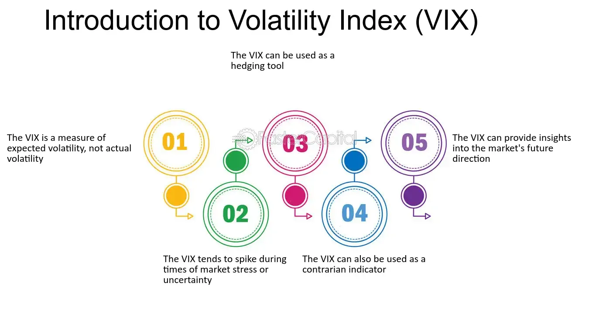

## Table of Contents

## What is the VIX and what does it measure?

The VIX, or Volatility Index, is a tool that measures how much the stock market expects prices to change in the future. It's often called the "fear gauge" because it shows how worried investors are about the market. The VIX is calculated using the prices of options on the S&P 500, which is a big collection of stocks. When the VIX goes up, it means people think the market will be more unpredictable and risky soon.

The VIX is important because it helps investors understand the mood of the market. If the VIX is high, it means there's a lot of uncertainty and people might be scared about what will happen next. On the other hand, if the VIX is low, it means the market is calm and people feel more confident. By keeping an eye on the VIX, investors can make better decisions about when to buy or sell stocks.

## How is the VIX calculated?

The VIX is calculated using the prices of options on the S&P 500. Options are like bets on whether the stock market will go up or down. The VIX looks at both call options, which bet on the market going up, and put options, which bet on the market going down. It focuses on options that will expire in about a month because they show what people think will happen soon. The VIX measures how much these options cost, which tells us how much people are willing to pay to protect themselves from big changes in the market.

To figure out the VIX, a special math formula is used. This formula looks at the difference between the prices of many different options. It takes into account how much the market might move up or down and how likely those moves are. The result is a number that shows the expected yearly change in the S&P 500, but it's shown as a percentage. So, if the VIX is 20, it means people expect the S&P 500 to move up or down by about 20% over the next year.

## Why is the VIX often referred to as the 'Fear Index'?

The VIX is often called the 'Fear Index' because it shows how scared or worried people are about the stock market. When the VIX goes up, it means that more people are buying options to protect themselves from big drops in the market. This happens when people think the market might become more unpredictable and risky soon. So, a high VIX number shows that there's a lot of fear and uncertainty among investors.

On the other hand, when the VIX is low, it means that people are feeling calm and confident about the market. They don't think big changes are coming, so they don't feel the need to buy as many protective options. This is why the VIX is a good way to measure the overall mood of the market. When people are scared, the VIX goes up, and when they're not, it goes down.

## What are the common ways investors can trade the VIX?

Investors can trade the VIX through different ways. One common way is by using VIX futures. These are agreements to buy or sell the VIX at a certain price on a future date. When investors think the VIX will go up, they buy VIX futures. If they think it will go down, they sell them. Another way is through VIX options, which give investors the right, but not the obligation, to buy or sell the VIX at a set price before a certain time. These options let investors bet on whether they think the VIX will rise or fall.

Another way to trade the VIX is through exchange-traded products (ETPs) like the VXX or the UVXY. These are funds that try to match the daily performance of the VIX or a multiple of it. They let investors easily buy and sell something that follows the VIX without dealing directly with futures or options. However, these products can be risky and are usually meant for short-term trading rather than long-term investing.

## How can the VIX be used for hedging against market downturns?

Investors can use the VIX to protect their money from big drops in the stock market. When they think the market might go down, they can buy VIX options or futures. These are like insurance for their investments. If the market does fall and the VIX goes up, the value of the VIX options or futures will also go up. This can help make up for the money they lose in the stock market.

For example, if an investor owns a lot of stocks and is worried about a market crash, they might buy VIX call options. These options will become more valuable if the VIX goes up, which usually happens when the stock market goes down. By doing this, the investor can use the money they make from the VIX options to cover some of the losses from their stocks. It's a way to balance out the risk and feel safer about their investments.

## What are VIX futures and options, and how do they work?

VIX futures are agreements to buy or sell the VIX at a set price on a future date. They are like bets on what the VIX will do in the future. If you think the VIX will go up because you expect the market to become more unpredictable, you can buy VIX futures. If the VIX does go up by the time the futures expire, you can sell them for more money than you paid, making a profit. On the other hand, if you think the VIX will go down because the market will be calm, you can sell VIX futures. If the VIX does go down, you can buy them back cheaper and make money from the difference.

VIX options give you the right, but not the obligation, to buy or sell the VIX at a set price before a certain time. They come in two types: call options and put options. Call options let you buy the VIX at a set price if you think it will go up. If the VIX does go up, you can use the call option to buy it cheaper than the current price and then sell it at the higher market price, making a profit. Put options let you sell the VIX at a set price if you think it will go down. If the VIX does go down, you can use the put option to sell it at a higher price than the current market price, again making a profit. Both types of options help investors protect their money or bet on what the VIX will do next.

## Can you explain the relationship between the VIX and the stock market?

The VIX and the stock market have an opposite relationship. When the stock market goes down and people start to worry, the VIX usually goes up. This is because the VIX measures how much people expect the market to move around, and when the market is falling, people think it will keep moving a lot. So, the VIX is often called the "fear gauge" because it shows how scared people are about the stock market.

On the other hand, when the stock market is doing well and people feel confident, the VIX usually goes down. This happens because people think the market will stay calm and not change much. So, the VIX helps investors understand the mood of the market. If the VIX is high, it means people are nervous, and if it's low, it means they feel safe about their investments.

## What are the historical patterns and trends of the VIX?

The VIX has shown some clear patterns over time. When the stock market goes through big changes, like during financial crises, the VIX often spikes up. For example, during the 2008 financial crisis, the VIX hit very high levels, showing how scared investors were. Another time was in early 2020 when the COVID-19 pandemic started, and the VIX jumped up a lot because people were worried about what would happen to the economy. These big spikes show that the VIX is good at showing when people are really worried about the market.

On the other hand, the VIX usually stays lower when the market is calm and doing well. For example, during the long bull market from 2009 to 2019, the VIX was often at lower levels because people felt more confident about their investments. The VIX tends to move in cycles, with periods of high fear followed by times of calm. This pattern helps investors see when the market might be getting too risky or when it might be a good time to invest because things are more stable.

## How can one profit from movements in the VIX?

People can make money from the VIX by trading VIX futures and options. If you think the VIX is going to go up because you expect the stock market to get more unpredictable, you can buy VIX futures. If the VIX does go up when your futures expire, you can sell them for more than you paid and make a profit. On the other hand, if you think the VIX will go down because the market will be calm, you can sell VIX futures. If the VIX goes down, you can buy them back cheaper and make money from the difference.

Another way to profit from the VIX is by using VIX options. There are two types: call options and put options. If you think the VIX will go up, you can buy call options. These let you buy the VIX at a lower price than it might be in the future, and if it does go up, you can sell it at the higher market price and make money. If you think the VIX will go down, you can buy put options. These let you sell the VIX at a higher price than it might be in the future, and if it does go down, you can make money from selling it at that higher price. Both types of options can help you make money based on your predictions about the VIX.

## What are the risks associated with trading VIX-related products?

Trading VIX-related products can be risky because the VIX can change a lot in a short time. It's called the "fear gauge" for a reason. When the stock market gets scared, the VIX can jump up very quickly. This means if you're betting on the VIX going up and it doesn't, you could lose a lot of money fast. Also, VIX products like futures and options can be hard to understand and they can lose value over time, especially if you're holding them for a long time.

Another risk is that VIX products are often used for short-term trading, not for keeping over a long time. If you're not careful, you might end up losing money because the VIX can be very unpredictable. Also, some VIX exchange-traded products (ETPs) are designed to follow the daily changes in the VIX, not the long-term trends. This means if you hold onto these products for more than a day, they might not perform the way you expect, and you could lose money even if the VIX goes in the direction you thought it would.

## How does the VIX impact portfolio management and risk assessment?

The VIX helps people who manage money to understand how scared or calm the stock market is. When the VIX is high, it means the market might move a lot and be risky, so people managing money might decide to be more careful. They might sell some of their stocks or buy things that protect their money from big drops in the market. On the other hand, when the VIX is low, it means the market is calm and not moving much, so they might feel safer to buy more stocks or invest more money.

The VIX also helps with figuring out how much risk is in a group of investments. If the VIX is high, it can show that the whole market is risky, so people might want to check their investments more closely. They might look at how their investments could be affected by big changes in the market and decide to change their plans to be safer. By keeping an eye on the VIX, people can make better choices about their money and feel more ready for what might happen in the stock market.

## What are some advanced strategies for using the VIX in financial markets?

One advanced strategy for using the VIX in financial markets is called "VIX hedging." This means buying VIX options or futures to protect your money from big drops in the stock market. For example, if you have a lot of stocks and you're worried about a market crash, you can buy VIX call options. If the market does fall and the VIX goes up, the value of your VIX options will go up too. This can help you make up for some of the money you lose in the stock market. It's like having insurance for your investments, and it can make you feel safer about what might happen next.

Another strategy is called "VIX trading," where you try to make money from the VIX going up or down. You can do this by buying or selling VIX futures or options. If you think the VIX will go up because the market might get more unpredictable, you can buy VIX futures or call options. If the VIX does go up, you can sell them for more money than you paid and make a profit. On the other hand, if you think the VIX will go down because the market will be calm, you can sell VIX futures or buy put options. If the VIX goes down, you can buy back the futures cheaper or make money from the put options. This strategy can be risky but can also help you make money if you guess right about the VIX.

A third strategy involves using the VIX to time the market. By watching the VIX, you can get a sense of when the market might be too risky or when it might be a good time to invest. If the VIX is very high, it might mean the market is about to calm down, so you could buy stocks at a lower price. If the VIX is very low, it might mean the market is about to get more unpredictable, so you could sell some of your stocks to protect your money. This strategy can help you make better decisions about when to buy or sell, but it's important to remember that the VIX is just one tool and you should use other information too.

## What is the VIX and how does it serve as the Uncertainty Index?

The VIX, or Volatility Index, is a vital instrument for financial market participants, effectively reflecting the market's expectations of near-term volatility conveyed through S&P 500 index options. Its nickname, the 'fear index,' often emphasizes its role as a sentiment indicator, reflecting investors' apprehensions towards potential market downturns. However, it serves a broader function as a measure of uncertainty rather than merely risk.

The index operates on the premise of quantifying the expected volatility over the coming 30 days. This is achieved by calculating the square root of the annualized variance, extracted from the weighted prices of S&P 500 options at different strike prices. More formally, the formula for the VIX involves integrating the weighted average of the implied volatilities of calls and puts beyond a range of strike prices. Mathematically, the VIX is calculated using the following formula:

$$
\text{VIX} = 100 \times \sqrt{\frac{2}{\pi T} \left( \sum \left( \frac{K_i}{K^2} e^{RT}Q+\frac{F-K}{K^2}e^{RT}Q \right) - \frac{1}{T}(F/K_0 - 1)^2 \right) }
$$

where $T$ is the time to expiration, $K$ denotes the strike prices, $R$ is the risk-free interest rate, $Q$ represents the price of the options, and $F$ is the forward index level derived from the index futures price.

By evaluating the array of these option prices—indicators of investor sentiment—the VIX provides a forward-looking measure of market [volatility](/wiki/volatility-trading-strategies). It effectively aggregates the collective market stance on the direction of market swings, adding depth to financial market dynamics understanding.

Thus, while its reputation as the 'fear index' might imply an exclusively negative connotation, the VIX's true utility lies in its ability to encapsulate broader market sentiments. It serves as a benchmark for gauging investor sentiment, informing strategies that seek to address anticipated market fluctuations, and informing risk management practices.

## References & Further Reading

[1]: Whaley, R. E. (2009). ["Understanding the VIX."](https://www.researchgate.net/publication/277429711_Understanding_the_VIX) The Journal of Portfolio Management, 35(3), 98-105.

[2]: Simon, D. P. (2003). ["The VIX futures market: Liquidity and implications for asset pricing."](https://onlinelibrary.wiley.com/doi/10.1002/fut.21788) The Journal of Futures Markets, 23(11), 1019-1041.

[3]: ["Trading VIX Derivatives: Trading and Hedging Strategies Using VIX Futures, Options, and Exchange-Traded Notes."](https://www.amazon.com/Trading-VIX-Derivatives-Strategies-Exchange-Traded/dp/0470933089) by Russell Rhoads

[4]: Swishchuk, A. (2008). ["Modeling and Pricing in Financial Markets for Weather Derivatives."](https://worldscientific.com/worldscibooks/10.1142/8457) World Scientific Publishing Company.

[5]: Black, F., & Scholes, M. (1973). ["The pricing of options and corporate liabilities."](https://www.cs.princeton.edu/courses/archive/fall09/cos323/papers/black_scholes73.pdf) Journal of Political Economy, 81(3), 637-654.