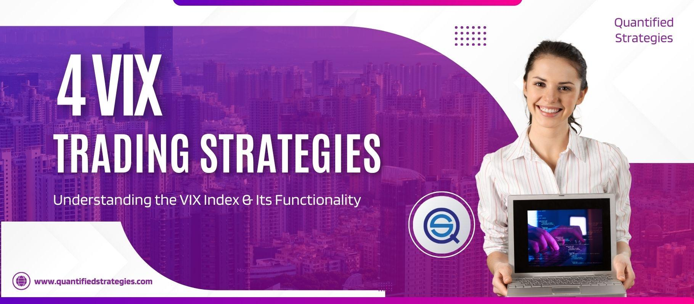

## Table of Contents

## What is the VIX and why is it important?

The VIX, or Volatility Index, is a tool that measures how much the stock market expects prices to change in the future. It's like a thermometer for the stock market's nervousness. The VIX looks at options, which are contracts that give people the right to buy or sell stocks at certain prices. When people think the market will move a lot, they buy more options, and the VIX goes up. When they think the market will stay calm, the VIX goes down.

The VIX is important because it helps investors understand how risky the market might be. If the VIX is high, it means investors are worried and expect big changes in stock prices. This can be a sign that it's a good time to be careful with investments. On the other hand, if the VIX is low, it suggests that the market is calm and investors are feeling more confident. By watching the VIX, investors can make smarter choices about when to buy or sell stocks.

## How does the VIX reflect market volatility?

The VIX, or Volatility Index, reflects market volatility by measuring how much the stock market expects prices to change in the future. It does this by looking at the prices of options, which are financial contracts that give people the right to buy or sell stocks at specific prices. When people think the market will be more unpredictable and prices will move a lot, they buy more options to protect themselves. This increased demand for options pushes the VIX higher, showing that the market is expecting more volatility.

On the other hand, when people think the market will stay calm and prices won't change much, they don't buy as many options. This lower demand for options causes the VIX to go down, signaling that the market expects less volatility. So, the VIX acts like a gauge of the market's nervousness, helping investors understand how much uncertainty there is and how much they should be prepared for big swings in stock prices.

## What are the basic principles of trading the VIX?

Trading the VIX involves understanding that it's not a stock you can buy directly. Instead, you trade products that are based on the VIX, like futures, options, or exchange-traded products (ETPs). These products try to follow the VIX's movements but don't always match it perfectly. When you think the market will get more nervous and the VIX will go up, you might buy these products. If you think the market will calm down and the VIX will go down, you might sell or short these products.

It's important to know that trading the VIX can be risky. The VIX can change a lot in a short time, and the products that track it can be hard to understand. They might not move the same way as the VIX, and they can lose value over time. So, it's a good idea to learn a lot about these products and maybe talk to a financial advisor before you start trading them. Remember, the VIX is a tool to help you understand market nervousness, not a guarantee of what will happen next.

## What are the different ways to trade the VIX?

Trading the VIX means you can't buy it directly like a stock. Instead, you trade things that are based on the VIX. There are a few ways to do this. One way is through VIX futures. These are agreements to buy or sell the VIX at a certain price on a future date. Another way is VIX options, which give you the right to buy or sell VIX futures at a set price before they expire. Lastly, you can trade VIX exchange-traded products (ETPs), like ETFs or ETNs, which try to follow the VIX's movements but don't always match it perfectly.

Each of these ways has its own risks and things to think about. VIX futures and options can be tricky because they might not move the same way as the VIX itself, and they can lose value over time. VIX ETPs can be easier to trade because they're like stocks, but they can also be risky because they might not track the VIX closely and can have big price swings. It's important to understand these products well and maybe talk to a financial advisor before you start trading them.

Remember, trading the VIX is about guessing if the market will get more nervous or calm down. If you think the market will get more nervous, you might buy VIX products, hoping their value will go up. If you think the market will calm down, you might sell or short these products, hoping their value will go down. It's a way to bet on how much the market might move, but it's not a sure thing, and it can be risky.

## How can beginners start trading the VIX?

If you're a beginner and want to start trading the VIX, it's important to first understand that you can't buy the VIX directly like a stock. Instead, you'll be trading products that are based on the VIX, like VIX futures, VIX options, or VIX exchange-traded products (ETPs). VIX futures are agreements to buy or sell the VIX at a certain price on a future date. VIX options give you the right to buy or sell VIX futures at a set price before they expire. VIX ETPs, like ETFs or ETNs, try to follow the VIX's movements but don't always match it perfectly.

Before you start trading, it's a good idea to learn as much as you can about these products. They can be tricky because they might not move the same way as the VIX itself, and they can lose value over time. It's also smart to practice with a demo account or a small amount of money to get a feel for how these products work. Remember, trading the VIX is about guessing if the market will get more nervous or calm down. If you think the market will get more nervous, you might buy VIX products, hoping their value will go up. If you think the market will calm down, you might sell or short these products, hoping their value will go down. It's a way to bet on how much the market might move, but it's not a sure thing, and it can be risky.

## What are the common VIX trading strategies for intermediate traders?

For intermediate traders, one common VIX trading strategy is to use VIX options to hedge against market downturns. When they think the market will get more nervous and the VIX will go up, they might buy VIX call options. These options give them the right to buy VIX futures at a set price if the VIX goes up as expected. This can help protect their other investments from big drops in the stock market. If the VIX goes down instead, they only lose the money they paid for the options, which can be less than losing money on their whole portfolio.

Another strategy is to trade VIX futures to take advantage of expected changes in market volatility. If an intermediate trader believes the VIX will go up because of upcoming news or events that might make the market nervous, they might buy VIX futures. If the VIX goes up, they can sell the futures later at a higher price and make a profit. On the other hand, if they think the market will calm down and the VIX will go down, they might sell or short VIX futures, hoping to buy them back later at a lower price.

Some intermediate traders also use VIX exchange-traded products (ETPs) like ETFs or ETNs to speculate on short-term movements in the VIX. These products can be easier to trade because they work like stocks, but they can be risky because they might not track the VIX closely and can have big price swings. Traders might buy these ETPs if they think the VIX will go up in the short term, or they might sell or short them if they think the VIX will go down. It's important for intermediate traders to understand these products well and keep an eye on their positions because the VIX can change a lot in a short time.

## How does the VIX futures market work?

The VIX futures market is a place where people can trade agreements to buy or sell the VIX at a certain price on a future date. The VIX, or Volatility Index, measures how much the stock market expects prices to change in the future. When someone buys a VIX futures contract, they're betting that the VIX will go up by the time the contract expires. If the VIX does go up, they can sell the contract later at a higher price and make a profit. If the VIX goes down, they might lose money because they have to buy the VIX at a higher price than it's worth when the contract expires.

VIX futures are different from the VIX itself because they're based on where people think the VIX will be in the future, not where it is right now. This means the price of VIX futures can be different from the current VIX level. Traders use VIX futures to guess if the market will get more nervous or calm down. If they think the market will get more nervous, they might buy VIX futures, hoping to sell them later at a higher price. If they think the market will calm down, they might sell or short VIX futures, hoping to buy them back later at a lower price. It's a way to bet on how much the market might move, but it's not a sure thing, and it can be risky.

## What are the risks associated with VIX trading?

Trading the VIX can be risky because the VIX can change a lot in a short time. When you trade VIX futures, options, or ETPs, you're betting on what the market might do in the future. If you guess wrong, you could lose money. For example, if you buy VIX futures thinking the VIX will go up but it goes down instead, you'll lose money because you have to buy the VIX at a higher price than it's worth when the contract expires.

Another risk is that the products you trade, like VIX futures and options, might not move the same way as the VIX itself. This is called "contango" and "backwardation." Contango happens when futures prices are higher than the current VIX, which can make you lose money over time. Backwardation is when futures prices are lower than the current VIX, which can also be risky. VIX ETPs can be tricky too because they might not track the VIX closely and can have big price swings, which can lead to big losses if you're not careful.

## How can advanced traders use VIX options to hedge their portfolios?

Advanced traders can use VIX options to protect their portfolios from big drops in the stock market. When they think the market might get more nervous and the VIX might go up, they can buy VIX call options. These options give them the right to buy VIX futures at a set price if the VIX goes up as expected. This can help them make money from the VIX going up, which can offset losses in their other investments if the stock market goes down. If the VIX doesn't go up, they only lose the money they paid for the options, which can be less than losing money on their whole portfolio.

Another way advanced traders use VIX options is to sell VIX put options when they think the market will stay calm and the VIX will stay low or go down. By selling these options, they get paid money upfront. If the VIX stays low or goes down, the options expire worthless, and the traders keep the money they were paid. This can add some extra money to their portfolio. But if the VIX goes up a lot, they might have to buy VIX futures at a higher price than they're worth, which can lead to losses. So, using VIX options to hedge a portfolio can be a smart way to manage risk, but it's important to understand the risks and keep an eye on the market.

## What are some advanced VIX trading strategies?

Advanced traders might use a strategy called the "VIX butterfly spread" to make money from the VIX staying in a certain range. They do this by buying and selling VIX options at different prices. They buy one VIX call option at a lower price, sell two VIX call options at a higher price, and then buy another VIX call option at an even higher price. If the VIX stays between the middle price and the highest price when the options expire, the trader can make money. This strategy can be good when the market is calm and the VIX is expected to stay steady, but it's tricky and needs a lot of understanding of options trading.

Another strategy is the "VIX calendar spread," which involves buying and selling VIX futures or options that expire at different times. Traders might buy a VIX future or option that expires soon and sell one that expires later. If they think the VIX will go up in the short term but then come back down, they can make money from the difference in prices between the two contracts. This strategy can be good when there's a big event coming up that might make the market nervous for a short time, but it's risky because the VIX can change a lot and the contracts might not move the way the trader expects.

Some advanced traders also use a strategy called "VIX ratio spread," where they buy and sell VIX options in different amounts. For example, they might buy one VIX call option and sell two or more VIX call options at a higher price. This can be a way to make money if the VIX goes up a little bit but not too much. It's a way to bet on small changes in the VIX, but it can be risky if the VIX moves a lot more than expected. These strategies need a lot of knowledge about how options and futures work and a good understanding of how the VIX might change in the future.

## How does the VIX correlate with other financial instruments?

The VIX often moves in the opposite direction of the stock market. When the stock market goes down and investors get worried, the VIX usually goes up because it measures how much the market expects prices to change. People buy more options to protect themselves when they think the market will be more unpredictable, which makes the VIX go up. On the other hand, when the stock market goes up and investors feel more confident, the VIX usually goes down because people don't think prices will change as much. This means the VIX can be a good tool to see how nervous or calm the market is feeling.

The VIX also has a relationship with other financial instruments like bonds and currencies. When the VIX goes up, it can make bond prices go up too because investors might move their money from stocks to safer investments like bonds. This can make bond yields, or the return you get from bonds, go down. For currencies, a high VIX can make the U.S. dollar stronger because it's seen as a safe place to keep money during uncertain times. But these relationships are not always the same, and other things can affect how the VIX moves with other financial instruments.

## What are the historical performance trends of VIX trading strategies?

Over the years, trading strategies based on the VIX have shown mixed results. When the market gets nervous and the VIX goes up, strategies like buying VIX futures or options can make money if the VIX keeps going up. For example, during big events like the 2008 financial crisis or the 2020 COVID-19 market crash, the VIX went up a lot, and traders who bet on this made money. But these big moves don't happen often, and most of the time, the VIX stays calm or goes down slowly. This means that strategies like buying VIX futures or options can lose money over time because of something called "contango," where future prices are higher than the current VIX.

Some traders use VIX options to protect their other investments. This can work well when the market goes down and the VIX goes up, helping to offset losses in their stock portfolio. But if the market stays calm and the VIX stays low, the money they paid for the options can be wasted. Other strategies like VIX butterfly spreads or calendar spreads can make money if the VIX stays in a certain range or moves in a certain way, but they need a lot of understanding and can be risky if the VIX moves differently than expected. Overall, the success of VIX trading strategies depends a lot on timing and understanding how the VIX might change in the future.

## How can one develop algorithmic VIX trading strategies?

Developing algorithmic strategies for trading the CBOE Volatility Index (VIX) involves a systematic approach to identify and capitalize on patterns of volatility shifts. An effective strategy begins with identifying anomalies or patterns within the historical data of VIX, which can serve as indicators of impending market volatility. Traders often focus on statistical measures such as standard deviation or variance to quantify historical volatility changes. For instance, calculating the historical standard deviation of VIX values can help in assessing the likelihood of future volatility spikes:

$$
\sigma = \sqrt{\frac{1}{N} \sum_{i=1}^{N} (VIX_i - \bar{VIX})^2}
$$

where $\sigma$ represents the standard deviation, $VIX_i$ is each individual VIX data point, $\bar{VIX}$ is the mean of the VIX data points, and $N$ is the total number of observations.

Moreover, trading signals from the VIX can be enhanced by pairing them with technical indicators. Moving averages and Bollinger Bands are widely used in this context. A simple moving average (SMA) can be applied to smooth out VIX data, aiding in the identification of trends, while Bollinger Bands, which encompass a moving average with upper and lower bands set at standard deviations, provide insights into price volatility and potential [breakout](/wiki/breakout-trading) points.

For a moving average:

$$
SMA = \frac{1}{n} \sum_{j=0}^{n-1} VIX_{i-j}
$$

where $n$ is the number of periods for the moving average and $VIX_{i-j}$ refers to the VIX values over those periods.

In contrast, Bollinger Bands are calculated as:

$$
\text{Upper Band} = SMA + m \times \sigma
$$
$$
\text{Lower Band} = SMA - m \times \sigma
$$

where $m$ is the number of standard deviations, typically set to 2.

Additionally, [machine learning](/wiki/machine-learning) techniques can significantly enhance prediction accuracy by training algorithms to recognize complex patterns within historical VIX data. Techniques such as supervised learning can be employed to develop predictive models. Machine learning models like decision trees, random forests, or neural networks can be trained on historical VIX datasets to discern patterns that might not be immediately obvious through traditional statistical methods.

A Python implementation of a basic machine learning model using a decision tree might look like this:

```python
from sklearn.model_selection import train_test_split
from sklearn.tree import DecisionTreeRegressor
import pandas as pd

# Load historical VIX data into a DataFrame
vix_data = pd.read_csv('vix_data.csv')

# Define features and target variable
X = vix_data[['sma', 'bollinger_upper', 'bollinger_lower']]
y = vix_data['vix_future']

# Split data into training and test sets
X_train, X_test, y_train, y_test = train_test_split(X, y, test_size=0.2, random_state=42)

# Initialize and fit the decision tree model
model = DecisionTreeRegressor()
model.fit(X_train, y_train)

# Predict future VIX values
vix_predictions = model.predict(X_test)
```

This model would utilize past VIX data, including simple moving averages and Bollinger Bands as inputs, to predict future values and potential volatility shifts. The integration of machine learning in trading strategies enables the discovery and utilization of more intricate patterns than traditional methods alone can provide.

## References & Further Reading

[1]: Bergstra, J., Bardenet, R., Bengio, Y., & Kégl, B. (2011). ["Algorithms for Hyper-Parameter Optimization."](https://dl.acm.org/doi/10.5555/2986459.2986743) Advances in Neural Information Processing Systems 24.

[2]: ["Advances in Financial Machine Learning"](https://www.amazon.com/Advances-Financial-Machine-Learning-Marcos/dp/1119482089) by Marcos Lopez de Prado

[3]: ["Evidence-Based Technical Analysis: Applying the Scientific Method and Statistical Inference to Trading Signals"](https://www.amazon.com/Evidence-Based-Technical-Analysis-Scientific-Statistical/dp/0470008741) by David Aronson

[4]: ["Machine Learning for Algorithmic Trading"](https://github.com/stefan-jansen/machine-learning-for-trading) by Stefan Jansen

[5]: ["Quantitative Trading: How to Build Your Own Algorithmic Trading Business"](https://books.google.com/books/about/Quantitative_Trading.html?id=j70yEAAAQBAJ) by Ernest P. Chan