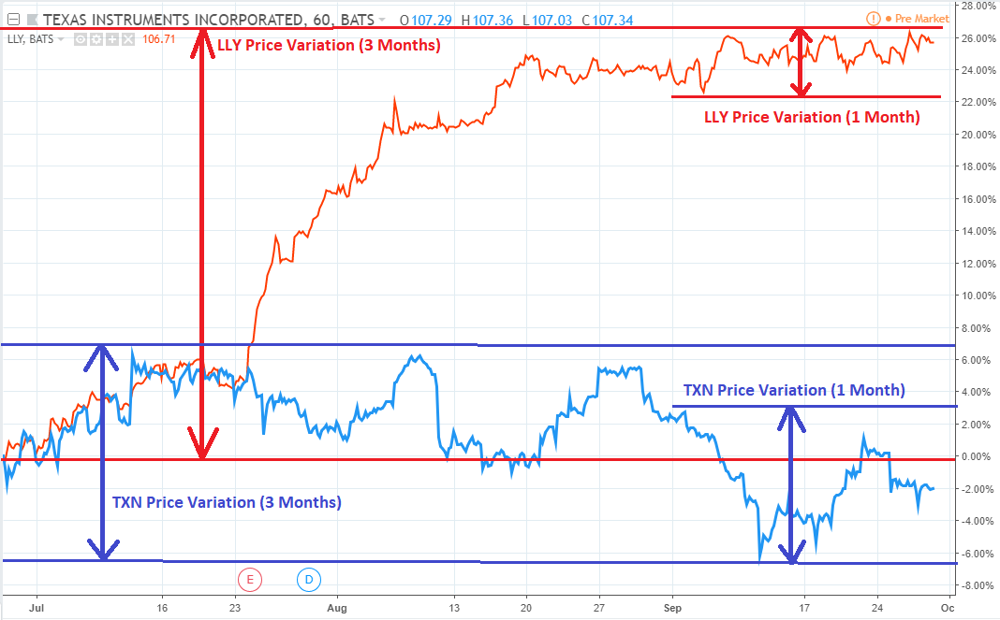

## Table of Contents

## What is the VIX and what does it measure?

The VIX is a tool that measures how much people expect the stock market to move up or down in the next 30 days. It's also called the "Fear Index" because it shows how worried investors are about the market. The VIX is calculated using the prices of options on the S&P 500, which is a big group of stocks. When the VIX number is high, it means people think the market will move a lot, and they're more worried. When the VIX number is low, it means people think the market will stay pretty steady, and they're less worried.

The VIX is important because it helps investors understand the mood of the market. If the VIX is high, it might be a good time to be careful with investments because big changes could be coming. If the VIX is low, it might be a good time to invest because the market seems calm. But remember, the VIX is just one tool, and it's always good to look at other information too before making decisions about money.

## How is the VIX calculated?

The VIX is calculated using the prices of options on the S&P 500. Options are like bets on where the stock market will go. The VIX looks at both call options, which bet the market will go up, and put options, which bet the market will go down. It focuses on options that will expire in about a month. The VIX uses a special math formula to figure out how much the S&P 500 is expected to move up or down in the next 30 days.

This formula takes the prices of many different options and turns them into one number. It does this by looking at how much it costs to buy options that will make money if the market moves a lot. The more it costs to buy these options, the higher the VIX will be. This means the market is expecting bigger moves and more worry. The VIX is updated every 15 seconds during trading hours, so it's always showing the latest guess about how much the market might move.

## Why is the VIX often referred to as the 'fear index'?

The VIX is often called the 'fear index' because it shows how scared or worried investors are about the stock market. When the VIX number goes up, it means people think the market might move a lot and they are more worried. This is why it's called the 'fear index' - it measures the fear in the market.

When the VIX is high, it means investors are buying more options to protect themselves from big drops in the market. They are scared that their investments might lose value, so they want to be safe. On the other hand, when the VIX is low, it means investors are not as worried and think the market will stay calm. So, the VIX helps everyone see how much fear is in the market at any time.

## What is a normal range for the VIX?

The VIX usually stays between 10 and 30. When the VIX is around 10 to 20, it means the market is pretty calm and people are not too worried. If the VIX is in the middle of this range, like around 15, it's a normal time in the market. 

But sometimes, the VIX can go above 30. When this happens, it means people are really worried and think the market might move a lot. This can happen during big events or when there's a lot of uncertainty. If the VIX goes above 40 or even 50, it means there's a lot of fear in the market, and it's a very unusual time.

## How can the VIX be used in trading and investment strategies?

The VIX can help traders and investors make decisions about their money. If the VIX is low, around 10 to 20, it might be a good time to buy stocks because the market seems calm and people are not too worried. Traders might think it's safe to invest more because big changes are not expected soon. On the other hand, if the VIX is high, above 30, it might be a good time to be careful. High VIX means people are worried and expect the market to move a lot, so traders might want to protect their investments or wait for a better time to buy.

Some investors use the VIX to make special trades called options. They can buy options that will make money if the VIX goes up or down. For example, if an investor thinks the market will get more worried soon, they might buy options that will make money if the VIX goes up. This can be a way to make money from the fear in the market. But it's important to remember that trading with the VIX can be risky, so it's good to learn a lot about it and maybe talk to a financial advisor before making big decisions.

## What is the relationship between the VIX and market volatility?

The VIX is a measure of how much people think the stock market will move up or down in the next 30 days. When the VIX is high, it means people expect big changes in the market, and this is called high volatility. High volatility means the market can go up or down a lot, and it makes investors worried. On the other hand, when the VIX is low, it means people expect the market to stay pretty steady, and this is called low volatility. Low volatility means the market moves less, and investors are less worried.

The VIX is often called the 'fear index' because it shows how scared investors are about the market's future. When the VIX goes up, it means more fear and more expected movement in the market. This can happen during big events or when there's a lot of uncertainty. When the VIX goes down, it means less fear and less expected movement. By watching the VIX, investors can get a sense of how much the market might change and plan their investments accordingly.

## How does the VIX impact options pricing?

The VIX affects how much options cost because it shows how much people think the stock market will move in the next 30 days. Options are like bets on where the stock market will go. If the VIX is high, it means people expect big changes in the market, so options will cost more. This is because when the market moves a lot, there's a bigger chance that the options will make money. People are willing to pay more for options that might make them a lot of money.

On the other hand, if the VIX is low, it means people expect the market to stay pretty steady. When the market doesn't move much, options are less likely to make a lot of money, so they cost less. Traders look at the VIX to help them decide if options are a good deal. If the VIX is high and options are expensive, traders might think twice before buying them. But if the VIX is low and options are cheap, it might be a good time to buy options.

## Can the VIX be traded directly, and if so, how?

You can't trade the VIX directly like you can trade stocks. The VIX is just a number that shows how much people think the stock market will move in the next 30 days. But you can trade things that are based on the VIX, like futures and options. These are special kinds of trades that let you bet on where you think the VIX will go.

To trade VIX futures, you go to a special place called the CBOE Futures Exchange. You can buy or sell futures contracts that are based on what the VIX will be in the future. If you think the VIX will go up, you can buy a futures contract and make money if it does go up. If you think the VIX will go down, you can sell a futures contract and make money if it does go down. Trading VIX options works in a similar way, but you can buy options that will make money if the VIX goes up or down by a certain amount.

## What are VIX futures and options, and how do they work?

VIX futures are special contracts that let you bet on where you think the VIX will be in the future. The VIX is a number that shows how much people think the stock market will move in the next 30 days. When you buy a VIX futures contract, you're betting that the VIX will go up by the time the contract ends. If you sell a VIX futures contract, you're betting that the VIX will go down. These contracts are traded on a special place called the CBOE Futures Exchange. The price of the futures contract goes up and down based on what people think the VIX will do in the future.

VIX options are another way to bet on the VIX. Options give you the right, but not the obligation, to buy or sell the VIX at a certain price before the option expires. There are two kinds of VIX options: calls and puts. A call option lets you buy the VIX at a certain price if you think it will go up. A put option lets you sell the VIX at a certain price if you think it will go down. Like VIX futures, VIX options are traded on the CBOE. The price of these options changes based on what people think the VIX will do, and they can be a way to make money if you guess right about where the VIX is headed.

## How does the VIX correlate with stock market indices like the S&P 500?

The VIX and the S&P 500 have an interesting relationship. When the VIX goes up, it usually means that people are worried and expect the S&P 500 to move a lot. This often happens when the stock market is going down or when there's a lot of uncertainty. So, a high VIX can be a sign that the S&P 500 might drop or become more volatile. On the other hand, when the VIX is low, it means people are not as worried and expect the S&P 500 to stay pretty steady. This usually happens when the stock market is doing well or when things are calm.

Even though the VIX and the S&P 500 are connected, they don't always move in the opposite direction. Sometimes the VIX can go up a little bit even when the S&P 500 is going up, or it can stay low even when the S&P 500 is going down. But in general, the VIX is a good way to see how worried people are about the S&P 500. If you see the VIX going up a lot, it's a good idea to be careful with your investments in the S&P 500 because big changes might be coming.

## What historical events have significantly affected the VIX?

Big events that make people worry about the stock market can make the VIX go up a lot. One famous time was during the financial crisis in 2008. The VIX got really high, over 80, because people were scared that banks might fail and the whole economy could crash. Another time was in 2020 when the COVID-19 pandemic started. The VIX went up to around 85 because everyone was worried about how the virus would hurt businesses and the economy. These events show how the VIX can spike when people are really scared about the future.

There have been other times when the VIX went up because of big events too. For example, after the terrorist attacks on September 11, 2001, the VIX went up a lot because people were unsure about what would happen next. Also, during the European debt crisis in 2011, the VIX went up because people were worried about countries like Greece not being able to pay their debts. These events show that anything that makes people worried about the economy can make the VIX go up.

## How can advanced statistical models be used to predict VIX movements?

Advanced statistical models can help predict how the VIX might move by looking at a lot of different things all at once. These models can use past data about the VIX, how the stock market has moved before, and other things like how much people are buying or selling options. They can also look at big events that might make people worried about the market, like a financial crisis or a global health scare. By putting all this information together, the models can make guesses about where the VIX might go next. This can be really helpful for people who want to make smart choices about their investments.

These models can be very complicated, using things like [machine learning](/wiki/machine-learning) and [artificial intelligence](/wiki/ai-artificial-intelligence) to find patterns that are hard for people to see. They can look at how the VIX has moved in the past and try to find rules that might help predict the future. For example, they might see that the VIX often goes up when the stock market goes down a lot, or when there's a lot of news about something scary happening in the world. By using these patterns, the models can give people a better idea of what might happen to the VIX, even though it's never perfect because the future is always a bit of a surprise.

## What are the mechanics of the VIX?

The VIX is an essential measure of market sentiment, providing insights into expected [volatility](/wiki/volatility-trading-strategies) in the S&P 500 over the next 30 days. Its calculation is rooted in the principles of options pricing theory. At its core, the VIX aggregates implied volatilities from a broad spectrum of S&P 500 index options, primarily focusing on those near the money with maturities spanning 23 to 37 days.

In operational terms, the VIX calculation involves a wide array of options prices, which are used to implicitly deduce the expected volatility rather than relying solely on historical data. The calculation utilizes both call and put options to provide a balanced view of the market's outlook. This approach allows the VIX to capture the market's consensus about future price movements, thereby serving as a vital tool for traders.

A mathematical expression that captures the volatility index calculation is integral to understanding its mechanics. The VIX is computed using the following formula:

$$

\text{VIX} = 100 \times \sqrt{\frac{2}{T} \sum ( \frac{\Delta K_i}{K_i^2} e^{RT} Q(K_i) ) - \frac{1}{T} ( \frac{F}{K_0} - 1 )^2 }
$$

In this formula, the various components are defined as follows:

- $T$ is the time to expiration.
- $\Delta K_i$ is the interval between strike prices.
- $K_i$ is the strike price of an option.
- $R$ is the risk-free interest rate.
- $Q(K_i)$ represents the midprice of each option (put and call).
- $F$ is the forward price derived from the at-the-money strike.
- $K_0$ is the first strike below the forward index level $F$.

A high VIX value suggests elevated fear or concern about market turbulence, translating into expectations of increased volatility. Conversely, a low VIX indicates more stability and reduced expected volatility. Traders use these insights to inform portfolio decisions and implement protective measures against unpredictable shifts. For example, during periods of heightened volatility as indicated by a rising VIX, traders might opt to decrease their equity exposure or invest in assets that traditionally perform well in volatile conditions.

Through its real-time calculations and comprehensive scope, the VIX equips market participants with an instrumental gauge of the prevailing sentiment, thus enabling them to strategically navigate through market complexities.

## References & Further Reading

[1]: Whaley, R. E. (2009). ["Understanding the VIX."](https://www.researchgate.net/publication/277429711_Understanding_the_VIX) The Journal of Portfolio Management, 35(3), 98-105.

[2]: Simon, D. P. (2003). ["The Nasdaq Volatility Index During and After the Bubble."](https://www.semanticscholar.org/paper/The-Nasdaq-Volatility-Index-During-and-After-the-Simon/2924df2a87ba6522ca7b133ea99e9a4107246804) The Journal of Derivatives, 10(3), 9-24.

[3]: Sinclair, E. (2010). ["Volatility Trading."](https://onlinelibrary.wiley.com/doi/book/10.1002/9781119197058) John Wiley & Sons.

[4]: "CBOE Volatility Index (VIX)." [CBOE](https://finance.yahoo.com/quote/%5EVIX/) 

[5]: Wiggins, J. B. (1992). ["Option Values under Stochastic Volatility: Theory and Empirical Estimates."](https://www.sciencedirect.com/science/article/abs/pii/0304405X87900092) The Journal of Financial Economics, 31(2), 101-131.