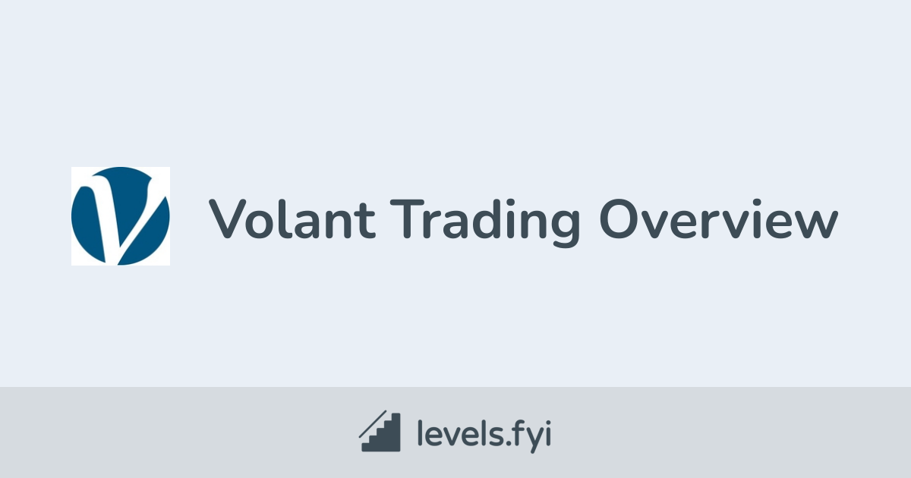

## Table of Contents

## What is Volant Trading?

Volant Trading is a type of trading where people buy and sell things quickly to make money. It's like playing a fast game where you need to be smart and quick to win. People who do Volant Trading often use computers and special programs to help them make decisions fast. They look at prices and try to buy low and sell high in a very short time.

This kind of trading can be exciting but also risky. Because everything happens so fast, there's a chance to lose money if you're not careful. People who do Volant Trading need to know a lot about the markets and be good at using technology. It's not for everyone, but for those who are good at it, it can be a way to make money.

## How does Volant Trading differ from traditional trading?

Volant Trading is different from traditional trading because it happens much faster. In traditional trading, people might buy stocks or other things and hold onto them for a long time, like months or years, hoping the price will go up. They look at big reports and news to make their decisions. But in Volant Trading, people buy and sell things in just seconds or minutes. They use computers and special software to watch prices all the time and make quick decisions.

Another big difference is the use of technology. Traditional traders might use the phone or go to a place to trade, and they might not use computers as much. They focus more on understanding the companies or products they are trading. Volant traders, on the other hand, rely a lot on technology. They use algorithms and programs that can make trades automatically based on certain rules. This means they need to be good with computers and understand how to set up these programs to work well.

## What are the basic principles of Volant Trading?

The basic principles of Volant Trading are all about speed and using technology. In Volant Trading, people try to make money by buying and selling things very quickly. They use computers and special programs to watch prices and make trades in just seconds or minutes. The idea is to buy something at a low price and sell it at a higher price, but do it all very fast. This means Volant traders need to be good at using technology and understanding how to set up their computers to make these quick trades.

Another important principle is understanding the market and using data. Volant traders look at a lot of information to make their decisions. They use things like charts and numbers to see patterns in prices. They also use algorithms, which are like special math formulas, to help them decide when to buy and sell. This means they need to be good at math and understanding how markets work. Even though everything happens fast, they still need to be careful and make smart choices to avoid losing money.

## What are the key tools and platforms used in Volant Trading?

In Volant Trading, people use special computer programs and platforms to make quick trades. One of the main tools is trading software that can watch prices and make trades automatically. These programs use algorithms, which are like math formulas, to decide when to buy and sell. Some popular trading platforms for Volant Trading are MetaTrader, NinjaTrader, and TradeStation. These platforms let traders set up their own rules for trading and can do everything very fast.

Another important tool is data analysis software. This helps traders look at a lot of information quickly to find patterns in prices. They use charts and numbers to see what's happening in the market. Tools like Bloomberg Terminal and Reuters Eikon are used for this. They give traders real-time data and news, which is important for making quick decisions. Without these tools, it would be hard to keep up with the fast pace of Volant Trading.

## How can someone start with Volant Trading as a beginner?

To start with Volant Trading as a beginner, you first need to learn about the basics of trading and how markets work. You can do this by reading books, watching videos, or taking online courses about trading. It's important to understand what stocks, currencies, or other things you can trade, and how prices move. Once you have a good understanding, you can start practicing with a demo account. Many trading platforms offer demo accounts where you can trade with fake money. This is a safe way to try out Volant Trading without risking real money. You can use this time to get used to the trading software and see how it works.

After you feel comfortable with the basics, you can start using real money, but it's smart to start small. Choose a reliable trading platform like MetaTrader or NinjaTrader, and set up your account. You'll need to learn how to use the platform's tools, like setting up algorithms and watching the market. It's also a good idea to keep learning and maybe join a community of traders where you can ask questions and get advice. Remember, Volant Trading can be risky, so always be careful and only trade with money you can afford to lose.

## What are the common strategies employed in Volant Trading?

In Volant Trading, one common strategy is called scalping. This is when traders make lots of small trades to make a little bit of money each time. They look for small changes in prices and try to buy low and sell high very quickly. Scalping needs a lot of focus and fast decisions because everything happens in seconds. Another strategy is called momentum trading. This is when traders look for things that are going up or down fast and try to join in to make money from the movement. They use charts and numbers to see when something is moving a lot and then make their trades.

Another strategy used in Volant Trading is called arbitrage. This is when traders find small differences in prices between different places and buy in one place and sell in another to make money from the difference. It needs fast computers to see these small differences and make trades before the prices change. Lastly, there's algo trading, which means using computer programs to make trades automatically. Traders set up rules for the computer to follow, and the computer does the trading for them. This can be good because the computer can make trades faster than a person, but it needs a lot of work to set up the right rules.

## What are the risks associated with Volant Trading?

Volant Trading can be risky because everything happens so fast. When you make trades in just seconds or minutes, there's a big chance you could lose money if you make a mistake. The prices can change very quickly, and if you're not watching closely, you might buy something at a high price and then the price goes down before you can sell it. Also, because you're using computers and special programs, there's a risk that something could go wrong with the technology. If your computer crashes or the internet goes out, you could miss out on making trades or lose money because you can't react fast enough.

Another risk is that Volant Trading can be stressful. Because you need to make quick decisions all the time, it can be hard on your mind and body. If you're not careful, you might start making bad choices because you're tired or stressed out. Also, because you're trying to make money from small changes in prices, you might need to use a lot of money to make a good profit. This means if something goes wrong, you could lose a lot of money very quickly. It's important to be careful and only use money you can afford to lose when you're doing Volant Trading.

## How can one manage and mitigate risks in Volant Trading?

Managing and mitigating risks in Volant Trading starts with having a good plan. Before you start trading, decide how much money you're willing to risk and stick to that amount. This is called setting a risk limit. It's also important to use something called stop-loss orders. These are like safety nets that automatically sell your trade if the price goes down too much, so you don't lose too much money. Another way to manage risk is to not put all your money into one trade. Instead, spread it out over different trades, which is called diversification. This way, if one trade goes bad, you won't lose everything.

Another important part of managing risk is keeping your emotions in check. Volant Trading can be exciting and stressful, and it's easy to make bad decisions when you're feeling strong emotions. Take breaks when you need to, and don't trade when you're tired or upset. It's also a good idea to keep learning and getting better at trading. The more you know, the better you can handle the fast pace of Volant Trading. Finally, always be ready for technology problems. Make sure your computer and internet are working well, and have a backup plan in case something goes wrong. By following these steps, you can lower the risks of Volant Trading and trade more safely.

## What advanced techniques can be used to enhance Volant Trading performance?

One advanced technique to enhance Volant Trading performance is using machine learning. This means using computers to learn from past trades and find patterns that humans might miss. By looking at a lot of data, the computer can make better guesses about when to buy and sell. This can help traders make more money because the computer can see things that are hard for people to see. But, setting up machine learning needs a lot of work and knowing about computers and math.

Another technique is called high-frequency trading. This is when traders use very fast computers to make a lot of trades in a very short time. They look for tiny changes in prices and try to make money from these small differences. High-frequency trading needs special computers and a good internet connection to work well. It can be very profitable, but it's also very risky because everything happens so fast. Traders need to be careful and have good systems in place to manage the risks.

## How does market analysis play a role in Volant Trading?

Market analysis is really important in Volant Trading because it helps traders make smart decisions quickly. When traders do market analysis, they look at a lot of information like prices, charts, and news to see what's happening in the market. They use this information to find patterns and trends that can tell them when to buy or sell. In Volant Trading, everything happens fast, so traders need to do this analysis quickly and use special computer programs to help them. By understanding the market well, traders can make better guesses about where prices are going and make more money.

Using market analysis in Volant Trading also helps traders manage their risks. When they know what's going on in the market, they can set up rules for their trades that help them avoid big losses. For example, if they see that prices are going down a lot, they might decide to sell their trades before they lose too much money. Market analysis can also help traders find good opportunities to make money. By looking at the data, they can see when prices are likely to go up and make trades at the right time. This way, market analysis is a key part of doing well in Volant Trading.

## What are the regulatory considerations for Volant Trading?

Volant Trading has to follow rules set by different countries and groups to make sure it's fair and safe. These rules are called regulations. They are made by places like the Securities and Exchange Commission (SEC) in the United States or the Financial Conduct Authority (FCA) in the United Kingdom. These rules say things like who can trade, how much money they need to have, and what kind of information they have to share. They also make sure that traders don't do things that could hurt the market, like cheating or using secret information.

Following these rules is important for Volant Traders because it helps keep the market fair for everyone. If traders break the rules, they can get in big trouble, like having to pay a lot of money or even going to jail. That's why it's important for Volant Traders to know the rules in their country and follow them carefully. They might also need special licenses or permissions to trade, and they have to keep good records of all their trades to show they are following the rules.

## How do expert traders optimize their Volant Trading strategies?

Expert traders optimize their Volant Trading strategies by using advanced technology and data analysis. They use special computer programs called algorithms to make trades automatically. These algorithms are set up to look for small changes in prices and make quick decisions. Expert traders spend a lot of time making these algorithms better by testing them with past data and seeing what works best. They also use machine learning, which helps the computer learn from past trades and make better guesses about the future. This way, they can make more money because the computer can see patterns that are hard for people to see.

Another way expert traders optimize their strategies is by managing risks carefully. They use tools like stop-loss orders to limit how much money they can lose on a trade. They also spread their money out over different trades, which is called diversification. This helps them not lose everything if one trade goes bad. Expert traders also keep learning and getting better at trading. They read a lot, join trading communities, and always try to find new ways to make their strategies work better. By doing all these things, they can make more money and trade more safely in the fast world of Volant Trading.

## References & Further Reading

[1]: Narang, R. K. (2013). ["Inside the Black Box: A Simple Guide to Quantitative and High-Frequency Trading"](https://onlinelibrary.wiley.com/doi/book/10.1002/9781118662717). Wiley Finance.

[2]: Aldridge, I. (2013). ["High-Frequency Trading: A Practical Guide to Algorithmic Strategies and Trading Systems"](https://www.wiley.com/en-us/High+Frequency+Trading%3A+A+Practical+Guide+to+Algorithmic+Strategies+and+Trading+Systems%2C+2nd+Edition-p-9781118343500). Wiley Finance.

[3]: Lopez de Prado, M. (2018). ["Advances in Financial Machine Learning"](https://www.amazon.com/Advances-Financial-Machine-Learning-Marcos/dp/1119482089). Wiley.

[4]: Chan, E. (2009). ["Quantitative Trading: How to Build Your Own Algorithmic Trading Business"](https://github.com/ftvision/quant_trading_echan_book). Wiley. 

[5]: Dourban, B., & Lambert, F. (2016). ["Algorithmic Trading and DMA: An introduction to direct access trading strategies"](https://archive.org/details/algorithmictradi0000john). 4Myeloma Press.