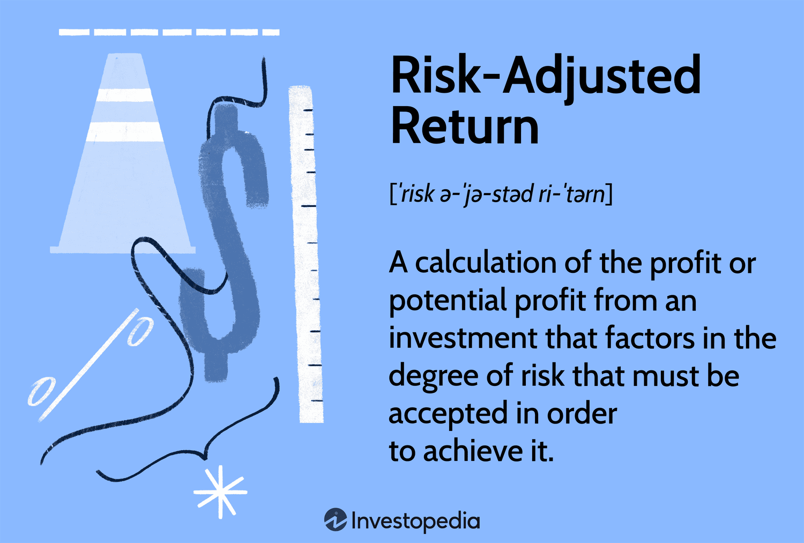

## Table of Contents

## What is volatility in the context of financial markets?

Volatility in financial markets refers to how much and how quickly the price of a financial asset, like a stock or a commodity, changes over time. If the price of an asset goes up and down a lot in a short period, we say it has high volatility. On the other hand, if the price stays pretty much the same without many big changes, it has low volatility. Think of it like the weather: a place with sudden storms and temperature swings is like a volatile market, while a place with steady, predictable weather is like a stable market.

Volatility is important because it affects how investors feel and what they decide to do. When markets are very volatile, it can make investors nervous, and they might sell their investments to avoid losing money. But some investors see high volatility as a chance to make big profits by buying assets when prices are low and selling them when prices go up. Understanding volatility helps investors pick the right strategies and manage their risks better, making it a key part of financial planning.

## How is volatility typically measured?

Volatility is usually measured using something called standard deviation. This is a way to see how much the price of an asset moves around its average price over a certain time. Imagine you're looking at the price of a stock every day for a month. You find the average price, then you see how far each day's price is from that average. The standard deviation tells you how spread out those prices are. If the prices are all over the place, the standard deviation will be high, meaning the stock is very volatile. If the prices are close to the average, the standard deviation will be low, showing low volatility.

Another common way to measure volatility is by using the VIX, which stands for the Volatility Index. The VIX is often called the "fear gauge" because it shows how much people expect the stock market to move around in the future. It's calculated using the prices of options, which are contracts that give people the right to buy or sell stocks at a certain price. If people are buying a lot of options because they think the market will move a lot, the VIX goes up, showing higher expected volatility. If people think the market will stay calm, the VIX goes down, showing lower expected volatility.

## What are the common misconceptions about volatility?

A common misconception about volatility is that it's always a bad thing. People often think that if a stock or the market is volatile, it means it's risky and they should stay away. But that's not always true. Volatility can actually create opportunities for investors to buy assets at lower prices and sell them at higher prices, making money from the ups and downs. It's all about understanding the market and using the right strategies.

Another misconception is that volatility and risk are the same thing. While they are related, they're not exactly the same. Volatility is about how much prices change, while risk is about the chance of losing money. A stock can be very volatile but still be a good investment if you believe in the company's future. On the other hand, a stock might seem stable but could be risky if the company has big problems that aren't obvious yet. It's important to look at both volatility and other factors when deciding what to invest in.

## What is risk-adjusted return and why is it important?

Risk-adjusted return is a way to measure how much money you make from an investment compared to how risky it is. Imagine you have two investments: one gives you a lot of money but is very risky, and the other gives you a little less money but is much safer. Risk-adjusted return helps you see which one is better for you by taking into account both the reward and the risk.

This is important because it helps you make smarter choices with your money. If you only look at how much money an investment makes, you might pick something very risky without realizing it. But by looking at risk-adjusted return, you can find investments that give you good rewards without taking too much risk. This way, you can feel more confident about your investment decisions and build a more balanced portfolio.

## Can you explain the Sharpe Ratio and how it measures risk-adjusted return?

The Sharpe Ratio is a tool that helps you see how well an investment is doing when you think about how risky it is. It was made by a guy named William F. Sharpe. The way it works is simple: you take the return of your investment and subtract the risk-free rate, which is what you could earn from a totally safe investment like a government bond. Then, you divide that number by the standard deviation of the investment's returns, which tells you how much the investment's value goes up and down. A higher Sharpe Ratio means the investment is giving you more reward for the risk you're taking.

Let's say you have an investment that made 10% last year, and the risk-free rate was 2%. If the standard deviation of your investment's returns was 5%, you'd calculate the Sharpe Ratio like this: (10% - 2%) / 5% = 1.6. This means for every unit of risk you took, you got 1.6 units of return. If another investment had a Sharpe Ratio of 0.8, it would mean that investment wasn't doing as well for the amount of risk involved. So, the Sharpe Ratio helps you compare different investments to see which ones are giving you the best bang for your risk buck.

## What are other measures of risk-adjusted return besides the Sharpe Ratio?

Another common measure of risk-adjusted return is the Sortino Ratio. It's a lot like the Sharpe Ratio, but it looks at only the bad risk, or downside risk. Imagine you're driving a car and you only care about the bumps that make you go slower, not the ones that make you go faster. The Sortino Ratio does that with investments. It takes the return of your investment, subtracts the risk-free rate, and then divides that by the standard deviation of only the negative returns. If an investment has a high Sortino Ratio, it means you're getting good returns without too many of those bad bumps.

There's also the Treynor Ratio, which looks at how much return you get for the risk you take, but it uses a different kind of risk called beta. Beta tells you how much an investment moves with the whole market. If an investment has a high beta, it moves a lot when the market moves. The Treynor Ratio takes your investment's return, subtracts the risk-free rate, and then divides that by the beta. A high Treynor Ratio means you're getting good returns for the amount of market risk you're taking. So, it's helpful if you want to see how your investment does compared to the market as a whole.

## How does the Sortino Ratio differ from the Sharpe Ratio?

The Sortino Ratio and the Sharpe Ratio are both ways to see how well an investment is doing when you think about how risky it is. The main difference is in how they look at risk. The Sharpe Ratio looks at all the ups and downs of an investment, both the good and the bad. It takes the return of your investment, subtracts what you could get from a totally safe investment, and then divides that by how much the investment's value goes up and down overall.

On the other hand, the Sortino Ratio only cares about the bad risk, or the times when your investment loses money. It's like if you're driving a car and you only want to know about the bumps that slow you down, not the ones that speed you up. The Sortino Ratio takes the return of your investment, subtracts the safe investment return, and then divides that by how much the investment's value goes down. So, if you want to focus on avoiding losses, the Sortino Ratio might be more helpful for you.

## What is the Treynor Ratio and how is it used in portfolio management?

The Treynor Ratio is a way to see how well an investment does compared to how much risk it takes from the market. It was made by a guy named Jack Treynor. To find the Treynor Ratio, you take the return of your investment and subtract the return of a safe investment, like a government bond. Then, you divide that number by the investment's beta. Beta is a measure that shows how much an investment moves with the whole market. If an investment has a high beta, it moves a lot when the market moves. A high Treynor Ratio means you're getting good returns for the amount of market risk you're taking.

In portfolio management, the Treynor Ratio is used to compare different investments or funds to see which ones are doing the best job of giving you returns for the market risk you're taking. If you're managing a bunch of investments, you might want to pick the ones with higher Treynor Ratios because they're giving you more bang for your risk buck. It helps you make smarter choices about where to put your money, especially if you're worried about how the whole market is doing.

## How can volatility and risk-adjusted return metrics be applied in investment strategies?

Volatility and risk-adjusted return metrics can help investors make better choices about where to put their money. When you look at how much an investment's price goes up and down, or its volatility, you can decide if it's too risky for you. If you're someone who doesn't like big changes, you might pick investments with lower volatility. But if you're okay with some ups and downs and want to make bigger profits, you might go for more volatile investments. By understanding volatility, you can pick the right kind of investments for your comfort level and goals.

Risk-adjusted return metrics like the Sharpe Ratio, Sortino Ratio, and Treynor Ratio help you see how well an investment is doing when you think about the risk. These tools let you compare different investments to find the ones that give you the best rewards for the risks you're taking. For example, if you're choosing between two funds, you might look at their Sharpe Ratios to see which one is giving you more return for the same amount of risk. By using these metrics, you can build a portfolio that balances risk and reward in a way that works for you.

## What are the limitations of using volatility as a sole measure of risk?

Using volatility as the only way to measure risk can be tricky because it doesn't tell the whole story. Volatility just looks at how much prices go up and down, but it doesn't say anything about why those changes are happening. For example, a stock might be very volatile because the company is doing something exciting and new, which could be a good thing. But if you only look at volatility, you might think it's too risky without understanding the reasons behind the price changes.

Also, volatility doesn't tell you about other kinds of risk that can affect your investments. There's something called "systematic risk," which is the risk that comes from things like the economy or interest rates, and it can't be avoided by just picking different investments. Then there's "unsystematic risk," which is specific to a single company or industry. Volatility doesn't help you see these different kinds of risks, so it's not enough on its own. You need to look at other things, like the company's financial health or what's happening in the world, to get a full picture of the risk you're taking.

## How do advanced statistical models enhance the understanding of volatility and risk-adjusted returns?

Advanced statistical models help investors understand volatility and risk-adjusted returns better by looking deeper into the data. These models can find patterns and connections that simpler methods might miss. For example, they can use something called "time series analysis" to see how prices have changed over time and predict how they might change in the future. They can also use "machine learning" to learn from past data and make smarter guesses about what will happen next. By using these advanced tools, investors can get a clearer picture of how risky an investment might be and how it could perform in the future.

These models also help with risk-adjusted returns by taking into account more than just the ups and downs of prices. They can look at other factors like how different investments move together, which is called "correlation," and how much an investment might lose in a bad situation, known as "tail risk." By considering these things, advanced models can give a more complete view of an investment's performance compared to the risk it carries. This helps investors make better choices about where to put their money, balancing the potential rewards with the risks they're willing to take.

## What recent research has been conducted on alternative risk-adjusted return measures?

Recent research on alternative risk-adjusted return measures has focused on finding new ways to understand how well investments are doing compared to the risks they carry. One study looked at something called the "Omega Ratio," which looks at all the possible returns of an investment, not just the average. It helps investors see the full picture of how an investment might do, including the good and the bad. Another study introduced the "Conditional Value-at-Risk (CVaR)" measure, which focuses on how much an investment could lose in really bad situations. This is useful for investors who want to know the worst-case scenarios and plan for them.

These new measures try to give a more complete view of risk and return than older ones like the Sharpe Ratio. For example, the Omega Ratio can show how an investment might perform in different market conditions, not just when things are going well. Meanwhile, the CVaR helps investors understand the risks of extreme losses, which is important for managing a portfolio safely. By using these alternative measures, investors can make better decisions about where to put their money, balancing the potential rewards with the risks they're willing to take.

## What is the difference between Historical and Implied Volatility?

Historical Volatility (HV) and Implied Volatility (IV) are two fundamental concepts in the analysis of market dynamics, particularly for traders and analysts who seek to evaluate and predict price movements. Historical Volatility is derived from past price data of a given security and provides a statistical measure of the degree of variation of its price over a specific period. It is calculated using the standard deviation of logarithmic returns, which are changes in the price of the security over short intervals. Mathematically, it is given by the formula:

$$
HV = \sqrt{\frac{\sum (R_i - \bar{R})^2}{N-1}}
$$

where $R_i$ represents the logarithmic return for each period, $\bar{R}$ is the mean of these returns, and $N$ is the number of returns used in the calculation. This retrospective measure gives insight into how volatile a security has been historically, aiding traders in assessing price trends and stability.

On the other hand, Implied Volatility is a forward-looking metric derived from the prices of options on an asset. It reflects the market's expectations of the future [volatility](/wiki/volatility-trading-strategies) of the asset's price. Unlike historical volatility, which is calculated from past price movements, implied volatility is inferred from the market prices of options, using models such as the Black-Scholes. The Black-Scholes formula for a call option can be rearranged to imply volatility:

$$
C = S_0 \cdot N(d_1) - X \cdot e^{-rT} \cdot N(d_2)
$$

$$
d_1 = \frac{\ln(S_0 / X) + (r + \sigma^2 / 2)T}{\sigma \sqrt{T}}
$$

$$
d_2 = d_1 - \sigma \sqrt{T}
$$

where $C$ is the call option price, $S_0$ is the current stock price, $X$ is the strike price, $r$ is the risk-free rate, $T$ is the time to expiration, and $N$ is the cumulative distribution function of the standard normal distribution.

The backward-looking nature of HV and forward-looking nature of IV make these metrics complementary. Traders often juxtapose these measures to validate their strategies, taking advantage of historical patterns while anticipating future market dynamics.

Python offers robust capabilities to calculate and analyze both historical and implied volatility, utilizing a variety of statistical libraries such as NumPy, SciPy, and pandas for data manipulation and analysis. For example, to calculate historical volatility in Python, one could use:

```python
import pandas as pd
import numpy as np

def calculate_hv(data):
    log_returns = np.log(data / data.shift(1))
    hv = log_returns.std() * np.sqrt(252)  # Annualizing the volatility
    return hv

historical_volatility = calculate_hv(price_data)  # price_data is a pandas Series
```

Libraries such as `QuantLib` or `yfinance` facilitate the extraction of market data and option prices to compute implied volatility. By employing these tools, traders can craft more precise trading strategies, optimize risk management, and achieve more accurate forecasts of market behavior. With these capabilities, Python serves as an invaluable asset in navigating the complexities of financial markets.

## How do volatility and risk-adjusted returns relate to each other?

Risk-adjusted returns are essential for evaluating the performance of an investment concerning the level of risk undertaken, thereby serving as a pivotal element in trading decisions. This evaluation acknowledges that returns alone do not provide a complete picture unless analyzed together with the associated risks. Risk-adjusted metrics serve as a gauge for traders, helping them to discern the efficiency of an investment in generating returns relative to the level of volatility and uncertainty encountered.

Key metrics for measuring risk-adjusted returns include the Sharpe Ratio, Sortino Ratio, and Treynor Ratio:

1. **Sharpe Ratio**: This ratio assesses the risk-adjusted performance by calculating the excess return per unit of risk. Defined as:
$$
   \text{Sharpe Ratio} = \frac{R_p - R_f}{\sigma_p}

$$

   where $R_p$ is the portfolio return, $R_f$ is the risk-free rate, and $\sigma_p$ is the portfolio's standard deviation. A higher Sharpe Ratio indicates better risk-adjusted returns.

2. **Sortino Ratio**: Similar to the Sharpe Ratio, the Sortino Ratio differentiates between harmful volatility (downside risk) and general volatility by focusing only on negative deviations from a target return. It is calculated as:
$$
   \text{Sortino Ratio} = \frac{R_p - R_f}{\sigma_d}

$$

   where $\sigma_d$ represents the standard deviation of the downside risk. This metric is often preferred when the distribution of returns is not symmetrical.

3. **Treynor Ratio**: This metric evaluates returns earned in excess of the risk-free rate per each unit of market risk, represented by the portfolio's beta ($\beta$) with the market.
$$
   \text{Treynor Ratio} = \frac{R_p - R_f}{\beta_p}

$$

   where $\beta_p$ represents the beta of the portfolio. It is particularly useful for evaluating the performance of diversified portfolios.

Python's flexibility and extensive library ecosystem facilitate the computation of these metrics, enabling traders to enhance their trading strategies effectively. Libraries such as `numpy` and `pandas` allow for complex data manipulations and calculations, while `scipy` and `statsmodels` provide statistical functions and models necessary for computing risk-adjusted performances. Here is an example of how one might calculate the Sharpe Ratio using Python:

```python
import numpy as np

# Sample data
returns = np.array([0.05, 0.02, 0.04, 0.03, 0.06])
risk_free_rate = 0.01

# Calculate the average return and standard deviation
average_return = np.mean(returns)
std_dev = np.std(returns)

# Calculate the Sharpe Ratio
sharpe_ratio = (average_return - risk_free_rate) / std_dev
print(f"Sharpe Ratio: {sharpe_ratio}")
```

By leveraging Python to compute these metrics, traders can rigorously assess how much return is being achieved per unit of risk, thereby informing better portfolio management decisions. This analytical capability supports the dynamic adjustment of trading strategies to align with varying risk scenarios, optimizing investment outcomes over time.

## What are GARCH Models used for in Volatility Prediction?

GARCH models, or Generalized Autoregressive Conditional Heteroskedasticity models, provide an effective framework for predicting future volatility by analyzing historical data. These models excel in capturing the phenomenon of volatility clustering, where periods of high volatility tend to follow one another. This characteristic makes GARCH models particularly useful for predicting market movements, as it acknowledges that volatile markets can exhibit trends in volatility bursts.

The basic GARCH model formulation, often referred to as GARCH(p, q), combines past error terms and past variances to forecast the current variance. In mathematical terms, it can be presented as:

$$
\sigma_t^2 = \alpha_0 + \sum_{i=1}^{p} \alpha_i \epsilon_{t-i}^2 + \sum_{j=1}^{q} \beta_j \sigma_{t-j}^2
$$

Where:
- $\sigma_t^2$ is the conditional variance at time t.
- $\alpha_0$ is a constant.
- $\epsilon_{t-i}^2$ are the squared residuals (or shocks) from previous periods.
- $\sigma_{t-j}^2$ is the lagged variance from previous periods.
- $\alpha_i$ and $\beta_j$ are coefficients that need to be estimated from the data.

Using Python, financial analysts can efficiently implement GARCH models for volatility prediction utilizing dedicated libraries such as 'arch'. This library simplifies the process of setting up GARCH models, performing estimations, and forecasting future volatility. The following Python code snippet demonstrates how to implement a simple GARCH(1, 1) model using the 'arch' library:

```python
import pandas as pd
from arch import arch_model

# Load your time series data
data = pd.read_csv('market_data.csv')
returns = data['returns']

# Estimate a GARCH(1, 1) model
model = arch_model(returns, vol='Garch', p=1, q=1)
model_fit = model.fit(disp=False)

# Forecast future volatility
forecast = model_fit.forecast(horizon=5)
forecast_variance = forecast.variance[-1:]
print(forecast_variance)
```

Using GARCH models, traders and analysts gain a significant advantage in the market, allowing for more informed strategy adjustments and improved risk management. The ability to forecast potential future volatility aids in making better trading decisions and allocating capital more effectively. By employing Python tools, the application of these models becomes both accessible and scalable, providing precise volatility modeling critical for high-frequency trading and dynamic portfolio management.

## References & Further Reading

[1]: Bollerslev, T. (1986). ["Generalized Autoregressive Conditional Heteroskedasticity."](https://www.sciencedirect.com/science/article/pii/0304407686900631) Journal of Econometrics, 31(3), 307-327.

[2]: Hull, J. C. (2015). ["Options, Futures, and Other Derivatives"](https://www.semanticscholar.org/paper/Options%2C-Futures%2C-and-Other-Derivatives-Hull/89bdee500c8623864fc9eb7a471546aa713acc44) (9th Edition). Pearson.

[3]: Jorion, P. (2007). ["Value at Risk: The New Benchmark for Managing Financial Risk."](https://link.springer.com/article/10.1007/s11408-007-0057-3) McGraw-Hill.

[4]: Chan, E. (2013). ["Algorithmic Trading: Winning Strategies and Their Rationale."](https://github.com/ftvision/quant_trading_echan_book) Wiley.

[5]: Tsay, R. S. (2010). ["Analysis of Financial Time Series."](https://onlinelibrary.wiley.com/doi/book/10.1002/9780470644560) Wiley.

[6]: Pyndick, R., & Rubinfeld, D. (2017). ["Microeconomics."](https://www.pearson.com/en-us/subject-catalog/p/Pindyck-Microeconomics-9th-Edition/P200000006021/9780136879572) Pearson.

[7]: Engle, R. F. (2001). ["GARCH 101: The Use of ARCH/GARCH Models in Applied Econometrics."](https://www.aeaweb.org/articles?id=10.1257/jep.15.4.157) Journal of Economic Perspectives, 15(4), 157-168.