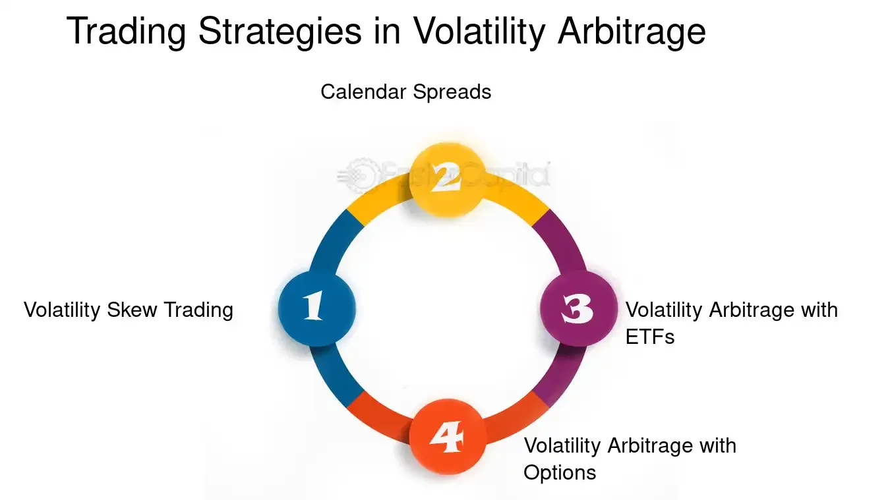

## Table of Contents

## What is volatility arbitrage?

Volatility arbitrage is a trading strategy that tries to make money from differences in how much stock prices might change in the future. Traders look at things like stock options, which give the right to buy or sell a stock at a certain price. They compare what they think the stock's price will do with what others think. If they believe the stock will move more or less than what the options suggest, they can buy or sell options to make a profit from this difference.

This strategy can be tricky because it involves guessing how much a stock's price will swing around. Traders use special math models to help them figure this out. If they guess right and the stock's price moves as they expected, they can make money. But if they're wrong, they could lose money. So, it's a bit like betting on how stormy or calm the stock market will be, rather than just betting on whether the stock price will go up or down.

## How does volatility arbitrage differ from other arbitrage strategies?

Volatility arbitrage is different from other arbitrage strategies because it focuses on the expected movement, or volatility, of a stock's price rather than the price itself. In traditional arbitrage, traders look for price differences of the same asset in different markets and buy low in one place and sell high in another. For example, if a stock is cheaper on one exchange than another, a trader can buy it on the cheaper exchange and sell it on the more expensive one, making a profit from the price difference. Volatility arbitrage, on the other hand, doesn't care about the current price but about how much the price might change in the future.

In [volatility](/wiki/volatility-trading-strategies) [arbitrage](/wiki/arbitrage), traders use options to bet on whether a stock's price will be more or less volatile than what the market expects. They might buy options if they think the stock will move more than the options suggest, or sell options if they think it will move less. This is different from other forms of arbitrage, like [statistical arbitrage](/wiki/statistical-arbitrage), where traders use math models to find patterns in stock prices and trade based on those patterns. Volatility arbitrage is more about predicting the storminess of the market, while other arbitrage strategies are more about finding calm, reliable price differences or patterns to exploit.

## What are the key components of volatility in financial markets?

Volatility in financial markets is all about how much and how quickly prices change. It's like the weather of the stock market - sometimes it's calm and steady, and other times it's stormy with big swings. The key parts that make up volatility include how much news and events affect the market, how investors feel about the future, and how much people are buying and selling. When big news comes out, like a company doing better or worse than expected, or when there's a lot of uncertainty, prices can jump around a lot.

Another important part of volatility is how investors feel. If everyone is worried or excited, they might all start buying or selling at the same time, which can make prices move a lot. This is called investor sentiment. Also, how much people are trading matters. If there's a lot of buying and selling, it can make prices more volatile because there's more action in the market. So, volatility is really a mix of news, feelings, and trading activity, and it can change from calm to wild depending on what's going on.

## Can you explain the basic concept of a volatility arbitrage strategy?

Volatility arbitrage is a way to make money by betting on how much a stock's price might change in the future. Instead of guessing if the price will go up or down, traders focus on how much it will move around. They use options, which are like bets on the stock's future price, to make their moves. If they think the stock will move more than what the options suggest, they buy options. If they think it will move less, they sell options. It's all about trying to profit from the difference between what they think will happen and what the market thinks.

This strategy can be tricky because it's hard to predict how much a stock's price will swing. Traders use special math models to help them guess better. If they guess right and the stock's price moves as they expected, they can make money. But if they're wrong, they could lose money. It's like betting on the weather of the stock market - whether it will be stormy or calm - instead of just betting on if the stock's price will go up or down.

## What are the common types of volatility arbitrage strategies?

One common type of volatility arbitrage strategy is called delta-neutral trading. In this strategy, traders try to make money from the difference between the expected volatility of a stock and the actual volatility. They use options and adjust their positions to make sure they don't lose money if the stock price goes up or down a little bit. The goal is to profit if the stock's price moves more or less than what the options suggest. It's like trying to balance on a seesaw so that small movements don't affect you, but big swings do.

Another type is called [dispersion](/wiki/dispersion-trading) trading. This strategy involves betting on the difference in volatility between a whole group of stocks, like those in an index, and the individual stocks within that group. Traders might think that the overall index will be less volatile than the sum of its parts. They use options on both the index and the individual stocks to make money from this difference. It's like betting that a team of players will be more predictable than each player acting on their own.

A third type is variance swaps. In this strategy, traders directly bet on the difference between the realized volatility of a stock and the implied volatility from options. They enter into a contract that pays out based on how much the stock's price actually moves compared to what the options market expected. It's a straightforward way to bet on whether the market's guess about future volatility is too high or too low.

## How do traders identify mispricings in volatility for arbitrage opportunities?

Traders look for mispricings in volatility by comparing what the options market thinks will happen with what they think will happen. They use special math models to figure out how much a stock's price might move in the future. These models help them see if the options are priced too high or too low based on their own predictions. If they think the stock will move more than the options suggest, they might buy options because they think the options are too cheap. If they think the stock will move less, they might sell options because they think the options are too expensive.

To find these mispricings, traders also watch the news and pay attention to how people feel about the market. Big news or a lot of uncertainty can make stock prices jump around more than usual. If traders see that the options market isn't expecting as much movement as they think there will be, they might find an opportunity to make money. It's all about spotting the difference between what everyone else thinks will happen and what they believe will happen, and then using options to bet on that difference.

## What are the risks associated with volatility arbitrage trading?

Volatility arbitrage trading can be risky because it's hard to predict how much a stock's price will move. Traders use math models to guess the future, but these models aren't always right. If the stock's price moves differently than expected, traders can lose money. For example, if they think the stock will move a lot and buy options, but the stock stays calm, they could lose the money they spent on the options. It's like betting on the weather - if you guess wrong, you might get soaked.

Another risk is that the options market can change quickly. News or big events can make stock prices jump around more than traders expected. If the market gets more volatile suddenly, it can hurt the traders' positions. Also, there's the risk of losing a lot of money if the trader uses a lot of borrowed money, called leverage, to make bigger bets. If things go wrong, the losses can be much bigger than the money they put in. So, volatility arbitrage is a bit like riding a roller coaster - it can be exciting, but it can also be scary if you're not ready for the ups and downs.

## How can one implement a simple volatility arbitrage strategy using options?

To implement a simple volatility arbitrage strategy using options, a trader needs to first figure out if they think a stock's price will move more or less than what the options market expects. They can do this by looking at the implied volatility of the options, which is a guess by the market about how much the stock's price might change in the future. If the trader believes the stock will move more than the options suggest, they should buy options. For example, they might buy call options if they think the stock will go up a lot, or put options if they think it will go down a lot. If the trader thinks the stock will move less than the options suggest, they should sell options. They might sell call options if they think the stock won't go up much, or sell put options if they think it won't go down much.

Once the trader decides whether to buy or sell options, they need to keep an eye on the stock's price and the options' value. If the stock's price moves as they expected, they can make money from the options. For example, if they bought call options and the stock's price goes up a lot, the value of those options will increase, and they can sell them for a profit. If they sold options and the stock's price stays calm, the options will lose value, and they can buy them back for less than they sold them for, making a profit. The key is to always be watching and ready to adjust the strategy if the market changes.

## What advanced techniques are used in volatility arbitrage?

In volatility arbitrage, traders use some fancy math tricks to make their bets more accurate. One of these tricks is called "model calibration." This is when traders adjust their math models to fit what's happening in the market right now. They look at things like how much the stock's price has moved in the past and what people think will happen in the future. By fine-tuning their models, they can make better guesses about how much the stock's price might swing around. Another technique is "volatility surface trading," where traders look at how the expected volatility changes over different times and prices. They use this information to find options that are priced too high or too low, and then they buy or sell those options to make a profit.

Another advanced technique is "correlation trading." This is when traders bet on how much different stocks will move together. They might think that the stocks in a group, like an index, will move more or less together than what the options suggest. By using options on both the index and the individual stocks, they can make money from the difference in how much these stocks move together. Lastly, "dynamic hedging" is a way to keep the strategy balanced as the market changes. Traders keep adjusting their positions in options and stocks to make sure they're not losing money from small price movements. They focus on making money from big swings in volatility while protecting themselves from small changes. These techniques help traders be more precise and protect their bets in the wild world of volatility arbitrage.

## How do market conditions affect the success of volatility arbitrage strategies?

Market conditions can really change how well volatility arbitrage strategies work. When the market is calm and steady, it can be tough for traders to make money from volatility arbitrage. That's because the stock prices don't move around much, so the options they bet on don't change value a lot. If traders guessed that the stock would be more stormy than it actually is, they might lose money. But when the market is all over the place, with big news and lots of uncertainty, it can be a good time for volatility arbitrage. If traders guessed right that the market would be wild, they can make a lot of money from the options they bought or sold.

Another thing that affects volatility arbitrage is how much people are trading. When there's a lot of buying and selling, it can make the market more volatile, which can be good for traders if they bet on that happening. But if there's not much trading, the market can be quieter, which might not be so good for their bets. Also, the overall mood of investors can make a big difference. If everyone is feeling nervous or excited, it can make stock prices jump around more. Traders who can guess these changes in mood and how they affect the market can do well with volatility arbitrage. But it's tricky because the market can change quickly, and what works one day might not work the next.

## What role does statistical analysis play in volatility arbitrage?

Statistical analysis is super important in volatility arbitrage because it helps traders make better guesses about how much a stock's price might move. Traders use math models to look at past data and figure out patterns in how the stock's price has changed before. They also use these models to predict what might happen in the future. By doing this, they can see if the options market is expecting the stock to move more or less than they think it will. If they find a difference, they can bet on that difference using options, hoping to make money from it.

These math models aren't perfect, but they give traders a way to make more informed bets. Traders need to keep updating their models with new data to make sure they stay accurate. They also use statistical tests to check if their guesses about volatility are right. If the market turns out to be more or less volatile than expected, traders can adjust their strategies quickly. So, statistical analysis is like a tool that helps traders navigate the ups and downs of the market, making their volatility arbitrage strategies more likely to succeed.

## How can one measure the performance of a volatility arbitrage strategy?

To measure how well a volatility arbitrage strategy is doing, traders look at a few key things. One important measure is the profit and loss (P&L) of the strategy. This shows how much money the trader made or lost over a certain time. They also look at the Sharpe ratio, which tells them how much return they got for the risk they took. A higher Sharpe ratio means the strategy did well for the amount of risk involved. Another thing they check is the strategy's volatility, which is how much the returns go up and down. If the strategy's returns are too jumpy, it might be too risky, even if it makes money sometimes.

Traders also use something called the information ratio to see if their strategy is beating the market. This ratio compares the strategy's returns to a benchmark, like a stock index, and shows how much better or worse it did. If the information ratio is high, it means the strategy is doing a good job of making more money than just following the market. Lastly, they might look at the drawdown, which is the biggest drop in the strategy's value from its highest point. A smaller drawdown means the strategy didn't lose as much money at its worst, which is good for keeping investors happy. By looking at all these measures, traders can get a good idea of how their volatility arbitrage strategy is performing.

## What are the Mechanics of Volatility Arbitrage?

Volatility arbitrage is a sophisticated financial strategy that centers around the differences between implied and realized volatility. This strategy employs various econometric models and [machine learning](/wiki/machine-learning) tools to accurately forecast future volatility, enabling traders to establish a delta-neutral portfolio and thus focus solely on volatility changes.

### Econometric Models and Forecasting

To predict future volatility, traders frequently utilize econometric models such as Generalized Autoregressive Conditional Heteroskedasticity (GARCH). The GARCH model is particularly well-suited for financial time series data, which often exhibit volatility clustering—a phenomenon where periods of high volatility are followed by high volatility and periods of low volatility by low volatility.

The GARCH(1,1) model can be represented as:

$$
\sigma_t^2 = \alpha_0 + \alpha_1 \epsilon_{t-1}^2 + \beta_1 \sigma_{t-1}^2
$$

where:
- $\sigma_t^2$ is the forecasted variance at time $t$,
- $\alpha_0$ is a constant,
- $\alpha_1$ and $\beta_1$ are coefficients,
- $\epsilon_{t-1}^2$ is the squared return from the previous period.

By analyzing historical volatility, the GARCH model allows traders to predict future fluctuations and identify potential arbitrage opportunities when comparing with implied volatility from market instruments.

### Machine Learning Tools

Beyond traditional econometric models, machine learning tools augment the forecasting process. Algorithms like neural networks and support vector machines analyze vast datasets to identify patterns in volatility. These tools provide more nuanced predictions by considering non-linear relationships and interactions between different market factors.

For instance, a basic Python implementation for training a [neural network](/wiki/neural-network) on historical volatility data might involve:

```python
from sklearn.model_selection import train_test_split
from sklearn.neural_network import MLPRegressor
import numpy as np

# Simulate volatility data
X = np.random.rand(1000, 10)  # Features
y = np.random.rand(1000)  # Target: Future Volatility

# Split the data
X_train, X_test, y_train, y_test = train_test_split(X, y, test_size=0.2, random_state=42)

# Initialize and train neural network
model = MLPRegressor(hidden_layer_sizes=(50, 50), max_iter=1000)
model.fit(X_train, y_train)

# Predict future volatility
predictions = model.predict(X_test)
```

### Delta-Neutral Portfolios

Once volatility is forecasted, traders implement the strategy by constructing delta-neutral portfolios. A delta-neutral portfolio involves balancing options and underlying assets so that the overall delta (sensitivity to price changes of the underlying asset) is zero. This isolation of volatility allows traders to profit from volatility changes without exposure to the direction of market movements.

### Continuous Re-hedging

Given the dynamic nature of markets, achieving and maintaining a delta-neutral position requires constant adjustments, known as re-hedging. As market conditions shift, so does the delta of options, necessitating continual recalibration of the portfolio to uphold neutrality. This process is inherent to the volatility arbitrage strategy, ensuring that the portfolio remains aligned with predetermined risk parameters and volatility expectations.

In summary, the mechanics of volatility arbitrage encompass forecasting future volatility through advanced models, constructing and maintaining a delta-neutral portfolio, and continuously re-hedging to adapt to market changes. These components facilitate a robust framework for capitalizing on volatility discrepancies.

## References & Further Reading

[1]: Bergstra, J., Bardenet, R., Bengio, Y., & Kégl, B. (2011). ["Algorithms for Hyper-Parameter Optimization."](https://dl.acm.org/doi/10.5555/2986459.2986743) Advances in Neural Information Processing Systems 24.

[2]: ["Advances in Financial Machine Learning"](https://www.amazon.com/Advances-Financial-Machine-Learning-Marcos/dp/1119482089) by Marcos Lopez de Prado

[3]: ["Evidence-Based Technical Analysis: Applying the Scientific Method and Statistical Inference to Trading Signals"](https://www.amazon.com/Evidence-Based-Technical-Analysis-Scientific-Statistical/dp/0470008741) by David Aronson

[4]: ["Machine Learning for Algorithmic Trading"](https://github.com/PacktPublishing/Machine-Learning-for-Algorithmic-Trading-Second-Edition) by Stefan Jansen

[5]: ["Quantitative Trading: How to Build Your Own Algorithmic Trading Business"](https://books.google.com/books/about/Quantitative_Trading.html?id=j70yEAAAQBAJ) by Ernest P. Chan

[6]: Sinclair, E. (2013). ["Volatility Trading, 2nd Edition."](https://onlinelibrary.wiley.com/doi/book/10.1002/9781118662724) Wiley.