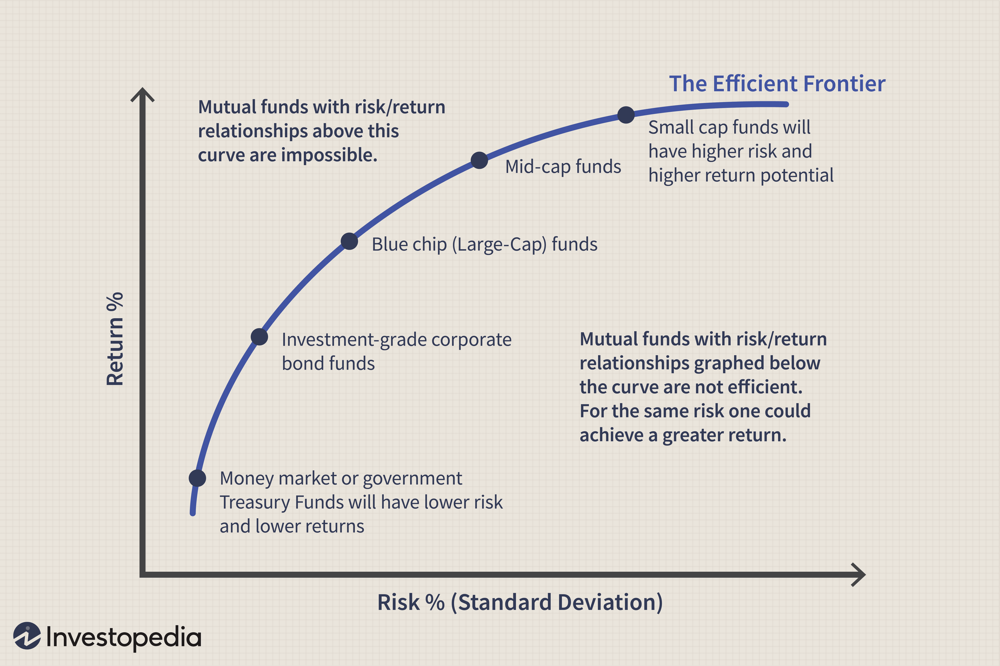

## Table of Contents

## What is volatility arbitrage?

Volatility arbitrage is a trading strategy that tries to make money from differences in how much the price of something, like a stock or an option, is expected to move around. Traders who use this strategy believe they can predict how much the price will change better than what the market thinks. They do this by comparing the expected volatility, which is what the market thinks will happen, with the actual volatility, which is what really happens. If they think the market's guess is wrong, they can buy or sell options to take advantage of this difference.

For example, if a trader thinks a stock's price will move more than what the market expects, they might buy options on that stock. If the stock's price does move a lot, the options could become more valuable, and the trader could make a profit. On the other hand, if the trader thinks the stock's price will move less than expected, they might sell options. If the stock's price stays calm, the options they sold could lose value, and the trader could make money from that. Volatility arbitrage can be risky because it's hard to predict how much prices will move, but it can also be rewarding if the trader's predictions are right.

## How does volatility arbitrage differ from other types of arbitrage?

Volatility arbitrage is different from other types of arbitrage because it focuses on the expected movement of prices, not just the prices themselves. In other types of arbitrage, like merger arbitrage or statistical arbitrage, traders look for price differences between similar assets or markets. They might buy a stock in one market where it's cheaper and sell it in another where it's more expensive, making a profit from the difference. But in volatility arbitrage, traders are more interested in how much the price of an asset, like a stock or an option, is expected to change. They try to make money by betting on whether the actual movement of the price will be more or less than what the market expects.

Another way [volatility](/wiki/volatility-trading-strategies) [arbitrage](/wiki/arbitrage) differs is that it often involves trading options, which are financial instruments that give the buyer the right, but not the obligation, to buy or sell an asset at a set price. Other types of arbitrage might involve trading stocks, bonds, or currencies directly. In volatility arbitrage, traders use options to take advantage of differences between the market's expected volatility and the actual volatility. This can be riskier because predicting how much prices will move is harder than predicting the prices themselves, but it can also lead to bigger profits if the trader's predictions are correct.

## What are the key components of a volatility arbitrage strategy?

A volatility arbitrage strategy involves a few key parts. First, traders need to figure out the expected volatility of an asset, like a stock or an option. This is what the market thinks the price will do. They look at things like the price of options to see what the market expects. Then, they compare this to their own guess about how much the price will actually move. If they think the market's guess is wrong, they can use this difference to make money.

The second part is trading options based on this difference. If traders think the price will move more than the market expects, they might buy options. This is because if the price does move a lot, the options could become more valuable. If they think the price will move less than expected, they might sell options. If the price stays calm, the options they sold could lose value, and they could make money from that. The whole idea is to use options to bet on whether the actual movement of the price will be more or less than what the market thinks.

## What are the common instruments used in volatility arbitrage?

The main instruments used in volatility arbitrage are options. Options are contracts that give the buyer the right, but not the obligation, to buy or sell an asset at a set price. Traders use options because they are directly linked to the expected volatility of the underlying asset. If a trader thinks the price of a stock will move more than the market expects, they might buy options on that stock. If the price does move a lot, the options could become more valuable, and the trader could make a profit. On the other hand, if the trader thinks the price will move less than expected, they might sell options. If the price stays calm, the options they sold could lose value, and the trader could make money from that.

Another instrument used in volatility arbitrage is volatility swaps. These are agreements between two parties to exchange future realized volatility for a fixed volatility level. They are used to bet directly on the volatility of an asset without the need for options. Traders use volatility swaps when they want to focus purely on the difference between expected and actual volatility, without the complications of option pricing. Both options and volatility swaps are key tools for traders trying to make money from the difference between what the market thinks will happen and what actually happens.

## How can one identify mispricings in volatility for arbitrage opportunities?

To find mispricings in volatility for arbitrage opportunities, traders need to compare the market's expected volatility with their own predictions. The market's expected volatility can be seen in the prices of options. For example, if options on a stock are expensive, it means the market thinks the stock's price will move a lot. Traders look at these prices and then use their own methods, like looking at past price movements or using special math models, to guess how much the price will actually move. If they think the market's guess is too high or too low, they might find a mispricing they can use to make money.

Once traders think they've found a mispricing, they can use options to bet on it. If they believe the stock's price will move more than the market expects, they might buy options. If the price does move a lot, the options could become more valuable, and the trader could make a profit. If they think the price will move less than expected, they might sell options. If the price stays calm, the options they sold could lose value, and the trader could make money from that. The key is to use options to take advantage of the difference between what the market thinks will happen and what the trader thinks will actually happen.

## What are the risks associated with volatility arbitrage?

Volatility arbitrage can be risky because it's hard to predict how much prices will move. Traders are betting on whether the actual movement of a stock or option's price will be more or less than what the market expects. If their guess is wrong, they could lose a lot of money. For example, if a trader buys options thinking the price will move a lot, but it doesn't, the options could lose value, and the trader would lose money. The same goes for selling options; if the price moves more than expected, the trader could lose money on the options they sold.

Another risk is that options can be tricky to understand and trade. They have complicated pricing models that can be hard to get right. If a trader makes a mistake in their calculations or doesn't understand how options work, they could lose money. Also, options can be very sensitive to small changes in the price of the underlying asset, which can make the trader's position more risky. Overall, while volatility arbitrage can be a way to make money, it comes with a lot of risks that traders need to be careful about.

## How does one hedge a volatility arbitrage position?

To hedge a volatility arbitrage position, traders often use other options or financial instruments to reduce the risk of their bets. For example, if a trader buys options thinking the price of a stock will move a lot, they might also sell other options on the same stock to balance out their risk. This way, if the stock's price doesn't move as much as they thought, the options they sold could help cover the losses from the options they bought. It's like having a backup plan to protect against things not going the way they expected.

Another way to hedge is by using different types of options, like puts and calls, to create a balanced position. If a trader thinks the stock's price will move more than the market expects, they might buy calls and sell puts, or vice versa. This can help them make money no matter which way the stock's price moves, as long as it moves a lot. Hedging is important in volatility arbitrage because it helps traders manage the risk of their predictions being wrong, making their strategy safer and more likely to succeed in the long run.

## What role does statistical analysis play in volatility arbitrage?

Statistical analysis is really important in volatility arbitrage because it helps traders guess how much prices will move. They use past price data to make models that predict future volatility. By comparing these predictions to what the market thinks, traders can find times when the market's guess might be wrong. This is how they spot opportunities to make money. For example, if a trader's model says a stock's price will move more than the market expects, they might buy options on that stock.

Using statistical analysis also helps traders manage risk. They can use it to check how likely their predictions are to be right and figure out how much they might lose if they're wrong. This helps them decide how much to bet and how to hedge their positions. By looking at lots of data and using math, traders can make better decisions and reduce the chances of losing money. So, statistical analysis is a big part of making volatility arbitrage work well.

## Can you explain the concept of volatility smile and its relevance to arbitrage?

The volatility smile is a pattern you see when you look at the prices of options for the same stock but with different expiration dates or strike prices. It's called a "smile" because if you draw a graph of the implied volatility (which is what the market thinks the stock's price will do) against the strike prices, it often looks like a smile. The middle of the smile is usually where the stock's current price is, and the ends of the smile show that options far away from the current price are more expensive than the market's guess about how much the stock will move.

This pattern is important for volatility arbitrage because it shows that the market's guess about how much the stock's price will move isn't the same for all options. Traders who do volatility arbitrage look at the volatility smile to find times when the market's guess might be wrong. If they think the options at the ends of the smile are too expensive or too cheap compared to what will really happen, they can buy or sell those options to make money. By understanding the volatility smile, traders can spot these opportunities and use them to their advantage.

## How do market conditions affect the success of volatility arbitrage strategies?

Market conditions can really change how well volatility arbitrage strategies work. When the market is calm and prices don't move much, it can be hard for traders to make money from volatility arbitrage. This is because they need prices to move a lot to make their options more valuable. If the market is quiet, the options they bought might not go up in price, and the options they sold might not lose value as much as they hoped. Also, in calm markets, the difference between what the market thinks will happen and what actually happens might be small, making it harder to find good opportunities.

On the other hand, when the market is wild and prices are moving a lot, volatility arbitrage can be more successful. Big price swings can make the options traders bought more valuable, helping them make money. But it can also be riskier because if the market moves in a way they didn't expect, they could lose a lot. Traders need to be careful and use good math models to guess how much prices will move. They also need to keep an eye on things like big news or events that can shake up the market, because these can create both opportunities and risks for their strategies.

## What advanced mathematical models are used in volatility arbitrage?

In volatility arbitrage, traders use advanced math models to guess how much prices will move. One popular model is the Black-Scholes model, which helps figure out the price of options. It uses things like the current price of the stock, how long until the option expires, and the market's guess about how much the stock's price will move. Traders can use this model to see if the market's guess is too high or too low, and then buy or sell options to make money from the difference. Another model is the Heston model, which is more complicated but can be better at guessing how much prices will move because it takes into account that volatility can change over time.

These models help traders make better guesses about how much prices will move, but they're not perfect. The real world is messy, and things like big news or events can make prices move in ways the models don't expect. That's why traders also use other math tools, like Monte Carlo simulations, to test their guesses. Monte Carlo simulations run lots of different scenarios to see how likely it is that the trader's guess will be right. By using these advanced math models and tools, traders can find good opportunities for volatility arbitrage and manage the risks that come with it.

## How can one measure the performance of a volatility arbitrage strategy?

To measure the performance of a volatility arbitrage strategy, traders look at how much money they make or lose over time. They keep track of their profits and losses from buying and selling options. If the strategy is working well, the trader should be making more money than they're losing. They also look at how much risk they're taking. A good strategy should make money without taking too much risk. Traders use numbers like the Sharpe ratio to see if their strategy is giving them good returns for the amount of risk they're taking.

Another way to measure performance is by looking at how often the strategy makes money. Traders want to know if their guesses about how much prices will move are usually right. They can use something called the hit rate, which is the percentage of times their trades make money. A high hit rate means the strategy is working well. Traders also look at how much their portfolio goes up and down, which is called volatility. If the strategy is making money but the portfolio is moving a lot, it might be too risky. By looking at these things, traders can see if their volatility arbitrage strategy is working and if they need to make changes.

## References & Further Reading

[1]: Sinclair, E. (2008). ["Volatility Trading."](https://onlinelibrary.wiley.com/doi/pdf/10.1002/9781118662724.fmatter) Wiley Finance.

[2]: Corcoran, C. M. (2007). ["Market-neutral Trading: Combining Technical and Fundamental Analysis into 7 Long-Short Trading Systems."](https://archive.org/details/marketneutraltra0000carr) Wiley.

[3]: Chan, E. P. (2013). ["Algorithmic Trading: Winning Strategies and Their Rationale."](https://github.com/ftvision/quant_trading_echan_book) Wiley.

[4]: Andersen, T. G., Bollerslev, T., Christoffersen, P., & Diebold, F. X. (2006). ["Volatility Forecasting."](https://www.nber.org/papers/w8160) PIER Working Paper 06-22.

[5]: Dowd, K. (2002). ["Risk Management in Trading."](https://www.semanticscholar.org/paper/Measuring-Market-Risk-Dowd/7a98c481e798f4bd78e90ba2ff9c4583e4d3a93f) Wiley Finance.