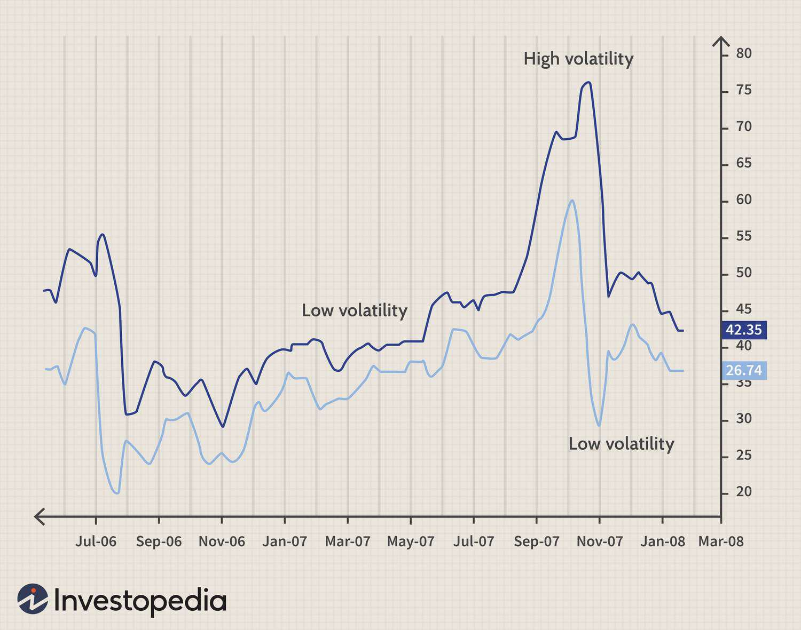

In the ever-evolving world of financial markets, traders and investors strive to find efficient methods for assessing market volatility. One such method is the Average True Range (ATR), a tool that has gained prominence due to its ability to provide clear insights into market conditions and price movements. The ATR, devised by J. Welles Wilder in his 1978 book "New Concepts in Technical Trading Systems," has found widespread application in risk management, algorithmic trading, and the development of trading strategies.

The Average True Range is particularly valued for its ability to quantify market volatility without signaling price direction. It does this by measuring the average range of price movements over a specific time period, which allows traders to understand the level of volatility an asset might exhibit. This makes ATR an essential instrument for those aiming to navigate the complex fluctuations of financial markets. 



Beyond individual trading decisions, ATR's application extends to algorithmic trading systems, where it plays a crucial role in automating and refining trade execution strategies. By incorporating ATR into algorithms, traders and developers can create systems sensitive to changes in market volatility, thereby optimizing entry and exit points as well as risk management protocols.

This article will explore the intricacies of the Average True Range, its significance in financial analysis, and its practical application within algorithmic trading systems. Through examining its functionality and utility, traders can enhance their understanding of market dynamics and bolster their strategic decision-making capabilities.

## Table of Contents

## Understanding Volatility and the Average True Range

Volatility is a fundamental factor in financial markets, directly impacting trading activities and risk management strategies. It quantifies the degree of variation in asset prices over time, reflecting the uncertainty or risk associated with those price movements. Traders utilize volatility metrics to make informed decisions, and one of the prominent measures employed is the Average True Range (ATR).

The ATR calculates the average price range over a pre-defined period, providing a numeric indicator of an asset's volatility. Unlike directional indicators that emphasize price trends, ATR centers around the breadth of price fluctuations, thereby offering a clearer picture of volatility without signaling potential price directions. This makes the ATR a distinct tool for traders interested in the amplitude of price movements rather than their upward or downward trajectories.

The concept of the True Range (TR) is vital in ATR calculations. True Range is designed to capture the most accurate measure of [volatility](/wiki/volatility-trading-strategies) by considering not only the current high and low prices of an asset but also its previous closing price. The True Range for the current trading period is calculated as follows:

$$
\text{TR} = \max(\text{high} - \text{low}, |\text{high} - \text{previous close}|, |\text{low} - \text{previous close}|)
$$

This formula ensures any price gaps or unexplained spikes are considered, leading to a comprehensive capture of volatility. The ATR then averages these True Range values over a specified period, smoothing out erratic movements to reveal consistent volatility trends. Often, a 14-day period is recommended for averaging, but traders may adjust this timeframe based on individual strategies and market conditions.

This distinctive focus on range as opposed to direction makes the ATR particularly useful for volatility measurement in a variety of trading contexts, helping traders and analysts understand not just how much the market is moving, but the consistency and intensity of these movements.

## Calculating the Average True Range

The calculation of the Average True Range (ATR) starts with determining the True Range (TR), a vital component that reflects an asset's volatility. To calculate the TR, one identifies the greatest value among three specific differences: the current high minus the current low, the absolute value of the current high minus the previous close, and the absolute value of the current low minus the previous close. Mathematically, this is represented as:

$$

\text{TR} = \max(\text{Current High} - \text{Current Low}, \left|\text{Current High} - \text{Previous Close}\right|, \left|\text{Current Low} - \text{Previous Close}\right| )
$$

J. Welles Wilder Jr., who developed the ATR, suggested using a 14-day period to average these True Range values, smoothing out short-term fluctuations in price movements. This smoothing process helps traders discern more consistent volatility trends, thereby providing more stable insights for decision-making. The ATR is computed by taking the average of the True Ranges over this period:

$$

\text{ATR} = \frac{1}{n} \sum_{i=1}^{n} \text{TR}_i 
$$

where $n$ is the number of periods, typically set to 14 for daily calculations.

By using a smoothing period, the ATR provides a clearer picture of volatility trends, minimizing short-term noise and allowing traders to make informed strategic decisions. An example of this application could be seen in setting stop-loss orders. For instance, a trader might decide to set a stop-loss at a distance of 1.5 times the ATR away from the entry price to account for anticipated daily price fluctuations, rather than arbitrary placement.

These calculated insights not only assist in setting effective risk management measures but also enhance trading strategies by aligning them closer with market conditions. Implementing these calculations in trading platforms can be efficiently executed using programming scripts. Here is a basic example of how ATR can be calculated in Python using popular libraries like Pandas:

```python
import pandas as pd

def calculate_atr(data, period=14):
    data['High-Low'] = data['High'] - data['Low']
    data['High-PrevClose'] = abs(data['High'] - data['Close'].shift(1))
    data['Low-PrevClose'] = abs(data['Low'] - data['Close'].shift(1))

    tr = data[['High-Low', 'High-PrevClose', 'Low-PrevClose']].max(axis=1)
    atr = tr.rolling(window=period, min_periods=1).mean()

    return atr

# Assuming 'df' is a DataFrame with 'High', 'Low', and 'Close' columns:
atr = calculate_atr(df)
df['ATR'] = atr
```

This code calculates the ATR for a given dataset, further demonstrating its integration into trading systems for enhanced volatility analysis and strategic optimization.

## Applications of ATR in Financial Analysis

The Average True Range (ATR) is an influential tool within financial analysis, offering traders a dynamic approach to managing trading strategies. One prominent application of the ATR is in setting dynamic stop-loss thresholds. By understanding market volatility through ATR, traders can establish stop-loss levels that are not fixed but adapt to current market conditions, thus providing greater flexibility in preserving capital. For instance, a higher ATR indicates increased market volatility, prompting a wider stop-loss range to accommodate price swings, while a lower ATR suggests tighter stop-loss placement.

Algorithmic traders find ATR particularly useful for developing adaptive strategies. By incorporating ATR into algorithmic systems, these traders can automatically adjust trading parameters such as entry, [exit](/wiki/exit-strategy) points, and position sizing based on volatility cues. This adaptability is central to maintaining the strategy's relevance amid fluctuating market conditions. Algorithmic trading systems often integrate ATR to modify the trading strategy in real-time, ensuring that trades are executed with current volatility levels in mind. In practice, an algorithm might be coded to alter the size of trades according to the ATR, exploiting periods of higher volatility for potentially greater returns while minimizing risk during calmer market phases.

ATR's application in risk management extends further by enabling traders to size their positions intelligently. Rather than adopting a one-size-fits-all approach, traders can adjust their position sizes in relation to the ATR value, aligning their risk exposure with market volatility. In highly volatile conditions indicated by a higher ATR, traders might opt for smaller positions to mitigate risk, whereas a lower ATR could justify larger positions. This strategy allows for a more nuanced risk management framework, aligning with the trader's overall risk tolerance and market conditions.

Real-life trading examples underscore the ATR's versatility and utility across different trading styles. For example, renowned traders have leveraged ATR in [momentum](/wiki/momentum) trading strategies, using it to identify entry and exit points that maximize profit potential while minimizing exposure to adverse price movements. By analyzing historical ATR data, traders can fine-tune their strategies to avoid being prematurely stopped out in volatile markets or holding onto positions longer in trending markets.

In summary, the ATR is a multifaceted indicator instrumental in enhancing financial analysis and trading efficiency. Its ability to guide dynamic stop-loss settings, inform adaptive algorithmic strategies, and facilitate effective risk management underscores its value to traders seeking to navigate varying market conditions. By integrating ATR within their trading toolset, traders gain the ability to respond proactively to market volatility, thereby optimizing their trading performance.

## Integrating ATR in Algorithmic Trading

In [algorithmic trading](/wiki/algorithmic-trading), the Average True Range (ATR) is integral for developing systems that respond to market volatility effectively. By leveraging the ATR, traders program stop-loss triggers and establish entry or exit points reflective of the underlying asset's volatility. This dynamic adjustment ensures that trading strategies remain adaptive to changing market conditions.

Developers often incorporate the ATR into trading bots to enable these automatic adjustments. ATR provides a systematic approach for modifying position sizes and stop-loss levels by accounting for the volatility of specific securities. This adaptability is crucial for maintaining a balanced risk-reward profile, particularly in algorithmic trading systems that operate continuously.

Technical environments such as MQL4, a popular platform for developing automated trading systems, offer comprehensive support for integrating ATR into trading strategies. This allows developers to craft scripts that utilize ATR data seamlessly, enhancing the precision of algorithmic trading efforts. For example, a typical ATR-based stop-loss adjustment in MQL4 might involve recalculating a stop-loss price based on the ATR value, as shown in the following simplified pseudo-code example:

```mql4
// Define the ATR period
int atrPeriod = 14;

// Calculate the ATR
double atrValue = iATR(NULL, 0, atrPeriod, 0);

// Define the base stop-loss level
double baseStopLoss = 0.02;  // Example fixed value

// Adjust stop-loss based on volatility
double adjustedStopLoss = baseStopLoss * atrValue;

// Set the stop-loss level in a trade
OrderSend(Symbol(), OP_BUY, LotSize, Ask, Slippage, Ask - adjustedStopLoss, "", 0, 0, Blue);
```

In Python, leveraging the numpy library for computations and API calls to fetch market data can further streamline ATR calculations and implementations within trading algorithms. Here's a basic example illustrating how ATR can be used to determine entry and exit triggers:

```python
import numpy as np
import pandas as pd

# Assuming df is a DataFrame with market data: 'High', 'Low', 'Close'
def calculate_atr(df, period=14):
    # Compute the True Range
    high_low = df['High'] - df['Low']
    high_close = np.abs(df['High'] - df['Close'].shift())
    low_close = np.abs(df['Low'] - df['Close'].shift())
    true_range = pd.concat([high_low, high_close, low_close], axis=1).max(axis=1)

    # Calculate the ATR
    atr = true_range.rolling(window=period).mean()
    return atr

# Example DataFrame df with columns 'High', 'Low', 'Close'
df['ATR'] = calculate_atr(df)
print(df[['High', 'Low', 'Close', 'ATR']])
```

In both examples, the ATR is employed to gauge market conditions and adjust trading strategies accordingly. These implementations highlight the flexibility and robustness of ATR as a tool for creating responsive algorithmic systems that can adapt to fluctuating market environments. By accurately integrating ATR, traders can optimize their algorithms for consistent performance amidst varying volatility patterns.

## Advanced Strategies Using ATR

The Average True Range (ATR) is frequently integrated with other technical indicators to formulate advanced trading strategies. Among these, volatility [breakout](/wiki/breakout-trading) systems capitalize on ATR’s ability to quantify market volatility, enabling traders to identify potential breakout points more accurately.

A widely implemented strategy employing ATR is the adjustment of trailing stops. Trailing stops are designed to protect profits while allowing trades to capitalize on prevailing trends. By leveraging ATR, traders can adjust these stops dynamically based on the asset's current volatility. This ensures that stops are neither too tight—leading to premature exits—nor too loose—resulting in potential profit erosion. The adaptive nature of ATR-based trailing stops allows traders to maintain an optimal balance between risk and reward.

One recognized application of ATR in advanced trading strategies is the 'Turtle Trading System'. This system uses ATR to set position sizes, ensuring a consistent level of portfolio risk regardless of market conditions. In the Turtle Trading methodology, the ATR determines the volatility-adjusted dollar value per point of movement in an asset, allowing traders to adjust their positions according to prevailing volatility. This ensures that traders take larger positions in less volatile markets and smaller positions in more volatile ones, maintaining a standardized risk across trades.

Additionally, the 'Chandelier Exit' is another strategy utilizing ATR, where the exit point of a trade is set at a fixed multiplier of the ATR value below the highest high since entering the trade (for long positions), or above the lowest low (for short positions). This method effectively safeguards profits during volatile times by adjusting the exit point based on the changing volatility landscape, thereby capturing profits from significant price movements while protecting against adverse reversals.

Understanding cyclic volatility patterns is crucial in employing these strategies effectively. Markets tend to exhibit alternating periods of high and low volatility. High volatility periods often follow low volatility spans and vice versa, a phenomenon sometimes referred to as the 'volatility cycle'. Recognizing these patterns can significantly enhance the effectiveness of ATR-based strategies, as traders can anticipate potential volatility expansions or contractions and adjust their approaches accordingly.

In summary, ATR provides a robust foundation for advanced trading strategies by offering a quantifiable measure of market volatility, essential for dynamic risk and trade management. Whether used in systems like Turtle Trading or Chandelier Exit, ATR empowers traders to navigate the complexities of volatile markets more effectively and protect their investments.

## Common Pitfalls and Best Practices

While the Average True Range (ATR) is a robust tool for assessing market volatility, traders should be aware of its limitations. A primary shortcoming is that ATR does not provide any information about the direction of price movement. It is solely a measure of volatility, meaning that it might signal high volatility without indicating whether the market will trend upwards or downwards. This can be problematic if used in isolation, as traders seeking directional cues must supplement ATR with other indicators to form a full analysis.

Another pitfall arises in illiquid markets where price data can be sparse or erratic, leading ATR to produce unreliable signals. In such environments, sudden large price moves can skew the ATR drastically, possibly misleading traders about the actual volatility context. Thus, it's imperative to be cautious when interpreting ATR values in markets with inconsistent [liquidity](/wiki/liquidity-risk-premium).

To harness ATR effectively, it is advisable to pair it with other technical analysis tools. For a comprehensive assessment of market conditions, combining ATR with indicators that assess price trends or momentum, such as Moving Averages or the Relative Strength Index (RSI), can provide more insightful analyses. This combination can help mitigate the limitations of ATR by giving traders a broader view of both volatility and market direction.

Periodic review and adjustment of the ATR periods, the timespan used for its calculation, can enhance responsiveness to varying market dynamics. While J. Welles Wilder, the developer of ATR, originally suggested a 14-day period, market conditions are not static, and neither should be the analysis parameters. Traders should consider adapting the ATR period to reflect the market's current volatility environment. For instance, in periods of significant market upheaval, a shorter ATR period might capture rapid changes more effectively.

Here are some practical guidelines for avoiding common mistakes when integrating ATR into trading systems:
- **Avoid Relying Solely on ATR:** Always implement ATR in conjunction with other indicators to gain additional insights into market trends and momentum.
- **Regularly Adjust ATR Periods:** Keep the ATR period dynamic to ensure it aligns with prevailing market conditions. Regular backtesting against historical data can aid in selecting the most effective period length for different scenarios.
- **Monitor Market Liquidity:** Be particularly cautious in illiquid markets, as ATR may reflect exaggerated volatility. Cross-verify ATR indications with other metrics to confirm consistency.
- **Utilize ATR for Risk Management:** Instead of trying to predict price direction, utilize ATR for setting stop-loss levels that account for market volatility, thus ensuring better risk mitigation.

By observing these best practices, traders can significantly improve the effectiveness of the ATR in their trading strategies, ensuring that it serves as a valuable component of a broader analytical framework.

## Conclusion

The Average True Range (ATR) remains an indispensable tool for traders aiming to adeptly manage the challenges presented by volatile markets. As an independent measure of market volatility, the ATR provides traders with a valuable gauge that facilitates informed decision-making and enhances risk management practices. Its adaptability allows it to be applied effectively across various asset classes and market conditions, accommodating the diverse needs of both manual and algorithmic trading systems.

Integrating ATR within trading strategies can increase the probability of consistent profitability. By enabling the calibration of dynamic stop-loss thresholds and position sizing, ATR ensures that trades are aligned with current market volatility, thereby protecting against unexpected price swings. Algorithmic systems that leverage the ATR as a core component are better equipped to autonomously adjust to market changes, offering traders an edge in rapidly shifting environments.

Moreover, utilizing ATR as part of a comprehensive technical analysis framework allows traders to harness its full potential, effectively complementing other indicators to form robust trading strategies. Its straightforward computation and practical application make ATR accessible even to novice traders while providing seasoned traders with a reliable metric to enhance their strategic finesse. Embracing the ATR can thus significantly elevate trading performance, supporting traders in achieving their financial objectives with greater confidence and precision.

## References & Further Reading

[1]: Wilder, J. W. (1978). ["New Concepts in Technical Trading Systems"](https://archive.org/details/newconceptsintec00wild). Trend Research.

[2]: Aronson, D. R. (2006). ["Evidence-Based Technical Analysis: Applying the Scientific Method and Statistical Inference to Trading Signals"](https://www.amazon.com/Evidence-Based-Technical-Analysis-Scientific-Statistical/dp/0470008741). Wiley.

[3]: de Prado, M. L. (2018). ["Advances in Financial Machine Learning"](https://www.amazon.com/Advances-Financial-Machine-Learning-Marcos/dp/1119482089). Wiley.

[4]: Chan, E. (2009). ["Quantitative Trading: How to Build Your Own Algorithmic Trading Business"](https://github.com/ftvision/quant_trading_echan_book). Wiley.

[5]: Schwager, J. D. (1993). ["The New Market Wizards: Conversations with America's Top Traders"](https://archive.org/details/newmarketwizards00jack). Harper Business.

[6]: Jansen, S. (2020). ["Machine Learning for Algorithmic Trading"](https://github.com/stefan-jansen/machine-learning-for-trading). Packt Publishing.

[7]: Kaufman, P. J. (2013). ["Trading Systems and Methods, + Website, 5th Edition"](https://onlinelibrary.wiley.com/doi/book/10.1002/9781119202561). Wiley.