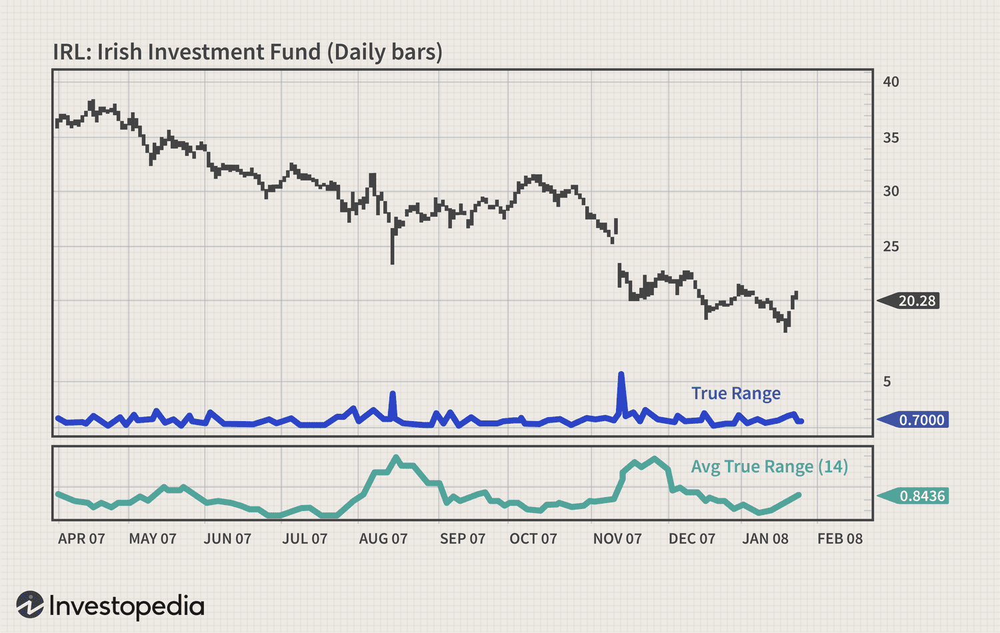

## Table of Contents

## What is volatility in the context of financial markets?

Volatility in financial markets refers to how much and how quickly the price of a financial asset, like a stock or a commodity, changes over time. If the price of an asset moves up and down a lot in a short period, we say it has high volatility. On the other hand, if the price stays pretty steady without big swings, it has low volatility. Traders and investors pay close attention to volatility because it can affect their decisions on whether to buy or sell an asset.

Understanding volatility is important because it helps people figure out the risk involved in investing in a particular asset. High volatility can mean more risk, as the price could drop suddenly, but it can also mean more chance for big gains if the price goes up. Low volatility might seem safer, but it also means there might not be as much opportunity for big profits. By looking at how volatile an asset has been in the past, investors can make better guesses about what might happen in the future, though nothing is ever certain in the financial markets.

## What is the Average True Range (ATR) and how is it calculated?

The Average True Range (ATR) is a tool used in trading to measure how much a stock or other financial asset's price moves around. It helps traders understand the volatility of an asset. The ATR doesn't tell you if the price is going up or down, just how much it's moving. It's useful for setting stop-loss orders and knowing how much an asset might change in price from day to day.

To calculate the ATR, you first need to find the True Range (TR) for each day. The True Range is the biggest of three values: the difference between today's high and low, the difference between today's high and yesterday's close, or the difference between today's low and yesterday's close. Once you have the True Range for a day, you take an average of the True Ranges over a set number of days, usually 14. You start with the first True Range as the initial ATR. Then, for each new day, you use this formula: New ATR = ((Previous ATR x 13) + Current TR) / 14. This smooths out the data and gives you a good idea of the average price movement over time.

## Why is the Average True Range used to assess volatility?

The Average True Range (ATR) is used to assess volatility because it shows how much the price of a stock or other asset moves up and down over time. It doesn't tell you if the price is going up or down, but it does tell you how much it's moving. This is helpful for traders because it gives them a clear picture of how risky an asset might be. If the ATR is high, it means the price is moving a lot, and the asset is more volatile. If the ATR is low, it means the price isn't moving much, and the asset is less volatile.

Traders use the ATR to make decisions about buying and selling. For example, if the ATR is high, a trader might set a wider stop-loss order to avoid getting stopped out by normal price movements. On the other hand, if the ATR is low, a trader might set a tighter stop-loss order because the price isn't expected to move as much. By understanding the ATR, traders can better manage their risk and make more informed choices about when to enter or exit a trade.

## How does ATR differ from other volatility indicators?

The Average True Range (ATR) is different from other volatility indicators because it focuses on the actual price movement of an asset, not just the closing prices. Many other indicators, like the standard deviation or Bollinger Bands, look at how much the closing prices change over time. But ATR looks at the biggest price move of the day, whether it's from high to low, high to the previous close, or low to the previous close. This makes ATR a better measure of the full range of price movement, which is important for understanding how much an asset's price can swing in a day.

Another way ATR differs is that it's not directional. This means it doesn't tell you if the price is going up or down, just how much it's moving. Other indicators, like the Relative Strength Index (RSI) or the Moving Average Convergence Divergence (MACD), can show you if an asset is overbought or oversold, or if its momentum is increasing or decreasing. But ATR only tells you about the size of the price moves, which is useful for setting stop-loss orders and understanding the risk of an asset without getting distracted by whether the price is going up or down.

## What time periods are commonly used for calculating ATR?

The most common time period for calculating the Average True Range (ATR) is 14 days. This period was suggested by J. Welles Wilder Jr., who created the ATR. Many traders find that 14 days gives a good balance between being sensitive to recent price changes and smoothing out the data to show the overall volatility.

However, traders can also use different time periods depending on their trading style and the asset they are trading. Shorter periods, like 7 or 10 days, can be used for more short-term trading where traders want to react quickly to changes in volatility. Longer periods, like 20 or 30 days, can be used for longer-term trading where traders want a more stable measure of volatility. The key is to choose a time period that matches your trading goals and helps you understand the asset's price movement in a way that's useful for your strategy.

## How can ATR be applied to different types of financial instruments?

The Average True Range (ATR) can be used with many different types of financial instruments like stocks, forex, commodities, and even cryptocurrencies. No matter what you're trading, ATR helps you understand how much the price of that thing might move around. For example, if you're trading stocks, you can use ATR to see if a stock is moving a lot or staying pretty steady. This can help you decide if you want to buy or sell the stock, and how much risk you're taking on. The same goes for forex, where you're trading currencies. ATR can show you how much the exchange rate between two currencies might change, which is important for deciding when to make a trade.

ATR is also useful for commodities like gold or oil. These can have big price swings because of things like weather or politics, so knowing the ATR can help you understand how much the price might change from day to day. For cryptocurrencies, which are known for being very volatile, ATR can be really helpful. It can show you how much the price of Bitcoin or Ethereum might move, which is important because these prices can go up and down a lot in a short time. By using ATR with different financial instruments, you get a better idea of the risk involved and can make smarter trading decisions.

## What are the limitations of using ATR for volatility assessment?

One limitation of using ATR for volatility assessment is that it only looks at how much the price moves, not the direction. This means it can't tell you if the price is going up or down, just how much it's moving. For traders who want to know more about the trend or the momentum of the price, ATR might not be enough. They might need to use other indicators along with ATR to get a full picture of what's happening with the price.

Another limitation is that ATR is based on past data. It uses the price movements from the past to guess what might happen in the future, but the future can be different. If something big and unexpected happens, like a company announcing bad news or a big change in the economy, the ATR might not show that the price could move a lot more than usual. So, while ATR is good for understanding normal volatility, it might not be as helpful when things get really unpredictable.

## How can traders use ATR to set stop-loss orders?

Traders use ATR to set stop-loss orders by figuring out how much the price of a stock or other asset might move around. They look at the ATR number, which tells them the average size of price swings over a certain time, usually 14 days. If the ATR is high, it means the price moves a lot, so traders might set their stop-loss order farther away from the current price to avoid getting stopped out by normal price swings. If the ATR is low, the price doesn't move as much, so traders can set their stop-loss closer to the current price.

For example, if a trader buys a stock at $50 and the ATR is $2, they might set their stop-loss at $48. That's two times the ATR below their buying price. This way, if the stock price drops because of normal volatility, the trader won't get stopped out. But if the price drops more than that, it might mean something bigger is happening, and the trader would rather get out of the trade. By using ATR to set stop-loss orders, traders can manage their risk better and make sure they're not getting out of trades too early because of normal price movements.

## What advanced techniques involve combining ATR with other technical indicators?

Traders often mix the Average True Range (ATR) with other technical indicators to get a better picture of what's happening with a stock or other asset. One common way to do this is by using ATR with the Relative Strength Index (RSI). RSI tells you if a stock is overbought or oversold, which means it might be due for a price change. By looking at both the ATR and the RSI, traders can see not just how much the price is moving, but also if it's moving in a way that suggests it's about to go up or down. For example, if the ATR shows high volatility and the RSI shows the stock is overbought, a trader might decide it's a good time to sell.

Another technique is to use ATR with Bollinger Bands. Bollinger Bands show the high and low points of a stock's price over time, and they get wider or narrower based on how much the price is moving. When you combine ATR with Bollinger Bands, you can see if the price is moving a lot more than usual. If the ATR is high and the Bollinger Bands are wide, it might mean the stock is very volatile right now. Traders can use this information to set their stop-loss orders further away from the current price, so they don't get stopped out by normal big price swings. By combining these indicators, traders get a fuller understanding of both the volatility and the trend of the asset they're trading.

## How does ATR help in understanding market trends and reversals?

The Average True Range (ATR) helps traders understand market trends by showing how much the price of an asset is moving around. When the ATR is high, it means the price is moving a lot, which can signal that a big trend might be starting or that the market is getting more active. For example, if the ATR starts to go up while the price is also going up, it could mean a strong upward trend is happening. On the other hand, if the ATR is low, it means the price isn't moving much, which can suggest that the market is calm and there might not be a strong trend happening.

ATR can also help traders spot when a market trend might be about to reverse. If the price has been going up and the ATR is high, but then the ATR starts to drop while the price keeps going up, it might mean the upward trend is losing steam and could soon reverse. Similarly, if the price has been going down and the ATR is high, but then the ATR starts to drop while the price keeps going down, it might mean the downward trend is weakening and could soon reverse. By watching the ATR along with the price, traders can get clues about when a trend might be getting stronger or weaker, helping them decide when to buy or sell.

## What are some common pitfalls when interpreting ATR values?

One common pitfall when interpreting ATR values is relying on it too much without looking at other things. ATR just tells you how much the price moves, not if it's going up or down. So, if you only use ATR, you might miss out on important information about the trend or the overall market. It's like trying to drive a car just by looking at the speedometer without checking the road or other traffic. You need to use other indicators like RSI or Bollinger Bands along with ATR to get a full picture of what's happening with the price.

Another pitfall is not understanding that ATR is based on past data. It looks at how much the price moved in the past to guess what might happen in the future. But the future can be different, especially if something big and unexpected happens, like a company announcing bad news or a big change in the economy. So, if you only look at the ATR, you might be surprised by big price swings that it didn't predict. It's important to use ATR as one tool among many and to always be ready for the market to do something unexpected.

## How can ATR be integrated into algorithmic trading strategies?

Traders can use ATR in their computer trading plans to help decide when to buy or sell things like stocks or currencies. ATR tells them how much the price of something might move around. This is helpful because it can show if the price is moving a lot or just a little. In a computer trading plan, traders can set rules that say, "If the ATR is high, we'll wait longer before selling because the price might keep moving up and down a lot." Or, "If the ATR is low, we'll sell quicker because the price isn't moving much." This way, the computer can make smart choices about when to get in or out of trades based on how much the price is moving.

ATR can also help set stop-loss orders in computer trading plans. A stop-loss order is like a safety net that tells the computer to sell if the price drops too much. If the ATR is high, the computer might set the stop-loss farther away from the current price because the price could move a lot without it being a big problem. If the ATR is low, the computer might set the stop-loss closer because the price isn't expected to move as much. By using ATR, the computer can adjust these safety nets to match how much the price is moving, which helps keep the trading plan safe and smart.

## What is the relationship between understanding volatility and the Average True Range?

Volatility is a fundamental factor in financial markets, directly impacting trading activities and risk management strategies. It quantifies the degree of variation in asset prices over time, reflecting the uncertainty or risk associated with those price movements. Traders utilize volatility metrics to make informed decisions, and one of the prominent measures employed is the Average True Range (ATR).

The ATR calculates the average price range over a pre-defined period, providing a numeric indicator of an asset's volatility. Unlike directional indicators that emphasize price trends, ATR centers around the breadth of price fluctuations, thereby offering a clearer picture of volatility without signaling potential price directions. This makes the ATR a distinct tool for traders interested in the amplitude of price movements rather than their upward or downward trajectories.

The concept of the True Range (TR) is vital in ATR calculations. True Range is designed to capture the most accurate measure of [volatility](/wiki/volatility-trading-strategies) by considering not only the current high and low prices of an asset but also its previous closing price. The True Range for the current trading period is calculated as follows:

$$
\text{TR} = \max(\text{high} - \text{low}, |\text{high} - \text{previous close}|, |\text{low} - \text{previous close}|)
$$

This formula ensures any price gaps or unexplained spikes are considered, leading to a comprehensive capture of volatility. The ATR then averages these True Range values over a specified period, smoothing out erratic movements to reveal consistent volatility trends. Often, a 14-day period is recommended for averaging, but traders may adjust this timeframe based on individual strategies and market conditions.

This distinctive focus on range as opposed to direction makes the ATR particularly useful for volatility measurement in a variety of trading contexts, helping traders and analysts understand not just how much the market is moving, but the consistency and intensity of these movements.

## How do you calculate the Average True Range?

The calculation of the Average True Range (ATR) starts with determining the True Range (TR), a vital component that reflects an asset's volatility. To calculate the TR, one identifies the greatest value among three specific differences: the current high minus the current low, the absolute value of the current high minus the previous close, and the absolute value of the current low minus the previous close. Mathematically, this is represented as:

$$

\text{TR} = \max(\text{Current High} - \text{Current Low}, \left|\text{Current High} - \text{Previous Close}\right|, \left|\text{Current Low} - \text{Previous Close}\right| )
$$

J. Welles Wilder Jr., who developed the ATR, suggested using a 14-day period to average these True Range values, smoothing out short-term fluctuations in price movements. This smoothing process helps traders discern more consistent volatility trends, thereby providing more stable insights for decision-making. The ATR is computed by taking the average of the True Ranges over this period:

$$

\text{ATR} = \frac{1}{n} \sum_{i=1}^{n} \text{TR}_i 
$$

where $n$ is the number of periods, typically set to 14 for daily calculations.

By using a smoothing period, the ATR provides a clearer picture of volatility trends, minimizing short-term noise and allowing traders to make informed strategic decisions. An example of this application could be seen in setting stop-loss orders. For instance, a trader might decide to set a stop-loss at a distance of 1.5 times the ATR away from the entry price to account for anticipated daily price fluctuations, rather than arbitrary placement.

These calculated insights not only assist in setting effective risk management measures but also enhance trading strategies by aligning them closer with market conditions. Implementing these calculations in trading platforms can be efficiently executed using programming scripts. Here is a basic example of how ATR can be calculated in Python using popular libraries like Pandas:

```python
import pandas as pd

def calculate_atr(data, period=14):
    data['High-Low'] = data['High'] - data['Low']
    data['High-PrevClose'] = abs(data['High'] - data['Close'].shift(1))
    data['Low-PrevClose'] = abs(data['Low'] - data['Close'].shift(1))

    tr = data[['High-Low', 'High-PrevClose', 'Low-PrevClose']].max(axis=1)
    atr = tr.rolling(window=period, min_periods=1).mean()

    return atr

# Assuming 'df' is a DataFrame with 'High', 'Low', and 'Close' columns:
atr = calculate_atr(df)
df['ATR'] = atr
```

This code calculates the ATR for a given dataset, further demonstrating its integration into trading systems for enhanced volatility analysis and strategic optimization.

## References & Further Reading

[1]: Wilder, J. W. (1978). ["New Concepts in Technical Trading Systems"](https://archive.org/details/newconceptsintec00wild). Trend Research.

[2]: Aronson, D. R. (2006). ["Evidence-Based Technical Analysis: Applying the Scientific Method and Statistical Inference to Trading Signals"](https://www.amazon.com/Evidence-Based-Technical-Analysis-Scientific-Statistical/dp/0470008741). Wiley.

[3]: de Prado, M. L. (2018). ["Advances in Financial Machine Learning"](https://www.amazon.com/Advances-Financial-Machine-Learning-Marcos/dp/1119482089). Wiley.

[4]: Chan, E. (2009). ["Quantitative Trading: How to Build Your Own Algorithmic Trading Business"](https://github.com/ftvision/quant_trading_echan_book). Wiley.

[5]: Schwager, J. D. (1993). ["The New Market Wizards: Conversations with America's Top Traders"](https://archive.org/details/newmarketwizards00jack). Harper Business.

[6]: Jansen, S. (2020). ["Machine Learning for Algorithmic Trading"](https://github.com/stefan-jansen/machine-learning-for-trading). Packt Publishing.

[7]: Kaufman, P. J. (2013). ["Trading Systems and Methods, + Website, 5th Edition"](https://onlinelibrary.wiley.com/doi/book/10.1002/9781119202561). Wiley.