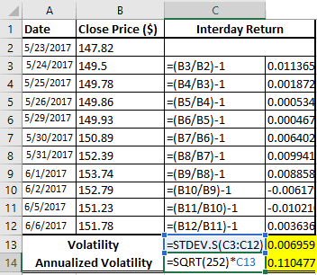

## Table of Contents

## What is volatility and why is it important in financial analysis?

Volatility is a measure of how much the price of a financial asset, like a stock or a commodity, moves up and down over time. It shows how unpredictable or stable the price of that asset is. If an asset has high volatility, its price can change a lot in a short amount of time. If it has low volatility, the price doesn't change much and stays more predictable.

Understanding volatility is important in financial analysis because it helps investors and traders make better decisions. If you know an asset is highly volatile, you might expect bigger price swings, which could mean more risk but also more potential reward. On the other hand, if an asset has low volatility, it might be safer but with smaller potential gains. By knowing the volatility, people can choose investments that match their comfort with risk and their financial goals.

## How can I use Excel to calculate basic volatility of a stock?

To calculate the basic volatility of a stock using Excel, you'll need a series of the stock's historical prices. Start by entering these prices into a column in your Excel spreadsheet. Let's say you put them in column A, starting from cell A1. Next, you need to calculate the daily returns of the stock. To do this, in cell B2, you can use the formula `=LN(A2/A1)` to find the natural logarithm of the ratio of the current price (A2) to the previous price (A1). Copy this formula down the column B for all your price data.

Once you have the daily returns, you can calculate the standard deviation of these returns, which represents the [volatility](/wiki/volatility-trading-strategies). In a new cell, let's say C1, you can use the formula `=STDEV.S(B2:BX)`, where X is the last row of your data. This formula calculates the standard deviation of the daily returns in column B, giving you the stock's volatility. To annualize this volatility, you can multiply the result by the square root of the number of trading days in a year, which is typically around 252. So, in cell C2, you would use `=C1*SQRT(252)` to get the annualized volatility.

## What data do I need to calculate volatility in Excel?

To calculate volatility in Excel, you need the historical prices of the stock. These prices should be in a list, like in one column of your spreadsheet. Each price should be for a different day, and they should be in order from oldest to newest. You'll start by putting these prices into your Excel sheet.

Once you have the prices, you'll need to calculate the daily returns. You do this by finding out how much the price changed from one day to the next. After you have the daily returns, you can find the standard deviation of these returns. This standard deviation is what we call volatility. To make it easier to understand, you might want to turn this daily volatility into an annual number, which you can do by using a simple formula in Excel.

## Can you explain the difference between historical and implied volatility?

Historical volatility, also called realized volatility, looks at how much a stock's price has moved up and down in the past. It uses old price data to figure out how much the stock price changed from day to day. This helps investors see how stable or unpredictable the stock has been over time. To calculate it, you find the standard deviation of the stock's daily returns, which shows how much the price has varied.

Implied volatility, on the other hand, is a prediction about how much a stock's price might move in the future. It's not based on past data but on what people think will happen. You can find implied volatility by looking at the prices of options on the stock. Options are like bets on where the stock price will go, and their prices tell us how much people expect the stock to move. If people think the stock will move a lot, the implied volatility will be high, and if they think it will stay pretty steady, it will be low.

## How do I calculate the standard deviation of returns in Excel to measure volatility?

To calculate the standard deviation of returns in Excel to measure volatility, you first need to have a list of the stock's historical prices. Put these prices in a column, say column A, starting from cell A1. Next, you need to find the daily returns. In cell B2, you can use the formula `=LN(A2/A1)` to calculate the natural logarithm of the ratio of the current price (A2) to the previous price (A1). This gives you the daily return. Copy this formula down column B for all your price data.

Once you have the daily returns in column B, you can calculate the standard deviation of these returns. In a new cell, say C1, use the formula `=STDEV.S(B2:BX)`, where X is the last row of your data. This formula calculates the standard deviation of the daily returns in column B, which is your measure of volatility. If you want to annualize this volatility, you can multiply the result by the square root of the number of trading days in a year, which is typically around 252. So, in cell C2, you would use `=C1*SQRT(252)` to get the annualized volatility.

## What is the formula for calculating annualized volatility in Excel?

To calculate annualized volatility in Excel, you first need a list of historical prices of the stock. Put these prices in a column, like column A, starting from cell A1. Then, calculate the daily returns by finding the natural logarithm of the ratio of the current price to the previous price. In cell B2, you can use the formula `=LN(A2/A1)`. Copy this formula down column B for all your price data. This gives you the daily returns.

Next, find the standard deviation of these daily returns. In a new cell, like C1, use the formula `=STDEV.S(B2:BX)`, where X is the last row of your data. This gives you the daily volatility. To turn this into annualized volatility, you multiply it by the square root of the number of trading days in a year, which is usually about 252. So, in cell C2, you would use the formula `=C1*SQRT(252)`. This gives you the annualized volatility of the stock.

## How can I use Excel's built-in functions to simplify volatility calculations?

To simplify volatility calculations in Excel, you can use the built-in functions to handle the math for you. Start by entering the stock's historical prices into a column, say column A. Then, in the next column, like column B, use the `LN` function to find the natural logarithm of the ratio of each price to the previous price. You do this with the formula `=LN(A2/A1)` in cell B2, and then copy it down the column. This gives you the daily returns. After that, you can use the `STDEV.S` function to find the standard deviation of these returns, which is your measure of volatility. Just type `=STDEV.S(B2:BX)` in a new cell, where X is the last row of your data.

To get the annualized volatility, you can use the `SQRT` function along with your standard deviation. In another cell, multiply the daily volatility by the square root of the number of trading days in a year, which is typically around 252. The formula for this is `=C1*SQRT(252)`, where C1 is the cell with your daily volatility. This gives you the annualized volatility, making it easier to understand how much the stock price might move over a year. By using these built-in functions, you can quickly calculate and analyze the volatility of a stock without having to do complex math yourself.

## What are some common pitfalls to avoid when calculating volatility in Excel?

When calculating volatility in Excel, one common mistake is not using the right data. You need to make sure you're using the stock's closing prices each day. If you use prices from different times of the day, your volatility calculation won't be accurate. Also, it's important to have enough data. Using just a few days of prices won't give you a good picture of the stock's volatility. Try to use at least a few months of data to get a more reliable result.

Another pitfall is not calculating the returns correctly. You need to find the natural logarithm of the ratio of each day's price to the previous day's price. If you don't do this right, your volatility calculation will be off. Also, be careful with the formulas. Make sure you're using `STDEV.S` for the standard deviation of a sample, not `STDEV.P`, which is for the standard deviation of a whole population. Finally, when annualizing the volatility, remember to multiply by the square root of the number of trading days in a year, which is usually around 252. If you forget this step or use the wrong number, your annualized volatility will be wrong.

## How can I compare the volatility of different stocks using Excel?

To compare the volatility of different stocks using Excel, you first need to gather the historical closing prices for each stock. Put the prices for each stock in separate columns, like column A for Stock 1, column B for Stock 2, and so on. Then, calculate the daily returns for each stock by finding the natural logarithm of the ratio of each day's price to the previous day's price. You can do this with the formula `=LN(A2/A1)` for Stock 1 in column D, and similarly for the other stocks in their own columns. After you have the daily returns for all stocks, use the `STDEV.S` function to find the standard deviation of these returns for each stock. This gives you the daily volatility for each stock.

Once you have the daily volatilities, you can annualize them to make it easier to compare the stocks over a year. To annualize the volatility, multiply the daily volatility by the square root of the number of trading days in a year, which is around 252. You can use the formula `=D1*SQRT(252)` in a new cell for Stock 1, where D1 is the cell with the daily volatility, and do the same for the other stocks. Now you have the annualized volatilities for all the stocks. You can put these numbers side by side in your Excel sheet to see which stock has the highest and lowest volatility, helping you understand which stocks are more or less risky.

## Can Excel be used to forecast future volatility, and if so, how?

Excel can be used to forecast future volatility, but it's not as straightforward as calculating historical volatility. To forecast future volatility, you can use a method called the GARCH (Generalized Autoregressive Conditional Heteroskedasticity) model, which looks at how volatility changes over time. To do this in Excel, you would need to set up formulas that use past volatility and returns to predict future volatility. This involves using complex formulas that take into account the past data to estimate how volatility might behave in the future. You can find templates or add-ins online that help with setting up these GARCH models in Excel.

Another simpler way to forecast volatility is by using moving averages of historical volatility. You can calculate the volatility over a certain period, like 30 days, and then use this as a moving average to predict future volatility. In Excel, you would first calculate the daily returns and then the daily volatility as you normally would. Next, you can use the `AVERAGE` function to find the average volatility over the last 30 days, for example. By updating this moving average daily, you can get a rough estimate of future volatility. While this method is easier to set up in Excel, it's less accurate than more complex models like GARCH.

## How do I incorporate moving averages into volatility calculations in Excel?

To incorporate moving averages into volatility calculations in Excel, you first need to calculate the daily returns and then the daily volatility as you normally would. Start by putting the stock's historical prices in a column, say column A. In the next column, like column B, find the daily returns by using the formula `=LN(A2/A1)` and copying it down. After that, use the `STDEV.S` function to find the standard deviation of these returns, which is your daily volatility. Put this in another column, like column C, with the formula `=STDEV.S(B2:BX)`, where X is the last row of your data.

Next, you can use the `AVERAGE` function to calculate a moving average of the daily volatility. For example, if you want a 30-day moving average, in a new column, like column D, you would use the formula `=AVERAGE(C2:C31)` to find the average of the first 30 days of volatility. As you move down the column, adjust the range to always include the most recent 30 days. This moving average gives you a smoother estimate of volatility over time, which can help you predict future volatility. By updating this moving average daily, you can get a rough idea of how the stock's volatility might change in the near future.

## What advanced Excel techniques can be used to model complex volatility scenarios?

To model complex volatility scenarios in Excel, you can use the GARCH (Generalized Autoregressive Conditional Heteroskedasticity) model. This model looks at how volatility changes over time and uses past data to predict future volatility. To set this up in Excel, you need to create formulas that use past returns and volatility to estimate future volatility. This involves using complex math, but you can find templates or add-ins online that make it easier. These tools help you enter your data and automatically calculate the GARCH model's predictions, giving you a more accurate forecast of future volatility.

Another advanced technique is using Monte Carlo simulations to model different volatility scenarios. This method involves generating many possible future price paths for a stock based on its historical volatility and other factors. In Excel, you can use the `RAND` or `RANDBETWEEN` functions to create random numbers that represent possible returns, and then use these to simulate future prices. By running many simulations, you can see a range of possible outcomes and understand how volatility might affect the stock's price in the future. This approach helps you prepare for different scenarios and make better investment decisions.

## How do you calculate historical volatility in Excel?

Historical volatility calculation involves quantifying how much a stock's returns deviate from its average over a fixed period. This metric is crucial for traders to understand past price dynamics and make informed trading decisions. Calculating historical volatility in Excel is a straightforward process that can be broken down into several steps:

1. **Determine the timeframe and gather closing prices for that period**: Choose a specific historical period for your analysis, such as the past month or year, and collect the closing prices of the asset for each trading day within this timeframe. This data can be obtained from financial websites or directly from market data providers.

2. **Compute daily returns**: The daily return represents the percentage change in the stock price from one day to the next. In Excel, calculate the daily returns using the formula:
$$
   \text{Daily Return} = \frac{\text{Today's Closing Price}}{\text{Yesterday's Closing Price}} - 1

$$

   In Excel, if your closing prices start from cell B2 for instance, the formula for daily return in cell C3 would be:

   ```
   =B3/B2 - 1
   ```

   Drag this formula down to calculate returns for all days in your dataset.

3. **Use Excel's 'STDEV.S' function to find the standard deviation of these returns**: The standard deviation measures the dispersion of these daily returns around their average, representing volatility. In Excel, apply the `STDEV.S` function to the range of daily returns to compute the standard deviation. For example, if your daily returns are in cells C3 to C32, the formula would be:

   ```
   =STDEV.S(C3:C32)
   ```

4. **Annualize the calculated standard deviation**: Since volatility is often expressed on an annual basis, the next step is to annualize the standard deviation. Assuming there are approximately 252 trading days in a year, you can annualize volatility using the formula:
$$
   \text{Annualized Volatility} = \text{Standard Deviation} \times \sqrt{252}

$$

   In Excel, if the standard deviation is calculated in cell D1, the formula would be:

   ```
   =D1 * SQRT(252)
   ```

This annualized volatility figure provides a meaningful representation of the stock's riskiness over the year, helping traders adjust their strategies accordingly. By leveraging Excel for these calculations, traders can efficiently integrate historical volatility into their analysis and enhance decision-making processes in their trading algorithms.

## How can you calculate implied volatility using Excel tools?

Implied volatility serves as a crucial metric in the options market, offering a glimpse into the market's expectations of future volatility. It is implicitly embedded in the prices of options and requires sophisticated methods to extract. Excel, a versatile tool for financial analysis, can be effectively utilized to calculate implied volatility using the Black-Scholes option pricing model.

The Black-Scholes model provides a theoretical price of European-style options based on several inputs:

$$
C = S_0 \cdot N(d_1) - X \cdot e^{-r \cdot T} \cdot N(d_2)
$$

Where:
- $C$ is the call option price.
- $S_0$ is the current stock price.
- $X$ is the strike price.
- $r$ is the risk-free interest rate.
- $T$ is the time to expiration.
- $N(d)$ is the cumulative distribution function of the standard normal distribution.
- $d_1 = \frac{\ln(S_0 / X) + (r + \sigma^2 / 2) \cdot T}{\sigma \cdot \sqrt{T}}$
- $d_2 = d_1 - \sigma \cdot \sqrt{T}$
- $\sigma$ is the volatility to be determined.

Excel's Goal Seek function can streamline the iterative process required to find the implied volatility, $\sigma$, that aligns the theoretical option price with the market price of the option.

**Steps to Calculate Implied Volatility with Goal Seek in Excel:**

1. **Input Parameters**: List the known variables including the underlying asset's price ($S_0$), strike price ($X$), market price of the option ($C_{\text{market}}$), risk-free rate ($r$), and time to expiration ($T$).

2. **Set Up Black-Scholes Formula**: Implement the Black-Scholes pricing formula in an Excel cell using the known parameters and an initial guess for $\sigma$.

3. **Use Goal Seek**: Navigate to `Data` > `What-If Analysis` > `Goal Seek`. Set the cell containing the Black-Scholes formula equal to the market price ($C_{\text{market}}$) by changing the cell containing the initial volatility guess.

4. **Automate the Process**: Excel iteratively adjusts the volatility until the theoretical price converges to the market price. The resulting volatility is the implied volatility.

By mastering these steps, traders gain valuable insights into potential market movements and can better calibrate their trading strategies. Accurate calculation of implied volatility enables traders to assess market sentiment and anticipate price shifts, making it an essential component of [algorithmic trading](/wiki/algorithmic-trading) models. Excel's powerful computational tools make this complex calculation accessible, ultimately aiding traders in crafting more informed and nuanced trading strategies.

## References & Further Reading

[1]: Hull, J. C. (2012). ["Options, Futures, and Other Derivatives."](https://www.semanticscholar.org/paper/Options%2C-Futures%2C-and-Other-Derivatives-Hull/89bdee500c8623864fc9eb7a471546aa713acc44) Pearson Education.

[2]: Black, F., & Scholes, M. (1973). ["The Pricing of Options and Corporate Liabilities."](https://www.cs.princeton.edu/courses/archive/fall09/cos323/papers/black_scholes73.pdf) Journal of Political Economy, 81(3), 637-654.

[3]: Natenberg, S. (1994). ["Option Volatility and Pricing: Advanced Trading Strategies and Techniques."](https://www.amazon.com/Option-Volatility-Pricing-Strategies-Techniques/dp/0071818774) McGraw-Hill.

[4]: Taleb, N. N. (1997). ["Dynamic Hedging: Managing Vanilla and Exotic Options."](https://www.amazon.com/Dynamic-Hedging-Managing-Vanilla-Options/dp/0471152803) John Wiley & Sons.

[5]: Wilmott, P., Howison, S., & Dewynne, J. (1995). ["The Mathematics of Financial Derivatives: A Student Introduction."](https://www.cambridge.org/core/books/mathematics-of-financial-derivatives/7121345D07C5BCE4FBEC91A8A7E6F267) Cambridge University Press.