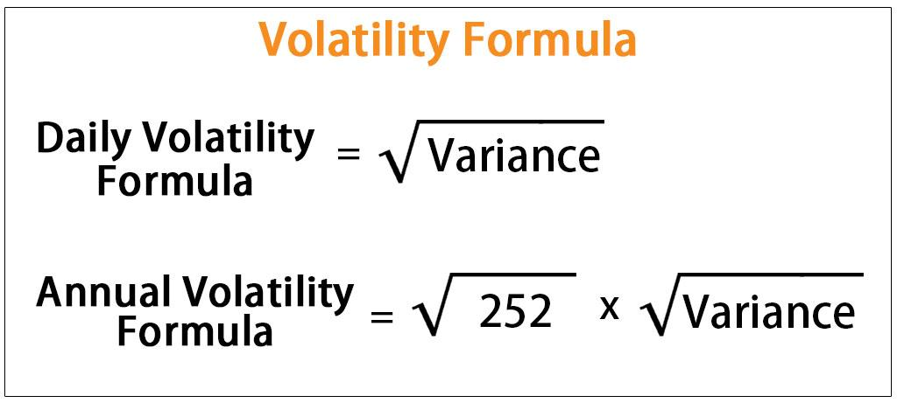

In finance, volatility stands as a crucial element influencing both investment decisions and risk management. It represents the degree of variation in asset prices over time, providing a quantitative measure that is essential for assessing market risk and identifying potential opportunities. By analyzing volatility, investors and traders gain insights into price fluctuations, enabling informed decision-making that aligns with their risk appetite and financial goals.

Financial volatility is multifaceted, encompassing both historical and implied volatility aspects. While historical volatility is based on past price data, capturing the asset's previous price movements, implied volatility is derived from current option prices, offering a glimpse into market expectations of future price swings. This dual perspective provides a comprehensive framework for understanding market behavior, which becomes especially pivotal in algorithmic trading.



Algorithmic trading leverages advanced mathematical models and statistical methods to optimize trading strategies. Volatility analysis is integral to these approaches, enabling algorithms to assess current market conditions and adapt strategies accordingly. By quantifying price volatility, algorithms can better manage risk, refine entry and exit points, and adjust investment sizes to maximize profitability.

Excel emerges as a potent tool in calculating financial volatility, serving as an accessible platform for traders to perform complex volatility analyses. With its range of functions and capabilities, Excel allows traders to compute both historical and implied volatility, facilitating the integration of sophisticated financial concepts into trading algorithms. Through this article, we examine how Excel aids in computing these volatility metrics, contributing to the development of robust trading algorithms that can adeptly navigate the ever-evolving financial markets.

## Table of Contents

## Understanding Financial Volatility

Volatility is a crucial factor in the financial market, representing the degree of variation in an asset's price over time. It is mathematically expressed as the standard deviation of returns. This measure provides insights into the unpredictability or risk associated with the price movements of a financial instrument. Higher volatility signifies larger price swings, presenting both opportunities and risks for traders.

In financial contexts, two main types of volatility are considered: historical volatility and implied volatility. Historical volatility is derived from past price data, reflecting the actual movements experienced by the asset. It provides a retrospective view of how volatile the asset has been over a specific period. The standard deviation formula applied to a series of past returns is commonly used to calculate this.

Conversely, implied [volatility](/wiki/volatility-trading-strategies) is forward-looking and is extracted from the prices of options in the market. It indicates the market's expectations of future price movements. Implied volatility is computed from the prices of options using models like the Black-Scholes formula. This involves determining the volatility value that matches the market price of the option, given known parameters like the underlying asset price, strike price, time to expiration, and the risk-free [interest rate](/wiki/interest-rate-trading-strategies).

High volatility can be enticing for traders, as it suggests the possibility of substantial price shifts that can be capitalized on for profit. However, greater volatility also implies increased risk. Traders may encounter swift and unexpected downturns that can lead to significant losses. Thus, assessing volatility comprehensively is essential for developing trading strategies that can withstand market uncertainties and optimize returns.

Understanding these volatility types and their implications is fundamental for traders. By integrating volatility analysis into their strategies, traders can better manage risk and fine-tune their tactics to align with market conditions. This understanding supports the identification of optimal entry and [exit](/wiki/exit-strategy) points, helping traders achieve a balance between risk and reward.

## Calculating Historical Volatility in Excel

Historical volatility calculation involves quantifying how much a stock's returns deviate from its average over a fixed period. This metric is crucial for traders to understand past price dynamics and make informed trading decisions. Calculating historical volatility in Excel is a straightforward process that can be broken down into several steps:

1. **Determine the timeframe and gather closing prices for that period**: Choose a specific historical period for your analysis, such as the past month or year, and collect the closing prices of the asset for each trading day within this timeframe. This data can be obtained from financial websites or directly from market data providers.

2. **Compute daily returns**: The daily return represents the percentage change in the stock price from one day to the next. In Excel, calculate the daily returns using the formula:
$$
   \text{Daily Return} = \frac{\text{Today's Closing Price}}{\text{Yesterday's Closing Price}} - 1

$$

   In Excel, if your closing prices start from cell B2 for instance, the formula for daily return in cell C3 would be:

   ```
   =B3/B2 - 1
   ```

   Drag this formula down to calculate returns for all days in your dataset.

3. **Use Excel's 'STDEV.S' function to find the standard deviation of these returns**: The standard deviation measures the dispersion of these daily returns around their average, representing volatility. In Excel, apply the `STDEV.S` function to the range of daily returns to compute the standard deviation. For example, if your daily returns are in cells C3 to C32, the formula would be:

   ```
   =STDEV.S(C3:C32)
   ```

4. **Annualize the calculated standard deviation**: Since volatility is often expressed on an annual basis, the next step is to annualize the standard deviation. Assuming there are approximately 252 trading days in a year, you can annualize volatility using the formula:
$$
   \text{Annualized Volatility} = \text{Standard Deviation} \times \sqrt{252}

$$

   In Excel, if the standard deviation is calculated in cell D1, the formula would be:

   ```
   =D1 * SQRT(252)
   ```

This annualized volatility figure provides a meaningful representation of the stock's riskiness over the year, helping traders adjust their strategies accordingly. By leveraging Excel for these calculations, traders can efficiently integrate historical volatility into their analysis and enhance decision-making processes in their trading algorithms.

## Applications of Historical Volatility in Algo Trading

Algorithmic traders leverage historical volatility to fine-tune their trading strategies in response to current market dynamics. Historical volatility, which measures the fluctuation of an asset's returns over a specific period, plays a vital role in decision-making processes about stop-loss and take-profit levels. This approach aims to maximize profitability while minimizing potential risks.

One primary application of historical volatility in [algorithmic trading](/wiki/algorithmic-trading) is the calibration of risk management parameters. Volatility informs traders about the level of price movement they can expect, enabling them to set more informed stop-loss orders, which automatically close a position to prevent further losses, and take-profit levels, which lock in gains at predetermined points. By adjusting these levels based on volatility, traders can protect their capital more effectively and capitalize on market trends.

Moreover, historical volatility assists in optimizing position size, which is the amount of capital allocated to a particular trade. Traders calculate the expected market turbulence to decide how much to invest in a given position. This method ensures that the position size is proportional to the anticipated risk, maintaining a balanced approach to trading that neither overexposes the trader to potential losses nor underutilizes available capital.

Algorithmic trading models also utilize historical volatility as a dynamic input to adapt their parameters to market behavior. This adaptability is critical in fluctuating markets, where static strategies may underperform. For instance, algorithms can modify their trading frequency, entry and exit points, and other strategic elements based on changes in volatility. Such modifications help in maintaining an edge in the market, as the algorithms continuously recalibrate to reflect present conditions.

In practical terms, algorithmic traders might implement these strategies using code. Here is a simple example in Python that demonstrates how historical volatility can influence trading decisions:

```python
import numpy as np
import pandas as pd

# Load historical price data into a DataFrame
data = pd.read_csv('historical_stock_data.csv')
data['returns'] = data['Close'].pct_change()

# Calculate historical volatility
volatility = data['returns'].std() * np.sqrt(252)  # Annualizing the standard deviation

# Define risk management parameters based on volatility
risk_tolerance = 0.02  # Example risk tolerance level
stop_loss = -volatility * risk_tolerance
take_profit = volatility * risk_tolerance

print(f"Calculated Stop-Loss: {stop_loss}")
print(f"Calculated Take-Profit: {take_profit}")

# Adjust position size
account_balance = 100000  # Example account balance
position_size = (account_balance * risk_tolerance) / volatility

print(f"Recommended Position Size: {position_size}")
```

This script calculates historical volatility and suggests stop-loss, take-profit levels, and position size in alignment with the trader’s risk tolerance. By harnessing the insights provided by historical volatility, algorithmic traders can enhance the stability and profitability of their strategies, adapting to market fluctuations with more precision and confidence.

## Calculating Implied Volatility with Excel Tools

Implied volatility serves as a crucial metric in the options market, offering a glimpse into the market's expectations of future volatility. It is implicitly embedded in the prices of options and requires sophisticated methods to extract. Excel, a versatile tool for financial analysis, can be effectively utilized to calculate implied volatility using the Black-Scholes option pricing model.

The Black-Scholes model provides a theoretical price of European-style options based on several inputs:

$$
C = S_0 \cdot N(d_1) - X \cdot e^{-r \cdot T} \cdot N(d_2)
$$

Where:
- $C$ is the call option price.
- $S_0$ is the current stock price.
- $X$ is the strike price.
- $r$ is the risk-free interest rate.
- $T$ is the time to expiration.
- $N(d)$ is the cumulative distribution function of the standard normal distribution.
- $d_1 = \frac{\ln(S_0 / X) + (r + \sigma^2 / 2) \cdot T}{\sigma \cdot \sqrt{T}}$
- $d_2 = d_1 - \sigma \cdot \sqrt{T}$
- $\sigma$ is the volatility to be determined.

Excel's Goal Seek function can streamline the iterative process required to find the implied volatility, $\sigma$, that aligns the theoretical option price with the market price of the option.

**Steps to Calculate Implied Volatility with Goal Seek in Excel:**

1. **Input Parameters**: List the known variables including the underlying asset's price ($S_0$), strike price ($X$), market price of the option ($C_{\text{market}}$), risk-free rate ($r$), and time to expiration ($T$).

2. **Set Up Black-Scholes Formula**: Implement the Black-Scholes pricing formula in an Excel cell using the known parameters and an initial guess for $\sigma$.

3. **Use Goal Seek**: Navigate to `Data` > `What-If Analysis` > `Goal Seek`. Set the cell containing the Black-Scholes formula equal to the market price ($C_{\text{market}}$) by changing the cell containing the initial volatility guess.

4. **Automate the Process**: Excel iteratively adjusts the volatility until the theoretical price converges to the market price. The resulting volatility is the implied volatility.

By mastering these steps, traders gain valuable insights into potential market movements and can better calibrate their trading strategies. Accurate calculation of implied volatility enables traders to assess market sentiment and anticipate price shifts, making it an essential component of algorithmic trading models. Excel's powerful computational tools make this complex calculation accessible, ultimately aiding traders in crafting more informed and nuanced trading strategies.

## Implementing Volatility Analysis in Algorithmic Trading

Algorithmic trading strategies leverage volatility analysis for various operational decisions, ensuring optimized performance in diverse market environments. The integration of volatility metrics enables traders to refine entry and exit points, adjust investment sizes, and manage overall risk more effectively.

Traders can use trading signals based on volatility breakouts, which occur when price levels surpass expected volatility thresholds. Such breakouts often indicate potential for significant price movements, allowing traders to enter or exit positions strategically. Contrarian strategies, on the other hand, rely on identifying when the market deviates significantly from its historical volatility patterns, betting that it will revert to the mean.

Moreover, [machine learning](/wiki/machine-learning) techniques enhance traditional volatility analysis by providing more nuanced predictive capabilities. Machine learning algorithms can identify complex patterns and relationships within market data, incorporating volatility metrics to adjust trading parameters dynamically. This leads to more adaptive trading strategies that adjust to changing market conditions.

Continuous [backtesting](/wiki/backtesting) of these strategies is paramount. By simulating strategies on historical data, traders assess the robustness of their models under various market conditions. This process involves using volatility metrics to gauge how strategies perform during periods of high and low volatility, thereby ensuring their resilience and effectiveness.

Understanding volatility’s impact is crucial in aligning trading algorithms with a trader's risk appetite and financial objectives. By incorporating volatility analysis, traders can tailor their algorithms to balance potential returns with acceptable risk levels, ultimately enhancing their strategic approach to algorithmic trading.

## Conclusion

Volatility is pivotal in financial markets, shaping both trading strategies and investment decisions due to its ability to measure risk and potential reward. With the aid of tools like Excel, traders can efficiently analyze both historical and implied volatility, integrating these sophisticated financial concepts into their algorithmic trading models. Excel's robust functions allow for the processing of large datasets and complex calculations, providing traders with actionable insights into market dynamics.

By calculating historical volatility, traders can gain insight into past market behavior, enabling them to adapt their strategies to current market conditions. Similarly, through the computation of implied volatility, traders can forecast future market movements, adjusting their algorithms to exploit anticipated opportunities. These capabilities afford traders a significant competitive edge, as they are better equipped to manage risk and pursue profitable ventures.

Market conditions are continuously evolving, necessitating the ongoing adjustment of trading strategies. The ability to utilize Excel's features to perform comprehensive volatility analysis ensures that traders remain agile and informed. This adaptability is crucial for maintaining effective trading strategies that align with shifting market trends and individual risk appetites. By mastering and applying Excel's capabilities for volatility assessment, traders can elevate their algorithmic trading strategies, thereby enhancing performance outcomes and achieving superior financial returns.

## References & Further Reading

[1]: Hull, J. C. (2012). ["Options, Futures, and Other Derivatives."](https://www.semanticscholar.org/paper/Options%2C-Futures%2C-and-Other-Derivatives-Hull/89bdee500c8623864fc9eb7a471546aa713acc44) Pearson Education.

[2]: Black, F., & Scholes, M. (1973). ["The Pricing of Options and Corporate Liabilities."](https://www.cs.princeton.edu/courses/archive/fall09/cos323/papers/black_scholes73.pdf) Journal of Political Economy, 81(3), 637-654.

[3]: Natenberg, S. (1994). ["Option Volatility and Pricing: Advanced Trading Strategies and Techniques."](https://www.amazon.com/Option-Volatility-Pricing-Strategies-Techniques/dp/0071818774) McGraw-Hill.

[4]: Taleb, N. N. (1997). ["Dynamic Hedging: Managing Vanilla and Exotic Options."](https://www.amazon.com/Dynamic-Hedging-Managing-Vanilla-Options/dp/0471152803) John Wiley & Sons.

[5]: Wilmott, P., Howison, S., & Dewynne, J. (1995). ["The Mathematics of Financial Derivatives: A Student Introduction."](https://www.cambridge.org/core/books/mathematics-of-financial-derivatives/7121345D07C5BCE4FBEC91A8A7E6F267) Cambridge University Press.