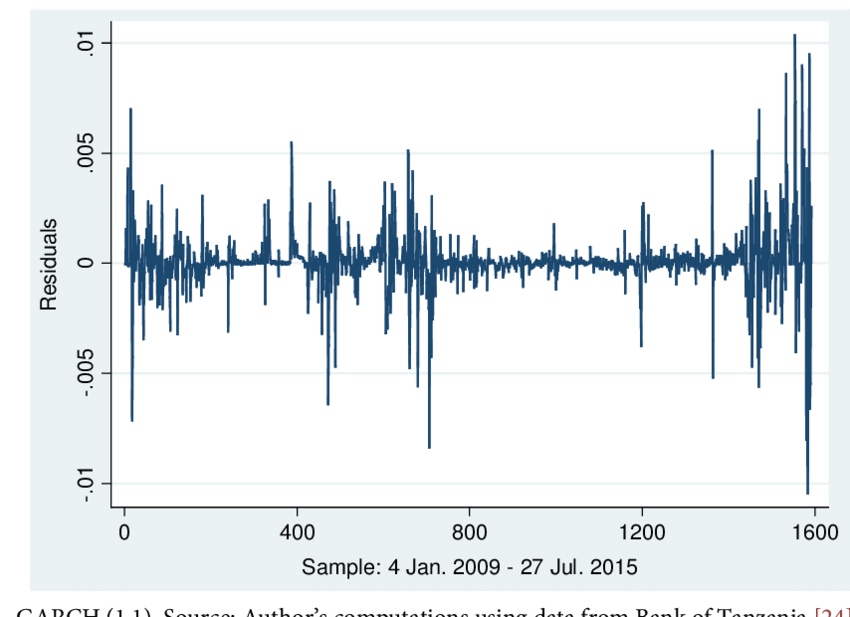

Volatility clustering is a fundamental concept in financial markets, describing the phenomenon where periods of large price changes tend to follow other periods of large price changes, while periods of small price changes follow periods of small price changes. This pattern has been widely observed in various financial instruments, where volatility, the measure of price variability, does not occur randomly but rather in clusters. Understanding this behavior is critical, especially in algorithmic trading, where accurate predictions of market movements can enhance trading strategies for better efficiency and profitability. 

Algorithmic trading relies heavily on data-driven decision-making processes, aiming to optimize trade executions by capitalizing on the signals generated from market data, including volatility patterns. Grasping volatility clustering enables traders and financial engineers to develop models that anticipate market behavior, thereby mitigating risks and improving the returns on trading portfolios. It calls for sophisticated statistical models that can capture the temporal dependencies observed in the volatility of asset returns. 

This article explores the theoretical and practical aspects of volatility clustering, underscoring its significance in algorithmic trading. Additionally, it examines the statistical models used to represent and predict this phenomenon, such as Generalized Autoregressive Conditional Heteroskedasticity (GARCH) models and stochastic volatility models. Understanding these concepts is pivotal for financial professionals and data scientists looking to enhance their trading systems and optimize risk management strategies.

## Table of Contents

## Understanding Volatility Clustering

Volatility describes the extent to which trading prices fluctuate over a specific timeframe. It is typically quantified using statistical tools such as the standard deviation or variance of asset returns. The concept of clustering, when applied to volatility, refers to the observation that periods characterized by substantial market volatility tend to be grouped together, as do intervals with minimal volatility. This suggests a pattern where large price swings are likely to follow other large swings, while small movements tend to succeed similarly small changes.

The phenomenon of volatility clustering was first brought to light in the 1960s by Benoit Mandelbrot, a pioneer in the field of fractal geometry. Mandelbrot's work revealed that financial markets exhibit phases of both high and low volatility that appear in distinct clusters, challenging the traditional assumption of constant volatility over time. His findings provided a foundation for the development of modern financial theories that consider the erratic nature of market movements.

Mathematically, if returns on a financial asset are denoted by $r_t$, the volatility $\sigma_t$ at time $t$ can be expressed as:

$$
\sigma_t^2 = \text{Var}(r_t)
$$

This variance can be seen as time-dependent, with periods of heightened [volatility](/wiki/volatility-trading-strategies) clustering together due to underlying market dynamics or external shocks.

In actual market data, this clustering effect is often captured using models that can dynamically adapt to changing volatility levels. These models include the Generalized Autoregressive Conditional Heteroskedasticity (GARCH) models, which explicitly incorporate the clustering of volatility by allowing past shocks to influence current volatility levels. Stochastic volatility models, on the other hand, posit that volatility itself follows a stochastic process, providing a more nuanced account of volatility behavior over time.

The understanding of volatility clustering not only contributes to more accurate financial modeling but is also critical in [algorithmic trading](/wiki/algorithmic-trading), risk management, and portfolio optimization. Recognizing the patterns in volatility can lead to more informed predictions about market risks and opportunities, thereby enabling traders and financial analysts to develop more effective strategies.

## Statistical Models in Volatility Clustering

Statistical models play a fundamental role in understanding and predicting volatility clustering in financial markets. Among these, the Generalized Autoregressive Conditional Heteroskedasticity (GARCH) models, Stochastic Volatility Models, and the RiskMetrics framework are particularly noteworthy.

### GARCH Models

The GARCH model, developed by Tim Bollerslev in 1986, is a widely adopted tool for estimating the volatility of asset returns, acknowledging the presence of volatility clustering. The model extends the Autoregressive Conditional Heteroskedasticity (ARCH) model by incorporating lagged conditional variances. The basic GARCH(1,1) formulation is expressed as:

$$

\sigma_t^2 = \alpha_0 + \alpha_1 \epsilon_{t-1}^2 + \beta_1 \sigma_{t-1}^2 
$$

Where:
- $\sigma_t^2$ is the conditional variance at time $t$.
- $\alpha_0$, $\alpha_1$, and $\beta_1$ are parameters with $\alpha_1 > 0$, $\beta_1 \geq 0$, and $\alpha_0 > 0$.
- $\epsilon_{t-1}$ denotes the residual from the previous period.

This model captures the persistent nature of volatility, where large shocks tend to be followed by large conditional variances, thus accounting for clustering effects.

### Stochastic Volatility Models

Stochastic Volatility Models (SVMs) assume that volatility itself follows a stochastic process, which can capture the continuous-time dynamics of volatility more realistically compared to discrete models like GARCH. A typical stochastic volatility model can be represented as:

$$
dS_t = \mu S_t dt + \sigma_t S_t dW_t
$$

$$
d\sigma_t^2 = \kappa (\theta - \sigma_t^2) dt + \nu \sigma_t^2 dZ_t
$$

Where:
- $S_t$ is the asset price.
- $\mu$ is the drift term.
- $W_t$ and $Z_t$ are Wiener processes.
- $\sigma_t$ is the instantaneous volatility, which can evolve according to mean-reversion ($\theta$) and volatility of volatility ($\nu$).

SVMs provide a more nuanced picture of volatility, particularly useful for derivative pricing and risk management.

### RiskMetrics Framework

The RiskMetrics framework, developed by J.P. Morgan in 1994, offers a practical approach to analyze volatility by leveraging exponentially weighted moving averages (EWMA). The EWMA method gives more weight to recent observations, emphasizing their relevance in predicting current volatility levels. The volatility estimate using EWMA is given by:

$$
\sigma_t^2 = \lambda \sigma_{t-1}^2 + (1 - \lambda) r_t^2
$$

Where:
- $\lambda$ is the decay factor, typically set close to but less than 1 (e.g., 0.94 for daily data).
- $r_t$ is the return at time $t$.

This approach is computationally efficient and particularly useful for managing financial risk in dynamic markets.

Each of these models provides distinct advantages and challenges in capturing the complex nature of volatility clustering in financial markets. Their application depends on the specific requirements and constraints of the task, such as computational resources and data availability.

## Practical Implications of Volatility Clustering

Volatility clustering significantly impacts several aspects of financial markets, offering various practical implications. One of the primary applications is in risk management. By anticipating periods of high volatility, financial institutions can strategically adjust their risk exposure. This anticipation enables firms to hedge portfolios more effectively, ensuring that potential losses are minimized while maintaining desired exposure to market opportunities. 

In algorithmic trading, incorporating volatility clustering into trading strategies allows for a more adaptive approach to the dynamic market environment. Strategies that recognize and respond to periods of increased market volatility can efficiently adjust their trading parameters, potentially enhancing the profitability and robustness of trading outcomes. By integrating models that capture the clustering behavior of volatility, algorithms can make informed decisions in real time, improving their response to sudden market shifts.

Portfolio optimization also benefits from understanding volatility clustering. Accurate volatility forecasts are essential for achieving the desired risk-reward ratios. By evaluating the volatility forecast, portfolio managers can better allocate assets in a manner that aligns with the investor's risk tolerance and return objectives. This assessment is crucial for constructing a portfolio that maximizes returns for a given level of risk, ultimately leading to more stable and predictable investment performance.

Overall, the practical implications of volatility clustering lie in its ability to provide enhanced strategies for risk management, trading adaptability, and portfolio optimization, facilitating improved decision-making processes within financial markets.

## Companies Specializing in Volatility Modelling

QuantConnect, Numerai, and QuantInsti are prominent companies that have established themselves as key players in the area of volatility modeling within financial markets. Each brings unique offerings to the table, contributing to advancements in trading strategies and financial education.

QuantConnect is a notable provider of algorithmic trading services that extensively support the implementation of volatility clustering models. Their platform offers a rich API for algorithm development, enabling traders to design, test, and deploy strategies that incorporate complex volatility models including Generalized Autoregressive Conditional Heteroskedasticity (GARCH) and Stochastic Volatility models. These tools allow users to account for and exploit volatility clustering in financial time series, optimizing trading decisions based on market conditions. The integration of robust [backtesting](/wiki/backtesting) features ensures strategies are evaluated against historical data, providing insights into potential performance before live trading.

Numerai operates as a crowd-sourced [hedge fund](/wiki/hedge-fund-trading-strategies) that capitalizes on the collective intelligence of data scientists and quants worldwide. At its core, Numerai leverages [machine learning](/wiki/machine-learning) models that understand and predict volatility clustering to inform trading decisions and allocate capital. By hosting regular data science tournaments, Numerai crowdsources predictive models, which are then synthesized into a meta-model that guides trading. This approach highlights the potential of decentralized intelligence in enhancing the accuracy and robustness of volatility forecasts.

QuantInsti stands out as an educational hub dedicated to fostering knowledge in algorithmic trading, with a strong focus on the impact of volatility clustering on trading strategies. Through its comprehensive courses and resources, QuantInsti empowers traders and analysts to harness advanced statistical models for effective market analysis. The curriculum often covers the application of models like GARCH and the role of exponentially weighted moving averages in capturing volatility patterns. By equipping learners with these skills, QuantInsti plays a crucial role in advancing the understanding of volatility dynamics among trading professionals.

These companies exemplify diverse approaches in leveraging volatility modeling, each contributing uniquely to the financial industry's evolution toward more responsive and informed trading practices.

## Challenges and Limitations

Model Accuracy is a critical aspect when studying volatility clustering through models like the Generalized Autoregressive Conditional Heteroskedasticity (GARCH) models. These models rely on proper parameterization to yield precise predictions. Incorrect estimations can lead to significant deviations from actual market behavior, causing inaccurate analyses and suboptimal trading or risk management decisions. Parameter estimation challenges are particularly pronounced in GARCH models since they demand the determination of lag orders and proper calibration of coefficients, often using complex optimization procedures.

Computational Complexity is another pivotal challenge associated with advanced volatility models. The implementation and execution of such models, including stochastic volatility models, necessitate considerable computational resources. These models often involve iterative processes, such as maximum likelihood estimation or Bayesian inference, requiring significant computing power, especially when dealing with high-frequency data or integrating them within real-time trading systems. Consequently, real-time application of these advanced models can be computationally prohibitive, potentially obstructing their utility in time-sensitive trading or risk assessment scenarios.

The concept of Fat Tails and Black Swans poses a substantial limitation for models like GARCH. Such models typically assume that financial returns are normally distributed. However, in reality, financial markets frequently experience extreme outliers termed "fat tails," which occur more often than a normal distribution would predict. These infrequent, high-impact events, also known as "Black Swans," can have severe implications on market stability and trader profitability. GARCH models' reliance on normal distribution assumptions can result in an underestimation of risk, misrepresenting the actual likelihood and impact of extreme market events.

Addressing these challenges necessitates advancements in both the theoretical formulation of volatility models and the computational capabilities available to implement them. Blockchain-enabled computing and cloud resources may offer scalable solutions, while evolving mathematical approaches might enhance model accuracy and robustness against extreme market conditions.

## Future Directions

Machine learning and [artificial intelligence](/wiki/ai-artificial-intelligence) are transforming financial markets by revealing intricate patterns in volatility clustering. Techniques such as supervised learning and [deep learning](/wiki/deep-learning) are now employed to analyze vast datasets, identifying subtle correlations and enhancing volatility predictions. Algorithms, like neural networks, can model complex relationships between different market indicators, improving the accuracy of forecasting models. As a result, these advanced methods augment traditional statistical models, providing a more comprehensive understanding of volatility movements.

Real-time analytics is becoming increasingly feasible with the exponential growth in computational power and data processing capabilities. The ability to perform real-time analysis of market data allows traders and financial institutions to respond promptly to emerging volatility patterns. Tools like real-time data streams and distributed computing frameworks enable the continuous analysis of financial data as it is generated, facilitating immediate decision-making and strategy adjustment.

Integrated financial systems are on the horizon, promising to incorporate volatility clustering models into broader financial infrastructures. Such integration allows for a holistic approach to market analysis, combining multiple financial models and data sources into a cohesive system. Future financial systems might not only predict market volatility with greater precision but also enhance overall market predictability. By leveraging interconnected models, institutions can gain insights into systemic risks and market trends, fostering a more resilient financial environment.

Machine learning and AI-driven approaches, coupled with real-time analytics and integrated systems, signal a significant shift in how financial markets handle volatility clustering. These innovations hold the potential to redefine risk management and trading strategies, paving the way for more stable and predictable market operations.

## Conclusion

Volatility clustering is a critical concept within financial markets that significantly enhances the understanding of market dynamics. It helps in recognizing patterns where periods of high volatility tend to group together, which is essential for numerous applications in finance such as risk management, algorithmic trading, and portfolio optimization.

Traditional statistical models, such as GARCH and stochastic volatility models, have provided valuable insights into the structure of volatility. These models have improved the ability to forecast future volatility based on historical data, enabling more robust decision-making processes in trading and risk assessment. However, they are often limited by assumptions such as normally distributed returns, which do not account for extreme market events known as "fat tails."

The emergence of machine learning and artificial intelligence presents new opportunities to enhance the understanding and prediction of volatility clustering. These advanced technologies are capable of uncovering complex patterns within the data that were previously inaccessible with traditional methods. Machine learning algorithms such as neural networks and support vector machines can analyze vast amounts of financial data more efficiently, offering potentially better predictive power.

Moreover, the increasing computational power available today facilitates real-time analytics, allowing financial professionals to respond to market changes rapidly and effectively. This capability is particularly valuable in high-frequency trading environments where speed and accuracy are crucial for success.

As financial technology continues to evolve, the integration of volatility clustering models within broader financial systems promises even greater market predictability. With improved real-time analytics and machine learning applications, the finance industry stands to benefit from stronger risk management strategies and enhanced algorithmic trading techniques.

In conclusion, while traditional models have laid a strong foundation for understanding volatility clustering, advancements in technology continue to transform the field, enhancing the ability to predict and manage market volatility with increasing effectiveness.

## References & Further Reading

[1]: Bollerslev, T. (1986). ["Generalized Autoregressive Conditional Heteroskedasticity."](https://www.sciencedirect.com/science/article/pii/0304407686900631) Journal of Econometrics, 31(3), 307-327.

[2]: Mandelbrot, B. B. (1963). ["The Variation of Certain Speculative Prices."](https://web.williams.edu/Mathematics/sjmiller/public_html/341Fa09/econ/Mandelbroit_VariationCertainSpeculativePrices.pdf) The Journal of Business, 36(4), 394-419.

[3]: Engle, R. F. (1982). ["Autoregressive Conditional Heteroscedasticity with Estimates of the Variance of United Kingdom Inflation."](https://www.econometricsociety.org/publications/econometrica/1982/07/01/autoregressive-conditional-heteroscedasticity-estimates) Econometrica, 50(4), 987.

[4]: Hull, J. C. (2018). ["Options, Futures, and Other Derivatives"](https://www.pearson.com/nl/en_NL/higher-education/subject-catalogue/finance/Options-Futures-and-Other-Derivatives-Hull.html) (10th ed.). Pearson.

[5]: Francq, C., & Zakoian, J.-M. (2010). ["GARCH Models: Structure, Statistical Inference and Financial Applications"](https://www.semanticscholar.org/paper/GARCH-Models%3A-Structure%2C-Statistical-Inference-and-Francq-Zakoian/b9a3d23682a6059f617905fadd8d7973d2b04b30) (1st ed.). Wiley.

[6]: Perez-Quiros, G., & Ortega, E. (2000). ["SARCH: A Stochastic ARCH Model,"](https://onlinelibrary.wiley.com/doi/abs/10.1111/0022-1082.00246) Journal of Econometrics, 98(1), 187-214.