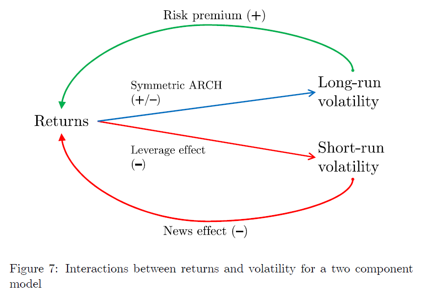

## Table of Contents

## What is the volatility effect in finance?

The volatility effect in finance refers to the observed pattern where stocks with higher volatility tend to deliver higher returns over time. This goes against the traditional financial theory, which suggests that higher risk should be compensated with higher returns, but not necessarily that all high-risk stocks will outperform the market. The volatility effect is interesting because it challenges the idea that investors are always rewarded for taking on more risk in a straightforward way.

In simple terms, if you look at a bunch of stocks, the ones that jump around a lot in price (high volatility) often end up doing better than the ones that stay pretty steady (low volatility). This might seem strange because you'd think that the wilder stocks would be riskier and thus might not always pay off. But, over time, these volatile stocks tend to give investors bigger rewards. This effect has been studied a lot, and it's one reason why some investors look for stocks that move a lot in price, hoping to benefit from this pattern.

## How does volatility affect investment returns?

Volatility can make your investment returns go up and down a lot. When a stock or an investment is volatile, it means its price can change a lot in a short time. This can be scary because you might see your money go down a lot quickly. But, if you hold on and don't sell when the price drops, you might see bigger gains when the price goes back up. That's because stocks with a lot of ups and downs often end up doing better over the long run, even if they are riskier.

On the other hand, if you need your money soon or get scared easily, high volatility can be bad for you. You might sell your investment when the price is low, which means you lose money. Also, if you keep buying and selling to try to time the market, you might end up losing more money because of fees and taxes. So, while volatility can lead to bigger returns, it's important to think about how much risk you can handle and how long you can wait for your investment to grow.

## What are the common causes of volatility in financial markets?

Volatility in financial markets can come from many things. One big reason is news and events. When something big happens, like a company announcing good or bad news, or a country having a big election, it can make stock prices jump around a lot. People might get scared or excited and start buying or selling quickly, which makes the market go up and down. Another reason is economic reports. If a report says the economy is doing well, people might buy more stocks, making prices go up fast. But if the report is bad, people might sell their stocks, making prices drop fast.

Another cause of volatility is changes in interest rates. When the interest rates go up or down, it can change how much people want to borrow or save money, which can affect stock prices. Also, the actions of big investors, like hedge funds or big banks, can make the market more volatile. If they buy or sell a lot of stocks at once, it can make prices move a lot. Sometimes, even rumors or social media can start a lot of buying or selling, making the market more volatile.

Lastly, there's something called market sentiment, which is how people feel about the market. If everyone is feeling good and confident, they might buy more, pushing prices up. But if everyone is worried or scared, they might sell more, pushing prices down. All these things together can make the market go through big ups and downs, which is what we call volatility.

## Can you explain the difference between historical and implied volatility?

Historical volatility is a measure of how much a stock's price has moved up and down in the past. It's like looking back at a stock's price history and figuring out how wild the ride has been. If a stock's price jumps around a lot over time, it has high historical volatility. If it stays pretty steady, it has low historical volatility. Investors use this information to understand how risky a stock might be based on what it did before.

Implied volatility, on the other hand, is about what people think might happen in the future. It's used a lot when people are buying and selling options, which are contracts that give you the right to buy or sell a stock at a certain price. Implied volatility is guessed from the price of these options. If people think a stock's price might jump around a lot soon, the implied volatility will be high. If they think it will stay calm, the implied volatility will be low. So, implied volatility is more about what might happen next, not what has already happened.

## How do investors measure volatility in the stock market?

Investors measure volatility in the stock market mainly by using something called standard deviation. This is a way to see how much a stock's price moves around over time. If a stock's price goes up and down a lot, it will have a high standard deviation, which means it's very volatile. If the price stays pretty steady, the standard deviation will be low, showing that the stock isn't very volatile. Investors look at the standard deviation of daily, weekly, or monthly returns to get a sense of how much risk they might be taking with a particular stock.

Another way to measure volatility is by using the VIX, which stands for the Volatility Index. The VIX is sometimes called the "fear gauge" because it shows how much volatility people expect in the stock market over the next 30 days. It's calculated using the prices of options on the S&P 500, which is a big group of stocks. If the VIX is high, it means people think the market might be jumpy and unpredictable soon. If it's low, people think the market will be calm. So, the VIX helps investors understand what other people are thinking about future market volatility.

## What role does the VIX index play in understanding market volatility?

The VIX index, also known as the Volatility Index, is a tool that helps investors understand how much the stock market might move around in the future. It's often called the "fear gauge" because it shows how worried or calm people are about what's going to happen in the market over the next 30 days. The VIX is calculated using the prices of options on the S&P 500, which is a big group of stocks. If the VIX is high, it means people think the market might be jumpy and unpredictable soon. If it's low, people think the market will be calm.

By keeping an eye on the VIX, investors can get a sense of what other people are thinking about future market volatility. This can be helpful for making decisions about when to buy or sell stocks. If the VIX is high, it might be a good time to be careful because big price swings could be coming. If the VIX is low, it might be a good time to feel more confident about investing because the market is expected to be more stable.

## How can investors use volatility to their advantage in trading strategies?

Investors can use volatility to their advantage by understanding that high volatility often means bigger price swings, which can create more chances to make money. One way to do this is by using options trading. Options let investors bet on whether a stock's price will go up or down without having to buy the stock itself. When volatility is high, options can become more valuable because there's a bigger chance the stock price will move a lot. So, investors can buy options when they think a stock will move a lot and sell them when the price does move, making a profit from the change.

Another way to use volatility is through a strategy called volatility trading. This means buying and selling investments that are affected by volatility, like the VIX or ETFs that track the VIX. When investors think volatility will go up, they can buy these investments, hoping to sell them later at a higher price. When they think volatility will go down, they can sell these investments or even bet against them, hoping to buy them back later at a lower price. By understanding and predicting changes in volatility, investors can make smart trades that take advantage of the ups and downs in the market.

## What are volatility ETFs and how do they work?

Volatility ETFs are exchange-traded funds that try to make money from changes in how much the stock market moves around. These ETFs usually follow the VIX, which is a number that shows how much people think the market will move in the next 30 days. When people think the market will be jumpy, the VIX goes up, and when they think it will be calm, the VIX goes down. So, volatility ETFs try to go up when the VIX goes up and go down when the VIX goes down.

These ETFs work by using special financial tools like futures and options. Futures and options are contracts that let investors bet on what will happen to the VIX in the future. By buying and selling these contracts, the ETFs can try to make money when the VIX changes. But it's important to know that volatility ETFs can be risky because they can lose money quickly if the market doesn't move the way people expect. So, they are usually used by investors who are okay with taking big risks and who understand how these ETFs work.

## How does the volatility effect influence portfolio diversification?

The volatility effect can make portfolio diversification more important and tricky at the same time. When you spread your money across different investments, you're trying to lower the risk that comes with big price swings in any single investment. If you have stocks with high volatility in your portfolio, they might go up and down a lot, but they could also give you bigger returns over time. By mixing these with less volatile investments, you can balance out the ups and downs, making your whole portfolio less risky while still aiming for good returns.

But, because high volatility stocks can jump around a lot, they can also make your portfolio more unpredictable. If all your high volatility stocks move in the same way at the same time, it might not help as much with diversification as you hoped. So, it's smart to pick high volatility stocks from different industries or types of companies. This way, if one type of stock goes down, another might go up, helping to keep your portfolio stable even when the market is wild.

## What are the psychological impacts of volatility on investor behavior?

Volatility can make investors feel scared or excited, which can change how they act with their money. When the market is jumping around a lot, some people might get scared and sell their investments quickly, even if it's not a good time to sell. This is called panic selling, and it can make people lose money because they sell when prices are low. On the other hand, some people might see the big price swings as a chance to make more money and start buying more, hoping to sell later at a higher price. But if they're not careful, they might buy when prices are too high and then lose money when the prices drop again.

These feelings can also make investors do things that aren't smart in the long run. For example, if someone keeps buying and selling to try to time the market, they might end up paying a lot in fees and taxes, which can eat into their profits. Also, if someone gets too excited about a stock because it's moving a lot, they might put too much money into it and not spread their investments around enough. This can make their whole portfolio riskier. So, it's important for investors to try to stay calm and stick to a plan, even when the market is going crazy.

## How do advanced statistical models predict and manage volatility?

Advanced statistical models help predict and manage volatility by looking at a lot of past data and finding patterns. These models use things like historical volatility, which is how much prices have moved around in the past, and implied volatility, which is what people think will happen in the future based on option prices. By putting all this information into a computer, the models can guess how much the market might move in the future. They use fancy math, like the GARCH model, to figure out how today's volatility might affect tomorrow's volatility. This helps investors get ready for big swings in the market and make smarter choices about when to buy or sell.

These models also help investors manage their portfolios better. By understanding how volatile the market might be, investors can decide how much risk they want to take. If the models predict high volatility, investors might choose to spread their money across different types of investments to lower their risk. They can also use options and other financial tools to protect their investments from big price swings. By using these advanced models, investors can feel more confident in their decisions and manage the ups and downs of the market more smoothly.

## What are some expert strategies for hedging against volatility risk?

One expert strategy for hedging against volatility risk is using options. Options are contracts that give you the right to buy or sell a stock at a certain price. If you think the market might get wild and prices might drop, you can buy a put option. This lets you sell your stock at a set price, even if the market price goes lower. It's like an insurance policy for your investments. If the market stays calm, you might lose the money you paid for the option, but if things get crazy, the put option can save you from big losses.

Another strategy is to use inverse ETFs. These are special funds that go up when the market goes down. If you think the market will be volatile and might drop, you can buy an inverse [ETF](/wiki/etf-trading-strategies) to balance out the losses in your other investments. It's like betting against the market. If you're right and the market does go down, the inverse ETF will go up, helping to protect your portfolio. But be careful, because if the market goes up instead, the inverse ETF will go down, and you could lose money.

A third way to hedge against volatility is through diversification. This means spreading your money across different types of investments, like stocks, bonds, and real estate. When the stock market gets volatile, other types of investments might not move as much. By having a mix of different investments, you can lower the overall risk in your portfolio. It's like not putting all your eggs in one basket. If one investment goes down because of volatility, another might stay steady or even go up, helping to keep your portfolio balanced.

## What is the key to understanding volatility in financial markets?

Volatility is a fundamental concept in financial markets, representing the degree of variation in the price of a financial instrument over time. It is a statistical measure often expressed as a percentage, indicating the extent to which the return of an asset deviates from its mean return. The greater the volatility, the wider the price swings observed over a given time frame.

### Measuring Volatility

Volatility can be quantified using various methods, each offering insight into different aspects of price movements:

1. **Standard Deviation**: This is the most common method, measuring the dispersion of a set of values from their mean. In finance, it is often used to quantify the historical volatility of a security.

$$
\sigma = \sqrt{\frac{1}{N-1} \sum_{i=1}^{N} (R_i - \bar{R})^2}
$$

   Here, $ R_i $ represents the return at time $ i $, $ \bar{R} $ is the mean return, and $ N $ is the total number of returns.

2. **Variance**: It is the square of the standard deviation and provides another indicator of risk associated with a security's price fluctuation.

3. **Volatility Indexes**: Tools like the VIX, which reflects market expectations of volatility, particularly in options pricing.

### Types of Volatility

Understanding the types of [volatility](/wiki/volatility-trading-strategies) is crucial for traders and investors, as each type conveys different information related to market dynamics:

- **Historical Volatility**: Also known as realized volatility, it measures past price movements over a specific period. It is backward-looking and provides a statistical view of how volatile a market or security has been.

- **Implied Volatility**: Extracted from options prices, it represents the market's forecast of a security's future volatility. Unlike historical volatility, implied volatility is forward-looking and is significantly influenced by market sentiment.

- **Realized Volatility**: Similar to historical volatility but often calculated over shorter, rolling time frames. It represents the actual volatility observed in the market over a recent period.

### Role of Volatility in Risk Management and Investment Decisions

Volatility plays a pivotal role in risk management and investment strategies, influencing decision-making processes across different market participants:

- **Risk Assessment**: Higher volatility signals higher risk, which can impact investment decisions. Portfolio managers may adjust their portfolios to mitigate risks associated with volatile instruments.

- **Pricing Models**: In options pricing, for instance, volatility is a critical input in models like Black-Scholes, affecting premium calculations.

- **Strategic Adjustments**: Traders may tailor their strategies based on volatility forecasts. High volatility might encourage strategies that capitalize on large price movements, while low volatility might favor stable, income-generating strategies.

Understanding and measuring volatility effectively allows traders and investors to make informed decisions that align with their risk tolerance and market expectations. It remains an indispensable element of financial analysis and strategic planning.

## References & Further Reading

[1]: Ang, A., Hodrick, R. J., Xing, Y., & Zhang, X. (2006). ["The Cross-Section of Volatility and Expected Returns."](https://onlinelibrary.wiley.com/doi/10.1111/j.1540-6261.2006.00836.x) The Review of Financial Studies, 19(1), 257-300.

[2]: Frazzini, A., & Pedersen, L. H. (2014). ["Betting Against Beta."](https://www.sciencedirect.com/science/article/pii/S0304405X13002675) Financial Analysts Journal, 70(1), 1-25.

[3]: Blitz, D., & Van Vliet, P. (2007). ["The Volatility Effect: Lower Risk Without Lower Return."](https://papers.ssrn.com/sol3/papers.cfm?abstract_id=980865) Journal of Portfolio Management, 34(1), 102-113.

[4]: Lo, A. W., & MacKinlay, A. C. (1999). ["A Non-Random Walk Down Wall Street"](https://www.amazon.com/Non-Random-Walk-Down-Wall-Street/dp/0691092567). Princeton University Press.

[5]: Bertsimas, D., & Lo, A. W. (1998). ["Optimal Control of Execution Costs."](https://www.mit.edu/~dbertsim/papers/Finance/Optimal%20control%20of%20execution%20costs.pdf) Journal of Financial Markets, 11(3), 62-70.

[6]: Johnson, B. (2010). ["Algorithmic Trading & DMA: An Introduction to Direct Access Trading Strategies."](https://www.amazon.com/Algorithmic-Trading-DMA-Introduction-Strategies/dp/0956399207) 4Myeloma Press.

[7]: Cartea, A., Jaimungal, S., & Penalva, J. (2015). ["Algorithmic and High-Frequency Trading."](https://www.amazon.com/Algorithmic-High-Frequency-Trading-Mathematics-Finance/dp/1107091144) Cambridge University Press.