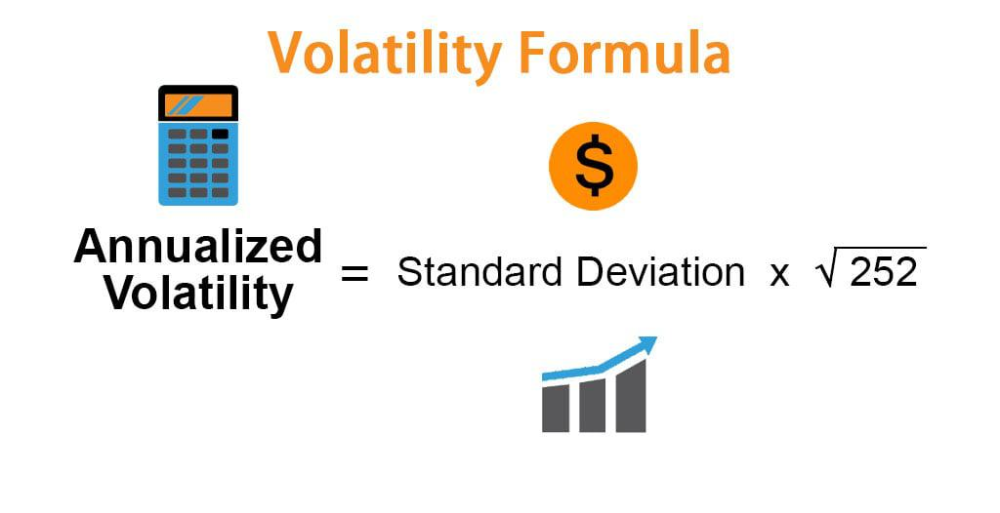

In the highly dynamic world of algorithmic trading, understanding market volatility is imperative for crafting effective trading strategies. Volatility refers to the degree of variation in the price of financial instruments over time and is a vital component for risk management. It measures the extent to which returns on an asset fluctuate, serving as an essential gauge of market uncertainty and investor sentiment. High volatility usually indicates a larger potential for erratic price changes, posing both opportunities and risks for traders.

This article provides an exploration of volatility estimation methods, their applications in algorithmic trading, and potential future trends. In algorithmic trading, where rapid decision-making and precision are critical, accurately measuring and predicting volatility aids in the creation of strategies that can withstand various market conditions. Different models help estimate volatility, emphasizing its importance in determining stop-loss levels, pricing derivatives, and optimizing portfolios to balance risk and return.

The importance of volatility is further underscored by its role in diverse trading strategies and tactics like volatility arbitrage and high-frequency trading, where minute price changes are exploited for profit. Embracing advanced analytical methods and understanding market behavior through volatility provide traders with the necessary tools to navigate financial markets effectively.

The field of volatility estimation is continually advancing, integrating emerging technologies such as machine learning and leveraging large datasets to enhance predictive capabilities. These developments are instrumental in shaping the future of algorithmic trading, enabling the development of robust trading strategies and enhancing risk management frameworks.

## Table of Contents

## Types of Volatility

Volatility can be categorized into several distinct types, each serving a specific purpose in financial analyses and trading strategies. These types are Historical Volatility, Implied Volatility, and Realized Volatility.

**Historical Volatility**

Historical Volatility is a statistical measure of the [dispersion](/wiki/dispersion-trading) of returns for a given security or market index over a defined period. It is grounded in past price data, often calculated using the standard deviation of price returns. Mathematically, if $P_t$ represents the price of a financial instrument at time $t$, the historical [volatility](/wiki/volatility-trading-strategies) over a period $n$ can be expressed as:

$$

\sigma = \sqrt{\frac{1}{n-1} \sum_{t=1}^{n} (r_t - \bar{r})^2} 
$$

where $r_t$ is the return at time $t$ and $\bar{r}$ is the average return over the period. Historical Volatility provides a retrospective view of price movement intensity, aiding in the evaluation of past market behaviors and the underlying asset's risk profile.

**Implied Volatility**

Implied Volatility is derived from the market prices of options and serves as a forward-looking measure, reflecting the market's expectations of future price volatility. It is extracted from an option's market price using option pricing models like the Black-Scholes model. Unlike Historical Volatility, which relies on historical data, Implied Volatility anticipates future fluctuations and is often considered a gauge of investor sentiment and market uncertainty. It is an essential component in options trading, influencing the pricing and valuation of options contracts.

**Realized Volatility**

Realized Volatility accounts for actual movements in the market, calculated using high-frequency intra-day data over a specific timeframe. This method captures the fine-grained oscillations in asset prices, providing an accurate reflection of market volatility over the observed period. Realized Volatility is integral to real-time risk management and is pivotal for strategies like high-frequency trading, as it empowers traders with insights into the current market landscape and price dynamics.

Collectively, these volatility categories equip traders and analysts with diverse tools for understanding price dynamics, managing investment risks, and developing informed trading strategies. Each type offers unique insights into market behavior, thus contributing to a comprehensive volatility assessment.

## Methods of Volatility Estimation

Volatility estimation is an essential aspect of [algorithmic trading](/wiki/algorithmic-trading), providing insights into the risk and potential price fluctuations of financial instruments. Various methods have been developed to estimate volatility, each with its strengths and weaknesses. This section outlines several prevalent techniques used in the financial industry. 

**Standard Deviation and Variance**

Standard deviation and variance are fundamental statistical measures used to quantify the dispersion of a set of data points. In the context of financial markets, these metrics are employed to gauge historical volatility. The standard deviation ($\sigma$) of asset returns is calculated as:

$$
\sigma = \sqrt{\frac{1}{N-1} \sum_{i=1}^{N} (R_i - \bar{R})^2}
$$

where $R_i$ denotes individual asset returns, $\bar{R}$ represents the mean return, and $N$ is the number of data points. Variance ($\sigma^2$) is simply the square of the standard deviation.

**Exponentially Weighted Moving Average (EWMA)**

The EWMA model enhances the basic moving average by assigning exponentially decaying weights to historical data. Recent observations are given more significance, allowing the model to adapt swiftly to market dynamics. The EWMA is defined as:

$$
\sigma_t^2 = \lambda \sigma_{t-1}^2 + (1 - \lambda) R_{t-1}^2
$$

where $\lambda$ ($0 < \lambda < 1$) is the smoothing parameter governing the decay rate, and $R_{t-1}$ is the return at time $t-1$.

**Generalized Autoregressive Conditional Heteroskedasticity (GARCH)**

GARCH models estimate volatility by expressing it as a function of past variances and squared returns. A basic GARCH(1,1) model is described by the equations:

$$
R_t = \mu + \epsilon_t
$$
$$
\epsilon_t = \sigma_t z_t
$$
$$
\sigma_t^2 = \alpha_0 + \alpha_1 \epsilon_{t-1}^2 + \beta_1 \sigma_{t-1}^2
$$

Here, $\mu$ is the expected return, $z_t$ is a standard normal random variable, and $\alpha_0$, $\alpha_1$, and $\beta_1$ are parameters that require estimation.

**Stochastic Volatility Models**

These models conceptualize volatility as evolving dynamically according to stochastic processes, rather than deterministically. Stochastic Volatility (SV) models can capture complex patterns in financial data that fixed-parameter models may miss. A common representation is:

$$
R_t = \mu + \sigma_t \epsilon_t
$$
$$
\log(\sigma^2_t) = \alpha + \beta \log(\sigma^2_{t-1}) + \eta_t
$$

where $\eta_t$ is a random shock with a normal distribution.

**Volatility Indexes**

The Volatility Index (VIX) is a widely referenced metric representing market expectations for future volatility, often derived from options pricing. It provides insights into investor sentiment and potential market movements, serving as a barometer for market stability.

These methods collectively provide a robust toolkit for estimating volatility, each with unique attributes suited to different market scenarios and requirements in algorithmic trading.

## Practical Applications in Algorithmic Trading

Volatility estimation plays a pivotal role in algorithmic trading, serving as a critical tool for risk management and strategic decision-making. In risk management, understanding and accurately estimating volatility are central to determining appropriate stop-loss levels and position sizes, thereby minimizing potential losses. By gauging the degree of price variation, traders can adjust their exposure to align with their risk tolerance and market conditions.

In derivatives trading, accurate volatility estimation is essential for pricing and hedging strategies. The pricing models for options and derivatives heavily rely on volatility inputs to determine fair values. For instance, the Black-Scholes model, a widely used option pricing model, incorporates volatility to compute option premiums. An incorrect volatility estimate can lead to mispricing, resulting in financial losses.

Volatility Arbitrage is a strategy that exploits disparities between implied volatility—derived from options pricing—and historical volatility. Traders engaging in this approach capitalize on the belief that the market's expectation of future volatility deviates from actual historical trends. By systematically identifying and exploiting these discrepancies, traders can generate significant returns while managing risk effectively.

Portfolio optimization benefits from volatility estimation as it seeks an optimal balance between risk and return. By incorporating volatility metrics, portfolio managers can allocate assets in a way that maximizes expected returns for a given level of risk. The process often involves the use of mean-variance optimization, where the expected volatility influences the diversification of the portfolio.

High-Frequency Trading ([HFT](/wiki/high-frequency-trading-strategies)) utilizes real-time volatility estimates to exploit micro-level market inefficiencies. In HFT, where trades are executed in fractions of a second, precise volatility measurements enable traders to make informed decisions swiftly. By reacting to volatility changes, HFT algorithms can capitalize on short-term price movements, thereby securing profits from small inconsistencies in market pricing.

Overall, volatility estimation is a cornerstone of algorithmic trading strategy, driving key decisions across various trading activities. By leveraging accurate volatility data, traders can enhance risk management, improve pricing models, and achieve superior returns in both traditional and high-frequency trading environments.

## Challenges in Volatility Estimation

In the sphere of volatility estimation, the accuracy and reliability of the results are paramount, with several challenges underpinning this endeavor. A critical [factor](/wiki/factor-investing) is data quality and frequency, as inaccuracies or inconsistencies in data can significantly skew volatility estimates, leading to potentially flawed risk assessments and trading decisions. High-frequency financial markets require precise, granular data to accurately capture short-term variations in price movements. Consequently, the slightest data error or lag can propagate significant errors in volatility calculations.

Model selection and calibration also present substantial challenges. Given the multiplicity of volatility estimation models—from standard deviation methods to complex GARCH models—choosing the appropriate model that aligns with current market conditions necessitates rigorous analysis. Calibration is equally complex, as it involves adjusting model parameters based on historical data to ensure predictive accuracy. A poorly calibrated model might fail to adapt to sudden market shifts, resulting in substantial forecasting errors.

Volatility frequently varies across different market regimes, characterized by changes in economic conditions, geopolitical developments, or market sentiment. Accurately estimating volatility across these regimes is complex, requiring models that can dynamically adapt to evolving market landscapes. Traditional models may fail to capture these shifts, necessitating advanced techniques that incorporate regime-switching elements or [machine learning](/wiki/machine-learning) approaches to improve adaptability and estimation accuracy.

Another significant challenge is the quantification of model risk. Since models are simplifications of reality, they inherently [carry](/wiki/carry-trading) the risk of incorrect assumptions or parameters, which can lead to substantial financial risks. Assessing the extent of this risk is crucial, as model errors can compound losses, particularly in volatile markets. Quantifying and mitigating model risk involves continuous evaluation and testing against out-of-sample data.

Leverage and derivatives add further complexity, magnifying the impacts of volatility on financial positions. Leverage amplifies both potential returns and losses, with heightened sensitivity to volatility changes. Similarly, derivatives—such as options and futures—rely heavily on volatility estimates for pricing and risk management. Consequently, sophisticated estimation techniques are necessary to manage these robust financial instruments effectively, ensuring adequate margin requirements and minimizing exposure to adverse market movements.

Collectively, these challenges underscore the necessity for robust models and high-quality data in volatility estimation, central to effective risk management and trading strategy development. Advanced computational methods and continuous refinement of estimation techniques are vital for addressing these complexities, ensuring resilience in the face of market volatility.

## Future Trends in Volatility Estimation

Machine Learning (ML) and Artificial Intelligence (AI) are becoming increasingly essential in identifying complex patterns within volatility data. These technologies use algorithms capable of processing vast amounts of data quickly, generating more accurate volatility forecasts. Machine learning models, such as neural networks and support vector machines, are adept at capturing non-linear relationships in financial data, which traditional statistical models might overlook. AI techniques allow for the extraction of subtle underlying patterns, improving predictive performance.

Big Data and Alternative Data sources, like social media sentiment analysis, are enhancing the accuracy of volatility predictions. The immense [volume](/wiki/volume-trading-strategy) and variety of data available today empower traders to consider factors beyond traditional financial metrics. Sentiment analysis, utilizing natural language processing, extracts sentiments from textual data, providing insights into market mood and potential volatility triggers. These data troves enhance the robustness of volatility models by incorporating information that reflects investor behavior and market sentiment.

Real-Time and Adaptive Models are advancing, enabling dynamic adjustments to volatility estimates in response to current market conditions. These models employ techniques such as adaptive filtering and Bayesian inference to refine their predictions continuously as new data arrive. By doing so, traders can respond to market changes with greater agility, maintaining the accuracy and reliability of volatility predictions over time.

The integration of High-Performance Computing (HPC) facilitates the swift processing and analysis of large-scale data sets necessary for real-time volatility estimation. HPC technologies enable complex calculations to be executed rapidly, making it possible to handle the increasing volume, velocity, and variety of data in financial markets. This computational power supports the deployment of sophisticated models with high-frequency data, ensuring timely updates to volatility forecasts.

Regulatory and Ethical considerations will increasingly influence how volatility estimation methodologies develop and impact the market. As algorithmic trading and AI-powered models become more pervasive, regulatory frameworks will need to adapt to ensure fair and transparent market practices. Ethical concerns, such as data privacy and the potential for bias in AI algorithms, will also shape the future landscape of volatility estimation. Ensuring that these methods are used responsibly and equitably will be crucial in maintaining the integrity and stability of financial markets. 

Overall, these trends indicate a significant shift towards more sophisticated and responsive volatility estimation methods, driven by technological advancements and innovative data analysis techniques.

## Conclusion

Volatility estimation is essential in algorithmic trading, serving as a foundation for crafting effective trading strategies and managing risks. The accurate estimation of market volatility is a complex task, demanding sophisticated techniques that consider the unpredictable nature of financial markets. With volatility being a significant determinant of option pricing, risk assessment, and portfolio management, traders rely heavily on robust models to anticipate market movements and protect against potential losses.

The field of volatility estimation is rapidly evolving, bolstered by the integration of advanced technologies. Machine learning and [artificial intelligence](/wiki/ai-artificial-intelligence) are at the forefront of this evolution, offering new capabilities to analyze large volumes of data and detect intricate patterns. As these technologies advance, their application in volatility estimation is expected to enhance accuracy and reliability, enabling traders to react swiftly to market changes.

Moreover, the incorporation of big data and [alternative data](/wiki/best-alternative-data) sources, such as social media sentiment and economic indicators, provides additional layers of information for volatility forecasting. By leveraging these diverse datasets, traders can gain a comprehensive view of market dynamics, leading to more informed decision-making.

As real-time and adaptive models become more sophisticated, they will further contribute to the precision of volatility estimates. The capability to process and analyze data swiftly through high-performance computing is crucial in high-frequency trading environments, where rapid adaptation to market fluctuations is necessary.

Furthermore, the evolving regulatory landscape and ethical considerations surrounding data usage will shape the future methodologies employed in volatility estimation. Ensuring compliance while maintaining transparency and fairness will be vital as technologies continue to advance.

Overall, the ongoing advancements in technology and data accessibility are set to equip traders with more sophisticated tools, enhancing their ability to navigate the complexities of financial markets with greater confidence and precision. As these developments unfold, the role of volatility estimation will remain pivotal in guiding trading strategies and managing risks effectively.

## References & Further Reading

[1]: Poon, S.-H., & Granger, C. W. J. (2003). ["Forecasting Volatility in Financial Markets: A Review."](https://www.aeaweb.org/articles?id=10.1257/002205103765762743) Journal of Economic Literature, 41(2), 478–539.

[2]: Hull, J. C. (2014). ["Options, Futures, and Other Derivatives."](https://elibrary.pearson.de/book/99.150005/9781292410623) Pearson Education.

[3]: Engle, R. F. (1982). ["Autoregressive Conditional Heteroscedasticity with Estimates of the Variance of United Kingdom Inflation."](https://www.jstor.org/stable/1912773) Econometrica, 50(4), 987–1007.

[4]: Bollerslev, T. (1986). ["Generalized Autoregressive Conditional Heteroskedasticity."](https://www.sciencedirect.com/science/article/pii/0304407686900631) Journal of Econometrics, 31(3), 307–327. 

[5]: Black, F., & Scholes, M. (1973). ["The Pricing of Options and Corporate Liabilities."](https://www.cs.princeton.edu/courses/archive/fall09/cos323/papers/black_scholes73.pdf) Journal of Political Economy, 81(3), 637–654.

[6]: Lopez de Prado, M. (2018). ["Advances in Financial Machine Learning."](https://www.amazon.com/Advances-Financial-Machine-Learning-Marcos/dp/1119482089) Wiley.

[7]: Jorion, P. (2007). ["Value at Risk: The New Benchmark for Managing Financial Risk."](https://link.springer.com/article/10.1007/s11408-007-0057-3) McGraw-Hill.

[8]: Ciliberti, S., Vinay Mahato, G., & Barrett, L. (2021). ["Machine Learning for Financial Market Volatility Forecasting."](https://papers.ssrn.com/sol3/papers.cfm?abstract_id=3766999) arXiv:2112.07845.

[9]: Litterman, R., & Scheinkman, J. (1991). ["Common Factors Affecting Bond Returns."](https://www.scirp.org/reference/ReferencesPapers?ReferenceID=1556070) Journal of Fixed Income, 1(1), 54-61.