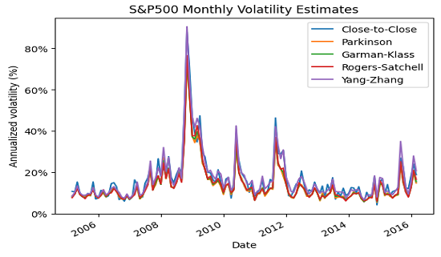

## Table of Contents

## What is volatility in the context of finance?

Volatility in finance refers to how much and how quickly the price of an asset, like a stock or a cryptocurrency, changes over time. If an asset's price moves up and down a lot in a short period, it is considered to have high volatility. On the other hand, if the price stays pretty steady without big swings, it has low volatility. Investors and traders pay close attention to volatility because it helps them understand the risk involved in buying or holding an asset.

Understanding volatility is important for making investment decisions. High volatility can mean more risk, but it can also mean more chances to make money if you know how to handle it. For example, day traders often look for highly volatile stocks because they can buy low and sell high within a short time. On the other hand, people saving for retirement might prefer less volatile investments, like bonds, to keep their money safe and steady over time. By knowing an asset's volatility, investors can better plan their strategies and manage their portfolios.

## Why is volatility estimation important for investors?

Volatility estimation is important for investors because it helps them understand how risky an investment might be. When investors know how much an asset's price might go up or down, they can make better decisions about whether to buy, sell, or hold onto it. For example, if an investor sees that a stock has been very volatile recently, they might decide it's too risky for their portfolio, or they might see it as a chance to make money if they think the price will go back up.

Also, knowing the volatility helps investors set the right expectations. If they expect a stock to be stable but it turns out to be very volatile, they might be surprised and make quick, bad decisions. By understanding volatility, investors can plan their moves better and not be caught off guard by big price swings. This can lead to more successful investing over time.

## What are the basic methods for estimating volatility?

One simple way to estimate volatility is by looking at historical data. This means checking how much the price of an asset has moved up and down in the past. You can use a tool called standard deviation to measure this. Standard deviation tells you how spread out the prices are from the average price. If the standard deviation is high, it means the price has been moving a lot, so the asset is more volatile. If it's low, the price has been pretty steady, so the asset is less volatile. This method is easy to use because you just need past price data, but it assumes the future will be like the past, which isn't always true.

Another way to estimate volatility is by using something called implied volatility. This method looks at the prices of options, which are contracts that give you the right to buy or sell an asset at a certain price. The price of an option can tell you how much the market thinks the asset's price will move in the future. If people are willing to pay a lot for an option, it means they think the asset's price will move a lot, so the implied volatility is high. If they're not willing to pay much, the implied volatility is low. This method can be more accurate because it's based on what people think will happen, not just what has happened, but it's a bit more complex to figure out.

Both methods have their pros and cons, and investors often use them together to get a better idea of an asset's volatility. Historical volatility gives you a look at what has happened, while implied volatility gives you a sense of what might happen. By combining these two, investors can make smarter decisions about their investments and manage their risk better.

## How does historical volatility differ from implied volatility?

Historical volatility looks at how much an asset's price has moved up and down in the past. It uses old price data to figure out how much the price changed over a certain time, like a month or a year. This is often measured with something called standard deviation, which tells you how spread out the prices are from the average price. If the standard deviation is high, it means the price has been moving a lot, so the asset has been more volatile. Historical volatility is easy to calculate because you just need past data, but it assumes that what happened before will happen again, which might not always be true.

Implied volatility, on the other hand, looks at what the market thinks will happen to the asset's price in the future. It's figured out by looking at the prices of options, which are contracts that let you buy or sell an asset at a certain price. If people are willing to pay a lot for an option, it means they think the asset's price will move a lot, so the implied volatility is high. If they're not willing to pay much, the implied volatility is low. This method can be more accurate because it's based on what people expect to happen, not just what has happened, but it's a bit harder to calculate.

Both historical and implied volatility are important for investors. Historical volatility gives you a look at the past, while implied volatility gives you a sense of what might happen in the future. By using both, investors can get a fuller picture of an asset's risk and make better decisions about their investments.

## What is the role of the standard deviation in volatility estimation?

Standard deviation is a key tool in figuring out how volatile an asset is. It measures how spread out the prices of an asset are from its average price. If the prices are all over the place, with big jumps up and down, the standard deviation will be high. This means the asset is very volatile. On the other hand, if the prices stay pretty close to the average, the standard deviation will be low, showing that the asset is not very volatile. By using standard deviation, investors can get a clear picture of how much an asset's price might change in the future based on what it did in the past.

Using standard deviation for historical volatility is simple because it only needs past price data. You look at how much the price moved over a certain time, like a month or a year, and calculate the standard deviation from that. This helps investors understand the risk of an asset by showing how much its price has moved around. However, standard deviation only tells you about the past, so it assumes the future will be the same. This might not always be true, but it's still a useful way to start understanding an asset's volatility.

## Can you explain the concept of volatility clustering?

Volatility clustering is when big price changes in an asset happen close together in time. Imagine a stock that's been pretty calm, with small price moves every day. Then, all of a sudden, it starts having big jumps up and down. Once these big jumps start, they tend to keep happening for a while before things calm down again. This pattern, where high volatility periods are followed by more high volatility periods, is what we call volatility clustering.

This idea is important because it helps investors understand that just because an asset has been calm doesn't mean it will stay that way. If they see a few big price changes, they might expect more to come soon. This can help them make better decisions about when to buy or sell, or how much risk they're willing to take. By knowing about volatility clustering, investors can be ready for those times when the market gets really wild.

## How do GARCH models work in estimating volatility?

GARCH models, which stands for Generalized Autoregressive Conditional Heteroskedasticity, are a way to estimate how much an asset's price might move in the future. They work by looking at how the price has moved in the past and using that to predict future movements. GARCH models are good at capturing something called volatility clustering, where big price changes tend to happen close together. So, if a stock has had a few big jumps recently, a GARCH model might predict that more big jumps are coming soon.

These models have two main parts: the autoregressive part and the moving average part. The autoregressive part looks at how past volatility affects future volatility. For example, if a stock was very volatile last week, it might be more likely to be volatile this week too. The moving average part looks at the average of past errors, or how much the actual price moved compared to what the model predicted. By combining these two parts, GARCH models can give a more accurate picture of what might happen next, helping investors plan their moves better.

## What are the limitations of using simple moving averages for volatility estimation?

Using simple moving averages for estimating volatility has some problems. A simple moving average looks at the average price of an asset over a set time, like the last 20 days. But this method doesn't really show how much the price is moving around. It just gives you an average, so you might miss out on seeing the big ups and downs that show how volatile an asset really is. For example, if a stock's price jumps up and down a lot but ends up at the same average price, a simple moving average won't show that volatility.

Another issue is that simple moving averages treat all days the same. They don't care if the price moved a lot one day and stayed still the next. This can make it hard to see patterns like volatility clustering, where big price changes happen close together. Because of this, simple moving averages might not give you a full picture of an asset's risk. Investors who only use this method might be surprised by sudden big price swings, which could lead to bad decisions.

## How does the Exponential Weighted Moving Average (EWMA) method improve volatility estimates?

The Exponential Weighted Moving Average (EWMA) method is a better way to estimate volatility because it pays more attention to recent price changes. Unlike simple moving averages, which treat all days the same, EWMA gives more weight to what happened lately. This means if a stock's price has been jumping around a lot recently, the EWMA will show that more clearly. By focusing on the latest data, EWMA can help investors see when volatility is picking up or calming down faster than a simple moving average would.

This method also helps catch patterns like volatility clustering, where big price changes happen close together. Because EWMA reacts quickly to new information, it can show these patterns more clearly. This makes it easier for investors to understand how risky an asset might be right now and in the near future. By using EWMA, investors can make smarter decisions and be more prepared for sudden changes in the market.

## What advanced techniques exist for forecasting volatility, such as stochastic volatility models?

Stochastic volatility models are another way to forecast how much an asset's price might move in the future. These models say that the volatility of an asset changes over time and that these changes can be random. Instead of assuming that volatility stays the same or follows a simple pattern, stochastic volatility models let it jump around. This makes them good at capturing the ups and downs of the market, like when things get really wild and then calm down again. By using these models, investors can get a better idea of how much an asset's price might move, which helps them plan their investments better.

Another advanced technique is using machine learning to predict volatility. Machine learning can look at a lot of different things at once, like past prices, news, and even social media, to figure out how volatile an asset might be. These models can learn from the data and get better over time, which means they might be able to spot patterns that other methods miss. This can be really helpful for investors because it gives them a more complete picture of what might happen next. By using machine learning, investors can make smarter decisions and be more ready for changes in the market.

## How can machine learning be applied to enhance volatility estimation?

Machine learning can help estimate how much an asset's price might move by looking at lots of different information at the same time. It can use past prices, news, and even social media to figure out how volatile an asset might be. These models can learn from the data and get better over time, which means they might be able to spot patterns that other methods miss. For example, if there's a lot of talk on social media about a stock, machine learning can use that to predict if the stock's price might start moving a lot. By looking at all this information together, machine learning can give investors a more complete picture of what might happen next.

Using machine learning for volatility estimation can be really helpful for investors because it helps them make smarter decisions. It can pick up on things like when people start talking a lot about a stock on social media or when there's big news that might affect the market. By seeing these patterns, investors can be more ready for changes in the market and plan their moves better. This can lead to better investing and help investors manage their risk more effectively.

## What are the current research trends and future directions in volatility estimation?

Current research in volatility estimation is focusing a lot on using new technologies like machine learning and artificial intelligence. These methods can look at tons of data from different places, like news, social media, and past prices, all at once. This helps them find patterns that older methods might miss. For example, researchers are working on models that can learn from data over time and get better at predicting how much an asset's price might move. They're also trying to figure out how to use things like sentiment analysis, which looks at what people are saying online, to see if it can help predict volatility.

Looking ahead, the future of volatility estimation might involve even more advanced technology. One big area is combining different types of data, like financial data with non-financial data, to get a fuller picture of what's happening in the market. Researchers are also interested in real-time volatility estimation, which means figuring out how much an asset's price might move right now, not just in the future. This could help investors make quicker decisions. Overall, the goal is to make volatility estimation more accurate and useful for investors, so they can better manage their risks and make smarter choices.

## What are the types of volatility?

Volatility can be categorized into several distinct types, each serving a specific purpose in financial analyses and trading strategies. These types are Historical Volatility, Implied Volatility, and Realized Volatility.

**Historical Volatility**

Historical Volatility is a statistical measure of the [dispersion](/wiki/dispersion-trading) of returns for a given security or market index over a defined period. It is grounded in past price data, often calculated using the standard deviation of price returns. Mathematically, if $P_t$ represents the price of a financial instrument at time $t$, the historical [volatility](/wiki/volatility-trading-strategies) over a period $n$ can be expressed as:

$$

\sigma = \sqrt{\frac{1}{n-1} \sum_{t=1}^{n} (r_t - \bar{r})^2} 
$$

where $r_t$ is the return at time $t$ and $\bar{r}$ is the average return over the period. Historical Volatility provides a retrospective view of price movement intensity, aiding in the evaluation of past market behaviors and the underlying asset's risk profile.

**Implied Volatility**

Implied Volatility is derived from the market prices of options and serves as a forward-looking measure, reflecting the market's expectations of future price volatility. It is extracted from an option's market price using option pricing models like the Black-Scholes model. Unlike Historical Volatility, which relies on historical data, Implied Volatility anticipates future fluctuations and is often considered a gauge of investor sentiment and market uncertainty. It is an essential component in options trading, influencing the pricing and valuation of options contracts.

**Realized Volatility**

Realized Volatility accounts for actual movements in the market, calculated using high-frequency intra-day data over a specific timeframe. This method captures the fine-grained oscillations in asset prices, providing an accurate reflection of market volatility over the observed period. Realized Volatility is integral to real-time risk management and is pivotal for strategies like high-frequency trading, as it empowers traders with insights into the current market landscape and price dynamics.

Collectively, these volatility categories equip traders and analysts with diverse tools for understanding price dynamics, managing investment risks, and developing informed trading strategies. Each type offers unique insights into market behavior, thus contributing to a comprehensive volatility assessment.

## What are the methods of volatility estimation?

Volatility estimation is an essential aspect of [algorithmic trading](/wiki/algorithmic-trading), providing insights into the risk and potential price fluctuations of financial instruments. Various methods have been developed to estimate volatility, each with its strengths and weaknesses. This section outlines several prevalent techniques used in the financial industry. 

**Standard Deviation and Variance**

Standard deviation and variance are fundamental statistical measures used to quantify the dispersion of a set of data points. In the context of financial markets, these metrics are employed to gauge historical volatility. The standard deviation ($\sigma$) of asset returns is calculated as:

$$
\sigma = \sqrt{\frac{1}{N-1} \sum_{i=1}^{N} (R_i - \bar{R})^2}
$$

where $R_i$ denotes individual asset returns, $\bar{R}$ represents the mean return, and $N$ is the number of data points. Variance ($\sigma^2$) is simply the square of the standard deviation.

**Exponentially Weighted Moving Average (EWMA)**

The EWMA model enhances the basic moving average by assigning exponentially decaying weights to historical data. Recent observations are given more significance, allowing the model to adapt swiftly to market dynamics. The EWMA is defined as:

$$
\sigma_t^2 = \lambda \sigma_{t-1}^2 + (1 - \lambda) R_{t-1}^2
$$

where $\lambda$ ($0 < \lambda < 1$) is the smoothing parameter governing the decay rate, and $R_{t-1}$ is the return at time $t-1$.

**Generalized Autoregressive Conditional Heteroskedasticity (GARCH)**

GARCH models estimate volatility by expressing it as a function of past variances and squared returns. A basic GARCH(1,1) model is described by the equations:

$$
R_t = \mu + \epsilon_t
$$
$$
\epsilon_t = \sigma_t z_t
$$
$$
\sigma_t^2 = \alpha_0 + \alpha_1 \epsilon_{t-1}^2 + \beta_1 \sigma_{t-1}^2
$$

Here, $\mu$ is the expected return, $z_t$ is a standard normal random variable, and $\alpha_0$, $\alpha_1$, and $\beta_1$ are parameters that require estimation.

**Stochastic Volatility Models**

These models conceptualize volatility as evolving dynamically according to stochastic processes, rather than deterministically. Stochastic Volatility (SV) models can capture complex patterns in financial data that fixed-parameter models may miss. A common representation is:

$$
R_t = \mu + \sigma_t \epsilon_t
$$
$$
\log(\sigma^2_t) = \alpha + \beta \log(\sigma^2_{t-1}) + \eta_t
$$

where $\eta_t$ is a random shock with a normal distribution.

**Volatility Indexes**

The Volatility Index (VIX) is a widely referenced metric representing market expectations for future volatility, often derived from options pricing. It provides insights into investor sentiment and potential market movements, serving as a barometer for market stability.

These methods collectively provide a robust toolkit for estimating volatility, each with unique attributes suited to different market scenarios and requirements in algorithmic trading.

## References & Further Reading

[1]: Poon, S.-H., & Granger, C. W. J. (2003). ["Forecasting Volatility in Financial Markets: A Review."](https://www.aeaweb.org/articles?id=10.1257/002205103765762743) Journal of Economic Literature, 41(2), 478–539.

[2]: Hull, J. C. (2014). ["Options, Futures, and Other Derivatives."](https://elibrary.pearson.de/book/99.150005/9781292410623) Pearson Education.

[3]: Engle, R. F. (1982). ["Autoregressive Conditional Heteroscedasticity with Estimates of the Variance of United Kingdom Inflation."](https://www.jstor.org/stable/1912773) Econometrica, 50(4), 987–1007.

[4]: Bollerslev, T. (1986). ["Generalized Autoregressive Conditional Heteroskedasticity."](https://www.sciencedirect.com/science/article/pii/0304407686900631) Journal of Econometrics, 31(3), 307–327. 

[5]: Black, F., & Scholes, M. (1973). ["The Pricing of Options and Corporate Liabilities."](https://www.cs.princeton.edu/courses/archive/fall09/cos323/papers/black_scholes73.pdf) Journal of Political Economy, 81(3), 637–654.

[6]: Lopez de Prado, M. (2018). ["Advances in Financial Machine Learning."](https://www.amazon.com/Advances-Financial-Machine-Learning-Marcos/dp/1119482089) Wiley.

[7]: Jorion, P. (2007). ["Value at Risk: The New Benchmark for Managing Financial Risk."](https://link.springer.com/article/10.1007/s11408-007-0057-3) McGraw-Hill.

[8]: Ciliberti, S., Vinay Mahato, G., & Barrett, L. (2021). ["Machine Learning for Financial Market Volatility Forecasting."](https://papers.ssrn.com/sol3/papers.cfm?abstract_id=3766999) arXiv:2112.07845.

[9]: Litterman, R., & Scheinkman, J. (1991). ["Common Factors Affecting Bond Returns."](https://www.scirp.org/reference/ReferencesPapers?ReferenceID=1556070) Journal of Fixed Income, 1(1), 54-61.