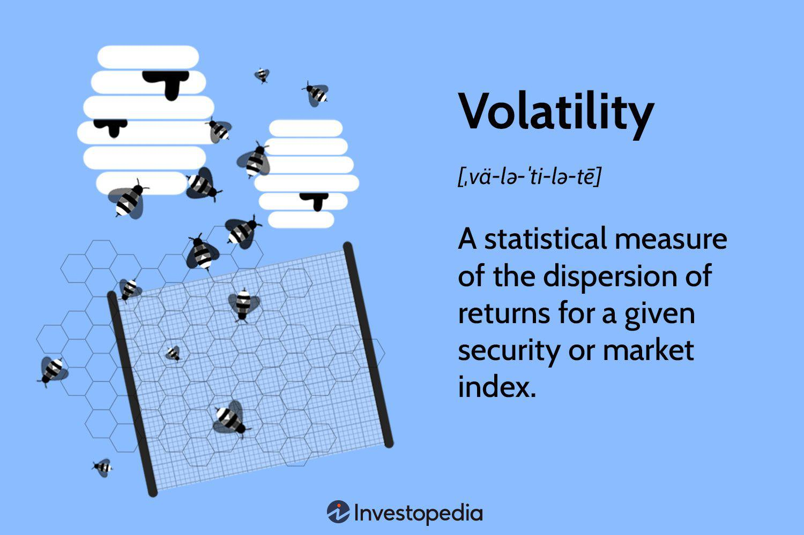

## Table of Contents

## What is volatility in the context of finance and stock markets?

Volatility in finance and stock markets refers to how much and how quickly the price of a stock or an investment changes over time. If a stock's price goes up and down a lot in a short period, it is considered to have high volatility. On the other hand, if the price stays pretty much the same, it has low volatility. Volatility is important because it helps investors understand the risk involved in buying a particular stock or investment. High volatility means there's a bigger chance that the price could drop suddenly, which might not be good for someone who doesn't like taking risks.

Volatility can be measured in different ways, but one common method is by looking at the standard deviation of the stock's returns. This gives investors an idea of how spread out the returns are from the average. Another popular measure is the Volatility Index (VIX), often called the "fear index," which predicts the stock market's volatility over the next 30 days. Understanding volatility helps investors make better decisions about when to buy or sell stocks, and how to manage their portfolios to balance risk and reward.

## How is volatility measured in financial markets?

Volatility in financial markets is measured using different methods, but one common way is by calculating the standard deviation of a stock's returns. This tells us how much the stock's price moves around its average price. If the standard deviation is high, it means the stock's price can change a lot, making it more volatile. If it's low, the stock's price doesn't change much, so it's less volatile. Investors use this information to understand how risky a stock might be.

Another popular way to measure volatility is by using the Volatility Index, or VIX, which is often called the "fear index." The VIX looks at the prices of options on the S&P 500 to predict how much the stock market might move in the next 30 days. When the VIX is high, it means investors expect big changes in the market, which can be a sign of fear or uncertainty. When it's low, it suggests the market is expected to be calm. The VIX helps investors see what the market might do next and plan their investments accordingly.

## What are the common indicators used to assess market volatility?

One common indicator used to assess market volatility is the standard deviation of a stock's returns. This measure shows how much the price of a stock changes over time compared to its average price. If the standard deviation is high, it means the stock's price can move a lot in either direction, making it more volatile. If it's low, the price doesn't change much, so the stock is less volatile. Investors use this information to gauge how risky a stock might be and to decide if it fits their investment strategy.

Another widely used indicator is the Volatility Index, or VIX, which is often called the "fear index." The VIX looks at the prices of options on the S&P 500 to predict how much the stock market might move in the next 30 days. When the VIX is high, it suggests that investors expect big changes in the market, which can be a sign of fear or uncertainty. When the VIX is low, it means the market is expected to be more stable. This helps investors understand market sentiment and make more informed decisions about their investments.

## Can you explain the difference between historical and implied volatility?

Historical volatility, also known as realized volatility, is a measure of how much a stock's price has actually moved in the past. It's calculated by looking at the past prices of a stock and figuring out how much those prices have changed over a certain period, like a month or a year. If a stock's price went up and down a lot in the past, it has high historical volatility. This helps investors understand how risky a stock has been and can give them an idea of what to expect in the future, though past performance doesn't guarantee future results.

Implied volatility, on the other hand, is a measure of how much investors think a stock's price might move in the future. It's not based on past prices but on the prices of options, which are contracts that give the buyer the right to buy or sell a stock at a set price. When people buy options, they're betting on how much the stock's price will change. If they think the price will move a lot, they'll pay more for the option, which increases the implied volatility. This helps investors see what the market expects to happen next and can be useful for making investment decisions.

## How does volatility impact investment strategies?

Volatility impacts investment strategies a lot because it shows how much risk is involved. If a stock has high volatility, it means its price can go up and down a lot in a short time. This can be good for investors who like taking risks and want to make quick profits. They might choose to buy and sell stocks more often, trying to take advantage of the big price changes. But for people who don't like risk, high volatility can be scary because their money could lose value quickly. So, they might choose to invest in stocks with lower volatility, which are usually more stable and less likely to change a lot.

Understanding volatility also helps investors decide how to spread out their investments. If they expect the market to be very volatile, they might choose to put their money in different types of investments, like stocks, bonds, and commodities, to balance out the risk. This way, if one investment goes down because of high volatility, the others might stay stable or even go up. On the other hand, if the market is expected to be calm, they might focus more on stocks with lower volatility to grow their money slowly and steadily. By paying attention to volatility, investors can make smarter choices about where to put their money and how to manage their portfolios.

## What role does volatility play in option pricing?

Volatility is really important when it comes to figuring out how much an option should cost. An option is like a bet on whether a stock's price will go up or down. If a stock's price is expected to move a lot, then the option will be more expensive. This is because there's a bigger chance the option will pay off if the stock's price changes a lot. So, when people talk about implied volatility, they're talking about how much they think the stock's price will move in the future, which directly affects the price of the option.

For example, if a stock is expected to be very volatile, the option's price will be higher because there's a bigger chance it will end up being worth something. On the other hand, if a stock is expected to be calm and not change much, the option's price will be lower because it's less likely to pay off. This is why options traders pay close attention to volatility – it helps them decide if an option is a good deal or not. By understanding how volatility affects option prices, investors can make smarter choices about buying and selling options.

## How can investors use volatility to their advantage?

Investors can use volatility to their advantage by understanding how much a stock's price might change. If a stock is very volatile, its price can go up and down a lot in a short time. Some investors like this because they can buy the stock when its price is low and sell it when it goes up, making a quick profit. This strategy is called trading, and it works well for people who are good at guessing which way the stock's price will move next. By keeping an eye on volatility, these investors can find the best times to buy and sell.

Another way to use volatility is by spreading out investments, which is called diversification. If an investor thinks the market will be very volatile, they can put their money into different types of investments, like stocks, bonds, and commodities. This way, if one investment goes down because of high volatility, the others might stay the same or even go up, balancing out the risk. By understanding and using volatility, investors can make smarter choices about where to put their money and how to manage their portfolios to get the best results.

## What are volatility trading strategies and how do they work?

Volatility trading strategies are ways for investors to make money by betting on how much a stock's price will move, not just which way it will go. One popular strategy is called straddling. In this strategy, an investor buys both a call option and a put option on the same stock at the same time. A call option lets them buy the stock at a set price, and a put option lets them sell it at a set price. If the stock's price moves a lot in either direction, one of the options will become valuable, and the investor can make money. This works best when the stock is expected to be very volatile, but it's not clear which way it will go.

Another strategy is called volatility [arbitrage](/wiki/arbitrage). This is a bit more complicated, but it involves buying and selling options to take advantage of differences between the expected volatility (implied volatility) and the actual volatility (historical volatility). If an investor thinks the stock's price will move more than what the options are pricing in, they can buy options to make money from the bigger move. On the other hand, if they think the stock's price won't move as much as expected, they can sell options and profit from the smaller move. Both strategies require a good understanding of volatility and how it affects option prices, but they can be very profitable for investors who know what they're doing.

## How do macroeconomic factors influence market volatility?

Macroeconomic factors like interest rates, inflation, and economic growth can really shake up the stock market. When interest rates go up, borrowing money gets more expensive, and this can slow down the economy. Companies might not make as much money, so their stock prices can go down, making the market more volatile. On the other hand, if interest rates drop, borrowing gets cheaper, which can help the economy grow and make stock prices go up, but it can also lead to more volatility if investors start worrying about inflation.

Inflation is another big [factor](/wiki/factor-investing). If prices for things like food and gas go up a lot, it can make people worry about the economy. This can cause stock prices to swing wildly as investors try to figure out what's going to happen next. Economic growth also plays a part. If the economy is growing fast, people might feel good about investing, but if it starts to slow down or go into a recession, the market can get really volatile as everyone tries to sell their stocks to avoid losing money. By keeping an eye on these macroeconomic factors, investors can better understand why the market is moving the way it is and make smarter choices about their investments.

## What is the relationship between volatility and market liquidity?

Volatility and market [liquidity](/wiki/liquidity-risk-premium) are closely related. Liquidity means how easily you can buy or sell something without affecting its price too much. If a market is very liquid, there are lots of buyers and sellers, and it's easy to trade. But when the market gets more volatile, meaning prices go up and down a lot, it can affect liquidity. During times of high volatility, some people might get scared and not want to trade as much. This can make it harder to buy or sell things quickly, which means the market becomes less liquid.

On the other hand, low liquidity can also lead to more volatility. If there aren't many people trading, even a small trade can cause big price swings. For example, if you try to sell a lot of a stock in a market with few buyers, the price might drop a lot because there's not enough demand. So, when liquidity is low, the market can become more volatile because small trades can have a big impact on prices. Understanding this relationship helps investors make better decisions about when to buy or sell, depending on how volatile and liquid the market is.

## How do advanced statistical models predict and analyze volatility?

Advanced statistical models help predict and analyze volatility by looking at lots of data from the past and figuring out patterns. One popular model is called GARCH, which stands for Generalized Autoregressive Conditional Heteroskedasticity. GARCH models look at how much a stock's price has moved in the past and use that information to guess how much it might move in the future. They are good at spotting when volatility goes up or down over time and can help investors understand if a stock is likely to be calm or jump around a lot. By using these models, investors can make better guesses about what might happen next and plan their investments accordingly.

Another way to predict volatility is by using [machine learning](/wiki/machine-learning). Machine learning models can look at tons of data, not just past stock prices, but also things like news articles, social media posts, and economic reports. These models can find hidden patterns that might affect how much a stock's price will move. For example, if a lot of people are talking about a company on social media, it might mean the stock will be more volatile. By using machine learning, investors can get a more complete picture of what might cause volatility and use that information to make smarter investment choices.

## What are the latest trends and research in volatility modeling and forecasting?

The latest trends in volatility modeling and forecasting are focusing more on using machine learning and big data. Researchers are finding that traditional models like GARCH are good but can miss out on important information from other sources. Now, they're using machine learning to look at news articles, social media, and economic reports to predict how much a stock's price might move. These models can find hidden patterns that might affect volatility, like how people are talking about a company online. This helps investors get a fuller picture of what might cause big price swings and make better guesses about the future.

Another big trend is the use of high-frequency data. Instead of looking at daily or weekly price changes, researchers are now using data that comes in every second or minute. This helps them see very small changes in the market and understand how volatility can change quickly. High-frequency data can also help spot things like flash crashes, where prices drop suddenly and then bounce back. By using this data, researchers can make more accurate models that help investors react faster to changes in the market. These trends show that volatility modeling and forecasting are getting more advanced and can give investors better tools to manage their investments.

## What is the key to understanding volatility in stocks?

Volatility in stocks refers to the extent of fluctuations in their trading prices over a specified period. It is a statistical measure denoted typically by the standard deviation or variance of returns for a given security or market index. A high level of volatility indicates significant variability in stock prices, often resulting in rapid and sizable swings. This characteristic can be influenced by numerous factors, including but not limited to market news, investor sentiment, economic indicators, and geopolitical events.

### Causes of Volatility

1. **Market News and Events**: News such as earnings reports, mergers, acquisitions, or changes in executive leadership can cause significant fluctuations. Additionally, macroeconomic news releases, including gross domestic product (GDP) figures, unemployment rates, or inflation data, can lead to shifts in stock prices.

2. **Investor Sentiment**: The collective mood of investors significantly affects stock prices. When investors are optimistic about future prospects, they are likely to buy stocks, driving prices up, and vice versa. Sentiment can be influenced by factors such as market trends, media coverage, and social media sentiment.

3. **Economic Indicators**: Indicators such as interest rates, inflation, and economic growth rates play a crucial role in determining stock volatility. For example, an unexpected change in interest rates by a central bank can lead to increased uncertainty and result in heightened volatility.

4. **Geopolitical Factors**: Political instability, trade wars, or international conflicts can create uncertainty, leading to volatile market conditions. Such events are often unpredictable and can cause investors to react impulsively, driving large fluctuations in stock prices.

### Measuring Volatility

Volatility is quantitatively measured using several methods, each with its own applications and implications.

- **Historical Volatility**: This measure looks at past market prices to calculate the standard deviation of returns over a specific period. It offers insights into how much the price of an asset has varied historically.
$$
  \sigma = \sqrt{\frac{\sum_{i=1}^{N} (R_i - \bar{R})^2}{N-1}}

$$

  Where $\sigma$ is the historical [volatility](/wiki/volatility-trading-strategies), $R_i$ is the return of the stock at time $i$, $\bar{R}$ is the average return, and $N$ is the number of trading periods.

- **Implied Volatility**: This forward-looking measure derives from the price of options contracts. It represents the market's expectations of future volatility. Implied volatility is a key component in option pricing models like the Black-Scholes model.

- **Beta**: This metric compares the volatility of a stock to the broader market. A beta greater than 1 indicates that the stock is more volatile than the market, while a beta less than 1 suggests less volatility.

Understanding stock volatility is crucial for traders as it directly influences investment decisions, risk management tactics, and the potential for profitability. By assessing the causes of volatility and employing accurate measurement techniques, traders can better navigate the complexities of the stock market and refine their strategies to align with market dynamics.

## What is Risk Management in Algorithmic Trading?

Algorithmic trading presents traders with opportunities for efficiency and precision, but it also poses unique risks, particularly in highly volatile markets. Effective risk management is essential to mitigate potential losses and ensure sustainable trading success. Several techniques have been developed and refined to manage these risks, including stop-loss orders, position sizing, and diversification.

Stop-loss orders are one of the primary tools for risk management in [algorithmic trading](/wiki/algorithmic-trading). They automatically execute a sell order when a stock reaches a predetermined price, thereby limiting potential losses. For instance, traders might employ a stop-loss order set at 5% below the purchase price. This means that if the stock price falls by 5%, the stock is sold automatically, capping the loss to that extent. By doing so, traders ensure that they do not retain positions that could lead to more significant losses.

Position sizing is another critical component in managing risk. It involves determining the number of shares or contracts to trade, based on the trader’s risk tolerance and the overall size of their portfolio. A common approach to position sizing is the fixed percentage risk model. In this method, a trader risks only a small percentage (usually 1-2%) of their total account balance on any single trade. The formula can be expressed as:

$$
\text{Position Size} = \frac{\text{Account Balance} \times \text{Risk Percentage}}{\text{Stop-Loss Amount}}
$$

This strategy ensures that no single trade can significantly impact the overall portfolio, thereby reducing the possibility of catastrophic losses.

Diversification is another key strategy used to manage risk in algorithmic trading. By holding a mix of assets that are not perfectly correlated, traders can reduce the overall risk of their portfolio. The idea is that market conditions affecting one stock or sector might not impact others, so losses in one area may potentially be offset by gains in another. This approach necessitates that algorithms are designed to identify and execute trades across various asset classes and markets.

Incorporating these risk management techniques into algorithmic systems requires careful consideration of the trading strategies and the anticipated market conditions. Algorithms must be programmed to incorporate stop-loss orders, adjust position sizes dynamically, and select a diversified set of trades. Python, a popular language for algorithmic trading, allows traders to implement such strategies efficiently. For instance, setting up automatic stop-loss orders could be programmed as follows:

```python
def calculate_stop_loss(entry_price, stop_loss_percentage=0.05):
    stop_loss_price = entry_price * (1 - stop_loss_percentage)
    return stop_loss_price

def execute_trade(entry_price, current_price, position_size):
    stop_loss_price = calculate_stop_loss(entry_price)
    if current_price <= stop_loss_price:
        print(f"Stop-loss triggered. Exit trade at price {current_price}.")
        # Code to execute sell order
```

In conclusion, while algorithmic trading provides significant advantages, risk management remains a vital part of the trading process. By employing techniques such as stop-loss orders, position sizing, and diversification, traders can effectively manage risks and enhance their chances of success in volatile markets. These techniques, when integrated into algorithmic systems, ensure that traders are better equipped to handle the complexities and uncertainties inherent in the financial landscape.

## References & Further Reading

[1]: Bergstra, J., Bardenet, R., Bengio, Y., & Kégl, B. (2011). ["Algorithms for Hyper-Parameter Optimization."](https://papers.nips.cc/paper/4443-algorithms-for-hyper-parameter-optimization) Advances in Neural Information Processing Systems 24.

[2]: ["Advances in Financial Machine Learning"](https://www.amazon.com/Advances-Financial-Machine-Learning-Marcos/dp/1119482089) by Marcos Lopez de Prado

[3]: ["Evidence-Based Technical Analysis: Applying the Scientific Method and Statistical Inference to Trading Signals"](https://www.amazon.com/Evidence-Based-Technical-Analysis-Scientific-Statistical/dp/0470008741) by David Aronson

[4]: ["Machine Learning for Algorithmic Trading"](https://github.com/PacktPublishing/Machine-Learning-for-Algorithmic-Trading-Second-Edition) by Stefan Jansen

[5]: ["Quantitative Trading: How to Build Your Own Algorithmic Trading Business"](https://www.amazon.com/Quantitative-Trading-Build-Algorithmic-Business/dp/0470284889) by Ernest P. Chan