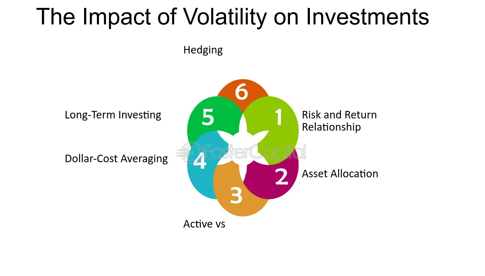

## Table of Contents

## What is volatility in financial markets?

Volatility in financial markets refers to how much and how quickly the prices of stocks, bonds, or other financial instruments change over time. When the prices move a lot in a short period, we say the market is volatile. This can happen because of many reasons, like news events, economic reports, or even just people's feelings about the market. High volatility means there's a lot of uncertainty, and it can be a sign that investors are worried or excited about something.

Understanding volatility is important for anyone investing in the market. It helps investors know how risky their investments might be. If a stock or market is very volatile, it could mean bigger gains, but also bigger losses. That's why some people try to predict volatility to make better investment choices. They use tools like the VIX, which is sometimes called the "fear gauge," to measure how much volatility is expected in the future.

## How is volatility measured?

Volatility is measured by looking at how much the price of something, like a stock or a market, moves up and down over time. One common way to do this is by calculating the standard deviation of the price changes. Standard deviation is a math term that tells us how spread out the numbers are. If the prices jump around a lot, the standard deviation will be high, and that means the volatility is high too.

Another way to measure [volatility](/wiki/volatility-trading-strategies) is by using something called the VIX, which stands for Volatility Index. The VIX is like a special tool that looks at the prices of options (which are agreements to buy or sell stocks at a certain price in the future) to guess how much the market might move in the next 30 days. If people are buying a lot of options because they think the market will move a lot, the VIX goes up, showing that people expect more volatility. This helps investors understand how nervous or calm the market might be in the near future.

## What are the common indicators used to assess volatility?

One common indicator used to assess volatility is the standard deviation of price changes. This is a math way to see how much the price of a stock or a market goes up and down over time. If the price moves a lot, the standard deviation will be high, and that means there's a lot of volatility. It's like looking at how bumpy a road is; a bumpy road means a lot of up and down movement, which is like high volatility in the market.

Another important indicator is the Volatility Index, or VIX. This is often called the "fear gauge" because it shows how much people expect the market to move in the next 30 days. The VIX looks at the prices of options, which are agreements to buy or sell stocks at a certain price in the future. If people are buying a lot of options because they think the market will move a lot, the VIX goes up, showing more expected volatility. This helps investors get a sense of how worried or calm the market might be soon.

There are also other ways to measure volatility, like looking at the average true range (ATR) of a stock. The ATR shows how much the price of a stock has moved on average over a certain period. If the ATR is high, it means the stock has been moving a lot, which indicates high volatility. These different indicators help investors understand how risky their investments might be and make better decisions.

## How does volatility affect investment decisions?

Volatility can make a big difference in how people decide to invest their money. When the market is very volatile, it means the prices of stocks and other investments can change a lot in a short time. This can be scary for some investors because it feels like a roller coaster. They might decide to sell their investments to avoid losing money, or they might choose not to invest at all because they're afraid of the ups and downs. On the other hand, some investors see high volatility as a chance to make money. They might buy stocks when prices are low and sell them when prices go up, hoping to make a profit from the big swings.

Understanding volatility also helps investors pick the right kind of investments for their goals. If someone is saving for something important and needs their money to grow steadily, they might choose investments that are less volatile, like bonds or stable stocks. These investments might not grow as fast, but they're less likely to lose a lot of value suddenly. For people who are okay with taking more risk and want to possibly make more money, they might choose more volatile investments, like tech stocks or cryptocurrencies. These can go up a lot, but they can also go down a lot, so it's important to know how much risk you're comfortable with before deciding where to put your money.

## What is the relationship between volatility and risk?

Volatility and risk are closely connected in the world of investing. Volatility is about how much and how quickly prices move up and down. When prices jump around a lot, we say the market is volatile. This makes things risky because you can't be sure what will happen next. If you own something that's very volatile, like a stock that goes up and down a lot, you might lose money quickly if the price drops suddenly. So, high volatility usually means high risk.

But it's not just about losing money. High volatility can also mean big chances to make money. If you buy something when its price is low and it goes up a lot, you can make a good profit. That's why some people like to invest in things that are volatile – they're hoping to catch those big swings and come out ahead. Still, it's important to remember that with more risk comes the chance of bigger losses, so you need to be ready for that too.

## How can investors use volatility to their advantage?

Investors can use volatility to their advantage by understanding when and how to make moves in the market. When prices are swinging a lot, some investors look for good deals. They buy stocks or other investments when the price is low and then sell them when the price goes up. This is called trading on volatility, and it can help them make money from the ups and downs of the market. But it's important to be careful because trying to guess where the market is going can be tricky and risky.

Another way investors can use volatility is by using tools like options. Options let investors make bets on how much a stock's price will move without actually owning the stock. If they think a stock will be very volatile, they can buy options that will pay off if the stock moves a lot in either direction. This can be a way to make money from volatility without having to predict if the price will go up or down. It's like betting on the weather being stormy without caring if it's rain or snow.

Lastly, investors can also use volatility to help them decide how to spread out their investments. If they know some parts of their portfolio are more volatile, they can balance that out with other investments that are less likely to swing wildly. This way, they can still take advantage of the potential for big gains from volatile investments while keeping their overall risk under control. It's all about finding the right mix to match their goals and how much risk they're comfortable with.

## What are the psychological impacts of volatility on investors?

Volatility in the financial markets can make investors feel stressed and worried. When prices go up and down a lot, it can be scary because it feels like your money is on a roller coaster. This can lead to something called "loss aversion," where people feel the pain of losing money much more than the joy of gaining it. Because of this, some investors might sell their investments quickly when they see prices dropping, even if it's not the best time to sell. This fear can make them miss out on potential gains if the market goes back up.

On the other hand, some investors might get too excited when prices are going up a lot. They might think they can predict the market and start making risky bets, hoping to make big profits. This kind of overconfidence can lead to bad decisions, like buying stocks at very high prices just because they've been going up. Both fear and overconfidence can cause investors to make choices based on their emotions rather than a clear plan, which can hurt their investments in the long run.

## How does volatility influence market liquidity?

Volatility can change how easy it is to buy and sell things in the market, which is called [liquidity](/wiki/liquidity-risk-premium). When prices move a lot, some people might be scared to trade because they don't know what will happen next. This can make the market less liquid because fewer people are willing to buy or sell. If you want to sell something but there aren't many buyers, you might have to wait longer or accept a lower price.

On the other hand, high volatility can sometimes make the market more liquid. When prices are swinging a lot, more traders might jump in to try and make money from the ups and downs. This can mean more people are buying and selling, which makes it easier to trade. But it's a bit tricky because while there might be more trades happening, the big price swings can still make it hard to get the price you want.

## What are the differences between historical and implied volatility?

Historical volatility is about looking at how much the price of something, like a stock, has moved up and down in the past. It's like looking at a chart of the stock's price over time and seeing how bumpy it was. If the price went up and down a lot, the historical volatility is high. This helps investors understand how much the price might move in the future based on what it did before. But remember, just because a stock was very volatile in the past doesn't mean it will be the same in the future.

Implied volatility, on the other hand, is a guess about how much the price might move in the future. It's based on what people are willing to pay for options, which are agreements to buy or sell stocks at a certain price later. If people think the stock will move a lot, they'll pay more for these options, and that makes the implied volatility go up. It's like a prediction of how nervous or excited people are about the stock's future. Both types of volatility are important, but they tell us different things: historical volatility looks at the past, while implied volatility looks at what might happen next.

## How do different asset classes respond to volatility?

Different types of investments, or asset classes, can react differently to volatility. Stocks, for example, can be very sensitive to volatility. When the market is shaky, stock prices might swing a lot because people are buying and selling based on their feelings and the news. This can make stocks a riskier investment during volatile times. On the other hand, bonds are usually less affected by volatility. They are seen as safer because they give a steady income, and their prices don't jump around as much as stocks. So, when the market is volatile, investors might move their money from stocks to bonds to feel safer.

Another type of investment, like commodities such as gold or oil, can also react differently to volatility. Gold is often seen as a safe place to put money during volatile times because people think it will hold its value even if the market is going crazy. That's why you might see the price of gold go up when the stock market is very volatile. Oil, on the other hand, can be very volatile itself because its price can be affected by many things like politics, weather, and global demand. So, during times of high market volatility, the price of oil might swing even more, making it a riskier investment.

Real estate is another asset class that tends to be less affected by short-term market volatility. Property values usually change more slowly over time and are less influenced by daily market swings. However, real estate can still be affected by economic conditions that cause volatility, like interest rates or big economic changes. So, while real estate might be a bit more stable during volatile times, it's not completely immune to the effects of a shaky market.

## What strategies can be employed to manage volatility in a portfolio?

One way to manage volatility in a portfolio is by diversifying your investments. This means spreading your money across different types of assets, like stocks, bonds, and maybe even real estate or commodities. When you do this, you're not putting all your eggs in one basket. If one part of your portfolio is going through a lot of ups and downs, the other parts might stay more stable. This can help smooth out the overall volatility of your portfolio and protect you from big losses.

Another strategy is to use something called asset allocation. This is about deciding how much of your money to put into different kinds of investments based on how much risk you're okay with and your goals. If you're worried about volatility, you might put more money into safer investments like bonds, which don't swing as much as stocks. But if you're okay with taking more risk for the chance of bigger gains, you might put more into stocks or other volatile assets. The key is to find a balance that works for you and stick to it, even when the market gets bumpy.

Lastly, some investors use tools like stop-loss orders to manage volatility. A stop-loss order is like a safety net that automatically sells an investment if its price drops to a certain level. This can help limit your losses if the market gets too volatile. But it's important to set these orders carefully because if the market just has a small dip and then goes back up, you might miss out on gains. Using these strategies together can help you handle the ups and downs of the market and keep your portfolio on track.

## How does global economic policy impact market volatility?

Global economic policy can really shake up the markets and cause a lot of volatility. When countries change their interest rates, taxes, or trade rules, it can make investors nervous. For example, if a big country like the United States decides to raise interest rates, it can make borrowing money more expensive. This can slow down the economy and make stock prices drop. Also, if countries start fighting over trade and put up new tariffs, it can mess up businesses that rely on selling things across borders. All these changes can make the market feel like a roller coaster, with prices going up and down a lot.

On the other hand, sometimes global economic policies can calm the markets down. If countries work together to help the economy grow, like by lowering interest rates or making trade easier, it can make investors feel more confident. When people think the economy will do well, they're more likely to buy stocks and other investments, which can make the market more stable. But it's all about how these policies are seen by investors. If they think the policies will help the economy, they'll feel good about investing. If they think the policies will hurt the economy, they'll be more worried, and that can make the market more volatile.

## What is Volatility?

Volatility, in financial markets, refers to the degree of variation in the price of a financial instrument over time. It is a key measure of the risk associated with the price changes of securities, options, or other financial assets. Volatility is not simply the probability of asset prices moving in a given direction, but rather the magnitude of these price movements, indicating a dynamic market environment where prices can oscillate significantly within short periods.

There are primarily two types of volatility: historical and implied. Historical volatility measures the past price fluctuations of a financial instrument over a specific timeframe, providing an empirical perspective on how the asset price has behaved. It is often calculated using standard deviation of past returns. Mathematically, for a series of daily returns $r_t$, historical volatility ($\sigma_h$) over $n$ days is given by:

$$
\sigma_h = \sqrt{\frac{1}{n-1} \sum_{t=1}^{n} (r_t - \bar{r})^2}
$$

where $\bar{r}$ is the average return over the period.

Implied volatility, on the other hand, is a forward-looking measure derived from the prices of options. It reflects the market's expectations of future volatility and is often used in options pricing models, like the Black-Scholes model. While historical volatility gives insight into past market behavior, implied volatility helps traders anticipate potential price dynamics.

Several factors contribute to market volatility, including economic data releases, geopolitical events, changes in market sentiment, corporate earnings announcements, and unexpected news. Additionally, liquidity and market microstructure can influence volatility levels. In general, markets tend to be more volatile in times of uncertainty and calm during periods of stability.

Volatility is integral to risk management. It is crucial for pricing derivatives, managing the risks on trading desks, and developing investment strategies. Higher volatility implies higher risk but can also lead to significant trading opportunities. Effective risk management strategies must account for volatility to mitigate potential losses and capitalize on market movements.

Traders and analysts often use various tools to measure and analyze volatility. Besides historical and implied volatility, metrics like Average True Range (ATR) and Bollinger Bands are employed to gauge the degree of price movement. Moreover, advanced statistical techniques and [machine learning](/wiki/machine-learning) algorithms are increasingly being used to forecast volatility and aid in decision-making processes. These measures enable traders to adjust their strategies in response to changing market conditions.

## References & Further Reading

[1]: Marcos Lopez de Prado. ["Advances in Financial Machine Learning"](https://www.amazon.com/Advances-Financial-Machine-Learning-Marcos/dp/1119482089). Wiley, 2018.

[2]: David Aronson. ["Evidence-Based Technical Analysis: Applying the Scientific Method and Statistical Inference to Trading Signals"](https://onlinelibrary.wiley.com/doi/book/10.1002/9781118268315). Wiley, 2007.

[3]: Stefan Jansen. ["Machine Learning for Algorithmic Trading: Predictive Models to Extract Signals from Market and Alternative Data for Systematic Trading Strategies with Python, 2nd Edition"](https://github.com/stefan-jansen/machine-learning-for-trading). Packt Publishing, 2020.

[4]: Ernest P. Chan. ["Quantitative Trading: How to Build Your Own Algorithmic Trading Business"](https://www.amazon.com/Quantitative-Trading-Build-Algorithmic-Business/dp/1119800064). Wiley, 2008.

[5]: Nassim Nicholas Taleb. ["Dynamic Hedging: Managing Vanilla and Exotic Options"](https://www.amazon.com/Dynamic-Hedging-Managing-Vanilla-Options/dp/0471152803). Wiley, 1997.

[6]: John C. Hull. ["Options, Futures, and Other Derivatives"](https://www.amazon.com/Options-Futures-Other-Derivatives-6th/dp/0131499084). Pearson, 2017.

[7]: Robert Engle. ["Autoregressive Conditional Heteroskedasticity with Estimates of the Variance of United Kingdom Inflation"](https://www.semanticscholar.org/paper/Autoregressive-conditional-heteroscedasticity-with-Engle/2ee6cb87fc81ecd78d161c4a92c9dfce00c8961c) Econometrica, 1982. 

[8]: Andrew Lo. ["A Non-Random Walk Down Wall Street"](https://www.amazon.com/Non-Random-Walk-Down-Wall-Street/dp/0691092567). Princeton University Press, 2001.