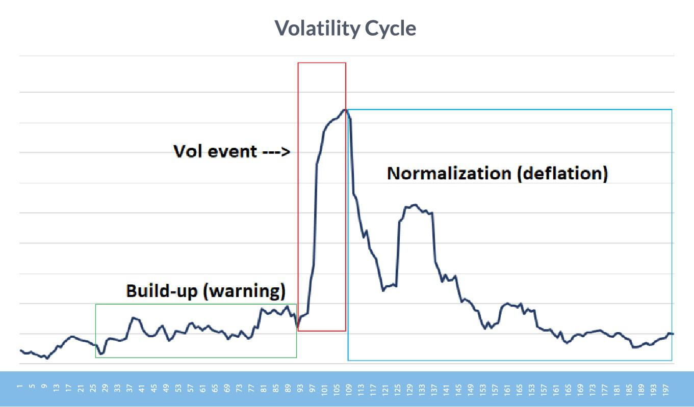

Algorithmic trading is a method of executing orders using automated pre-programmed trading instructions, accounting for variables such as time, price, and volume, to succeed in the financial markets. An essential component that impacts the effectiveness of algorithmic trading is market volatility, which refers to the degree of variation in trading prices over time. Understanding the impact of volatility is crucial for traders and investors as it can significantly influence the risk and returns associated with their trading strategies.

This article explores the topic of volatility in algorithmic trading and why it is a critical consideration for anyone engaged in financial trading. We will provide an overview of how algorithmic trading systems interact with dynamic market conditions characterized by varying levels of volatility. Specifically, the article will cover how volatility influences trading performance, risk management, and strategy development.



Volatility is a cornerstone of financial markets, impacting everything from asset pricing to risk assessment. It can create opportunities for profit but also pose significant challenges, particularly in algorithmic trading, which relies on precise calculations and the processing of large datasets for optimal execution. When markets become turbulent, the price movements can be unpredictable, making it challenging for algorithms to maintain performance without sophisticated volatility management techniques.

Algorithmic trading systems, with their ability to process immense quantities of data quickly, are both affected by and capable of responding to market volatility. These systems employ various algorithms designed to adjust to changing market conditions, implementing strategies such as arbitrage, market making, and trend following, each with unique ways of handling price fluctuations. However, the success of these strategies is heavily dependent on the system's design and the ability to adapt to volatility spikes without incurring excessive risk.

In summary, the interaction between algorithmic trading and volatility is complex and multifaceted. The article aims to further elucidate this relationship, emphasizing the necessity for traders to incorporate volatility measures in their algorithmic systems and adapt their risk management techniques to mitigate adverse effects while capitalizing on opportunities presented by volatile market conditions.

## Table of Contents

## Understanding Algorithmic Trading

Algorithmic trading refers to the use of computer algorithms to facilitate decision-making and trade execution in financial markets. These algorithms are designed to perform complex calculations at a high speed, enabling traders to capitalize on market opportunities that may be imperceptible to human traders. The evolution of algorithmic trading can be traced back to the 1970s with the advent of electronic trading systems. Over the decades, it has progressed significantly due to advancements in technology, particularly in computing power and data analytics.

The benefits of [algorithmic trading](/wiki/algorithmic-trading) are manifold. Algorithms can process vast amounts of market data in real time and execute trades at optimal prices, significantly reducing the impact of human error and emotional decision-making. These systems can analyze multiple indicators simultaneously, making decisions based on pre-defined criteria faster and more accurately than human traders. This results in improved trading efficiency and the potential for higher returns. However, algorithmic trading also presents certain challenges. The reliance on complex algorithms requires robust programming skills and thorough testing, as faulty algorithms can lead to significant financial losses. Moreover, these systems can sometimes exacerbate market [volatility](/wiki/volatility-trading-strategies), especially when many traders use similar strategies.

There are various types of algorithmic trading strategies, each designed to exploit different market conditions. These include statistical [arbitrage](/wiki/arbitrage), which uses statistical methods to profit from price inefficiencies; trend-following strategies, which identify and ride market trends; market-making, where algorithms provide [liquidity](/wiki/liquidity-risk-premium) by quoting both buy and sell prices; and execution-based strategies, which aim to reduce market impact when executing large orders.

Technology plays a crucial role in algorithmic trading. High-frequency trading ([HFT](/wiki/high-frequency-trading-strategies)), a subset of algorithmic trading, relies on cutting-edge technology to execute a large number of orders within extremely short time frames. The infrastructure supporting algorithmic trading includes fast processors, high-speed internet connections, and sophisticated software capable of real-time data analysis. Machine learning and [artificial intelligence](/wiki/ai-artificial-intelligence) are increasingly being integrated into trading algorithms, enabling them to learn from past data and improve decision-making processes.

In conclusion, algorithmic trading represents a significant innovation in financial markets, driven by technological advancements. While it offers considerable advantages in terms of speed and efficiency, it also requires careful management and oversight to mitigate associated risks and challenges.

## What is Volatility?

Volatility, in financial markets, refers to the degree of variation in the price of a financial instrument over time. It is a key measure of the risk associated with the price changes of securities, options, or other financial assets. Volatility is not simply the probability of asset prices moving in a given direction, but rather the magnitude of these price movements, indicating a dynamic market environment where prices can oscillate significantly within short periods.

There are primarily two types of volatility: historical and implied. Historical volatility measures the past price fluctuations of a financial instrument over a specific timeframe, providing an empirical perspective on how the asset price has behaved. It is often calculated using standard deviation of past returns. Mathematically, for a series of daily returns $r_t$, historical volatility ($\sigma_h$) over $n$ days is given by:

$$
\sigma_h = \sqrt{\frac{1}{n-1} \sum_{t=1}^{n} (r_t - \bar{r})^2}
$$

where $\bar{r}$ is the average return over the period.

Implied volatility, on the other hand, is a forward-looking measure derived from the prices of options. It reflects the market's expectations of future volatility and is often used in options pricing models, like the Black-Scholes model. While historical volatility gives insight into past market behavior, implied volatility helps traders anticipate potential price dynamics.

Several factors contribute to market volatility, including economic data releases, geopolitical events, changes in market sentiment, corporate earnings announcements, and unexpected news. Additionally, liquidity and market microstructure can influence volatility levels. In general, markets tend to be more volatile in times of uncertainty and calm during periods of stability.

Volatility is integral to risk management. It is crucial for pricing derivatives, managing the risks on trading desks, and developing investment strategies. Higher volatility implies higher risk but can also lead to significant trading opportunities. Effective risk management strategies must account for volatility to mitigate potential losses and capitalize on market movements.

Traders and analysts often use various tools to measure and analyze volatility. Besides historical and implied volatility, metrics like Average True Range (ATR) and Bollinger Bands are employed to gauge the degree of price movement. Moreover, advanced statistical techniques and [machine learning](/wiki/machine-learning) algorithms are increasingly being used to forecast volatility and aid in decision-making processes. These measures enable traders to adjust their strategies in response to changing market conditions.

## Volatility Impact on Algorithmic Trading

Volatility significantly influences the performance of algorithmic trading systems. Algorithmic trading, also known as algo-trading, automates decision-making in financial markets through the use of pre-programmed instructions. These systems aim to execute trades at optimal prices, increase market liquidity, reduce transaction costs, and mitigate human emotional factors in trading decisions. However, market volatility presents both challenges and opportunities for such algorithms.

Volatility clustering, a phenomenon where large changes in asset prices tend to be followed by further large changes, impacts the efficacy of trading algorithms. Volatility clustering suggests that volatility is time-varying and persistent, which can lead to significant price swings over short periods. For algo-traders, this means that an algorithm needs to adapt quickly to changing market conditions to capitalize on potential opportunities and avoid losses.

Algorithms built for volatile markets often incorporate mechanisms such as dynamic risk assessment and adaptive trading strategies. For instance, algorithms may adjust their trading frequency and size based on real-time volatility metrics. A common way to account for volatility is by employing measures like the standard deviation of asset returns or more sophisticated models such as the Generalized Autoregressive Conditional Heteroskedasticity (GARCH) model. A simplified Python implementation of volatility adjustment using standard deviation might look like this:

```python
import numpy as np

def calculate_volatility(prices):
    log_returns = np.diff(np.log(prices))
    volatility = np.std(log_returns)
    return volatility

prices = [100, 105, 102, 110, 108]
volatility = calculate_volatility(prices)
print(f"Calculated Volatility: {volatility}")
```

Trading in volatile markets provides both potential risks and rewards. On the risk side, high volatility can lead to increased transaction costs due to wider bid-ask spreads and slippage. Additionally, algorithms without proper risk management protocols maybe susceptible to executing erroneous trades. However, volatility also presents opportunities for algorithms specifically designed to exploit price movements. 

Examples of algorithmic strategies that perform well under volatile conditions include [statistical arbitrage](/wiki/statistical-arbitrage), mean reversion, and [momentum](/wiki/momentum)-based strategies. Statistical arbitrage exploits pricing inefficiencies between related asset classes, while mean reversion strategies capitalize on the tendency of asset prices to revert to their long-term mean. Momentum strategies, on the other hand, capitalize on persistent trends during volatility.

In conclusion, while volatility poses certain challenges to algorithmic trading systems, it also offers lucrative opportunities for well-designed algorithms. Incorporating sophisticated risk management techniques and adaptive strategies allows algorithms to navigate the complexities of volatile markets effectively, balancing potential risks with substantial rewards.

## Handling Volatility in Algorithmic Trading

Managing volatility in trading algorithms is crucial for achieving stable performance in financial markets. One of the key strategies to address this challenge is diversification. By spreading investments across a wide array of asset classes, sectors, or geographic regions, traders can reduce the impact of localized market shocks and moderate overall portfolio volatility. Diversification helps to ensure that the negative performance of some assets is balanced by positive outcomes in others, thereby stabilizing returns.

Risk management tools are essential in controlling volatility. These tools include stop-loss orders, which automatically sell a security when it reaches a certain price level, thereby limiting potential losses. Similarly, limit orders can be used to buy or sell assets at predetermined prices, helping traders to avoid unfavorable market conditions. Value-at-risk (VaR) is another important tool, providing a statistical method to gauge the potential loss in value of a portfolio over a defined period for a given confidence interval.

Volatility-adjusted trading models represent another approach to managing market turbulence. These models [factor](/wiki/factor-investing) in current volatility levels to make trading decisions. For instance, the position sizes might be reduced during periods of high volatility to limit exposure. This adjustment is often based on metrics such as the average true range (ATR) or standard deviation. By incorporating volatility measures into models, traders can dynamically adjust their strategies in response to changing market conditions.

Backtesting algorithms across different volatility regimes is a critical step in understanding how they will perform under various market conditions. Historical data can be analyzed to simulate how an algorithm would have reacted during periods of low and high volatility. Backtesting helps in identifying weaknesses in trading strategies and refining them for better performance. By doing so, traders can enhance the robustness of their algorithms, ensuring they are well-equipped to handle sudden volatility shifts.

In summary, managing volatility in algorithmic trading requires a combination of diversification, risk management tools, volatility-adjusted models, and thorough [backtesting](/wiki/backtesting). These strategies collectively help traders mitigate the risks associated with volatile markets and improve their chances of consistent and profitable trading outcomes.

## Conclusion

In conclusion, algorithmic trading and market volatility are intricately linked, with volatility playing a critical role in the performance and success of trading algorithms. Effective management of volatility is of paramount importance for algorithmic traders as it significantly impacts profitability and risk exposure. By understanding how volatility influences trading strategies, traders can develop more resilient algorithms that are capable of adapting swiftly to volatile market conditions.

As the financial markets continue to evolve, there is a growing need for ongoing research and innovation in algorithmic trading. By continuously improving algorithms, traders can enhance their capacity to handle unforeseen market fluctuations and capitalize on volatile conditions. The future of algorithmic trading relies heavily on advancements in technology and analytical tools, which will allow algorithms to become more sophisticated and responsive to changes in market dynamics.

The landscape of volatility presents both challenges and opportunities for traders. Emphasizing the impact of volatility in trading strategies enables traders to devise better risk management frameworks and adopt techniques like diversification and volatility-adjusted models. Future developments in machine learning and artificial intelligence will play a crucial role in how these strategies are formulated and executed.

Therefore, traders are urged to place significant importance on volatility assessment within their algorithmic strategies. By doing so, they can better navigate the complexities of the financial markets, minimize risk, and maximize returns. Embracing the changing nature of market volatility will ensure that algorithmic trading remains a dynamic and profitable domain.

## References & Further Reading

[1]: Marcos Lopez de Prado. ["Advances in Financial Machine Learning"](https://www.amazon.com/Advances-Financial-Machine-Learning-Marcos/dp/1119482089). Wiley, 2018.

[2]: David Aronson. ["Evidence-Based Technical Analysis: Applying the Scientific Method and Statistical Inference to Trading Signals"](https://onlinelibrary.wiley.com/doi/book/10.1002/9781118268315). Wiley, 2007.

[3]: Stefan Jansen. ["Machine Learning for Algorithmic Trading: Predictive Models to Extract Signals from Market and Alternative Data for Systematic Trading Strategies with Python, 2nd Edition"](https://github.com/stefan-jansen/machine-learning-for-trading). Packt Publishing, 2020.

[4]: Ernest P. Chan. ["Quantitative Trading: How to Build Your Own Algorithmic Trading Business"](https://www.amazon.com/Quantitative-Trading-Build-Algorithmic-Business/dp/1119800064). Wiley, 2008.

[5]: Nassim Nicholas Taleb. ["Dynamic Hedging: Managing Vanilla and Exotic Options"](https://www.amazon.com/Dynamic-Hedging-Managing-Vanilla-Options/dp/0471152803). Wiley, 1997.

[6]: John C. Hull. ["Options, Futures, and Other Derivatives"](https://www.amazon.com/Options-Futures-Other-Derivatives-6th/dp/0131499084). Pearson, 2017.

[7]: Robert Engle. ["Autoregressive Conditional Heteroskedasticity with Estimates of the Variance of United Kingdom Inflation"](https://www.semanticscholar.org/paper/Autoregressive-conditional-heteroscedasticity-with-Engle/2ee6cb87fc81ecd78d161c4a92c9dfce00c8961c) Econometrica, 1982. 

[8]: Andrew Lo. ["A Non-Random Walk Down Wall Street"](https://www.amazon.com/Non-Random-Walk-Down-Wall-Street/dp/0691092567). Princeton University Press, 2001.