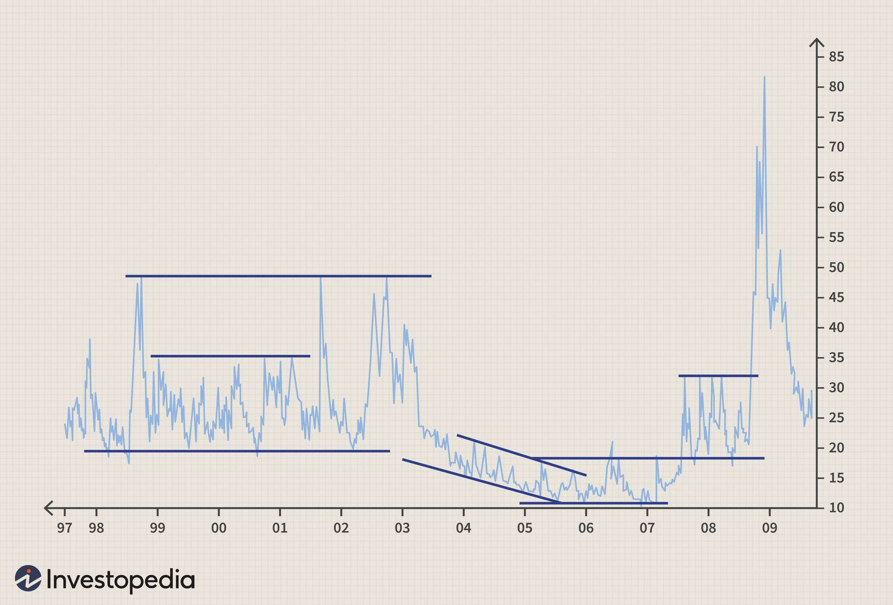

Financial markets are intricate systems influenced by myriad factors, with market sentiment and volatility holding significant sway. These elements can affect price movements, trading volumes, and overall market behavior, thereby playing a crucial role in investment strategies. An understanding of these factors is essential, especially in the domain of algorithmic trading, where decisions are predicated on robust quantitative analysis.

Algorithmic trading, a method of executing orders using automated pre-programmed trading instructions accounting for variables such as time, price, and volume, has revolutionized the landscape of financial markets. It enables traders to process vast sets of data at high speeds, making decisions that are both rapid and informed. Market sentiment—the collective attitude and outlook of investors—and volatility—the degree of variation of trading prices—are pivotal in shaping these trading algorithms.



The Volatility Index (VIX), commonly referred to as the "fear index," quantifies expected market volatility over a 30-day period, providing insights into investor sentiments and potential market movements. By analyzing the VIX alongside market sentiment, which evaluates emotions expressed across a variety of data sources such as news articles and social media, traders gain a deeper understanding of market moods. This confluence of sentiment and volatility informs strategies that aim to optimize outcomes and minimize risks.

This article explores the relationship between the finance volatility index, market sentiment, and algorithmic trading. By examining how these components interact, it underscores their collective role in modern trading environments, offering traders sophisticated tools to navigate the complexities of financial markets with precision and foresight.

## Table of Contents

## Understanding the Volatility Index

The Volatility Index, commonly known as the VIX, serves as a barometer for gauging market expectations of future volatility. Introduced by the Chicago Board Options Exchange (CBOE) in 1993, the VIX reflects the expected volatility of the S&P 500 index over the next 30 days. It is popularly dubbed the "fear index" due to its tendency to rise during periods of market stress, indicating heightened investor anxiety.

The formulation of the VIX is derived from the prices of S&P 500 index options, employing complex mathematical models to estimate the expected volatility. Mathematically, the VIX is calculated using the formula:

$$
VIX = 100 \times \sqrt{\frac{2}{\pi} \int_0^\infty \frac{1}{K^2} e^{rT} P(K) dK}
$$

where:
- $K$ represents the strike price of the options,
- $r$ is the risk-free interest rate,
- $T$ is the time to expiration, and
- $P(K)$ denotes the option's price.

Historically, the VIX has exhibited significant spikes correlating with key market disruptions. Notable examples include the global financial crisis of 2008, where the VIX reached unprecedented levels, and the [volatility](/wiki/volatility-trading-strategies) driven by the COVID-19 pandemic. Such spikes indicate heightened institutional uncertainty and fear regarding market stability.

For traders, the VIX is a vital tool for understanding institutional sentiment. A high VIX suggests an expectation of substantial market fluctuations and potential downturns. Consequently, investors and fund managers use the VIX to guide their investment strategies, often opting for conservative positions in times of elevated VIX levels to mitigate risk.

In summary, the VIX encapsulates market sentiment pertaining to anticipated volatility, offering investors a quantitative measure to assess market mood and tailor their trading strategies accordingly.

## Market Sentiment Analysis

Market sentiment refers to the general attitude and emotional state of investors towards a market or specific asset. This sentiment can be categorized as bullish, bearish, or neutral, directly influencing trading strategies and decisions. A bullish sentiment implies that investors expect prices to rise, while a bearish sentiment suggests a decline in prices, and a neutral sentiment indicates no strong directional expectation.

Sentiment analysis leverages advancements in natural language processing (NLP) and [machine learning](/wiki/machine-learning) to interpret and quantify these emotional states. By analyzing text data from sources like news articles, social media, and financial reports, sentiment analysis seeks to gauge the mood of the market participants. For instance, by processing large datasets of Tweets or financial news, algorithms can identify trends and patterns indicative of collective investor behavior.

The mathematical backbone of sentiment analysis often involves the use of algorithms to convert qualitative data into quantitative metrics. Techniques such as tokenization, sentiment scoring, and text classification are foundational. Tokenization involves breaking down text into meaningful components, while sentiment scoring assigns values to words or phrases based on their positive or negative connotations. Text classification involves categorizing segments of text into predefined sentiments.

One prevalent approach in sentiment analysis is using supervised learning techniques where models are trained on labeled datasets to predict sentiment from new, unlabeled data. The following Python code snippet demonstrates a basic sentiment analysis process using a library such as TextBlob, which provides a simple API for diving deeper into common natural language processing tasks:

```python
from textblob import TextBlob

def analyze_sentiment(text):
    blob = TextBlob(text)
    sentiment = blob.sentiment.polarity
    if sentiment > 0:
        return 'Bullish'
    elif sentiment < 0:
        return 'Bearish'
    else:
        return 'Neutral'

sample_text = "The market is showing strong performance and investor confidence is high."
print(analyze_sentiment(sample_text))  # Outputs: Bullish
```

Integrating sentiment analysis into trading is becoming increasingly valuable as it provides an additional layer of market insight beyond traditional indicators. By predicting potential movements through sentiment trends, traders can adjust positions proactively rather than reactively. For instance, a sudden increase in negative sentiment detected across multiple sources might signal the likelihood of a market downturn, allowing traders to hedge against potential losses.

The predictive nature of sentiment analysis is continually enhanced through machine learning methodologies, enabling ever-more accurate interpretations of market mood. As financial markets continue to intertwine with social media and digital communications, the capacity to analyze sentiment swiftly and efficiently offers traders a profound advantage in anticipating market dynamics.

## Algorithmic Trading and Its Advantages

Algorithmic trading employs sophisticated mathematical models and computational techniques to execute trading decisions at high speed. This method leverages the power of computer systems to analyze vast amounts of market data and execute trades at a pace unattainable by human traders. One primary advantage of [algorithmic trading](/wiki/algorithmic-trading) is its capacity to process large volumes of data efficiently, allowing for rapid decision-making that correlates with real-time market conditions.

By integrating market volatility and sentiment data, algorithmic trading can enhance trading strategies, leading to more effective positioning. Volatility indices, such as the VIX, provide insights into expected market fluctuations, enabling algorithms to adjust their strategies accordingly. For example, during periods of high volatility, risk-averse strategies may be favored. Conversely, lower volatility might lead to strategies focusing on small, frequent gains.

Adapting algorithms to account for shifts in volatility enhances trading outcomes, particularly in unpredictable markets. Algorithms can employ various methods to adapt, including dynamic reallocation of assets and adjusting risk management parameters. For instance, using Python, a trading algorithm might look like:

```python
import numpy as np

def adjust_strategy(volatility_index, current_strategy):
    if volatility_index > threshold_high:
        return 'risk_averse'
    elif volatility_index < threshold_low:
        return 'risk_on'
    else:
        return current_strategy

volatility_index = np.random.uniform(low=10, high=50)
current_strategy = 'neutral'
new_strategy = adjust_strategy(volatility_index, current_strategy)
```

This snippet demonstrates a simple adjustment based on a volatility index threshold, which effectively shifts the strategy from neutral to either risk-averse or risk-on, depending on observed market conditions.

Overall, algorithmic trading's ability to synthesize complex data inputs—including market volatility and sentiment—results in more adaptive and informed trading decisions. By continuously optimizing strategies, algorithmic trading not only improves efficiency but also increases the potential for achieving higher returns in a rapidly changing financial landscape.

## Strategies for Trading Volatility and Sentiment

Volatility-driven trading strategies seek to exploit price fluctuations in financial markets. Among the prominent strategies are mean reversion and [trend following](/wiki/trend-following). Mean reversion is based on the idea that asset prices and historical returns eventually return to their long-term mean or average levels. Traders employing this strategy will typically buy assets when prices are low and sell when prices are high relative to their historical average. In mathematical terms, this strategy can be articulated as focusing on the z-score, calculated as follows: 

$$
z = \frac{x - \mu}{\sigma}
$$

where $x$ is the current price, $\mu$ is the mean price over a specified period, and $\sigma$ is the standard deviation. A high positive z-score suggests the price is significantly above the mean, signaling a potential sell, while a low negative z-score suggests a potential buy.

Conversely, trend following strategies involve capitalizing on the directional movement of markets. Traders focus on indicators such as moving averages and [momentum](/wiki/momentum) indicators to identify and follow existing market trends, buying securities in an uptrend and selling in a downtrend. The primary assumption is that price trends will continue.

Sentiment indicators add another dimension by assessing investor mood to enhance volatility trading strategies. The put/call ratio is a widely-used sentiment indicator. It compares the [volume](/wiki/volume-trading-strategy) of traded put options to call options, offering insights into the prevailing market sentiment. A high put/call ratio indicates bearish sentiment, which could signal a buying opportunity for contrarian investors expecting a market reversal.

Sentiment scores derived from news analysis and social media sentiment analysis can further enrich these strategies by providing data on public sentiment. For instance, news sentiment can be quantified using natural language processing (NLP) techniques to extract positive or negative sentiments from a large volume of articles.

The Volatility Index (VIX) serves as a pivotal tool for contrarian strategies. Traders might adopt the strategy of buying assets when the VIX is high, anticipating that market fear will drive prices below their intrinsic value, and selling when the VIX is low, predicting complacency might have overpriced assets.

A comprehensive trading approach requires integrating both technical indicators and sentiment data for robust decision-making. Technical indicators provide objective, historical price data, while sentiment indicators offer insights into the psychological aspects affecting market movements. A synergistic use of these tools enables traders to make more informed and potentially profitable decisions. 

The complex interplay of volatility and sentiment underscores the importance of a multifaceted approach, merging quantitative analysis with psychological insights. This not only heightens the precision of trading strategies but also adapts to the ever-changing landscapes of financial markets.

## The Future of Sentiment Analysis in Trading

Sentiment analysis, a key tool for understanding market mood, is undergoing significant transformation due to rapid advancements in [artificial intelligence](/wiki/ai-artificial-intelligence) (AI) and machine learning (ML). These technologies enhance the accuracy of sentiment analysis by enabling more nuanced assessments of textual data from diverse sources such as news articles, social media, and financial reports. The integration of sentiment analysis with trading platforms can provide a competitive edge by delivering real-time insights into market sentiment, enabling traders to make faster and more informed decisions.

Real-time sentiment analysis is set to revolutionize trading by offering near-instantaneous insights into market dynamics. With the ability to process vast quantities of text data and extract sentiment information rapidly, traders can adjust their strategies in response to changing market conditions. This capability is particularly beneficial in volatile markets, where rapid response times can significantly impact trading outcomes. For instance, Python libraries like TextBlob or Vader can be used to perform sentiment analysis on streaming data, allowing for real-time monitoring of market sentiment. The following Python code snippet demonstrates how to perform sentiment analysis using the TextBlob library:

```python
from textblob import TextBlob

def analyze_sentiment(text):
    blob = TextBlob(text)
    return blob.sentiment.polarity

# Example usage
text = "The market is showing signs of recovery."
sentiment_score = analyze_sentiment(text)
print("Sentiment polarity:", sentiment_score)
```

Furthermore, the integration of sentiment analysis with blockchain and decentralized finance (DeFi) platforms holds the potential to increase transparency and efficiency in algorithmic trading systems. By leveraging blockchain technology, sentiment data can be securely and transparently recorded, ensuring the integrity of the information used in trading algorithms. This integration can also facilitate more efficient sharing of sentiment data across decentralized networks, enhancing the collective understanding of market dynamics.

As AI and ML techniques continue to evolve, we can expect more sophisticated sentiment analysis methods that offer finer granularity in decision-making. Advanced models, such as [deep learning](/wiki/deep-learning) architectures, are capable of capturing complex linguistic nuances and context dependencies that are essential for accurate sentiment analysis. These sophisticated techniques can provide a more detailed understanding of market sentiment, enabling traders to tailor their strategies with greater precision.

In conclusion, the future of sentiment analysis in trading is set to be characterized by enhanced real-time capabilities, integration with emerging technologies like blockchain and DeFi, and the development of more refined analytic methods. These advancements promise to transform trading by improving the accuracy and speed of sentiment insights, ultimately leading to more effective trading strategies and potentially higher returns on investment.

## Conclusion

The fusion of volatility indices, market sentiment analysis, and algorithmic trading signifies a transformative phase in the financial sector. Each component provides distinct advantages, enhancing a trader's ability to anticipate and react to market fluctuations with increased accuracy.

Volatility indices, such as the VIX, serve as crucial barometers for market uncertainty. By reflecting the anticipated 30-day volatility, they help traders gauge potential market instability and adjust their strategies accordingly. When integrated with sentiment analysis, which deciphers the emotional tone of market narratives from sources like news media and social networks, traders can gain a holistic view of market sentiment. This dual approach allows the anticipation of market movements before they occur, offering a substantial edge in decision-making.

Algorithmic trading takes this a step further by utilizing these insights through automated systems that can process large datasets and execute trades at unparalleled speeds. The ability to incorporate real-time sentiment and volatility data into algorithms optimizes strategy formulation, particularly in rapidly changing markets. This capability not only improves trade execution but also reduces human biases and errors, resulting in more consistent performance.

Innovations in sentiment analysis, powered by advancements in artificial intelligence and machine learning, are continuously refining the predictive accuracy and integration of these tools within trading platforms. Future developments are set to offer even finer granularity, allowing traders to exploit minor market inefficiencies that were previously undetectable.

Furthermore, the combination of blockchain technology with decentralized finance (DeFi) systems could further enhance transparency and efficiency, potentially leading to more robust algorithmic trading operations. As traders become more adept at harnessing these tools, the potential for achieving higher returns increases, provided that these elements are comprehensively understood and strategically leveraged. This approach marks a significant evolution in trading methodologies, emphasizing the importance of data-driven, technologically-advanced strategies in the pursuit of financial success.

## References & Further Reading

[1]: Whaley, R. E. (2009). ["Understanding the VIX."](https://www.researchgate.net/publication/277429711_Understanding_the_VIX) The Journal of Portfolio Management, 35(3), 98-105.

[2]: Tetlock, P. C. (2007). ["Giving Content to Investor Sentiment: The Role of Media in the Stock Market."](https://onlinelibrary.wiley.com/doi/abs/10.1111/j.1540-6261.2007.01232.x) The Quarterly Journal of Economics, 122(3), 1139-1168.

[3]: Alexander, C. (Ed.). (2008). ["Market Risk Analysis, Volume III: Pricing, Hedging and Trading Financial Instruments"](https://download.e-bookshelf.de/download/0000/5795/04/L-G-0000579504-0002383568.pdf). Wiley.

[4]: Black, F., & Scholes, M. (1973). ["The Pricing of Options and Corporate Liabilities."](https://www.cs.princeton.edu/courses/archive/fall09/cos323/papers/black_scholes73.pdf) Journal of Political Economy, 81(3), 637-654.

[5]: ["Sentiment Analysis for Financial Markets"](https://dl.acm.org/doi/10.1145/3649451) by Carlos A. C. Teixeira, André G. dos Santos, and Sébastien G. Thingbaijam

[6]: Lo, A. W. (2004). ["The Adaptive Markets Hypothesis: Market Efficiency from an Evolutionary Perspective."](https://papers.ssrn.com/sol3/papers.cfm?abstract_id=602222) The Journal of Portfolio Management, 30(5), 15-29.