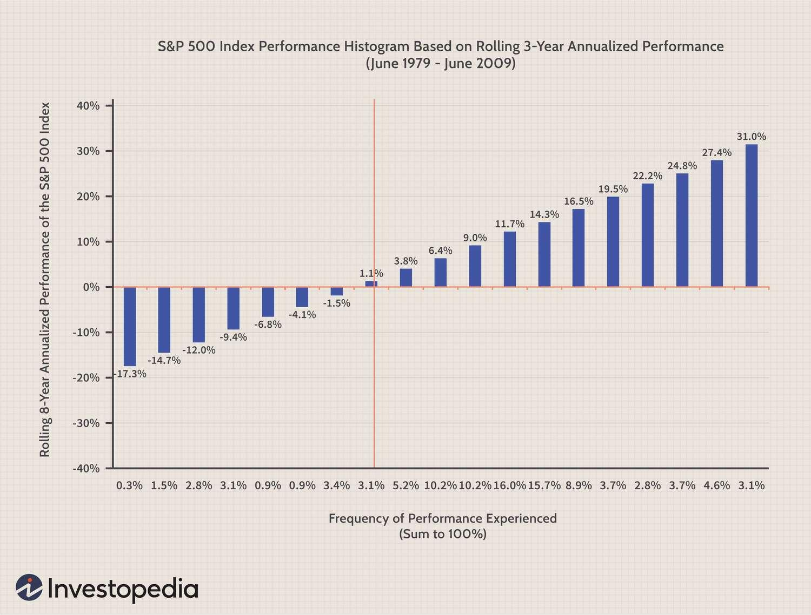

## Table of Contents

## What is volatility in financial markets?

Volatility in financial markets refers to how much and how quickly the prices of stocks, bonds, or other investments change. If the prices move up and down a lot in a short time, we say the market is very volatile. Imagine you're on a boat; if the waves are big and the boat rocks a lot, that's like a volatile market. If the waves are small and the boat stays steady, that's like a less volatile market.

Volatility is important because it shows how risky an investment might be. If a stock's price jumps around a lot, it could mean bigger gains, but also bigger losses. Investors watch volatility to decide if they want to take the risk. For example, if you need your money to be safe, you might choose investments with less volatility. But if you're okay with more risk for the chance of higher rewards, you might pick investments with higher volatility.

## Why is measuring volatility important for investors?

Measuring volatility helps investors understand how risky their investments are. If an investment goes up and down a lot in price, it's more volatile and riskier. By knowing this, investors can decide if they want to take that risk. For example, if you're saving for something important and can't afford to lose money, you might choose investments with less volatility to keep your money safer.

On the other hand, some investors are okay with more risk because they hope to make bigger profits. They might look for investments with higher [volatility](/wiki/volatility-trading-strategies) because those can sometimes lead to bigger gains, even though they could also lead to bigger losses. Knowing the volatility helps these investors match their investments to their goals and how much risk they're willing to take.

## What are the basic methods to measure volatility?

One basic way to measure volatility is by looking at the standard deviation of an investment's returns over time. Standard deviation tells you how much the returns spread out from the average. If the returns are all over the place, the standard deviation will be high, meaning the investment is more volatile. If the returns are more consistent, the standard deviation will be low, showing less volatility. It's like measuring how much a kid's height changes from year to year; if it jumps a lot, that's like high volatility.

Another simple method is to use the historical volatility, which looks at how much the price of an investment has moved in the past. You can calculate this by finding the average of the daily price changes over a certain period, like 30 or 60 days. If the price changes a lot from day to day, the historical volatility will be high. This method helps investors see how bumpy the ride has been and guess how bumpy it might be in the future. It's like checking the weather history to see if it's usually stormy or calm.

## How does the standard deviation method work in measuring volatility?

The standard deviation method measures volatility by looking at how much an investment's returns change over time. Imagine you're watching the scores of your favorite sports team over a season. If the scores are all over the place, with big wins and big losses, that's like high volatility. The standard deviation calculates how spread out these scores are from the average score. If the scores are close to the average, the standard deviation is low, showing less volatility. If the scores are far from the average, the standard deviation is high, showing more volatility.

To use this method, you first find the average return of the investment over a certain time, like a year. Then, you look at each return and see how far it is from that average. You square these differences, add them up, and divide by the number of returns. Finally, you take the square root of that number, and that's your standard deviation. It's like measuring how much a kid's test scores change from the class average; a bigger change means more volatility.

## What is the difference between historical volatility and implied volatility?

Historical volatility looks at how much an investment's price has moved in the past. It's like checking the weather history to see if it was usually stormy or calm. You calculate it by finding the average of the daily price changes over a certain time, like 30 or 60 days. If the price changes a lot from day to day, the historical volatility is high. This helps investors guess how bumpy the ride might be in the future based on how bumpy it was before.

Implied volatility, on the other hand, is about what people think might happen in the future. It's like guessing if it will be stormy or calm tomorrow based on the weather forecast. Implied volatility comes from the prices of options, which are contracts that let you buy or sell an investment at a set price in the future. If people think the price will move a lot, they'll pay more for these options, and that makes the implied volatility high. It's a way to see what the market expects, not what has already happened.

## How can the GARCH model be used to forecast volatility?

The GARCH model, which stands for Generalized Autoregressive Conditional Heteroskedasticity, is a way to predict how much an investment's price might jump around in the future. It looks at past price changes to figure out how volatile things might be going forward. Imagine you're trying to guess how bumpy a road will be ahead. The GARCH model uses the bumps you've already felt to predict the bumps you might feel next. It's good at this because it can see patterns in how volatility changes over time, like how some days the road is smoother and other days it's bumpier.

Using the GARCH model, investors can get a better idea of the risk they're taking with their investments. If the model predicts high volatility, it means the price might swing a lot, which is riskier. If it predicts low volatility, the price might stay pretty steady, which is less risky. By knowing this, investors can decide if they want to hold onto their investments or maybe switch to something safer or riskier, depending on what they're comfortable with. It's like checking the weather forecast before deciding if you need an umbrella or sunglasses.

## What are the limitations of using the VIX as a volatility measure?

The VIX, or Volatility Index, is often called the "fear gauge" because it measures how much people think the stock market will move around in the next 30 days. But it has some limits. One big one is that it only looks at the S&P 500, a big group of stocks in the U.S. So, it might not tell you much about other markets or individual stocks. If you're interested in tech stocks or foreign markets, the VIX won't help much.

Another issue is that the VIX is based on what people expect to happen, not what has already happened. It uses the prices of options to guess future volatility. But sometimes, people's guesses can be wrong. If everyone suddenly thinks the market will be calm but it turns out to be wild, the VIX won't catch that until it's too late. So, while the VIX can be a useful tool, it's not perfect and shouldn't be the only thing you look at when trying to understand market volatility.

## How does the Exponential Weighted Moving Average (EWMA) method improve volatility estimates?

The Exponential Weighted Moving Average (EWMA) method helps make better guesses about how much an investment's price might jump around in the future. It does this by putting more weight on what happened recently and less weight on what happened a long time ago. Imagine you're trying to predict if it will rain today. You'd probably pay more attention to the weather from the last few days than the weather from last month. EWMA works the same way, giving more importance to the latest price changes, which makes its predictions more accurate for the near future.

Using EWMA can be better than simpler methods like just looking at the average of past price changes. Those simpler methods treat all past data the same, which can be misleading if the market has changed a lot recently. By focusing more on recent data, EWMA can catch changes in volatility faster. This is really helpful for investors who need to know how risky their investments are right now, not just what they were like in the past. It's like checking the most recent weather report instead of looking at the whole year's data to decide if you need an umbrella today.

## What role do volatility cones play in understanding historical volatility patterns?

Volatility cones are a way to look at how much an investment's price has moved around in the past. They show the highest, lowest, and average levels of volatility over different time periods, like 1 month, 3 months, or a year. Imagine you're looking at a cone-shaped chart where the top is the most recent time and the bottom shows longer periods. The lines inside the cone tell you how much the price has jumped around in the past. This helps investors see if today's volatility is normal or if it's higher or lower than usual.

Using volatility cones can help investors understand if the current market situation is unusual. For example, if the current volatility is way above the top line of the cone, it means the market is moving more than it usually does, which might be a sign of big changes or uncertainty. On the other hand, if the volatility is near the bottom line, it means things are calmer than usual. By looking at these patterns, investors can make better decisions about whether to buy, sell, or hold their investments based on how the market's behavior compares to what's happened before.

## How can machine learning techniques enhance volatility prediction models?

Machine learning techniques can make volatility prediction models better by looking at lots of different things at once. Imagine you're trying to guess if it will rain tomorrow. You might look at the clouds, the wind, and the temperature. Machine learning can do the same thing but with way more information, like stock prices, news articles, and even social media posts. By finding patterns in all this data, [machine learning](/wiki/machine-learning) can make more accurate guesses about how much an investment's price might jump around in the future.

These techniques can also learn from their mistakes. If a machine learning model predicts that a stock will be calm but it turns out to be wild, the model can learn from that and do better next time. This is like getting better at a game the more you play it. By constantly updating and improving, machine learning models can adapt to new information and changing market conditions, making them really useful for investors who want to know how risky their investments might be.

## What are the advanced statistical tools used in volatility measurement?

Advanced statistical tools like the GARCH model help measure how much an investment's price might jump around. The GARCH model looks at past price changes to predict future volatility. It's good at this because it can see patterns in how volatility changes over time. For example, it can tell if the market usually has calm periods followed by wild swings. This helps investors understand the risk they're taking and decide if they want to stick with their investments or switch to something safer or riskier.

Another tool is the Exponential Weighted Moving Average (EWMA) method. This method puts more weight on recent price changes and less on older ones. It's like focusing more on the weather from the last few days to predict if it will rain today. By doing this, EWMA can catch changes in volatility faster than simpler methods. This is really helpful for investors who need to know how risky their investments are right now, not just what they were like in the past.

Machine learning techniques also play a big role in measuring volatility. These techniques can look at lots of different things at once, like stock prices, news, and social media. By finding patterns in all this data, machine learning can make more accurate guesses about future volatility. Plus, these models can learn from their mistakes and get better over time, which is great for investors trying to understand how risky their investments might be.

## How do different volatility measurement techniques perform during market stress events?

During market stress events, like big economic crashes or sudden news, different volatility measurement techniques can act differently. Simple methods like historical volatility, which looks at past price changes, might not catch how wild the market is getting right away. That's because they treat all past data the same, so if the market was calm for a long time before the stress event, these methods might say things are still calm even when they're not. On the other hand, the VIX, which measures what people expect the market to do in the next 30 days, can jump up quickly during these times because it's based on what people are thinking right now. If everyone suddenly gets scared, the VIX will show that right away.

More advanced tools like the GARCH model and the Exponential Weighted Moving Average (EWMA) method can do a better job during market stress. The GARCH model looks at how volatility has changed over time and can see if the market usually has calm periods followed by wild swings. This helps it predict that a stress event might be coming. The EWMA method puts more weight on recent price changes, so it can catch changes in volatility faster. If the market starts getting wild, EWMA will notice that quicker than methods that treat all past data the same. These advanced tools can give investors a better idea of how risky their investments are during stressful times.

## How can we measure volatility?

Volatility in financial markets is a critical concept, encapsulating the fluctuations in an asset's price over a given period. Assessing volatility is essential for both risk management and strategic trading. Several metrics are commonly employed to measure and interpret volatility, providing various insights that inform trading decisions.

### Standard Deviation

Standard deviation is the most straightforward metric for measuring volatility. It quantifies the extent to which an asset's price deviates from its average price over a specific period. Mathematically, standard deviation ($\sigma$) is represented as:

$$
\sigma = \sqrt{\frac{1}{N} \sum_{i=1}^{N} (X_i - \mu)^2}
$$

where $X_i$ represents each value in the dataset, $\mu$ is the mean of the dataset, and $N$ is the number of values. A high standard deviation indicates significant price swings, suggesting higher volatility, whereas a low standard deviation signifies more stable price movements.

### Beta

Beta ($\beta$) is a measure that contrasts a fund or asset's volatility with that of the broader market or a specific benchmark. Essentially, it elucidates the asset's sensitivity to market movements. A beta of 1 suggests that the asset's price moves in tandem with the market. A beta greater than 1 indicates higher volatility compared to the market, while a beta less than 1 denotes lower volatility. This metric is pivotal for investors seeking to understand relative risk. Beta is calculated using the covariance of the asset's returns with the market's returns, divided by the variance of the market's returns:

$$
\beta = \frac{\text{Cov}(R_a, R_m)}{\text{Var}(R_m)}
$$

where $R_a$ is the asset's returns and $R_m$ is the market returns.

### R-squared

R-squared ($R^2$) is a statistical measure that explains the proportion of an asset or fund's movements influenced by general market changes. It is expressed as a percentage and provides a gauge for the reliability of the beta and alpha metrics. For instance, an $R^2$ of 0.85, or 85%, suggests that 85% of the asset’s movements are attributable to market fluctuations. $R^2$ values range from 0 to 1, where higher values indicate a stronger correlation with the benchmark.

### Alpha

Alpha ($\alpha$) measures the active return on an investment, adjusting for risk relative to the benchmark index. It represents the performance of an asset compared to a market index, considering both the risk and returns. A positive alpha suggests that the asset has performed better than the benchmark on a risk-adjusted basis, while a negative alpha indicates underperformance. Alpha is integral for evaluating fund managers' effectiveness in generating excessive returns. It can be calculated as:

$$
\alpha = R_a - [R_f + \beta \times (R_m - R_f)]
$$

where $R_a$ is the asset's return, $R_f$ is the risk-free rate, and $R_m$ is the market return.

These metrics collectively serve as the cornerstone for analyzing and interpreting investment risks and potential rewards, aiding in the effective implementation of trading strategies and portfolio management.

## What is the role of volatility in algorithmic trading?

Algorithmic trading utilizes advanced mathematical models and automated systems to [carry](/wiki/carry-trading) out trades according to predefined criteria. Within these systems, volatility is a pivotal [factor](/wiki/factor-investing) that significantly influences decision-making and trading strategies. Volatility represents the rate at which the price of an asset increases or decreases for a given set of returns. In algorithmic models, understanding and anticipating these fluctuations are crucial.

To effectively respond to market changes, algorithms can be programmed to react to different levels of volatility. This adaptability is often accomplished by setting thresholds or conditions based on volatility metrics, thereby determining the timing and size of trades. For instance, algorithms might employ volatility [breakout](/wiki/breakout-trading) strategies, initiating trades when price movements surpass a certain percentage from a calculated mean. This approach hinges on the assumption that volatility tends to cluster, leading to periods of high activity that can be predicted and exploited for profit.

Implied volatility, a metric derived from the price of an option and reflective of market expectations regarding future volatility, provides traders with predictive insights. Unlike historical volatility, which examines past price actions, implied volatility forecasts how volatile an asset is likely to be in the future based on the pricing of derivatives linked to that asset. Derivatives pricing models, like the Black-Scholes equation, incorporate implied volatility to estimate the fair value of an option. In such models:

$$
\text{Implied Volatility} = \text{Function}(S, K, T, r, C_{\text{market}})
$$

Where $S$ is the current stock price, $K$ is the option's strike price, $T$ is the time to expiration, $r$ is the risk-free [interest rate](/wiki/interest-rate-trading-strategies), and $C_{\text{market}}$ is the market price of the option.

By integrating implied volatility data, algorithmic strategies can more accurately anticipate periods of heightened market activity and adjust trading positions accordingly. This approach can enhance returns by capturing opportunities presented by significant price movements while managing risks associated with unexpected volatility.

The application of volatility in [algorithmic trading](/wiki/algorithmic-trading) underscores its importance in crafting strategies that are both responsive to market conditions and capable of seizing opportunities for profit. As markets evolve, the role of volatility in algorithmic models will continue to be essential in navigating and harnessing the dynamics of financial markets.

## References & Further Reading

[1]: ["Volatility and Correlation: The Perfect Hedger and the Fox"](https://www.amazon.com/Volatility-Correlation-Perfect-Hedger-Fox/dp/0470091398) by Riccardo Rebonato

[2]: ["Options, Futures, and Other Derivatives"](https://www.amazon.com/Options-Futures-Other-Derivatives-10th/dp/013447208X) by John C. Hull

[3]: Black, F., & Scholes, M. (1973). ["The Pricing of Options and Corporate Liabilities."](https://www.cs.princeton.edu/courses/archive/fall09/cos323/papers/black_scholes73.pdf) Journal of Political Economy, 81(3), 637-654.

[4]: Bodie, Z., Kane, A., & Marcus, A. J. (2018). ["Investments"](https://www.mheducation.com/highered/product/Investments-Bodie.html) (11th ed.). McGraw-Hill Education.

[5]: ["Algorithmic Trading: Winning Strategies and Their Rationale"](https://www.amazon.com/Algorithmic-Trading-Winning-Strategies-Rationale-ebook/dp/B00CY5HC0U) by Ernie Chan