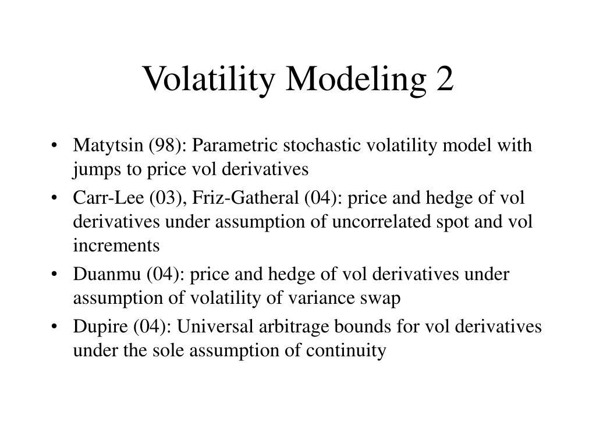

Volatility modeling is a crucial aspect of algorithmic trading, focusing on the prediction and exploitation of asset price fluctuations to maximize returns. This form of trading depends heavily on sophisticated mathematical models and statistical methods to improve market efficiency and liquidity. The primary goal is to anticipate market changes and make data-driven decisions at speeds and frequencies impossible for human traders. By systematically analyzing price dynamics, traders can develop strategies to optimize their positions based on predicted volatility patterns.

Algorithmic trading employs quantitative models designed to identify volatility signals swiftly and accurately. Models such as the Generalized Autoregressive Conditional Heteroskedasticity (GARCH) or stochastic volatility frameworks are central to this process, aiding in understanding price variance over time. These models provide traders with insights into when to enter or exit positions, taking advantage of fleeting market opportunities driven by volatility shifts.



Furthermore, the integration of machine learning techniques, such as neural networks, has enhanced the accuracy of predictions by analyzing vast datasets for hidden patterns. This machine-driven process allows traders to adjust their strategies dynamically, responding to market movements in real-time. Across various trading platforms, complex algorithms operate efficiently, executing trades based on pre-defined risk parameters and strategic goals.

Finally, the landscape of algorithmic volatility trading is shaped by leading financial firms, which leverage advanced technology to refine these models. While this approach offers undeniable advantages—such as speed, precision, and the ability to handle large volumes—it also presents challenges that traders must navigate. Market risk, evolving regulatory requirements, and technological dependencies are among the obstacles that require constant vigilance and adaptation to sustain profitability in this competitive domain.

## Table of Contents

## Understanding Volatility in Financial Markets

Volatility in financial markets refers to the extent of variation in trading prices over a specific period and serves as a vital gauge of market risk. It reflects how much and how quickly the value of an asset fluctuates, an essential metric for traders and investors. Mathematically, volatility is often represented by the standard deviation or variance of returns, capturing the dispersion of an asset's price from its mean value. The formula for historical volatility (σ) can be expressed as:

$$
\sigma = \sqrt{\frac{1}{N-1} \sum_{i=1}^{N} (R_i - \bar{R})^2}
$$

where $R_i$ is the return on the $i^{th}$ day, $\bar{R}$ is the average return over $N$ days, and $N$ is the number of observations.

High [volatility](/wiki/volatility-trading-strategies) implies a larger range of price changes, indicating a potential for considerable gains but accompanied by the prospect of significant losses. This characteristic attracts speculators aiming to capitalize on rapid price swings, enhancing market [liquidity](/wiki/liquidity-risk-premium) but also introducing higher risk levels. Conversely, low volatility suggests more stable price movements, appealing to risk-averse investors seeking steadier returns.

Volatility is classified into two primary types: historical volatility, calculated from past market prices, and implied volatility, derived from the market price of a financial derivative, such as options. Implied volatility is forward-looking, anticipating market expectations about future price movements.

Understanding volatility necessitates an appreciation of several foundational concepts, such as price trends, market cycles, and investor behavior. Market participants utilize these insights to interpret economic indicators and geopolitical events that could influence asset prices. Enhanced awareness of these concepts aids in developing effective risk management strategies and informed decision-making in trading practices.

Quantifying volatility allows traders to assess the risk associated with an asset and adjust their portfolios accordingly. Volatility indices, such as the VIX for the S&P 500, serve as benchmarks, representing market expectations of future volatility and guiding traders in structuring options and hedging strategies.

Overall, recognizing the implications of volatility in financial markets empowers traders to exploit profitable opportunities while mitigating potential risks. Understanding this dynamic component is crucial for navigating the complexities of trading environments and achieving financial objectives.

## Algorithmic Trading and Volatility

Algorithmic trading exploits market volatility by employing sophisticated computer algorithms to execute trades with high speed and precision. These algorithms, often associated with high-frequency trading ([HFT](/wiki/high-frequency-trading-strategies)), are designed to analyze market data in real-time, identify opportunities based on volatility signals, and execute orders in fractions of a second.

The core principle of [algorithmic trading](/wiki/algorithmic-trading) is the automation of the trading process, which enables traders to capitalize on minute price movements that occur frequently in the market. Algorithms are programmed to follow specific criteria based on statistical patterns, price movements, or [volume](/wiki/volume-trading-strategy) surges. This systematic approach allows for executing large orders without significantly impacting the market, ensuring efficiency and liquidity.

To predict and act on volatility signals, algorithms employ a range of sophisticated techniques. One common method is the use of statistical [arbitrage](/wiki/arbitrage) strategies, which involve the identification of pricing inefficiencies between related financial instruments. By exploiting these imbalances, traders aim to make rapid profits before the market corrects itself.

Additionally, algorithms incorporate models such as the Generalized Autoregressive Conditional Heteroskedasticity (GARCH) and stochastic volatility models. These are crucial for estimating and forecasting future volatility, allowing algorithms to adapt dynamically to changing market conditions. In Python, for example, the 'arch' library can be utilized to fit GARCH models for volatility forecasting. Here's a basic implementation:

```python
from arch import arch_model

# Simulated financial return data
returns = [0.02, -0.01, 0.03, -0.02, 0.01]

# Fit a GARCH(1, 1) model
model = arch_model(returns, vol='Garch', p=1, q=1)
model_fit = model.fit(disp='off')

# Predict future volatility
forecast = model_fit.forecast(horizon=5)
print(forecast.variance.values[-1:])
```

In addition to statistical models, [machine learning](/wiki/machine-learning) techniques play an increasing role in algorithmic trading strategies. By processing vast amounts of historical data, machine learning algorithms can detect complex patterns and relationships that traditional models might miss, thus providing more accurate volatility predictions. Reinforcement learning, for instance, is employed to optimize trading strategies by learning from the action-reward system in simulated trading environments.

In conclusion, algorithmic trading effectively harnesses the power of computation to respond rapidly to market volatility. By leveraging advanced models and data-driven strategies, these algorithms aim to efficiently exploit market fluctuations, thus maximizing trading profitability. Nonetheless, this approach demands a robust understanding of financial theories, programming skills, and an ability to manage systemic risks effectively.

## Statistical Models for Volatility Prediction

Statistical models play a pivotal role in predicting and understanding volatility in financial markets, particularly in algorithmic trading. Two prominent models, GARCH (Generalized Autoregressive Conditional Heteroskedasticity) and stochastic volatility models, stand out for their efficacy in forecasting and interpreting financial returns volatility.

GARCH models are widely employed to model financial time series exhibiting volatility clustering—a phenomenon where high-volatility events tend to cluster together. The GARCH model captures this by using past squared returns and past variances to estimate future volatility. The GARCH(p, q) model can be defined mathematically as:

$$
\sigma_t^2 = \alpha_0 + \sum_{i=1}^{p} \alpha_i \cdot \epsilon_{t-i}^2 + \sum_{j=1}^{q} \beta_j \cdot \sigma_{t-j}^2
$$

In this formula, $\sigma_t^2$ represents the forecasted variance at time $t$, $\epsilon_{t-i}^2$ are the squared residuals from past returns, and $\sigma_{t-j}^2$ are the lagged variances. The coefficients $\alpha_0$, $\alpha_i$, and $\beta_j$ are estimated from historical data. The adaptability of GARCH models allows them to be refined with extensions, such as EGARCH or GJR-GARCH, to capture asymmetric volatility effects.

Stochastic volatility models, on the other hand, account for changes in volatility over time by introducing latent variables that are governed by their stochastic processes. A commonly used stochastic volatility model is defined by the following set of equations:

$$
y_t = \mu + \exp(h_t / 2) \cdot \epsilon_t
$$
$$
h_{t+1} = \phi \cdot h_t + \eta_{t+1}
$$

Here, $y_t$ is the return at time $t$, $h_t$ represents the logarithm of volatility, and both $\epsilon_t$ and $\eta_{t+1}$ are assumed to be independent, standard normal error terms. The parameter $\phi$ dictates the persistence of volatility shocks.

In trading algorithms, these models serve distinct purposes. GARCH models are suitable for short-term volatility predictions due to their capacity to model conditional variance, providing signals for timing trades in markets with cyclical volatility behavior. Stochastic volatility models, with their continuous-time framework, better cater to derivatives pricing and risk management, offering insights into the underlying volatility that drives financial asset returns.

Consequently, a strategic implementation of these models within algorithmic trading systems can significantly enhance the decision-making process. Trading algorithms might incorporate these models to adjust portfolio risk dynamically, execute trades based on predicted changes in market volatility, and devise hedging strategies. By leveraging statistical models for volatility prediction, traders can potentially improve the accuracy of their forecasts and optimize their trading strategies, thus gaining an edge in the competitive financial markets.

## Role of Machine Learning in Volatility Trading

Machine learning has become an essential component in the realms of volatility trading. As markets evolve, traders leverage machine learning methodologies to better anticipate price movements based on historical data patterns, enhancing the predictive accuracy of their trading models. The two commonly used machine learning techniques in volatility trading are neural networks and [reinforcement learning](/wiki/reinforcement-learning).

### Neural Networks

Neural networks, specifically [deep learning](/wiki/deep-learning) models, offer powerful tools for modeling volatility. These models are adept at recognizing intricate patterns in large datasets, which are typical in financial markets. A deep [neural network](/wiki/neural-network) (DNN) consists of multiple layers, where each layer transforms the input data to capture linear and non-linear relationships essential for forecasting volatility.

For modeling purposes, a recurrent neural network (RNN), and more specifically, its variant called Long Short-Term Memory (LSTM), is often used. This is due to its ability to retain information over longer sequences, making it suitable for time-series data typical in market datasets.

Here is a simple Python example using an LSTM model to predict volatility:

```python
import numpy as np
import pandas as pd
from keras.models import Sequential
from keras.layers import LSTM, Dense

# Assume data is a pandas DataFrame with historical volatility data
def create_dataset(data, time_step=1):
    dataX, dataY = [], []
    for i in range(len(data)-time_step-1):
        a = data[i:(i+time_step), 0]
        dataX.append(a)
        dataY.append(data[i + time_step, 0])
    return np.array(dataX), np.array(dataY)

# Load and preprocess dataset
data = pd.read_csv('volatility_data.csv')
dataset = data.values
train_size = int(len(dataset) * 0.67)
train, test = dataset[0:train_size, :], dataset[train_size:len(dataset), :]

# Reshape data into X=t and Y=t+1
time_step = 10
X_train, y_train = create_dataset(train, time_step)
X_test, y_test = create_dataset(test, time_step)

# Reshape input to [samples, time steps, features] for LSTM
X_train = X_train.reshape(X_train.shape[0], X_train.shape[1], 1)
X_test = X_test.reshape(X_test.shape[0], X_test.shape[1], 1)

# Build LSTM model
model = Sequential()
model.add(LSTM(50, return_sequences=True, input_shape=(time_step, 1)))
model.add(LSTM(50, return_sequences=False))
model.add(Dense(1))
model.compile(optimizer='adam', loss='mse')

# Train the model
model.fit(X_train, y_train, epochs=100, batch_size=64, verbose=1)

# Predict and evaluate
y_pred = model.predict(X_test)
```

### Reinforcement Learning

Reinforcement learning (RL) has recently garnered attention due to its potential to optimize trading strategies through a policy-gradient approach. In volatility trading, RL models are used to make decisions that maximize cumulative rewards. This process involves an agent interacting with an environment through actions that lead to quantifiable rewards.

An agent in RL learns a trading policy by evaluating which actions yield the most favorable outcomes under volatility conditions. Techniques such as Deep Q-Networks (DQN) and Proximal Policy Optimization (PPO) are common in this domain.

For instance, a basic reinforcement learning setup for volatility trading might involve an agent that:

- Observes market volatility
- Decides whether to take long or short positions
- Receives rewards based on its decisions

The adaptability of machine learning models to dynamic data environments allows traders to automate complex trading strategies effectively. The application of neural networks enables traders to predict market shifts with higher precision, while reinforcement learning provides a robust framework for decision-making under uncertainty. The intersection of these methodologies in volatility modeling is enhancing the sophistication and effectiveness of algorithmic trading strategies.

## Tools and Platforms for Algorithmic Volatility Trading

The success of algorithmic volatility trading is intricately linked to the deployment of sophisticated software and platforms, enabling traders to execute strategies with precision and speed. QuantConnect stands out as a pivotal platform in this domain, offering a cloud-based algorithmic trading engine that integrates with multiple financial data sources. It provides users with access to a collaborative community, rich data libraries, and comprehensive documentation, which are essential for developing, testing, and deploying trading algorithms. Traders can use languages like Python and C# to implement complex models and backtest them extensively.

QuantLib, on the other hand, is a robust open-source library designed for quantitative finance. It is highly regarded for its comprehensive suite of mathematical tools and numerical methods that enable the modeling, analysis, and valuation of sophisticated financial instruments. QuantLib supports a variety of functionalities, such as options pricing, risk management, and of [course](/wiki/best-algorithmic-trading-courses), volatility modeling. Its flexibility allows integration into custom-built trading platforms, providing professionals with the bespoke tools necessary to engage in high-level trading strategies.

Platforms by [Interactive Brokers](/wiki/interactive-brokers-api) also play a significant role in algorithmic volatility trading. Interactive Brokers provides access to a wide array of trading instruments, real-time data feeds, and API capabilities, which are crucial for algorithmic traders. The Interactive Brokers API supports multiple programming languages, including Python, Java, and C++, giving traders the flexibility to develop and implement their custom algorithms efficiently.

The collective utilization of such tools and platforms empowers traders to handle the complexities of volatility trading. With the capability to backtest strategies over historical data, adjust models based on market conditions, and execute trades at high frequencies, these platforms significantly enhance the effectiveness and reliability of algorithmic trading operations. The continued evolution of these tools will likely further influence the landscape of financial markets, enabling traders to leverage ever more sophisticated techniques to manage volatility.

## Key Players in the Market

Two Sigma Investments and Citadel Securities are two prominent entities recognized for their leadership in the field of algorithmic volatility trading. These firms are at the forefront of utilizing advanced technology and computational power to optimize trading strategies, thereby maintaining their competitive edge in the financial markets.

Two Sigma Investments employs a scientific approach to finance, leveraging big data, machine learning, and distributed computing to refine their trading strategies. The company uses sophisticated algorithms that continuously adapt to market conditions, enabling precise volatility predictions and strategic trading decisions. Two Sigma's technology infrastructure is capable of processing vast amounts of financial data in real-time, which is crucial for executing high-frequency trades and minimizing latency, thus capturing opportunities as they arise.

Citadel Securities, another leader in algorithmic trading, applies advanced quantitative techniques to improve market-making and trading strategies. The firm uses a combination of proprietary technology and quantitative research to assess market volatility and identify profitable trading opportunities. Their trading platform is designed to handle a high volume of transactions efficiently, with an emphasis on speed and accuracy. Citadel Securities’ system architecture utilizes distributed computing to ensure that its trading operations are robust and scalable.

Both firms invest heavily in research and development to continually advance their technological capabilities. This includes exploring new algorithms, enhancing data analytics, and expanding computational resources. The use of [artificial intelligence](/wiki/ai-artificial-intelligence) and machine learning models plays a significant role in their trading activities, with applications ranging from volatility prediction to execution optimization.

The strategic use of technology by Two Sigma Investments and Citadel Securities not only enhances their trading efficiency but also contributes to market liquidity and stability. By facilitating seamless transactions and maintaining tight bid-ask spreads, these companies help improve overall market conditions.

Their success in algorithmic volatility trading underscores the importance of technology-driven strategies in achieving high performance in financial markets. As the industry evolves, the continuous innovation and adaptation employed by these key players set a benchmark for others aspiring to excel in algorithmic trading.

## Advantages and Challenges

Algorithmic trading presents numerous advantages, prominently featuring increased speed, improved efficiency, and the ability to execute strategies consistently. The automation of trade management allows for swift transactions that are executed in fractions of a second, a feat unachievable by human traders. This rapid execution leverages fleeting market opportunities, allowing traders to capitalize on short-term price movements effectively.

Furthermore, efficiency in algorithmic trading is enhanced by the minimization of human errors, which are prevalent in manual trading. Automation ensures adherence to predefined trading rules, thus ensuring that strategies are executed precisely as designed. This consistency in execution means that traders can backtest their models with confidence, knowing that the live execution will mirror the tests.

Another significant benefit lies in the ability of algorithms to process and analyze vast data sets at high speeds, allowing them to detect trends and anomalies that might be missed by human traders. This data-driven approach is further aided by advanced computational capabilities, facilitating comprehensive market analysis and improved decision-making.

However, algorithmic trading is not without its challenges. The unpredictability of market risk remains a significant concern. Despite highly sophisticated models and algorithms, financial markets can be influenced by unforeseen events that lead to rapid and unpredictable changes in volatility. Such events can surpass the predictive capabilities of existing models, leading to substantial financial losses.

Regulatory issues also pose challenges to algorithmic trading. Financial markets are subject to stringent regulations that vary across different jurisdictions. Trading algorithms must adhere to these regulations, which are continually evolving. Compliance requires ongoing monitoring and adjustment of trading strategies, adding layers of complexity to the trading process.

Technological dependencies further complicate algorithmic trading. The reliance on complex software and high-speed internet connections means that any technological glitch—be it a software bug, hardware failure, or network latency—can result in missed trades or erroneous transactions. This dependency necessitates robust risk management and contingency planning to mitigate potential technological failures.

Overall, while algorithmic trading offers substantial benefits in terms of speed and efficiency, traders must navigate the challenges posed by market risk, compliance with regulations, and technological dependencies to maintain a competitive edge.

## Conclusion

Algorithmic volatility trading leverages technology and advanced mathematical models to enhance trading profitability. Through the application of sophisticated algorithms, traders can capitalize on price fluctuations with remarkable precision and speed. These algorithms integrate volatility predictions, often derived from statistical models such as GARCH (Generalized Autoregressive Conditional Heteroskedasticity) and machine learning techniques, to inform trading strategies and optimize returns.

To succeed in this competitive domain, traders must remain vigilant about risk management. Market risk, inherent in the high levels of volatility that present both opportunities and threats, requires robust risk assessment frameworks. Employing stop-loss strategies, diversification, and hedging are common methods to mitigate these risks. 

Furthermore, adherence to regulatory standards is critical. As algorithmic trading operates at high frequencies and involves complex transactions, it attracts significant attention from regulatory bodies. Traders must ensure compliance with financial regulations to avoid penalties and maintain market integrity. This includes transparency in algorithm design and execution, maintaining audit trails, and adhering to market conduct rules.

The integration of technology, statistical acumen, and regulatory compliance forms the backbone of successful algorithmic volatility trading strategies. As markets evolve and technological advancements continue, traders are compelled to adapt and innovate continually, balancing the pursuit of profitability with the demands of risk management and regulatory adherence.

## References & Further Reading

[1]: Engle, R. F. (1982). ["Autoregressive Conditional Heteroscedasticity with Estimates of the Variance of United Kingdom Inflation."](https://www.jstor.org/stable/1912773) Econometrica, 50(4), 987-1007.

[2]: Bollerslev, T. (1986). ["Generalized Autoregressive Conditional Heteroskedasticity."](https://www.sciencedirect.com/science/article/pii/0304407686900631) Journal of Econometrics, 31(3), 307-327.

[3]: Hull, J. C. (2018). ["Options, Futures, and Other Derivatives."](https://elibrary.pearson.de/book/99.150005/9781292410623) Pearson Education.

[4]: Aït-Sahalia, Y., & Kimmel, R. L. (2007). ["Maximum likelihood estimation of stochastic volatility models."](https://www.princeton.edu/~yacine/stochvol.pdf) The Review of Financial Studies, 20(2), 413-444.

[5]: Francois, A., & John, C. (2006). ["Stochastic Volatility."](https://onlinelibrary.wiley.com/doi/10.1002/%28SICI%291099-1255%28200003/04%2915%3A2%3C137%3A%3AAID-JAE546%3E3.0.CO%3B2-M) Oxford University Press.

[6]: Tsay, R. S. (2010). ["Analysis of Financial Time Series."](https://onlinelibrary.wiley.com/doi/book/10.1002/9780470644560) John Wiley & Sons.

[7]: Lopez de Prado, M. (2018). ["Advances in Financial Machine Learning."](https://books.google.com/books/about/Advances_in_Financial_Machine_Learning.html?id=oU9KDwAAQBAJ) Wiley.

[8]: Jansen, S. (2018). ["Machine Learning for Algorithmic Trading."](https://github.com/stefan-jansen/machine-learning-for-trading) Packt Publishing. 

[9]: Chan, E. P. (2008). ["Quantitative Trading: How to Build Your Own Algorithmic Trading Business."](https://github.com/egorpe/EPChan-QuantitativeTrading/blob/master/example7_6.m) John Wiley & Sons.