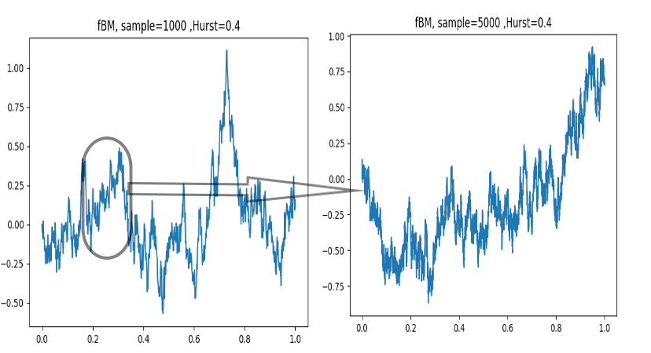

## Table of Contents

## What is volatility in financial markets?

Volatility in financial markets refers to how much and how quickly the price of a financial asset, like a stock or a commodity, changes over time. If the price of an asset moves up and down a lot in a short period, we say it has high volatility. On the other hand, if the price stays more or less the same, it has low volatility. Think of it like the weather: some days it's calm and stable, while other days it's stormy and unpredictable.

Volatility is important for investors because it affects how risky an investment is. When there's high volatility, it means there's a bigger chance that the price could go up a lot, but also that it could go down a lot. This can make investing exciting but also scary. People who like to take risks might enjoy high volatility, while those who prefer stability might look for assets with lower volatility. Understanding volatility helps investors make better choices about where to put their money.

## Why is volatility important for investors and traders?

Volatility is important for investors and traders because it tells them how risky an investment might be. If a stock or other asset has high volatility, its price can change a lot in a short time. This means there's a bigger chance the price could go up a lot, which could be good for making money. But it also means the price could go down a lot, which could lead to losing money. So, knowing about volatility helps investors and traders decide if they want to take the risk or not.

Traders, especially, use volatility to make quick decisions. They might buy an asset when its price is low and sell it when the price goes up, trying to make a profit from these fast changes. For long-term investors, understanding volatility helps them plan for the future. They might choose assets with lower volatility if they want their investments to be more stable over time. In both cases, volatility is a key piece of information that helps guide their choices in the financial markets.

## What are the basic types of volatility?

There are two basic types of volatility: historical volatility and implied volatility. Historical volatility looks at how much the price of an asset has changed in the past. It's like looking back at old weather reports to see how stormy it was. If a stock's price moved up and down a lot over the last month, it has high historical volatility. This helps investors understand what might happen in the future based on what happened before.

Implied volatility, on the other hand, is about what people think will happen in the future. It's like guessing how stormy the weather might be next week. Traders use this type of volatility when they buy and sell options, which are special kinds of investments. If people think a stock's price will move a lot in the future, the implied volatility will be high. This helps traders decide if they want to take a chance on that stock or not.

## How can volatility be measured?

Volatility can be measured using historical volatility and implied volatility. Historical volatility looks at how much the price of an asset has changed in the past. To measure it, you take the past prices of a stock or other asset over a certain time, like a month or a year. Then, you calculate how much those prices have moved up and down. If the prices have changed a lot, the historical volatility is high. If they haven't changed much, it's low. This helps investors see how wild or calm the price has been before.

Implied volatility is a bit different because it's about what people think will happen in the future. It's used a lot when people are buying and selling options, which are bets on where the price of an asset will go. To measure implied volatility, you look at the price of these options. If the options are expensive, it means people think the price of the asset will move a lot, so the implied volatility is high. If the options are cheap, it means people think the price won't move much, so the implied volatility is low. This helps traders guess how much the price might change in the future.

## What is the difference between historical and implied volatility?

Historical volatility looks at how much the price of something, like a stock, has gone up and down in the past. It's like looking at old weather reports to see how much it rained or how windy it was. If the price of a stock moved a lot over the last few months, then it has high historical volatility. This helps investors understand how wild or calm the stock has been before, which can give them a clue about what might happen next.

Implied volatility, on the other hand, is about what people think will happen to the price in the future. It's like guessing how much it might rain next week. This type of volatility is important when people are buying and selling options, which are bets on where the price of a stock will go. If people think the price will move a lot, the implied volatility will be high, making the options more expensive. This helps traders decide if they want to take a chance on that stock based on what they think might happen.

## What are some common volatility models used in finance?

One common volatility model used in finance is the GARCH model, which stands for Generalized Autoregressive Conditional Heteroskedasticity. This model is used to predict how much the price of a stock or other asset might move in the future. It looks at past price changes and uses them to guess future volatility. Imagine it's like using last week's weather to guess if it will be stormy next week. The GARCH model is popular because it can adjust to how volatility changes over time, making it useful for investors and traders who want to know how risky their investments might be.

Another model is the Black-Scholes model, which is often used to price options. Options are special kinds of investments that give you the right to buy or sell an asset at a certain price. The Black-Scholes model uses implied volatility to help figure out what an option should cost. It's like using the price of a raincoat to guess how much it might rain. This model helps traders understand how much the price of the asset might move in the future, which is important when deciding if an option is a good buy or not.

## How does the GARCH model work in volatility forecasting?

The GARCH model, which stands for Generalized Autoregressive Conditional Heteroskedasticity, is used to predict how much the price of a stock or other asset might move in the future. It does this by looking at how the price has moved in the past. Imagine you're trying to guess if it will be stormy next week. You might look at last week's weather to help you decide. The GARCH model works in a similar way. It uses past price changes to make a guess about future volatility. This helps investors and traders understand how risky their investments might be.

The GARCH model is special because it can change over time. It adjusts to new information, so if the price of a stock starts moving more or less than before, the model will notice and update its predictions. This is like how weather forecasts get better as new data comes in. By using the GARCH model, investors can get a more accurate idea of how much the price might go up or down, helping them make smarter choices about their money.

## What are the advantages and limitations of the Black-Scholes model in volatility modeling?

The Black-Scholes model is really helpful for figuring out how much options should cost. Options are special kinds of investments that let you buy or sell an asset at a certain price. The model uses something called implied volatility, which is a guess about how much the price of the asset might move in the future. By using this model, traders can decide if an option is a good deal or not. It's like using the price of a raincoat to guess how much it might rain. This makes it easier for people to make smart choices about buying and selling options.

But the Black-Scholes model isn't perfect. It makes some guesses that don't always match up with the real world. For example, it assumes that the price of the asset moves in a smooth, normal way, but in real life, prices can jump around a lot. It also assumes that you can buy and sell the asset whenever you want, which isn't always true. Because of these guesses, the model might not always give the right answer, especially during times when the market is really wild. So, while the Black-Scholes model is a good tool, it's important to use it carefully and know its limits.

## How can stochastic volatility models improve upon traditional models?

Stochastic volatility models can improve upon traditional models by better capturing how unpredictable the financial markets can be. Traditional models, like the Black-Scholes model, often assume that the price of an asset moves in a smooth, normal way. But in real life, prices can jump around a lot and change in ways that are hard to predict. Stochastic volatility models take this into account by allowing the volatility itself to change randomly over time. This makes them better at showing the ups and downs that really happen in the market, helping investors and traders make more accurate guesses about the future.

Another way stochastic volatility models help is by giving a more realistic picture of risk. Traditional models might underestimate how risky an investment can be because they don't account for sudden big changes in volatility. Stochastic models, on the other hand, can show that the risk of an investment can change quickly and unexpectedly. This is important for investors who want to understand how much their investments might go up or down. By using stochastic volatility models, they can get a better sense of the real risks they're facing, which helps them make smarter choices about where to put their money.

## What role do machine learning techniques play in modern volatility modeling?

Machine learning techniques have become really important in modern volatility modeling. They help by looking at huge amounts of data and finding patterns that traditional models might miss. Imagine you're trying to guess the weather by looking at a lot of different things, like temperature, wind, and humidity. Machine learning can do something similar with stock prices, news, and other financial data. By using these techniques, investors and traders can get better guesses about how much the price of an asset might move in the future, which helps them make smarter choices about their investments.

One cool thing about machine learning is that it can learn and get better over time. As more data comes in, the models can update themselves to give even more accurate predictions. This is really helpful because financial markets are always changing, and what worked yesterday might not work tomorrow. By using machine learning, people can stay ahead of the game and understand the risks better. This makes it a powerful tool for anyone trying to navigate the ups and downs of the financial world.

## How do you calibrate and validate a volatility model?

Calibrating a volatility model means adjusting it so it matches up with real data. Imagine you're trying to guess how much it will rain next week. You'd look at how much it rained last week and maybe even the week before that. In the same way, to calibrate a volatility model, you use past stock prices or other financial data. You change the model's settings until its guesses about how much the stock price will move match what really happened. This helps make sure the model is working right and giving good predictions.

Validating a volatility model means checking if it's doing a good job. After you've calibrated the model, you test it with new data that it hasn't seen before. It's like using your rain guess from last week to see if it helps predict this week's weather. If the model's guesses about how much the stock price will move are close to what actually happens, then it's working well. If not, you might need to go back and tweak the model some more. This step is important because it helps you trust the model and use it to make smart choices about investments.

## What advanced techniques are used in volatility modeling for high-frequency trading?

In high-frequency trading, where trades happen really fast, people use some special techniques to understand how much the price of a stock might move. One of these techniques is called realized volatility. It looks at how much the price has changed over very short periods, like seconds or minutes. By using this, traders can get a quick idea of how wild or calm the market is right now. Another technique is called intraday volatility modeling, which helps traders see how the price might move during the day. This is really helpful because high-frequency traders need to make quick decisions based on what's happening in the market at that very moment.

Another advanced technique is using machine learning algorithms. These can look at tons of data really fast and find patterns that might be hard for people to see. For example, machine learning can use data from past trades, news, and even social media to guess how much the price might move in the next few seconds. This helps traders make better decisions and react quickly to changes in the market. By using these advanced techniques, high-frequency traders can stay ahead of the game and make smart choices about when to buy and sell.

## What is the key to understanding volatility in financial markets?

Volatility in financial markets refers to the extent of variation in trading prices over a specific period and serves as a vital gauge of market risk. It reflects how much and how quickly the value of an asset fluctuates, an essential metric for traders and investors. Mathematically, volatility is often represented by the standard deviation or variance of returns, capturing the dispersion of an asset's price from its mean value. The formula for historical volatility (σ) can be expressed as:

$$
\sigma = \sqrt{\frac{1}{N-1} \sum_{i=1}^{N} (R_i - \bar{R})^2}
$$

where $R_i$ is the return on the $i^{th}$ day, $\bar{R}$ is the average return over $N$ days, and $N$ is the number of observations.

High [volatility](/wiki/volatility-trading-strategies) implies a larger range of price changes, indicating a potential for considerable gains but accompanied by the prospect of significant losses. This characteristic attracts speculators aiming to capitalize on rapid price swings, enhancing market [liquidity](/wiki/liquidity-risk-premium) but also introducing higher risk levels. Conversely, low volatility suggests more stable price movements, appealing to risk-averse investors seeking steadier returns.

Volatility is classified into two primary types: historical volatility, calculated from past market prices, and implied volatility, derived from the market price of a financial derivative, such as options. Implied volatility is forward-looking, anticipating market expectations about future price movements.

Understanding volatility necessitates an appreciation of several foundational concepts, such as price trends, market cycles, and investor behavior. Market participants utilize these insights to interpret economic indicators and geopolitical events that could influence asset prices. Enhanced awareness of these concepts aids in developing effective risk management strategies and informed decision-making in trading practices.

Quantifying volatility allows traders to assess the risk associated with an asset and adjust their portfolios accordingly. Volatility indices, such as the VIX for the S&P 500, serve as benchmarks, representing market expectations of future volatility and guiding traders in structuring options and hedging strategies.

Overall, recognizing the implications of volatility in financial markets empowers traders to exploit profitable opportunities while mitigating potential risks. Understanding this dynamic component is crucial for navigating the complexities of trading environments and achieving financial objectives.

## What are Statistical Models for Volatility Prediction?

Statistical models play a pivotal role in predicting and understanding volatility in financial markets, particularly in algorithmic trading. Two prominent models, GARCH (Generalized Autoregressive Conditional Heteroskedasticity) and stochastic volatility models, stand out for their efficacy in forecasting and interpreting financial returns volatility.

GARCH models are widely employed to model financial time series exhibiting volatility clustering—a phenomenon where high-volatility events tend to cluster together. The GARCH model captures this by using past squared returns and past variances to estimate future volatility. The GARCH(p, q) model can be defined mathematically as:

$$
\sigma_t^2 = \alpha_0 + \sum_{i=1}^{p} \alpha_i \cdot \epsilon_{t-i}^2 + \sum_{j=1}^{q} \beta_j \cdot \sigma_{t-j}^2
$$

In this formula, $\sigma_t^2$ represents the forecasted variance at time $t$, $\epsilon_{t-i}^2$ are the squared residuals from past returns, and $\sigma_{t-j}^2$ are the lagged variances. The coefficients $\alpha_0$, $\alpha_i$, and $\beta_j$ are estimated from historical data. The adaptability of GARCH models allows them to be refined with extensions, such as EGARCH or GJR-GARCH, to capture asymmetric volatility effects.

Stochastic volatility models, on the other hand, account for changes in volatility over time by introducing latent variables that are governed by their stochastic processes. A commonly used stochastic volatility model is defined by the following set of equations:

$$
y_t = \mu + \exp(h_t / 2) \cdot \epsilon_t
$$
$$
h_{t+1} = \phi \cdot h_t + \eta_{t+1}
$$

Here, $y_t$ is the return at time $t$, $h_t$ represents the logarithm of volatility, and both $\epsilon_t$ and $\eta_{t+1}$ are assumed to be independent, standard normal error terms. The parameter $\phi$ dictates the persistence of volatility shocks.

In trading algorithms, these models serve distinct purposes. GARCH models are suitable for short-term volatility predictions due to their capacity to model conditional variance, providing signals for timing trades in markets with cyclical volatility behavior. Stochastic volatility models, with their continuous-time framework, better cater to derivatives pricing and risk management, offering insights into the underlying volatility that drives financial asset returns.

Consequently, a strategic implementation of these models within algorithmic trading systems can significantly enhance the decision-making process. Trading algorithms might incorporate these models to adjust portfolio risk dynamically, execute trades based on predicted changes in market volatility, and devise hedging strategies. By leveraging statistical models for volatility prediction, traders can potentially improve the accuracy of their forecasts and optimize their trading strategies, thus gaining an edge in the competitive financial markets.

## References & Further Reading

[1]: Engle, R. F. (1982). ["Autoregressive Conditional Heteroscedasticity with Estimates of the Variance of United Kingdom Inflation."](https://www.jstor.org/stable/1912773) Econometrica, 50(4), 987-1007.

[2]: Bollerslev, T. (1986). ["Generalized Autoregressive Conditional Heteroskedasticity."](https://www.sciencedirect.com/science/article/pii/0304407686900631) Journal of Econometrics, 31(3), 307-327.

[3]: Hull, J. C. (2018). ["Options, Futures, and Other Derivatives."](https://elibrary.pearson.de/book/99.150005/9781292410623) Pearson Education.

[4]: Aït-Sahalia, Y., & Kimmel, R. L. (2007). ["Maximum likelihood estimation of stochastic volatility models."](https://www.princeton.edu/~yacine/stochvol.pdf) The Review of Financial Studies, 20(2), 413-444.

[5]: Francois, A., & John, C. (2006). ["Stochastic Volatility."](https://onlinelibrary.wiley.com/doi/10.1002/%28SICI%291099-1255%28200003/04%2915%3A2%3C137%3A%3AAID-JAE546%3E3.0.CO%3B2-M) Oxford University Press.

[6]: Tsay, R. S. (2010). ["Analysis of Financial Time Series."](https://onlinelibrary.wiley.com/doi/book/10.1002/9780470644560) John Wiley & Sons.

[7]: Lopez de Prado, M. (2018). ["Advances in Financial Machine Learning."](https://books.google.com/books/about/Advances_in_Financial_Machine_Learning.html?id=oU9KDwAAQBAJ) Wiley.

[8]: Jansen, S. (2018). ["Machine Learning for Algorithmic Trading."](https://github.com/stefan-jansen/machine-learning-for-trading) Packt Publishing. 

[9]: Chan, E. P. (2008). ["Quantitative Trading: How to Build Your Own Algorithmic Trading Business."](https://github.com/egorpe/EPChan-QuantitativeTrading/blob/master/example7_6.m) John Wiley & Sons.