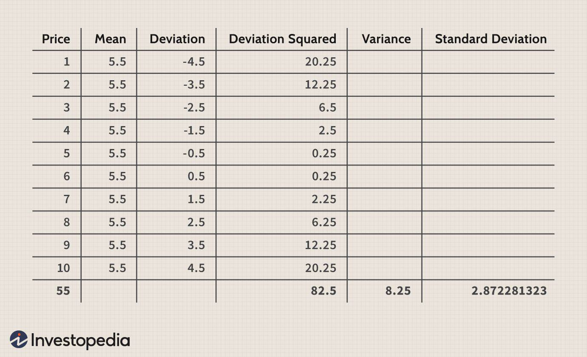

In an ever-evolving financial landscape, market volatility presents both challenges and opportunities for investors. This volatility, characterized by rapid and unpredictable fluctuations in asset prices, is often driven by factors such as economic indicators, geopolitical tensions, and technological disruptions. Understanding and navigating this volatility are crucial for investors seeking to maintain and grow their portfolios.

Dividend stocks and algorithmic trading have emerged as key strategies to navigate and thrive during volatile times. Dividend stocks are typically issued by financially stable companies that provide consistent income through regular payouts. These stocks not only offer equity growth potential but also serve as a quasi-bond instrument, providing steady cash flow and potentially lessening the impact of market swings.



On the other hand, algorithmic trading leverages advanced algorithms and artificial intelligence (AI) to execute high-speed trades based on predefined criteria and vast data analyses. This strategy can mitigate emotional biases inherent in human trading, allowing for more efficient and logical decision-making. While algorithmic trading involves certain risks, such as the need for robust risk management frameworks, it holds promise for enhancing trading efficiency and market adaptability.

This article explores how dividend stocks and algorithmic trading can contribute to investment stability and market adaptability, providing investors with tools to not only cope with market unpredictability but also capitalize on the opportunities it presents. Understanding and applying these strategies can empower investors to turn market challenges into avenues for future success.

## Table of Contents

## Understanding Market Volatility

Market volatility refers to the rapid and unpredictable changes in asset prices, an intrinsic characteristic of financial markets. These fluctuations can be driven by a myriad of factors, making them a complex phenomenon to understand and predict. Economic indicators, such as interest rates, inflation reports, and employment data, play a significant role in influencing market sentiments and price movements. For instance, unexpected changes in central bank policies, like interest rate adjustments, can swiftly alter investor expectations and lead to sudden price swings.

Geopolitical tensions also contribute to volatility. Events such as trade wars, political unrest, or changes in government can cause uncertainty, impacting investor confidence and resulting in volatile market conditions. For example, geopolitical tensions in oil-producing regions can lead to fluctuations in oil prices, which, in turn, affect global stock markets and contribute to broader volatility.

Technological disruptions further complicate the [volatility](/wiki/volatility-trading-strategies) landscape. The rapid pace of technological advances can lead to shifts in market dynamics, such as the emergence of new industries or declines in traditional sectors. Technological changes can also impact trading mechanisms, as seen with the rise of [algorithmic trading](/wiki/algorithmic-trading), which can amplify market movements, especially during periods of high activity.

Despite the challenges presented by market volatility, it also offers potential opportunities for investors willing to embrace its uncertainties. Volatile markets can create situations where asset prices are misaligned with their fundamental values, providing opportunities for astute investors to buy undervalued securities or short overvalued ones. This often involves a thorough analysis and understanding of the factors driving volatility and devising strategies to capitalize on these market conditions.

In summary, while market volatility poses significant challenges, it can also serve as a gateway to investment opportunities for those equipped to navigate its complexities effectively. By understanding the underlying causes of volatility and employing strategies to mitigate its risks, investors can leverage these fluctuations to their advantage.

## The Role of Dividend Stocks in Investment Stability

Dividend stocks have long been considered a cornerstone of investment portfolios due to their ability to provide consistent income, particularly in volatile market conditions. These stocks represent a portion of the profits distributed to shareholders by companies, usually on a regular basis. One of the primary attractions of dividend stocks is their perceived lower volatility compared to non-dividend-paying stocks. This stability arises from the income generated through regular dividend payouts, which can buffer against market fluctuations.

Companies that offer dividend stocks tend to exhibit strong financial health. They typically possess robust cash flow, manageable debt levels, and a history of profitability, which allows them to sustain regular dividend payments. This financial strength can contribute to the resilience of dividend-paying stocks during periods of economic uncertainty. Investors often view these companies as being more mature, with established business models and predictable revenue streams. As a result, dividend stocks are less likely to experience the sharp price swings often seen with [growth stocks](/wiki/growth-stocks), which may be more vulnerable to market sentiment and speculative behavior.

Moreover, dividend stocks are perceived as quasi-bond instruments. They offer a blend of equity growth potential and steady cash flow, appealing to investors seeking both security and growth. The steady income component makes dividend stocks similar to bonds, which provide regular interest payments. However, unlike bonds, dividend stocks still offer the potential for capital appreciation, providing an opportunity for equity growth.

In financial terms, the total return on a dividend stock can be expressed as the sum of the dividend yield and capital gains. Mathematically, this can be represented as:

$$
\text{Total Return} = \left(\frac{\text{Dividends Received}}{\text{Initial Investment}} \right) + \left(\frac{\text{Change in Stock Price}}{\text{Initial Stock Price}} \right)
$$

This formula highlights how dividend stocks provide a dual source of return: through periodic cash distributions (dividends) and potential increases in stock price (capital gains). As such, dividend-paying stocks can play a crucial role in portfolio diversification, aiding in risk management and enhancing portfolio stability through regular income despite stock market conditions.

Given their tangible benefits, dividend stocks are frequently used by income-focused investors and those seeking a relatively stable investment option amidst market volatility. They are particularly attractive for retirees or individuals looking to supplement their income streams with regular cash inflows. By combining both income and growth potential, dividend stocks have established themselves as an essential component in constructing resilient and adaptable investment portfolios.

## Market Volatility and Algorithmic Trading

Algorithmic trading employs [artificial intelligence](/wiki/ai-artificial-intelligence) (AI) and sophisticated algorithms to execute trades at speeds and frequencies that exceed human capabilities. This method operates based on predefined criteria, such as timing, price, and quantity, allowing for systematic decision-making free from the emotional biases that often influence human trading behavior. By relying on quantitative data analysis and historical trends, algorithmic trading can enhance the efficiency of decision-making processes, offering a more disciplined approach to navigating volatile markets.

Despite its advantages, algorithmic trading is not without significant risks. The inherent complexity of these systems means they can be vulnerable to technological failures, such as software bugs or system overloads, which can lead to substantial financial losses. Moreover, market anomalies, like flash crashes, can be exacerbated by automated trading, highlighting the need for robust risk management frameworks. Effective risk management strategies often involve continuous monitoring of algorithms, stress testing under various market conditions, and setting safeguards such as circuit breakers to limit adverse impacts.

Algorithmic trading's reliance on high-frequency trades—often referred to as high-frequency trading ([HFT](/wiki/high-frequency-trading-strategies))—also necessitates a focus on latency, the time delay between data input and trade execution. Minimizing latency is crucial for maintaining competitive advantage in markets where even milliseconds can determine the profitability of trades. Successful implementation of algorithmic trading strategies often involves significant technological investment to optimize communication networks and computing infrastructure.

In conclusion, while algorithmic trading offers the potential to navigate market volatility with precision and speed, it requires comprehensive risk management and technological commitment to harness its full benefits. By effectively managing these risks, investors can leverage algorithmic trading to achieve more reliable and consistent outcomes in dynamic financial markets.

## Addressing Market Volatility through AI and Technology

Artificial intelligence (AI) and technology are reshaping how investors address market volatility, offering advanced tools to enhance trading strategies and improve predictive accuracy. AI-enhanced algorithms play a central role by analyzing extensive datasets in real time to identify emerging trends and predict market movements. These algorithms utilize [machine learning](/wiki/machine-learning) models, such as neural networks and decision trees, to process historical data, current market conditions, and even non-traditional data sources like social media sentiment to forecast price fluctuations. The formula for a basic linear regression model, often a component of more complex predictive models, is expressed as: 

$$

Y = \beta_0 + \beta_1 X_1 + \beta_2 X_2 + \ldots + \beta_n X_n + \epsilon 
$$

where $Y$ represents the dependent variable (e.g., asset price), $\beta_0$ is the intercept, $\beta_1, \beta_2, \ldots, \beta_n$ are the coefficients, $X_1, X_2, \ldots, X_n$ are the independent variables (predictors), and $\epsilon$ is the error term.

Dynamic adjustments in trading strategies are facilitated by algorithms capable of executing trades based on real-time market analysis. These algorithms enable high-frequency trading, making numerous trades with minimal human intervention, thereby reducing the influence of emotional biases. Python, a preferred programming language for developing such algorithms, allows for efficient data manipulation and modeling. A simple example of a trading strategy using Python might include:

```python
import numpy as np
import pandas as pd

# Example: Moving Average Crossover Strategy
def moving_average(data, window):
    return data.rolling(window=window).mean()

# Sample data
price_data = pd.Series([100, 102, 104, 103, 105, 107, 106])

# Calculate moving averages
short_window = 3
long_window = 5
short_ma = moving_average(price_data, short_window)
long_ma = moving_average(price_data, long_window)

# Generate signals
signal = np.where(short_ma > long_ma, 1, 0)
```

This basic code demonstrates using moving averages as a signal generator, which can be complexified with more sophisticated techniques and larger datasets.

As AI-driven trading becomes more prevalent, regulatory frameworks are evolving to ensure market transparency and stability. Regulatory bodies are focusing on mitigating risks associated with high-frequency and algorithmic trading to preserve market integrity. This involves designing strategies to monitor algorithmic trades, ensuring that they adhere to established rules, and minimizing the risk of exacerbating market volatility. An example of regulatory response includes enforcing circuit breakers that temporarily halt trading when excessive market movements occur to prevent panic selling and provide a cooling-off period for traders.

In summary, the integration of AI and advanced technology within trading strategies is crucial for effectively addressing market volatility. By leveraging sophisticated algorithms for data analysis and trade execution, investors can better navigate and anticipate market dynamics, ultimately leading to a more controlled approach to investment amidst fluctuating financial conditions.

## Diversification and Risk Management Strategies

Portfolio diversification is a fundamental strategy employed to mitigate risks associated with market volatility. By spreading investments across various sectors and asset classes, investors can reduce their exposure to specific market fluctuations. This approach ensures that the adverse performance of one sector or asset class can be potentially offset by more favorable outcomes in others, thereby stabilizing overall portfolio returns.

Implementing stop-loss orders is another protective measure that helps manage potential downsides. A stop-loss order is an investor's directive to their broker to execute a sale of a security once it reaches a predetermined price. This simple yet effective tool aids in limiting losses and protecting gains by automatically liquidating a position before losses mount. For example, if an investor owns a stock currently priced at $50 and sets a stop-loss order at $45, the order will trigger a sale if the stock price falls to $45, thereby preventing further financial loss.

Another prudent strategy is dollar-cost averaging (DCA), which involves regularly investing a fixed amount of money into a particular investment, regardless of its price. This method of investing reduces the impact of volatility on the overall purchase price of a given asset, as it implies buying more shares when prices are low and fewer shares when prices are high. DCA can be particularly effective in turbulent markets as it promotes disciplined investing and reduces the risk of making impulsive investment decisions based on short-term market movements.

Furthermore, long-term strategies such as these are crucial for navigating turbulent markets. By focusing on the bigger picture and maintaining a well-balanced, diversified portfolio, investors can better withstand short-term volatility and align their investments with long-term financial goals. Calculated risk management, rooted in diversification and the use of protective measures, fosters a stable investment environment and enhances the likelihood of achieving favorable financial outcomes over time.

## Regulation and Market Integrity

As algorithmic trading gains prominence in financial markets, maintaining market integrity has become increasingly important. Algorithmic trading, with its rapid execution and complex strategies, poses both opportunities and challenges. To ensure a fair and transparent market environment, regulators have intensified their efforts to oversee these activities.

One primary area of focus for regulators is enhancing transparency in trading practices. High-frequency trading (HFT), a subset of algorithmic trading, involves executing a large number of orders at extremely high speeds. The speed and [volume](/wiki/volume-trading-strategy) characteristic of HFT can lead to market disruptions if not properly monitored. To mitigate such risks, regulatory bodies such as the U.S. Securities and Exchange Commission (SEC) and the European Securities and Markets Authority (ESMA) have implemented measures to ensure that trading activities are transparent and that appropriate data reporting standards are adhered to by market participants.

A specific challenge in regulating algorithmic trading is the need to balance technological innovation with investor protection. On one hand, technological advancements have improved market efficiency and [liquidity](/wiki/liquidity-risk-premium). On the other hand, they have introduced new risks and complexities that can undermine market stability. To address this, regulatory frameworks are evolving to incorporate advanced supervisory technologies, often referred to as "SupTech" and "RegTech." These technologies enable regulators to monitor market activities more effectively and identify irregular patterns indicative of manipulation or other illicit behaviors.

For instance, real-time surveillance systems have been developed to detect anomalies in trading patterns that might suggest market abuse, such as spoofing or layering—practices where traders place large orders that they intend to cancel to manipulate prices. By employing machine learning algorithms and data analytics, regulators can enhance their ability to enforce market rules and protect investors.

Furthermore, ensuring market integrity extends beyond national regulations, necessitating international cooperation. Markets are becoming increasingly globalized, and trading activities often span multiple jurisdictions. International regulatory bodies, such as the International Organization of Securities Commissions (IOSCO), play a crucial role in fostering cooperation and establishing global standards to manage cross-border trading risks.

In summary, as algorithmic trading shapes the future of financial markets, the imperative to uphold market integrity becomes an essential task for regulators worldwide. By promoting transparency, embracing technology in regulation, and fostering international collaboration, regulatory bodies aim to safeguard investor interests while supporting the innovation that algorithmic trading offers.

## Conclusion: Harnessing Volatility for Investment Success

In navigating the turbulent waters of financial markets, dividend stocks and algorithmic trading stand out as potent strategies for managing market volatility. Dividend stocks provide investors with a stable income stream, grounded in companies that typically exhibit strong financial stability. This consistent income acts as a cushion against market fluctuations, helping to smoothen the equity curve for investors seeking both growth and income. Moreover, these stocks maintain a dual role, akin to bonds, by offering both the potential for equity appreciation and steady cash inflows.

Algorithmic trading, on the other hand, presents a technological edge in processing and reacting to market movements with precision and speed. By leveraging AI and machine learning, these systems can identify patterns and execute trades devoid of emotional biases inherent in human decision-making. This allows for efficient capital allocation, even amid significant market shifts. However, mastering algorithmic trading requires a robust framework to address its inherent risks, including market anomalies and execution hazards, which can be managed through comprehensive risk management strategies.

The dynamic nature of modern finance mandates a blend of innovation and careful planning. Investors who strategically incorporate dividend stocks into their portfolios can benefit from consistent returns, while those who harness algorithmic trading can enhance their market responsiveness. Ultimately, the essence of thriving amid market volatility lies in adaptability and informed decision-making. By adopting these strategies, investors can transform market challenges into avenues for growth, ensuring their portfolios are both resilient and responsive to the ever-changing financial landscape.

## References & Further Reading

[1]: Bergstra, J., Bardenet, R., Bengio, Y., & Kégl, B. (2011). ["Algorithms for Hyper-Parameter Optimization."](https://dl.acm.org/doi/10.5555/2986459.2986743) Advances in Neural Information Processing Systems 24.

[2]: ["Advances in Financial Machine Learning"](https://www.amazon.com/Advances-Financial-Machine-Learning-Marcos/dp/1119482089) by Marcos Lopez de Prado

[3]: ["Evidence-Based Technical Analysis: Applying the Scientific Method and Statistical Inference to Trading Signals"](https://www.amazon.com/Evidence-Based-Technical-Analysis-Scientific-Statistical/dp/0470008741) by David Aronson

[4]: ["Machine Learning for Algorithmic Trading"](https://github.com/stefan-jansen/machine-learning-for-trading) by Stefan Jansen

[5]: ["Quantitative Trading: How to Build Your Own Algorithmic Trading Business"](https://www.amazon.com/Quantitative-Trading-Build-Algorithmic-Business/dp/1119800064) by Ernest P. Chan