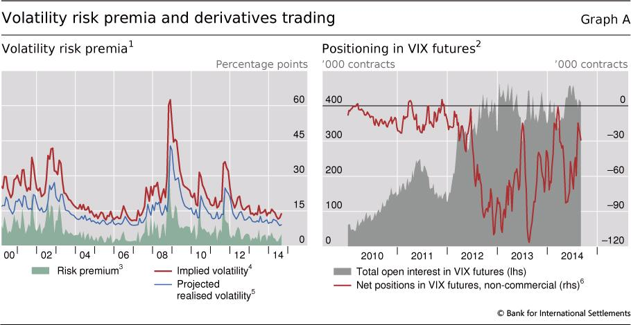

## Table of Contents

## What is the volatility premium?

The volatility premium is the extra return that investors expect to earn for taking on the risk of investing in assets that have higher volatility. In simple terms, it's like a reward for being willing to invest in something that might go up and down a lot in value. This premium is often seen in the stock market, where stocks that are more volatile tend to offer higher potential returns to compensate for their increased risk.

Investors can try to capture this volatility premium by investing in assets that are known to be more volatile, like small-cap stocks or emerging market stocks. However, it's important to understand that while the potential for higher returns exists, so does the potential for bigger losses. Therefore, investors need to carefully consider their risk tolerance and investment goals before trying to take advantage of the volatility premium.

## How is the volatility premium calculated?

The volatility premium is not something you can calculate with a simple formula like you might use for other financial measures. Instead, it's more of a concept that shows up in the difference between the expected returns of volatile assets and less volatile ones. To see it, you would look at how much more return, on average, you get from investing in something risky compared to something safe over a long period of time.

For example, if you compare the average returns of a stock index that includes many volatile stocks to a bond index, which is usually less volatile, you might see that the stock index has higher returns over time. This difference in returns is what people call the [volatility](/wiki/volatility-trading-strategies) premium. It's the extra reward you might get for being willing to take on more risk. However, remember that past performance doesn't guarantee future results, so this premium can change and isn't always there.

## Why is the volatility premium important in financial markets?

The volatility premium is important in financial markets because it helps explain why some investors are willing to take on more risk. When people invest in stocks or other assets that go up and down a lot, they expect to be rewarded with higher returns. This extra return is the volatility premium. It's like a bonus for being brave enough to handle the ups and downs of the market. Without this premium, fewer people might be willing to invest in risky assets, which could make the market less dynamic and less able to fund new businesses and projects.

Understanding the volatility premium also helps investors make better choices. If they know that they might get higher returns from volatile investments, they can decide if the potential reward is worth the risk. This knowledge can guide them in building a balanced portfolio that matches their comfort with risk and their financial goals. By considering the volatility premium, investors can aim to improve their long-term returns while being aware of the potential for bigger losses along the way.

## What are the main factors that influence the volatility premium?

The volatility premium can change because of many things. One big [factor](/wiki/factor-investing) is how the economy is doing. When the economy is growing and people feel good about the future, they might be more willing to take risks, which can make the volatility premium smaller. But if the economy is shaky or people are worried, they might want safer investments, which can make the volatility premium bigger. Another factor is what's happening in the stock market. If the market is going up a lot, people might expect bigger rewards from risky stocks, pushing up the volatility premium. But if the market is going down, the premium might shrink because people are scared to take risks.

Another thing that affects the volatility premium is how much people know about the market. If there's a lot of uncertainty or big news that could change things, like new laws or big world events, the volatility premium might go up because people want more reward for taking on the extra risk. Also, how much money is available to invest can make a difference. When there's a lot of money looking for a place to go, it might push up the prices of risky investments, which can make the volatility premium smaller. But if money is tight, the premium might get bigger because fewer people are willing to take risks.

## How does the volatility premium relate to risk and return?

The volatility premium is all about the extra money you might get for taking on more risk when you invest. Imagine you have two choices: one is a safe investment like a savings account, and the other is a risky investment like a stock that goes up and down a lot. Over time, the risky stock might give you more money back than the safe savings account. This extra money you could earn from the stock is what we call the volatility premium. It's like a reward for being brave enough to handle the ups and downs.

This idea is important because it helps explain why people are willing to invest in things that can be scary and unpredictable. If there was no chance of getting more money from risky investments, not many people would bother with them. But because the volatility premium exists, people see the potential for higher returns and decide it's worth the risk. Just remember, the premium can change and isn't always there, so it's important to think carefully about how much risk you're okay with before you invest.

## Can you explain the difference between realized and implied volatility in the context of the volatility premium?

Realized volatility and implied volatility are two different ways to measure how much an investment might go up and down. Realized volatility looks at how much an investment has actually moved in the past. It's like looking back at a stock's price history and seeing how much it has jumped around over a certain time, like a month or a year. This can help investors understand how risky an investment has been and can give them an idea of what to expect in the future, but it's based on what has already happened.

Implied volatility, on the other hand, is about what people think might happen in the future. It's used a lot with options, which are contracts that give you the right to buy or sell something at a certain price. When people buy and sell these options, the prices they agree on can show how much they think the investment will move around in the future. If people think a stock will be very jumpy, they'll pay more for options, which means the implied volatility is high. The difference between realized and implied volatility can affect the volatility premium because it shows how much extra return people expect for taking on the risk of future ups and downs.

## What are some common strategies for capturing the volatility premium?

One common way to try to capture the volatility premium is by investing in stocks that are known to be more volatile, like small companies or companies in new markets. These stocks can go up and down a lot, but over time, they might give you higher returns than safer investments like big, stable companies. Investors might choose to put some of their money into these riskier stocks, hoping to earn the extra reward that comes with the volatility premium. But it's important to remember that this strategy can also lead to bigger losses, so it's not for everyone.

Another strategy is to use options, which are contracts that let you buy or sell something at a certain price in the future. By selling options on stocks that are expected to be volatile, investors can collect money from other people who want to bet on those stocks. This money is like a payment for taking on the risk of the stock moving a lot. If the stock doesn't move as much as expected, the person selling the option keeps the money, which can add up to a nice extra return over time. But if the stock moves a lot more than expected, the person selling the option could lose money, so it's a risky strategy that needs careful management.

## How do market conditions affect the volatility premium?

Market conditions play a big role in how big or small the volatility premium can be. When the economy is doing well and people feel confident, they might be more willing to take risks with their money. This can make the volatility premium smaller because more people are okay with investing in things that go up and down a lot. But if the economy is struggling or there's a lot of uncertainty, like during a recession or a big world event, people might want to play it safe. This can make the volatility premium bigger because they want more reward for taking on the extra risk of volatile investments.

The stock market itself can also change the volatility premium. If the market is going up and people are excited about making money, they might expect bigger rewards from risky stocks, which can push up the volatility premium. But if the market is going down and people are scared, the premium might shrink because fewer people are willing to take risks. So, the volatility premium isn't always the same; it moves around based on what's happening in the economy and the stock market.

## What are the historical trends of the volatility premium?

Over the years, the volatility premium has shown some interesting patterns. When you look back at history, you can see that during good times, like when the economy is growing and people feel confident, the volatility premium tends to be smaller. This is because more people are willing to take risks with their money, so they don't need as much extra reward to invest in things that go up and down a lot. For example, during the long bull market of the 1990s, the volatility premium was often lower because people were excited about investing in stocks and other risky assets.

On the other hand, during tough times, like when there's a recession or a big world event causing uncertainty, the volatility premium tends to get bigger. This happens because people want to be safer with their money, so they need a bigger reward to take on the risk of volatile investments. You can see this during events like the 2008 financial crisis, where the volatility premium spiked because people were scared and wanted more return for taking on risk. So, the volatility premium isn't always the same; it changes based on what's happening in the world and the economy.

## How can investors use options to exploit the volatility premium?

Investors can use options to try to make money from the volatility premium by selling options on stocks that are expected to be volatile. When you sell an option, you get money from someone who wants to bet on the stock moving a lot. This money is like a payment for taking on the risk that the stock might go up or down more than expected. If the stock doesn't move as much as people thought it would, the person who sold the option gets to keep the money they received. Over time, this can add up to a nice extra return, which is the volatility premium.

But using options to capture the volatility premium can be risky. If the stock moves a lot more than expected, the person who sold the option could lose money. They might have to pay out more than they received when they sold the option. So, it's important for investors to carefully manage their options and understand the risks. They need to think about how much they're willing to lose and make sure they're okay with the ups and downs that come with trying to earn the volatility premium through options.

## What are the risks associated with trying to capture the volatility premium?

Trying to capture the volatility premium can be risky because it means investing in things that go up and down a lot. If you put your money into stocks that are very volatile, you might make more money over time, but you could also lose a lot if the market takes a big dip. It's like riding a roller coaster; it can be exciting, but it can also make you feel sick if it goes too wild. So, if you're not ready for big swings in your investment value, trying to earn the volatility premium might not be right for you.

Another risk comes from using options to try to capture the volatility premium. When you sell options, you get money upfront, but you also take on the risk that the stock might move a lot more than expected. If that happens, you could end up losing more money than you made from selling the options. It's like betting on a horse race; you might win some money if your horse does well, but if it doesn't, you could lose your bet. So, it's important to understand these risks and be ready for the possibility of losing money when trying to earn the volatility premium.

## How do advanced models and theories, such as the VIX, help in understanding and predicting the volatility premium?

The VIX, which stands for the Volatility Index, is a tool that helps investors understand how much the stock market might move around in the future. It's often called the "fear gauge" because it shows how worried people are about the market. When the VIX is high, it means people think the market will be very jumpy, and when it's low, they think it will be calmer. By looking at the VIX, investors can get a sense of what the volatility premium might be. If the VIX is high, the volatility premium might be bigger because people want more reward for taking on the risk of a volatile market.

Advanced models and theories, like those used to calculate the VIX, help investors predict the volatility premium by using a lot of data and math. These models look at things like how much options are costing and how much stocks have moved around in the past. They try to guess how much the market might move in the future and what kind of reward people might expect for taking on that risk. While these models can't predict the future perfectly, they give investors a better idea of what to expect and help them make smarter choices about whether to try to capture the volatility premium.

## References & Further Reading

[1]: Bergstra, J., Bardenet, R., Bengio, Y., & Kégl, B. (2011). ["Algorithms for Hyper-Parameter Optimization."](https://papers.nips.cc/paper_files/paper/2011/hash/86e8f7ab32cfd12577bc2619bc635690-Abstract.html) Advances in Neural Information Processing Systems 24.

[2]: Lopez de Prado, M. (2018). ["Advances in Financial Machine Learning."](https://www.amazon.com/Advances-Financial-Machine-Learning-Marcos/dp/1119482089) John Wiley & Sons.

[3]: Aronson, D. (2007). ["Evidence-Based Technical Analysis: Applying the Scientific Method and Statistical Inference to Trading Signals."](https://www.wiley.com/en-gb/Evidence+Based+Technical+Analysis:+Applying+the+Scientific+Method+and+Statistical+Inference+to+Trading+Signals-p-9780470008744) Wiley.

[4]: Jansen, S. (2018). ["Machine Learning for Algorithmic Trading."](https://www.amazon.com/Machine-Learning-Algorithmic-Trading-intelligence/dp/9918608013) Packt Publishing.

[5]: Chan, E. P. (2009). ["Quantitative Trading: How to Build Your Own Algorithmic Trading Business."](https://www.amazon.com/Quantitative-Trading-Build-Algorithmic-Business/dp/0470284889) John Wiley & Sons.

[6]: Hull, J. C. (2018). ["Options, Futures, and Other Derivatives."](https://www.amazon.com/Options-Futures-Derivatives-John-Hull/dp/013447208X) Pearson.