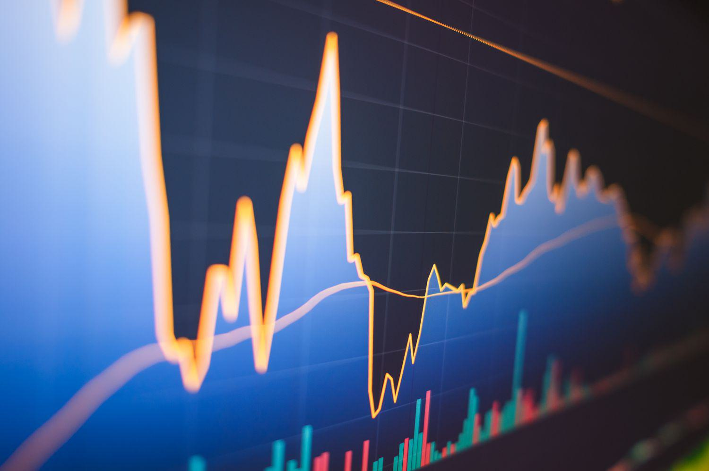

## Table of Contents

## What is the Volatility Ratio and why is it important in trading?

The Volatility Ratio is a measure used in trading to understand how much the price of a financial asset, like a stock or a commodity, moves around over a certain period of time. It helps traders see if the price is changing a lot or staying pretty steady. The ratio is calculated by looking at the highest and lowest prices of the asset over a specific time and comparing that to the average price during that time. A higher Volatility Ratio means the price is moving a lot, while a lower ratio means the price is more stable.

Understanding the Volatility Ratio is important for traders because it helps them make better decisions. If the ratio is high, it means the market might be riskier, and prices could change a lot very quickly. Traders might use this information to decide if they want to buy or sell, or if they should wait for a calmer time. On the other hand, a low Volatility Ratio might suggest a safer time to trade, but it could also mean fewer chances to make big profits. By knowing the volatility, traders can adjust their strategies to match the current market conditions.

## How is the Volatility Ratio calculated?

The Volatility Ratio is calculated by looking at the highest and lowest prices of a financial asset over a certain period of time, and then comparing that to the average price during that time. First, you find the difference between the highest and lowest prices. This difference shows how much the price has moved around. Then, you figure out the average price by adding up all the closing prices over the period and dividing by the number of days.

Next, you divide the difference between the highest and lowest prices by the average price. This gives you the Volatility Ratio. For example, if the highest price was $110, the lowest price was $90, and the average price was $100, the Volatility Ratio would be (110 - 90) / 100 = 0.20, or 20%. This simple calculation helps traders understand how much the price of an asset might change, which is important for making trading decisions.

## What data is needed to compute the Volatility Ratio?

To compute the Volatility Ratio, you need the highest price, the lowest price, and the average price of the financial asset over a specific period of time. The highest price is the most the asset cost during that time, and the lowest price is the least it cost. The average price is found by adding up all the closing prices during the period and then dividing by the number of days.

Once you have these three pieces of data, you can calculate the Volatility Ratio. You do this by subtracting the lowest price from the highest price to see how much the price moved around. Then, you divide that difference by the average price. This gives you a number that shows how much the price changed compared to what it usually was, helping traders understand if the market was calm or wild during that time.

## Can you explain the formula for calculating the Volatility Ratio?

The formula for calculating the Volatility Ratio is pretty simple. First, you need to know the highest price and the lowest price of the asset during the time you're looking at. You subtract the lowest price from the highest price to find out how much the price moved around. This difference shows you the range of the price changes.

Next, you need the average price of the asset during that same time. You find this by adding up all the closing prices and then dividing by the number of days. Once you have this average price, you divide the difference between the highest and lowest prices by the average price. The result is the Volatility Ratio, which tells you how much the price changed compared to what it usually was.

## What time frames are typically used when calculating the Volatility Ratio?

Traders often use different time frames when calculating the Volatility Ratio, depending on what they need. Short-term traders might look at a day or a week. This helps them see how much the price might change in a short time, which is important for making quick decisions. If a trader is looking at a day, they'll use the highest and lowest prices from that day and the average price from that day's closing prices.

Longer time frames are also used, like a month or even a year. These are helpful for people who are not in a rush and want to see bigger trends. If someone is looking at a month, they'll use the highest and lowest prices from that whole month and the average of all the closing prices during those days. This gives them a good idea of how stable or wild the market has been over a longer period.

## How does the Volatility Ratio help in identifying market trends?

The Volatility Ratio helps traders see if the market is moving a lot or staying calm. If the ratio is high, it means the price of the asset is jumping around a lot. This can mean the market is going through a big change or a trend is starting. Traders can use this information to guess if the price will keep going up or down. For example, if the ratio is high and the price has been going up, it might mean a strong upward trend is happening.

On the other hand, if the Volatility Ratio is low, it means the price is not changing much. This can show that the market is stable and not going through big changes. Traders might see this as a time when the market is not trending strongly in any direction. Knowing this helps them decide if they should wait for a better time to trade or if they should make a move when things are calm. By looking at the Volatility Ratio, traders can better understand what the market is doing and make smarter choices.

## What are the common signals generated by the Volatility Ratio?

The Volatility Ratio can give traders signals about what might happen next in the market. If the ratio is high, it means the price is moving around a lot. This can be a sign that the market is getting ready for a big change or that a new trend is starting. Traders might see this as a signal to get ready for a big move in the price, either up or down. They can use this information to decide if they should buy or sell to take advantage of the trend.

On the other hand, if the Volatility Ratio is low, it means the price is not changing much. This can be a signal that the market is calm and not going through big changes. Traders might see this as a time to wait for a better opportunity or to make a move when things are stable. By watching the Volatility Ratio, traders can get a good idea of whether the market is likely to stay the same or if big changes are coming soon.

## How can traders use Volatility Ratio signals to make trading decisions?

Traders can use the Volatility Ratio to help them decide when to buy or sell. If the ratio is high, it means the price is moving a lot. This can be a sign that the market might be getting ready for a big change or a new trend. When traders see a high Volatility Ratio, they might get ready to make a move. They could decide to buy if they think the price will keep going up, or sell if they think it will go down. The high ratio tells them that the market is not calm, and they need to be ready for quick changes.

On the other hand, if the Volatility Ratio is low, it means the price is not moving much. This can be a sign that the market is stable and not going through big changes. When traders see a low Volatility Ratio, they might decide to wait for a better time to trade. They might think it's safer to make a move when the market is calm, but they also know that calm times might not offer big chances to make a lot of money. By watching the Volatility Ratio, traders can get a good idea of what the market might do next and make smarter choices about when to trade.

## What are the limitations of using the Volatility Ratio as a standalone indicator?

The Volatility Ratio is helpful, but it has some limits if you use it by itself. It only tells you how much the price is moving around, but it doesn't say anything about where the price is going. So, if you just look at the Volatility Ratio, you might know that the market is changing a lot, but you won't know if the price will go up or down next. This can make it hard to decide if you should buy or sell just based on this one number.

Also, the Volatility Ratio can be tricky because it can change a lot from one time to another. What seems like a high ratio today might not seem so high if you look at it over a longer time. This means you might get different ideas about the market depending on how long you look at it. To make better choices, traders usually use the Volatility Ratio along with other tools and information to get a fuller picture of what's happening in the market.

## How does the Volatility Ratio compare to other volatility indicators like the Average True Range (ATR)?

The Volatility Ratio and the Average True Range (ATR) both help traders understand how much a price might move around, but they do it in different ways. The Volatility Ratio looks at the highest and lowest prices over a certain time and compares that to the average price. This gives a simple number that shows if the price is moving a lot or staying calm. On the other hand, the ATR looks at the true range of the price, which is the biggest move the price made each day, whether it was up or down. The ATR then averages these true ranges over a set number of days, usually 14, to give a smoother measure of how much the price is moving around.

While the Volatility Ratio gives a quick snapshot of how much the price changed compared to what it usually is, the ATR gives a more detailed view of the price movement over time. The Volatility Ratio is good for seeing if the market is wild or calm right now, but it doesn't tell you much about where the price might go next. The ATR, on the other hand, can help traders see trends and changes in volatility over time, which can be useful for making longer-term trading decisions. Both indicators can be useful, but they work better when used together with other tools to get a full picture of the market.

## Can the Volatility Ratio be integrated with other technical analysis tools for better results?

Yes, the Volatility Ratio can be integrated with other technical analysis tools to give traders a better understanding of the market. For example, traders might use the Volatility Ratio along with moving averages to see if a high volatility period is happening during an uptrend or a downtrend. If the Volatility Ratio is high and the price is above a moving average, it might mean that the market is getting more excited about an upward trend. On the other hand, if the Volatility Ratio is high and the price is below a moving average, it could signal that the market is getting worried about a downward trend.

Another way to use the Volatility Ratio is with other indicators like the Relative Strength Index (RSI) or the Moving Average Convergence Divergence (MACD). If the Volatility Ratio is high and the RSI is showing that the market is overbought, it might mean that the price could fall soon. If the MACD shows a strong bullish signal along with a high Volatility Ratio, it could mean that the price might keep going up. By combining the Volatility Ratio with these other tools, traders can get a clearer picture of what might happen next and make smarter trading decisions.

## What advanced techniques can be applied to refine the use of Volatility Ratio in algorithmic trading?

In algorithmic trading, one advanced technique to refine the use of the Volatility Ratio is to apply machine learning algorithms. These algorithms can analyze historical data to find patterns in how the Volatility Ratio changes over time and how it relates to other market indicators. By training a model on past data, traders can predict future volatility more accurately. This can help them adjust their trading strategies automatically based on the expected level of market movement, making their trades more profitable and less risky.

Another technique is to use the Volatility Ratio in combination with other volatility measures, like the Average True Range (ATR), to create a more robust volatility index. By calculating a weighted average of these different measures, traders can get a more complete picture of market volatility. This combined index can then be used to set dynamic stop-loss levels or to adjust the size of trades based on current market conditions. This approach helps traders react more effectively to changes in the market, improving the performance of their trading algorithms.

## What are Volatility Ratios and How Can We Understand Them?

The volatility ratio is a fundamental metric in financial analysis designed to measure the degree of price change relative to its historical volatility. Volatility, by definition, refers to the rate at which the price of a security increases or decreases for a given set of returns. The volatility ratio then becomes a pivotal tool in technical analysis as it aids in discerning price breakouts and identifying trends within financial markets.

Price breakouts are significant movements in the price of a security that typically signal the start of a new trend. By analyzing the volatility ratio, traders and analysts can detect these breakouts more reliably. This is achieved by comparing recent volatility against historical norms, thereby offering a clearer understanding of whether a price movement is part of a new trend or just noise within regular market fluctuations.

One prevalent foundation for calculating the volatility ratio is the Average True Range (ATR). The ATR, developed by J. Welles Wilder, is a widely utilized indicator for determining market volatility. It considers the greatest of the following three values:

1. The current high minus the current low.
2. The absolute value of the current high minus the previous close.
3. The absolute value of the current low minus the previous close.

The formula for the ATR over a period $n$ is given as:

$$
\text{ATR}_n = \frac{1}{n} \sum_{i=1}^{n} \text{TR}_i
$$

where $\text{TR}_i$ is the true range for day $i$.

By leveraging the ATR, the [volatility](/wiki/volatility-trading-strategies) ratio can be effectively calculated, thus providing insights into the underlying dynamics of market movements. Traders often utilize ATR-based volatility ratios to manage risks by adjusting position sizes according to varying levels of market volatility. 

Different versions of the volatility ratio exist, some replacing the ATR with an exponential moving average (EMA) or considering absolute range values for a more tailored approach to specific trading strategies. Yet, the core principle remains: assessing price changes relative to historical volatility enables a more informed approach to technical analysis and trading decision-making.

## What are the methods for calculation?

Calculation methods for the volatility ratio are crucial for accurately assessing market behavior. A popular approach is Schwager's method, which calculates the volatility ratio as the ratio of today's true range to an average of historical true ranges. The true range is defined as the greatest of the following three values on a given day: the current high minus the current low, the current high minus the previous close, and the previous close minus the current low. 

Mathematically, Schwager's volatility ratio can be expressed as:

$$
\text{Volatility Ratio} = \frac{\text{Today's True Range}}{\text{Average True Range}}
$$

The Average True Range (ATR) is typically computed over a set period, usually 14 days, using the formula:

$$
\text{ATR} = \frac{1}{n} \sum_{i=1}^{n} \text{True Range}_i
$$

where $n$ is the number of days over which the ATR is calculated.

In addition to Schwager's method, other variations of calculating volatility ratios include using exponential moving averages (EMA) instead of simple averaging. This approach gives more weight to recent price changes, making it responsive to current market conditions. The EMA can be calculated using the formula:

$$
\text{EMA}(t) = \alpha \times \text{Price}(t) + (1-\alpha) \times \text{EMA}(t-1)
$$

where $\alpha = \frac{2}{n+1}$ and $n$ is the number of periods.

Another method involves assessing absolute range values directly. This approach captures changes without smoothing over and could provide a raw insight into market volatility.

These calculations are significant as they help traders gauge market volatility. Higher values in the volatility ratio indicate increased market uncertainty, potentially flagging times of price [breakout](/wiki/breakout-trading) or reversals, thereby aiding in informed trading decisions. Additionally, these methodologies can be incorporated into [algorithmic trading](/wiki/algorithmic-trading) systems, providing dynamic inputs for assessing trading conditions and adjusting strategies accordingly.

## What are the applications in algorithmic trading?

Algorithmic trading, a method of executing orders using automated pre-programmed trading instructions, heavily utilizes volatility ratios to enhance multiple aspects of trading. One of the primary applications is in risk management. By evaluating volatility ratios, algorithms can determine the level of market uncertainty and adjust the risk exposure of trading strategies accordingly. High volatility suggests greater uncertainty, prompting algorithms to increase or decrease position sizes as part of dynamic risk management measures. 

For instance, position sizing is optimized using volatility ratios to align with the potential risks and rewards. A simple approach involves adjusting the position size inversely with volatility; in periods of high volatility, smaller positions are preferred to mitigate risk. A volatility-based position sizing model might employ the formula:

$$
\text{Position Size} = \frac{\text{Account Risk}}{\text{Volatility} \times \text{Asset Price}}
$$

Here, the 'Account Risk' denotes the portion of capital the trader is willing to risk on a single trade. By factoring in volatility, the position size dynamically adjusts to current market conditions.

Volatility ratios are also instrumental in optimizing trade entry and [exit](/wiki/exit-strategy) points. High volatility ratios can indicate potential breakouts or trend reversals, which can be leveraged for strategic entries or exits. Algorithms can be designed to recognize these signals, thereby allowing traders to capture [momentum](/wiki/momentum) during periods of significant price movements. During low-volatility periods, algorithms may favor holding positions to maximize gains from existing trends without frequent trades.

Incorporating volatility ratios into [machine learning](/wiki/machine-learning) models extends the adaptability of trading algorithms. These models can be built to recognize patterns and adjust strategies based on real-time volatility assessments, improving their predictive accuracy and robustness. By training machine learning algorithms on historical data with features including volatility ratios, models can learn to anticipate market movements and adjust trading strategies accordingly, ensuring decisions are data-driven and responsive to market dynamics.

Continuous [backtesting](/wiki/backtesting) is vital for validating the performance and efficacy of strategies based on volatility ratios. By simulating trading strategies against historical data, backtesting allows traders to evaluate how well these strategies would have performed across different market conditions, identifying potential weaknesses and opportunities for refinement. This process ensures that strategies remain effective and adaptable, even as market conditions evolve. Backtesting also provides a framework for developing new strategies and refining existing ones, reinforcing the importance of volatility analysis in achieving long-term trading success.

## References & Further Reading

[1]: Wilder, J. Welles. ["New Concepts in Technical Trading Systems."](https://www.amazon.com/New-Concepts-Technical-Trading-Systems/dp/0894590278) Trend Research, 1978.

[2]: Schwager, Jack D. ["Technical Analysis of the Futures Markets: A Comprehensive Guide to Trading Methods and Applications."](https://www.amazon.com/Technical-Analysis-Futures-Markets-Comprehensive/dp/013898008X) Prentice Hall Press, 1986.

[3]: Hull, John. ["Options, Futures, and Other Derivatives."](https://www.amazon.com/Options-Futures-Other-Derivatives-9th/dp/0133456315) Pearson, 2017.

[4]: Lopez de Prado, Marcos. ["Advances in Financial Machine Learning."](https://www.amazon.com/Advances-Financial-Machine-Learning-Marcos/dp/1119482089) Wiley, 2018.

[5]: Chan, Ernest P. ["Algorithmic Trading: Winning Strategies and Their Rationale."](https://github.com/ftvision/quant_trading_echan_book) Wiley, 2013.