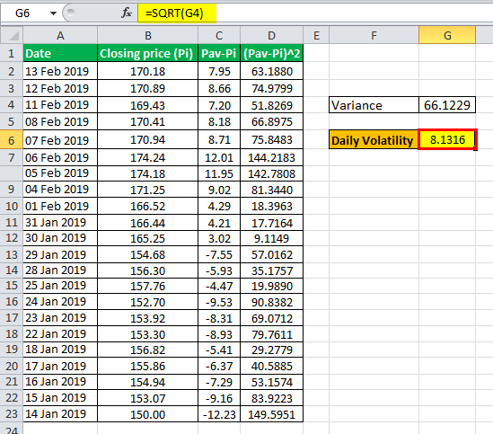

Understanding and managing volatility holds significant importance in the financial sector, particularly for developing successful investment strategies and executing algorithmic trading. Volatility refers to the degree of variation in the price of a financial instrument over time, and it serves as a crucial indicator of risk. The volatility ratio is a key financial metric that aids investors and traders in assessing and capitalizing on this price variability.

This article focuses on the volatility ratio's role in finance, offering insights into its significance, calculation, and application. The volatility ratio is a tool that measures fluctuations in asset prices, thus providing critical insights into historical price variations. By evaluating the ratio of current price ranges to previously established ones, traders can identify potential breakouts and predict future price movements.



Further, the volatility ratio is a vital component of investment analysis and algorithmic trading strategies, where it helps quantify market risk and identify opportunities. When integrated with other metrics, the volatility ratio can enhance investment decisions, optimize portfolio performance, and guide automated trading systems.

With the aim of fostering a comprehensive understanding of volatility management, this article endeavors to illustrate how traders can harness the volatility ratio for better trading outcomes. By combining it thoughtfully with other financial metrics, market practitioners can navigate the complexities of dynamic markets effectively.

## Table of Contents

## Understanding the Volatility Ratio

The volatility ratio is a crucial tool within technical analysis, primarily used to assess the extent of price fluctuations in financial markets. It focuses specifically on historical volatility, contrasting with implied volatility, which derives from market expectations. This distinction is essential as historical volatility reflects how the price of an asset has moved over a past period, providing a factual basis for traders to analyze potential future price movements.

Traders leverage the volatility ratio to pinpoint potential breakouts, which are significant price shifts that may indicate new market trends or reversals. By examining both current and past price ranges, the volatility ratio helps traders detect when the asset's price is moving in a markedly different way from its historical behavior. This detection is beneficial in deciding whether to enter or exit trading positions, as it suggests increased market activity that could lead to profitable opportunities.

The calculation of the [volatility](/wiki/volatility-trading-strategies) ratio involves the true range, which is an indicator of market price movement. The true range is defined as the greatest of the following: 
1. The current high minus the current low
2. The absolute value of the current high minus the previous close
3. The absolute value of the current low minus the previous close

To obtain the volatility ratio, the true range is assessed over a current period and compared to a previously established period. The formula is expressed as:

$$
\text{Volatility Ratio} = \frac{\text{Current True Range}}{\text{Previous True Range}}
$$

This ratio serves as a gauge for determining whether the price range of an asset has widened or narrowed compared to its past behavior. A heightened volatility ratio suggests the potential for substantial price movement, while a lower ratio indicates a more stable, less volatile market condition.

Understanding and applying the volatility ratio allows traders to anticipate price movements more accurately. By utilizing historical price data, traders can make informed decisions, thereby enhancing the likelihood of successful trading outcomes. This analytical approach aids in recognizing market entry and [exit](/wiki/exit-strategy) points and managing trading risks more effectively.

## Calculating the Volatility Ratio

To calculate the volatility ratio, traders need to determine the current true range and the previous true range over a specified period. The true range is a measure commonly used in financial markets to gauge the volatility of an asset's price. It takes into account the greatest of the following:

1. The difference between the current high and the current low.
2. The difference between the current high and the previous close.
3. The difference between the current low and the previous close.

The widely adopted periods for calculating true ranges are typically 10 or 14 days. Once these ranges are established, the volatility ratio is derived from the following formula:

$$
\text{Volatility Ratio} = \frac{\text{Current True Range}}{\text{Previous True Range}}
$$

This calculation is essential for identifying significant expansions in a stock's price range. For instance, when the volatility ratio is greater than 1, it suggests that the stock's current volatility is higher than the previous trading period. This increase in volatility can signal potential investment opportunities, as it may precede a [breakout](/wiki/breakout-trading) or other significant price movements.

Here is a simple Python function demonstrating how to calculate the volatility ratio:

```python
def calculate_volatility_ratio(current_high, current_low, previous_close, previous_true_range):
    current_true_range = max(current_high - current_low,
                             abs(current_high - previous_close),
                             abs(current_low - previous_close))
    volatility_ratio = current_true_range / previous_true_range
    return volatility_ratio
```

By monitoring changes in the volatility ratio, traders can better prepare and adjust their strategies to capitalize on these emerging opportunities in the financial markets.

## Volatility Ratio in Investment Analysis

In investment analysis, the volatility ratio functions as a crucial signal to detect deviations in a security's trading pattern from its historical norm. This deviation acts as an indicator of potential risk, equipping investors with foresight for possible market shifts. The volatility ratio offers a quantitative measure to determine these shifts, providing a clear framework for anticipating market behavior.

A volatility ratio threshold, such as 0.5, is often employed to identify breakout scenarios where current volatility is twice as large as the previous range. This specific threshold acts as an alert to traders and investors, indicating that the security price is displaying abnormal movement, potentially signaling the start of a significant trend. This kind of insight is valuable for timely decision-making, allowing investors to adjust their strategies in anticipation of further volatility.

Incorporating the volatility ratio into a suite of broader financial metrics empowers investors by offering enhanced insights into portfolio management. By integrating this metric with others, such as the Sharpe Ratio or the Maximum Drawdown, investors can gain a more comprehensive view of risk-adjusted returns and portfolio performance. The volatility ratio, by highlighting shifts in market behavior, complements these metrics in optimizing portfolio strategies to better align with investors' risk tolerance and performance objectives.

Through its ability to signal potential market disruptions and serve as a foundation for calculating risk metrics, the volatility ratio becomes instrumental in aiding investors to refine their approaches and enhance their portfolio's risk management strategies.

## Role in Algorithmic Trading

Algorithmic trading leverages metrics such as the volatility ratio to automate and enhance the precision of trading activities. This ratio aids in developing algorithms specifically designed to respond efficiently to significant price shifts. By measuring the fluctuations in asset prices, traders can program systems to detect and act on potential investment opportunities swiftly. This responsiveness is critical in markets where timing can significantly impact profitability.

The volatility ratio is frequently used alongside other technical indicators, including [volume](/wiki/volume-trading-strategy) and moving averages, to confirm trading signals. Volume can indicate the strength of a price move, while moving averages help in identifying trend directions. For instance, a volatility ratio paired with high trading volumes might suggest a strong market sentiment, prompting algorithmic models to execute trades accordingly. Similarly, moving averages can be used to filter out noise and smooth out price data, providing a clearer trend direction when used with the volatility ratio.

To implement these concepts programmatically, traders often deploy algorithms that integrate these indicators. Here’s a simple Python snippet demonstrating basic logic to combine the volatility ratio with a moving average to generate trading signals:

```python
def calculate_volatility_ratio(current_true_range, previous_true_range):
    return current_true_range / previous_true_range

def moving_average(prices, period):
    return sum(prices[-period:]) / period

def generate_signal(volatility_ratio, moving_average, price):
    if volatility_ratio > 0.5 and price > moving_average:
        return "Buy"
    elif volatility_ratio < 0.5 and price < moving_average:
        return "Sell"
    else:
        return "Hold"

# Example usage
prices = [100, 101, 102, 103, 104]  # example price data
current_true_range = 2.0
previous_true_range = 1.5

volatility_ratio = calculate_volatility_ratio(current_true_range, previous_true_range)
mov_avg = moving_average(prices, period=3)
signal = generate_signal(volatility_ratio, mov_avg, prices[-1])

print(f"Trading signal: {signal}")
```

By employing such metrics, automated trading systems can rapidly adjust to market changes, minimizing losses and enhancing potential returns. This adaptability is crucial in volatile markets where conditions can shift quickly. Well-designed algorithms thus ensure traders remain aligned with fast-moving market conditions, enabling them to capture opportunities while managing risk effectively.

## Integrating Volatility Ratio with Other Metrics

Integrating the volatility ratio with other financial metrics can provide traders with a more nuanced understanding of market behavior and risk management. One of the key metrics to pair with the volatility ratio is the Sharpe Ratio, which measures risk-adjusted return by considering the excess return per unit of deviation. This combination allows traders to identify whether a high volatility environment is delivering proportionate returns relative to the risk incurred.

Another crucial metric is the Maximum Drawdown, which assesses the maximum loss from a peak to a trough in a portfolio. By using the volatility ratio alongside Maximum Drawdown, traders can determine how volatility spikes might correlate with significant drops in portfolio value. This insight is vital for refining stop-loss orders and position sizing.

The Profit Factor, which is the ratio of gross profits to gross losses, can also be evaluated in conjunction with the volatility ratio. This pairing gives a clearer picture of strategy profitability during varying volatility levels. A high Profit Factor in a high volatility scenario might indicate effective risk management and strategy execution.

To automate the integration of these metrics, traders can employ Python for data analysis. For example, they might use the Pandas library to calculate these metrics over historical data and visualize correlations with Matplotlib. Here's a basic Python script to illustrate the calculation of these metrics:

```python
import pandas as pd
import numpy as np

# Example data
data = pd.DataFrame({
    'returns': np.random.normal(0.01, 0.05, 100),
    'volatility_flags': np.random.choice([0, 1], size=100)
})

# Calculate Sharpe Ratio
mean_return = data['returns'].mean()
std_deviation = data['returns'].std()
sharpe_ratio = mean_return / std_deviation

# Calculate Maximum Drawdown
cumulative_returns = (1 + data['returns']).cumprod()
drawdown = cumulative_returns / cumulative_returns.cummax() - 1
max_drawdown = drawdown.min()

# Calculate Profit Factor
gross_profit = data.loc[data['returns'] > 0, 'returns'].sum()
gross_loss = abs(data.loc[data['returns'] < 0, 'returns'].sum())
profit_factor = gross_profit / gross_loss if gross_loss != 0 else np.nan

print(f"Sharpe Ratio: {sharpe_ratio}")
print(f"Maximum Drawdown: {max_drawdown}")
print(f"Profit Factor: {profit_factor}")
```

By evaluating multiple metrics in tandem, traders can better manage risk and enhance the robustness of their strategies. This integrated approach ensures that trading decisions are not solely based on one aspect of market dynamics but consider a wider range of scenarios, aligning strategies with diverse market conditions. Such comprehensive analysis helps in tailoring strategies to optimize performance and manage risk efficiently in volatile markets.

## Challenges and Considerations

Traders must exercise caution to avoid overfitting when integrating the volatility ratio into [algorithmic trading](/wiki/algorithmic-trading) models. Overfitting occurs when a model is excessively complex, capturing noise rather than the underlying pattern in historical data. This leads to poor predictive performance in unseen data. To mitigate this risk, practitioners should employ techniques such as cross-validation, regularized regression, and out-of-sample testing to ensure models generalize well.

Moreover, varying market conditions can significantly influence the interpretation of the volatility ratio. In stable markets, low volatility ratios might be typical, while high volatility ratios might be more prevalent during uncertain periods. Traders need to be aware of these contextual shifts and adjust their strategies accordingly. For example, a volatility ratio that signals a potential breakout in one market condition may not hold the same implication in another.

The impact of transaction costs and slippage must also be part of the strategic consideration. Trades triggered by volatility signals can incur significant transaction costs, reducing the overall profitability of the strategy. Slippage, the difference between the expected transaction price and the actual price executed, is another [factor](/wiki/factor-investing) that can diminish returns. An example of slippage computation in Python could be:

```python
def calculate_slippage(expected_price, executed_price):
    return executed_price - expected_price

# For a trade with expected trading price of $100 and executed trading price of $101
slippage = calculate_slippage(100, 101)
print(f"Slippage: ${slippage}")
```

Adjusting strategies periodically to align with evolving market dynamics is crucial for maintaining efficacy. Markets are influenced by an array of factors such as economic indicators, geopolitical events, and technological advancements, necessitating a continuous reassessment of trading models. By regularly recalibrating these models and incorporating fresh data, traders can enhance their ability to respond to market changes, thereby optimizing their trading outcomes.

## Conclusion

The volatility ratio remains a vital tool in financial and algorithmic trading analyses. By comprehending its calculation and application, traders can effectively navigate the complexities inherent in volatile markets. This metric enables traders to quantify price fluctuations and anticipate market trends, thus aiding in the development of informed strategies.

In combination with other financial metrics, the volatility ratio offers valuable insights that can significantly enhance trading strategy development. When integrated with metrics such as the Sharpe Ratio or Maximum Drawdown, it provides a comprehensive perspective on risk-adjusted returns and market behavior. This synergy allows traders to construct more robust and adaptive trading strategies tailored to diverse market conditions. 

Continual learning and strategy refinement are pivotal in leveraging the full potential of the volatility ratio. Markets evolve and economic conditions fluctuate, necessitating regular updates and optimizations to trading models to sustain performance. Traders and algorithm developers must remain vigilant, adapting their systems to incorporate new data and insights gained from ongoing analysis. This approach ensures that trading strategies remain effective and resilient amidst changing market dynamics, optimizing opportunities while mitigating risks.

## References & Further Reading

[1]: ["Advances in Financial Machine Learning"](https://www.amazon.com/Advances-Financial-Machine-Learning-Marcos/dp/1119482089) by Marcos Lopez de Prado

[2]: ["Evidence-Based Technical Analysis: Applying the Scientific Method and Statistical Inference to Trading Signals"](https://www.amazon.com/Evidence-Based-Technical-Analysis-Scientific-Statistical/dp/0470008741) by David Aronson

[3]: ["Machine Learning for Algorithmic Trading"](https://github.com/stefan-jansen/machine-learning-for-trading) by Stefan Jansen

[4]: ["Quantitative Trading: How to Build Your Own Algorithmic Trading Business"](https://www.amazon.com/Quantitative-Trading-Build-Algorithmic-Business/dp/1119800064) by Ernest P. Chan

[5]: Hull, J. C. (2018). ["Options, Futures, and Other Derivatives"](https://www.semanticscholar.org/paper/Options%2C-Futures%2C-and-Other-Derivatives-Hull/89bdee500c8623864fc9eb7a471546aa713acc44) by John C. Hull

[6]: Taleb, N. N. (2010). ["The Black Swan: The Impact of the Highly Improbable"](https://archive.org/details/10.1.1.695.4305) by Nassim Nicholas Taleb