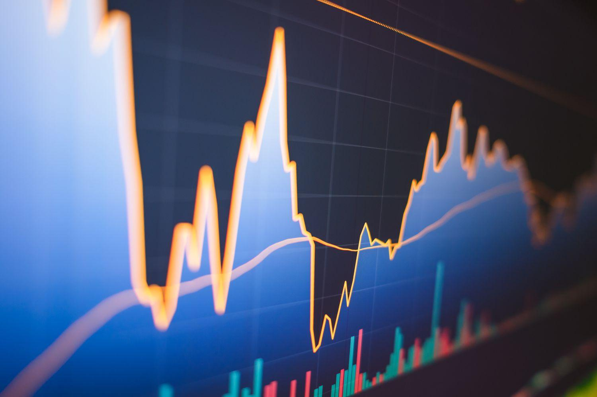

## Table of Contents

## What is the volatility ratio and why is it important?

The volatility ratio is a measure that shows how much the price of something, like a stock, changes over time. It tells you if the price moves a lot or stays pretty steady. Imagine you're watching the price of a toy. If the price jumps up and down a lot, that toy has high volatility. If the price stays about the same, it has low volatility.

This ratio is important because it helps people who invest money make better choices. If someone likes to take big risks, they might choose something with high volatility because they hope to make more money, even though it's riskier. But if someone wants to be safer with their money, they'll pick something with low volatility. Knowing the volatility ratio helps everyone understand the risks and decide what's best for them.

## How does the volatility ratio differ from other volatility measures like standard deviation?

The volatility ratio and standard deviation both help us understand how much prices change, but they do it in slightly different ways. The volatility ratio looks at how the price of something changes over time and compares it to how much it usually changes. It's like seeing if a toy's price is jumping around more than normal. On the other hand, standard deviation is a math tool that tells us how spread out the prices are from the average price. It's like figuring out how far each price is from the middle price and then using that to see how much the prices vary.

Both measures are useful, but they give us different pieces of information. The volatility ratio is great for seeing if the recent price changes are bigger or smaller than what we usually see. This can be really helpful if you want to know if things are getting more or less wild right now. Standard deviation, though, gives a more overall picture of how much the prices have been moving around over a longer time. It's like looking at a whole year of toy prices to see if they've been all over the place or pretty steady.

## What are the basic components needed to calculate the volatility ratio?

To calculate the volatility ratio, you need to know the average true range (ATR) and the average price of whatever you're looking at, like a stock. The ATR tells you how much the price has been moving around over a certain time. You can find the ATR by looking at the difference between the highest and lowest prices each day, and then averaging those differences over a set number of days. The average price is just the middle price over that same time, which you get by adding up all the prices and dividing by how many there are.

Once you have the ATR and the average price, you can figure out the volatility ratio. You do this by dividing the ATR by the average price. This gives you a number that shows how big the price swings are compared to the price itself. If the number is big, it means the price is moving around a lot compared to what it usually is. If it's small, the price isn't changing much. This helps you see if the thing you're looking at is calm or wild in terms of price changes.

## Can you walk through a simple example of calculating the volatility ratio?

Let's say you want to find out the volatility ratio for a toy's price over five days. First, you need to figure out the average true range (ATR) for those five days. Imagine the toy's price went from $10 to $12 on day one, $11 to $13 on day two, $12 to $14 on day three, $13 to $15 on day four, and $14 to $16 on day five. The true range for each day is the difference between the highest and lowest prices, so that's $2 for each day. The ATR is the average of those true ranges, which is $2.

Next, you need to find the average price of the toy over those five days. The prices were $11, $12, $13, $14, and $15. If you add these up and divide by five, the average price is $13. Now, to get the volatility ratio, you divide the ATR ($2) by the average price ($13). So, the volatility ratio is $2 divided by $13, which equals about 0.154. This number tells you that the toy's price is moving around by about 15.4% of its average price, which helps you understand how wild or calm the price changes are.

## What time frames are typically used when calculating the volatility ratio?

When people want to figure out the volatility ratio, they usually look at different time frames depending on what they need. Some might use a short time like a few days or a week if they want to see how the price is changing right now. This is good for people who need to make quick decisions, like day traders who buy and sell things fast.

Others might use a longer time frame, like a month or even a year, to get a bigger picture of how the price moves over time. This helps investors who are thinking about holding onto something for a while. By choosing the right time frame, people can better understand if the price is usually calm or if it jumps around a lot, which helps them make smarter choices with their money.

## How does the choice of time frame affect the volatility ratio?

The time frame you choose really changes how the volatility ratio looks. If you pick a short time, like a few days, the volatility ratio might show big jumps because you're only seeing what's happening right now. It's like looking at a quick snapshot of the price, so if there's a sudden big change, the ratio will be high. This is useful if you need to make fast decisions, but it might not show the whole story because it's just a tiny piece of time.

On the other hand, if you use a longer time frame, like a month or a year, the volatility ratio will give you a smoother, bigger picture of how the price moves. It's like watching a whole movie instead of just one scene. Over a longer time, the ups and downs can balance out, so the ratio might not look as wild. This helps people who are thinking about keeping their money in something for a while because it shows them what to expect over time, not just right now.

## What are common misinterpretations or pitfalls when using the volatility ratio?

One common mistake people make with the volatility ratio is thinking it tells the whole story about risk. The volatility ratio just shows how much prices move around, but it doesn't say anything about whether those moves will make you money or lose it. Just because something has high volatility doesn't mean it's a bad investment, and low volatility doesn't mean it's a safe bet. It's like looking at how fast a roller coaster goes without knowing if it's going up or down.

Another pitfall is using the wrong time frame. If you look at the volatility ratio over a short time, like a few days, you might think something is super risky when it's really just having a wild week. But if you look at it over a longer time, like a year, you might miss out on seeing important short-term changes. It's important to pick the right time frame for what you're trying to do, so you don't get the wrong idea about how risky something really is.

## How can the volatility ratio be used in trading strategies?

The volatility ratio can be a helpful tool for people who trade things like stocks. If you see that the volatility ratio is high, it means the price is moving around a lot. Traders who like to take big risks might see this as a chance to make more money, because big price swings can lead to big profits if they guess right. But they need to be careful because big swings can also lead to big losses. On the other hand, if the volatility ratio is low, it means the price is pretty steady. Traders who don't like to take big risks might like this because it's less likely that they'll lose a lot of money quickly.

Traders can use the volatility ratio to decide when to buy or sell. For example, if the volatility ratio goes up a lot, it might mean that the price is about to change a lot. Some traders might decide to sell before the price drops, or they might buy if they think the price will go up. But they have to remember that the volatility ratio is just one piece of the puzzle. They need to look at other things too, like what's happening in the market and any news that might affect the price. By using the volatility ratio along with other information, traders can make smarter choices about when to make their moves.

## What advanced statistical techniques can enhance the accuracy of the volatility ratio?

To make the volatility ratio more accurate, people can use something called the GARCH model. GARCH stands for Generalized Autoregressive Conditional Heteroskedasticity, but don't worry about the big word. It's just a fancy way to look at how much prices change over time and how those changes can get bigger or smaller. The GARCH model helps by looking at past price changes to guess how much prices might move in the future. This can make the volatility ratio more useful because it gives a better idea of what might happen next, not just what's happening right now.

Another way to improve the volatility ratio is by using something called the Exponential Moving Average (EMA). The EMA is a way to look at prices that gives more weight to the most recent prices. This can help make the volatility ratio more responsive to what's happening now. By using the EMA, you can get a quicker sense of whether the price is starting to move around more or less, which can help you make better decisions about buying or selling. Both the GARCH model and the EMA can make the volatility ratio a stronger tool for understanding how prices might change.

## How does the volatility ratio correlate with market conditions and asset types?

The volatility ratio can change a lot depending on what's happening in the market and what kind of asset you're looking at. When the market is calm and things are going smoothly, the volatility ratio for most assets might be low because prices aren't jumping around much. But if there's a lot of uncertainty or big news, like a surprise election result or a big company going bankrupt, the market can get really wild. During these times, the volatility ratio can go up because prices start moving a lot more. This means that knowing what's going on in the market can help you guess if the volatility ratio will be high or low.

Different types of assets also have different volatility ratios. Stocks, for example, can have high volatility ratios because their prices can change a lot based on news about the company or the economy. On the other hand, bonds usually have lower volatility ratios because their prices don't jump around as much. Things like commodities, which are things you can touch like oil or gold, can have their own volatility patterns based on things like weather or how much people want them. So, when you're looking at the volatility ratio, it's important to think about what kind of asset it is and what's happening in the market to understand what the number means.

## Can the volatility ratio be integrated with other financial indicators for better analysis?

Yes, the volatility ratio can be used together with other financial indicators to get a better understanding of what's going on with prices. For example, you can look at the volatility ratio along with the Relative Strength Index (RSI), which tells you if a price is overbought or oversold. If the volatility ratio is high and the RSI shows the price is overbought, it might mean that the price could drop soon because it's been moving around a lot and is now too high. On the other hand, if the volatility ratio is low and the RSI shows the price is oversold, it might be a good time to buy because the price isn't moving much and is now too low.

Another useful indicator to use with the volatility ratio is the Moving Average Convergence Divergence (MACD). The MACD helps you see if the price is trending up or down. If the volatility ratio is high and the MACD shows a strong upward trend, it could mean that the price is going to keep going up, even with big swings. But if the volatility ratio is high and the MACD shows a downward trend, it might be a sign that the price could fall even more. By using the volatility ratio with other indicators, you can get a clearer picture of what might happen next with prices.

## What are the latest research findings on the volatility ratio and its applications?

Recent research on the volatility ratio has shown that it can be a powerful tool for predicting how prices might change in the future. One study found that by combining the volatility ratio with machine learning algorithms, traders can better understand the risk and potential rewards of their investments. This approach helps to spot patterns in price movements that might be hard to see with just the volatility ratio alone. Researchers are also looking at how the volatility ratio can be used to create better trading strategies, especially in fast-moving markets where prices can change quickly.

Another area of interest in recent studies is how the volatility ratio can be adjusted for different types of assets. For example, some research has shown that the volatility ratio can be more accurate when it's tailored to the specific characteristics of stocks, bonds, or commodities. This means that by understanding the unique ways that different assets move, the volatility ratio can be a more reliable indicator of risk. These findings suggest that the volatility ratio is becoming an even more important tool for investors and traders who want to make smart decisions based on how much prices might change.

## What is the Volatility Ratio and how can it be understood?

The volatility ratio is a crucial tool within technical analysis, primarily used to assess the extent of price fluctuations in financial markets. It focuses specifically on historical volatility, contrasting with implied volatility, which derives from market expectations. This distinction is essential as historical volatility reflects how the price of an asset has moved over a past period, providing a factual basis for traders to analyze potential future price movements.

Traders leverage the volatility ratio to pinpoint potential breakouts, which are significant price shifts that may indicate new market trends or reversals. By examining both current and past price ranges, the volatility ratio helps traders detect when the asset's price is moving in a markedly different way from its historical behavior. This detection is beneficial in deciding whether to enter or exit trading positions, as it suggests increased market activity that could lead to profitable opportunities.

The calculation of the [volatility](/wiki/volatility-trading-strategies) ratio involves the true range, which is an indicator of market price movement. The true range is defined as the greatest of the following: 
1. The current high minus the current low
2. The absolute value of the current high minus the previous close
3. The absolute value of the current low minus the previous close

To obtain the volatility ratio, the true range is assessed over a current period and compared to a previously established period. The formula is expressed as:

$$
\text{Volatility Ratio} = \frac{\text{Current True Range}}{\text{Previous True Range}}
$$

This ratio serves as a gauge for determining whether the price range of an asset has widened or narrowed compared to its past behavior. A heightened volatility ratio suggests the potential for substantial price movement, while a lower ratio indicates a more stable, less volatile market condition.

Understanding and applying the volatility ratio allows traders to anticipate price movements more accurately. By utilizing historical price data, traders can make informed decisions, thereby enhancing the likelihood of successful trading outcomes. This analytical approach aids in recognizing market entry and [exit](/wiki/exit-strategy) points and managing trading risks more effectively.

## How do you calculate the Volatility Ratio?

To calculate the volatility ratio, traders need to determine the current true range and the previous true range over a specified period. The true range is a measure commonly used in financial markets to gauge the volatility of an asset's price. It takes into account the greatest of the following:

1. The difference between the current high and the current low.
2. The difference between the current high and the previous close.
3. The difference between the current low and the previous close.

The widely adopted periods for calculating true ranges are typically 10 or 14 days. Once these ranges are established, the volatility ratio is derived from the following formula:

$$
\text{Volatility Ratio} = \frac{\text{Current True Range}}{\text{Previous True Range}}
$$

This calculation is essential for identifying significant expansions in a stock's price range. For instance, when the volatility ratio is greater than 1, it suggests that the stock's current volatility is higher than the previous trading period. This increase in volatility can signal potential investment opportunities, as it may precede a [breakout](/wiki/breakout-trading) or other significant price movements.

Here is a simple Python function demonstrating how to calculate the volatility ratio:

```python
def calculate_volatility_ratio(current_high, current_low, previous_close, previous_true_range):
    current_true_range = max(current_high - current_low,
                             abs(current_high - previous_close),
                             abs(current_low - previous_close))
    volatility_ratio = current_true_range / previous_true_range
    return volatility_ratio
```

By monitoring changes in the volatility ratio, traders can better prepare and adjust their strategies to capitalize on these emerging opportunities in the financial markets.

## References & Further Reading

[1]: ["Advances in Financial Machine Learning"](https://www.amazon.com/Advances-Financial-Machine-Learning-Marcos/dp/1119482089) by Marcos Lopez de Prado

[2]: ["Evidence-Based Technical Analysis: Applying the Scientific Method and Statistical Inference to Trading Signals"](https://www.amazon.com/Evidence-Based-Technical-Analysis-Scientific-Statistical/dp/0470008741) by David Aronson

[3]: ["Machine Learning for Algorithmic Trading"](https://github.com/stefan-jansen/machine-learning-for-trading) by Stefan Jansen

[4]: ["Quantitative Trading: How to Build Your Own Algorithmic Trading Business"](https://www.amazon.com/Quantitative-Trading-Build-Algorithmic-Business/dp/1119800064) by Ernest P. Chan

[5]: Hull, J. C. (2018). ["Options, Futures, and Other Derivatives"](https://www.semanticscholar.org/paper/Options%2C-Futures%2C-and-Other-Derivatives-Hull/89bdee500c8623864fc9eb7a471546aa713acc44) by John C. Hull

[6]: Taleb, N. N. (2010). ["The Black Swan: The Impact of the Highly Improbable"](https://archive.org/details/10.1.1.695.4305) by Nassim Nicholas Taleb