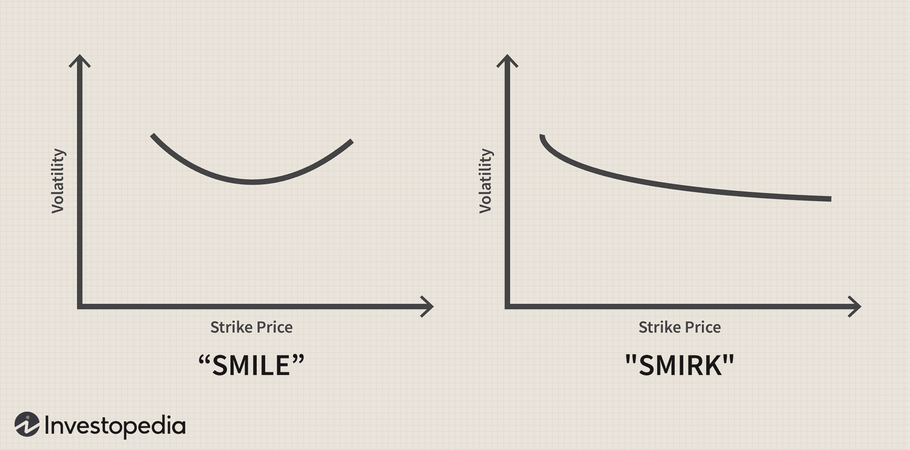

## Table of Contents

## What is volatility skew and how is it defined in financial markets?

Volatility skew, also known as option skew, is a term used in financial markets to describe the difference in implied volatility between options with different strike prices but the same expiration date. Implied volatility is a measure of how much the market expects the price of an asset to move in the future. When you look at a range of options for the same asset, you might notice that the implied volatility isn't the same for all of them. This variation, or "skew," can tell us a lot about what investors are thinking and expecting.

In simple terms, volatility skew shows that options with lower strike prices often have higher implied volatility than options with higher strike prices. This pattern is especially common in equity markets and is often called a "smile" or "smirk" because of the shape it makes on a graph. The skew can be influenced by many things, like how likely investors think big price drops are, or how much they expect the market to move in general. Understanding volatility skew helps traders and investors make better decisions about which options to buy or sell.

## How does volatility skew differ from volatility smile?

Volatility skew and volatility smile are related concepts in options trading, but they describe different patterns in how implied volatility changes across different strike prices. Volatility skew refers to a situation where the implied volatility of options at lower strike prices is higher than at higher strike prices. This pattern often looks like a slope on a graph and is commonly seen in equity markets. It suggests that investors are more worried about big price drops than big price increases, so they're willing to pay more for options that protect against downside risk.

On the other hand, a [volatility](/wiki/volatility-trading-strategies) smile is a pattern where the implied volatility forms a U-shaped curve on a graph. This means that both very low and very high strike prices have higher implied volatilities than options with strike prices close to the current market price. The volatility smile is often seen in currency and commodity markets and can indicate that investors expect big moves in either direction. While the skew focuses on the difference between low and high strikes, the smile emphasizes the higher volatility at the extremes compared to the middle.

In summary, while both terms deal with how implied volatility varies across strike prices, volatility skew highlights a linear or sloping pattern typically seen in equity markets, whereas a volatility smile shows a more symmetrical U-shaped pattern often observed in other markets. Understanding these patterns helps traders and investors make more informed decisions about their options strategies.

## What causes volatility skew in options markets?

Volatility skew in options markets happens because of how people think about risk and what might happen to prices in the future. When people are more worried about a stock or market going down than going up, they will pay more for options that protect them if the price drops. This makes the implied volatility higher for options with lower strike prices. For example, if a company is about to release earnings and people think there might be bad news, they'll want to buy more put options (which go up in value if the stock price falls), which pushes up the implied volatility for those options.

Another reason for volatility skew is how supply and demand work in the options market. If a lot of people want to buy options at certain strike prices, the price of those options will go up, and so will the implied volatility. Market makers, who help make the market by buying and selling options, will adjust the prices to balance out the demand. If there's a lot of demand for options at lower strike prices, the market makers will increase the implied volatility for those options to make them more expensive. This creates the skew we see in the market.

## How can volatility skew be measured and what are the common indicators used?

Volatility skew can be measured by looking at the difference in implied volatility across different strike prices for the same expiration date. A common way to do this is to plot the implied volatility against the strike prices on a graph. If the line on the graph slopes down from left to right, that shows a volatility skew. Traders and analysts often use software and data from options exchanges to get the numbers they need to see this skew.

A key indicator used to measure volatility skew is the "skew index," which compares the implied volatility of out-of-the-money put options to at-the-money options. A higher skew index means there's a bigger difference in implied volatility between these options, showing more fear of a price drop. Another common indicator is the "risk reversal," which looks at the difference in implied volatility between out-of-the-money put and call options. Both of these indicators help traders understand market sentiment and make better decisions about their options trades.

## What is the relationship between volatility skew and market sentiment?

Volatility skew shows what people in the market are thinking and feeling. When the skew is high, it means people are worried about the price of a stock or market going down. They're willing to pay more for options that protect them if the price drops. This happens a lot when there's bad news or uncertainty, like before a company's earnings report or during economic troubles. So, a big skew tells us that people are scared and expecting a possible drop in prices.

On the other hand, if the skew is low, it means people aren't as worried about a big price drop. They might think the market will stay stable or even go up. This can happen during good times when everything seems to be going well. By looking at the volatility skew, traders and investors can get a sense of what others in the market are feeling and make their choices based on that.

## How does volatility skew affect option pricing and trading strategies?

Volatility skew affects option pricing because it changes how much people are willing to pay for options at different strike prices. When the skew is high, options with lower strike prices (like put options that protect against price drops) cost more because more people want to buy them. This makes the price of these options go up. On the other hand, options with higher strike prices might be cheaper because fewer people are interested in them. Traders need to think about this when they are buying or selling options because the skew can make some options a better deal than others.

Traders use volatility skew to make smart choices about their trading strategies. If the skew is high and people are worried about a price drop, traders might buy more put options to protect their investments or to make money if the price does fall. They might also sell call options at higher strike prices because those are cheaper and less in demand. If the skew is low and people are feeling good about the market, traders might do the opposite and buy more call options to bet on prices going up. By understanding the skew, traders can find the best options to trade and make plans that fit with what the market is expecting.

## Can volatility skew predict market movements or upcoming events?

Volatility skew can give clues about what the market might do next or what big events might be coming up. When people are really worried about the market going down, they'll pay more for options that protect them if the price drops. This makes the skew go up. If you see a big skew, it might mean that people are expecting something bad to happen, like a company giving a bad earnings report or the economy having problems. So, the skew can be like a warning sign that something important might be about to happen.

But, it's important to know that the skew doesn't tell you exactly what will happen or when. It's more like a hint about what people are thinking and feeling. Sometimes, the market might not move the way people expect, even if the skew is high. So, while the skew can be a helpful tool for traders to get ready for possible changes, it's not a sure way to predict the future. It's best used along with other information to make smart guesses about what might happen next.

## What historical events have significantly impacted volatility skew?

One big event that changed volatility skew a lot was the 2008 financial crisis. During this time, people were really scared about the economy and the stock market. They thought prices might drop a lot, so they wanted to buy more options that would protect them if that happened. This made the skew go way up because everyone was trying to buy the same kind of options. The high skew showed how worried everyone was about the market crashing.

Another event that affected volatility skew was the 2020 COVID-19 pandemic. When the virus started spreading, people didn't know what would happen to the economy and the stock market. They were afraid prices would fall, so they bought a lot of put options to be safe. This made the skew go up a lot, just like in 2008. The skew during the pandemic showed how uncertain and scared people were about what might happen next.

## How do different market participants interpret and react to changes in volatility skew?

Different people in the market, like traders, investors, and market makers, all look at volatility skew in their own way. Traders might see a big skew and think it's a sign that the market is scared and might drop. They could buy more put options to protect their money or even to make a profit if the market does go down. Investors, on the other hand, might see the same big skew and decide to wait and see what happens, or they might change their plans to be safer. Market makers, who help make the market by buying and selling options, will change the prices of options to match what people want. If everyone wants to buy put options, market makers will make those options more expensive, which makes the skew even bigger.

Sometimes, big changes in the skew can make people do different things. For example, if the skew suddenly gets a lot bigger, traders might rush to buy put options to protect themselves or to take advantage of the fear in the market. This can make the skew even bigger because more people are buying the same options. On the other hand, if the skew gets smaller, it might mean people are feeling better about the market. Traders might then buy more call options, thinking the market will go up. Investors might see a smaller skew as a good time to buy stocks or other investments because the market seems less risky.

## What advanced models incorporate volatility skew for option pricing?

One advanced model that uses volatility skew for option pricing is the Stochastic Volatility Model. This model says that the volatility of an asset can change over time and isn't always the same. It looks at how the skew changes and uses that to guess what the price of an option might be. Traders like this model because it can help them understand how the market might move and what options might be worth.

Another model is the Local Volatility Model. This model looks at the current prices of options and uses the skew to figure out what the volatility might be at different prices of the asset. It's good for pricing options that are far away from the current price of the asset. Traders use this model to find the best options to buy or sell based on what the market is expecting.

Both of these models help traders make better guesses about option prices by looking at the volatility skew. They are more complicated than simple models but can give a clearer picture of what might happen in the market. By using these models, traders can make smarter choices about which options to trade.

## How can traders use volatility skew to hedge their portfolios?

Traders can use volatility skew to hedge their portfolios by buying put options that have a higher implied volatility because of the skew. When the skew is high, it means people are worried about the market going down, so put options with lower strike prices cost more. By buying these put options, traders can protect their investments from big price drops. If the market does go down, the value of the put options will go up, which can help make up for any losses in their portfolio.

For example, if a trader owns a lot of stocks and sees a big skew, they might buy put options to hedge their position. This way, if the stocks go down in value, the put options will go up in value and help balance out the losses. By understanding the skew, traders can pick the right options to use as a hedge and make sure they are paying a fair price for the protection they need.

## What are the limitations and potential pitfalls of relying on volatility skew for market analysis?

Using volatility skew to understand the market can be tricky because it's not a perfect way to predict what will happen. The skew shows what people are worried about right now, but it doesn't tell you for sure what the market will do next. Sometimes, even if the skew is high and people are scared, the market might not drop like everyone thinks. Also, the skew can change quickly because of new news or events, so relying on it too much can lead to wrong guesses about the future.

Another problem is that the skew can be influenced by things that aren't related to the market's future. For example, if a lot of people want to buy certain options at the same time, the skew might go up just because of that demand, not because the market is actually going to drop. This can make it hard to tell if the skew is a real sign of what might happen or just a reaction to what's happening right now. Traders need to be careful and use other information along with the skew to make the best choices.

## How can machine learning be leveraged in algorithmic trading?

Machine learning models significantly enhance [algorithmic trading](/wiki/algorithmic-trading) by analyzing large datasets to identify patterns, thereby adapting trading strategies to dynamic market conditions. These models employ various techniques, such as supervised learning, unsupervised learning, and [reinforcement learning](/wiki/reinforcement-learning), to interpret complex market data and derive actionable insights.

One of the primary benefits of employing [machine learning](/wiki/machine-learning) in algorithmic trading is its ability to predict market volatility. Machine learning algorithms can process historical data to construct predictive models that forecast future market movements. For example, a common approach is to use time-series analysis to model and predict price changes or volatility. Given input variables $X = [x_1, x_2, ..., x_n]$, a machine learning model can output a prediction $\hat{y}$ for the future price or volatility: 

$$
\hat{y} = f(X; \theta)
$$

where $\theta$ denotes the parameters of the model that are learned from the data.

Traders can utilize various machine learning models, such as regression models, decision trees, or neural networks, each varying in complexity and suitability depending on the trading scenario. Neural networks, in particular, are powerful due to their ability to capture non-linear relationships within financial data. A notable example in this category is [deep learning](/wiki/deep-learning) models, which leverage multiple layers to learn sophisticated features from raw data.

Moreover, reinforcement learning has gained traction as a strategy for developing automated trading algorithms. In this setup, the trading algorithm acts as an agent in an environment where it learns optimal trading policies through trials and feedback received from the market. Successful implementation of reinforcement learning can enable trading systems to autonomously develop strategies that maximize returns while mitigating risk, represented through the reward function $R$.

The integration of [artificial intelligence](/wiki/ai-artificial-intelligence) and machine learning provides traders with a competitive edge due to the models' adaptability and efficiency in processing massive volumes of data. This capability is not only vital for identifying profitable trading opportunities but also for executing trades at speed and scale that is beyond human capacity.

In conclusion, machine learning is transforming the landscape of algorithmic trading by enabling predictive analytics and dynamic strategy adaptation, providing traders with invaluable tools to navigate volatile markets effectively. As the field continues to evolve, embracing these technological advancements will be crucial for maintaining a competitive advantage in financial markets.

## References & Further Reading

[1]: Bergstra, J., Bardenet, R., Bengio, Y., & Kégl, B. (2011). ["Algorithms for Hyper-Parameter Optimization."](https://papers.nips.cc/paper/4443-algorithms-for-hyper-parameter-optimization) Advances in Neural Information Processing Systems 24.

[2]: ["Advances in Financial Machine Learning"](https://www.amazon.com/Advances-Financial-Machine-Learning-Marcos/dp/1119482089) by Marcos Lopez de Prado

[3]: Black, F., & Scholes, M. (1973). ["The Pricing of Options and Corporate Liabilities."](https://www.cs.princeton.edu/courses/archive/fall09/cos323/papers/black_scholes73.pdf) Journal of Political Economy, 81(3), 637–654.

[4]: Whaley, R. E. (2000). ["The Investor Fear Gauge."](https://www.semanticscholar.org/paper/The-Investor-Fear-Gauge-Whaley/37ea262fb99beb8bf9dcb8406400d491aab40a0b) Financial Analysts Journal, 56(3), 8-17.

[5]: Hull, J. (2009). ["Options, Futures, and Other Derivatives."](https://www.amazon.com/Options-Futures-Other-Derivatives-9th/dp/0133456315) Pearson Education.

[6]: ["Machine Learning for Algorithmic Trading: Predictive models to extract signals from market and alternative data for systematic trading strategies with Python"](https://github.com/stefan-jansen/machine-learning-for-trading) by Stefan Jansen

[7]: ["Quantitative Trading: How to Build Your Own Algorithmic Trading Business"](https://github.com/LucindaYa/quant-resources/blob/master/Quantitative%20Trading%20How%20to%20Build%20Your%20Own%20Algorithmic%20Trading%20Business.pdf) by Ernest P. Chan

[8]: Aronson, D. R. (2007). ["Evidence-Based Technical Analysis: Applying the Scientific Method and Statistical Inference to Trading Signals."](https://onlinelibrary.wiley.com/doi/book/10.1002/9781118268315) Wiley Trading.

[9]: Engle, R. F. (1982). ["Autoregressive Conditional Heteroscedasticity with Estimates of the Variance of United Kingdom Inflation."](https://www.semanticscholar.org/paper/Autoregressive-conditional-heteroscedasticity-with-Engle/2ee6cb87fc81ecd78d161c4a92c9dfce00c8961c) Econometrica, 50(4), 987–1007.