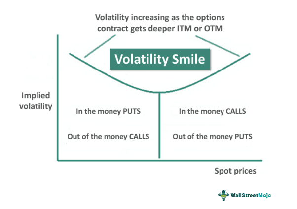

## Table of Contents

## What is the volatility smile?

The volatility smile is a pattern seen in the options market where the implied volatility of options increases as the options get further away from being "at-the-money," or having a strike price equal to the current price of the underlying asset. This creates a smile-like shape when you plot the implied volatility against the strike prices. It shows that options that are far away from the current price of the stock (either very high or very low strike prices) tend to have higher implied volatility.

The volatility smile is important because it suggests that the market expects more extreme movements in the price of the underlying asset than what standard models predict. These standard models, like the Black-Scholes model, assume that volatility is constant across all strike prices, which is not what we see in real markets. The smile indicates that traders are pricing in the possibility of big price jumps, which can be due to events like economic reports, company news, or other unexpected happenings.

## How does the volatility smile appear in option pricing?

The volatility smile shows up in option pricing when you look at how much people are willing to pay for options at different strike prices. When you plot the implied volatility against the strike prices, you see a curve that looks like a smile. This happens because options that are far from the current stock price, either much higher or much lower, have higher implied volatility. This means people are willing to pay more for these options because they think the stock price might make big moves.

The smile tells us that the market thinks there's a bigger chance of the stock price jumping a lot than what simple models like the Black-Scholes model predict. These models assume that the chance of the stock price moving up or down is the same no matter how far it moves. But in real life, traders see that big jumps can happen because of things like company news or economic reports, so they price options accordingly. This is why you see higher prices, and thus higher implied [volatility](/wiki/volatility-trading-strategies), for options that are far from the current stock price.

## What causes the volatility smile?

The volatility smile happens because people in the market think big price jumps can happen more often than what simple math models say. These models, like the Black-Scholes model, think the chance of a stock price moving up or down is the same no matter how big the move is. But in real life, traders know that things like company news, economic reports, or other surprises can make stock prices jump a lot. So, they are willing to pay more for options that are far away from the current stock price, which makes the implied volatility higher for these options.

This higher implied volatility for options far from the current price creates the smile shape when you plot it on a graph. The smile shows that the market expects more extreme moves in the stock price than what the models predict. Traders are pricing in the risk of these big jumps, which is why options with very high or very low strike prices cost more. This pattern is seen across many markets and shows how real-world trading differs from what the models expect.

## Can you explain the difference between implied volatility and historical volatility in the context of the volatility smile?

Implied volatility and historical volatility are two different ways to measure how much a stock's price might move. Historical volatility looks at how much the stock price has moved in the past. It's like looking back at old data to see how jumpy the stock was. If a stock's price was going up and down a lot over the last few months, it would have high historical volatility. 

Implied volatility, on the other hand, is about what people think might happen in the future. It's based on the prices people are willing to pay for options right now. When you see a volatility smile, it means the implied volatility is higher for options that are far from the current stock price. This shows that people think there's a bigger chance of big price jumps happening than what the past data shows. So, the volatility smile is all about implied volatility and how it changes with different strike prices, not about what happened before.

## How does the volatility smile affect option pricing strategies?

The volatility smile affects option pricing strategies because it shows that people expect big price jumps more often than simple models predict. When traders see a volatility smile, they know that options far from the current stock price might be more expensive. This means if you're buying options, you might want to pick ones that are far from the current price if you think the stock will make a big move. But if you're selling options, you need to be careful because those far-out options could cost you more if the stock does jump a lot.

Traders use the volatility smile to adjust their strategies. For example, if you think the stock might jump a lot because of some news coming out, you might buy options with a strike price far from the current price to take advantage of the higher implied volatility. On the other hand, if you think the stock will stay calm, you might sell those far-out options to collect the higher premiums that come with the volatility smile. This way, you can make money from other people's fear of big price moves.

## What are the implications of the volatility smile for the Black-Scholes model?

The volatility smile shows that the Black-Scholes model isn't perfect. The Black-Scholes model thinks that the chance of a stock price moving up or down is the same no matter how big the move is. But the volatility smile tells us that people in the market think big jumps can happen more often than what the model says. So, when traders see a volatility smile, they know that the Black-Scholes model might not be giving them the right prices for options that are far from the current stock price.

Because of this, traders need to be careful when they use the Black-Scholes model. They might need to adjust the model or use other models that can handle the idea of big price jumps better. The volatility smile reminds everyone that real markets can be more complicated than what simple models can predict, and traders should keep this in mind when they're making decisions about buying or selling options.

## How do traders use the volatility smile in their trading decisions?

Traders use the volatility smile to make smarter choices about buying and selling options. They know that the volatility smile means options far from the current stock price might be more expensive because people think big price jumps can happen. So, if a trader thinks a stock might make a big move because of news or something else, they might buy options with a strike price far from the current price. This way, they can take advantage of the higher implied volatility and possibly make more money if the stock does jump.

On the other hand, if a trader thinks the stock will stay calm and not move much, they might sell those far-out options. They can collect the higher premiums that come with the volatility smile, making money from other people's fear of big price moves. By understanding the volatility smile, traders can adjust their strategies to either buy options that they think will go up in value or sell options to collect premiums, depending on what they think will happen with the stock.

## What is the relationship between the volatility smile and market sentiment?

The volatility smile can tell us a lot about what people in the market are thinking. When you see a big smile on the chart, it means that people are expecting the stock to make big jumps. This shows that there's a lot of worry or hope about what might happen next. If traders are worried about bad news or excited about good news, they'll pay more for options that are far from the current stock price, making the smile bigger.

On the other hand, if the smile is smaller, it means people are not as worried or excited. They think the stock will stay pretty calm, so they're not willing to pay as much for those far-out options. By looking at the size and shape of the volatility smile, traders can get a sense of how nervous or hopeful everyone is feeling about the stock's future. This helps them decide whether to buy or sell options based on what they think the market sentiment is.

## How can the volatility smile be used to predict market movements?

The volatility smile can help traders guess what might happen next in the market. When the smile is big, it means people think the stock could jump a lot. This could be because they're worried about bad news or excited about good news. If traders see a big smile, they might think the market is expecting something big to happen soon. So, they could buy options far from the current price to take advantage of these expected jumps.

If the smile is small, it means people think the stock will stay pretty calm. They're not as worried or excited about what might happen next. A small smile could mean that traders expect the market to stay steady, without any big surprises. By looking at the size of the volatility smile, traders can get a sense of whether to expect big moves or not, and plan their trading strategies accordingly.

## What are the mathematical models used to explain the volatility smile?

To explain the volatility smile, people use different math models. One popular model is called the Stochastic Volatility Model. This model says that the ups and downs of a stock's price aren't always the same. They can change over time. So, the model tries to guess how much the stock's volatility might change, which can help explain why options far from the current price might cost more.

Another model is the Jump-Diffusion Model. This model thinks that stocks can make big jumps suddenly, not just move smoothly up or down. It adds these big jumps to the normal small moves of the stock price. By including these jumps, the model can show why people might pay more for options that are far from the current price, creating the volatility smile.

These models are more complicated than the Black-Scholes model because they try to capture the real ups and downs of the market better. By using them, traders can get a better idea of how much to pay for options and why the volatility smile happens.

## How does the volatility smile vary across different asset classes?

The volatility smile can look different for different types of assets like stocks, currencies, or commodities. For stocks, the smile often shows up because people expect big news or events to make the stock price jump. For example, if a company is about to release earnings, the smile might be bigger because people are worried or excited about what the news might be. On the other hand, for currencies, the smile might be less about big news and more about how stable or unstable the economy of a country is. If people think a country's economy might go through big changes, they might pay more for options far from the current exchange rate, making the smile bigger.

For commodities like oil or gold, the volatility smile can change because of things like weather, politics, or changes in how much people want to buy these things. If there's a big storm that might affect oil production, the smile for oil options might get bigger because people are worried about price jumps. Each asset class has its own reasons for why the smile might look different, but it always shows what people think might happen to the price in the future.

## What are the advanced techniques for modeling and exploiting the volatility smile?

Advanced techniques for modeling the volatility smile involve using more complicated math models than the simple Black-Scholes model. One of these is the Local Volatility Model, which changes the volatility based on the stock price and time. This model tries to fit the smile better by saying that the volatility can be different at different stock prices. Another technique is the Stochastic Volatility Model, which thinks that the volatility itself can jump around. This model uses two parts: one for the stock price and another for the volatility. By doing this, it can explain why the volatility smile happens and help traders guess what might happen next.

To exploit the volatility smile, traders use strategies like volatility [arbitrage](/wiki/arbitrage). This means they buy and sell options at different strike prices to take advantage of the differences in implied volatility. If they think the smile is going to get bigger, they might buy options far from the current price and sell options closer to it. Another strategy is called a volatility spread, where traders buy and sell options with different expirations to make money from changes in the smile over time. These advanced techniques help traders make better guesses about the future and make money from the way people in the market think about big price jumps.

## What are the limitations of the Black-Scholes Model?

The Black-Scholes model, developed by Fischer Black and Myron Scholes in 1973, marks a seminal advancement in the field of financial economics as it established a theoretical framework for valuing European-style options. The model relies on several key assumptions, most notably the presumption of constant volatility of the underlying asset's returns. The formula given by the Black-Scholes model is:

$$
C = S_0 N(d_1) - X e^{-rT} N(d_2)
$$

where:
- $C$ is the call option price.
- $S_0$ is the current stock price.
- $X$ is the strike price of the option.
- $T$ is the time to expiration.
- $r$ is the risk-free interest rate.
- $N$ is the cumulative distribution function of the standard normal distribution.
- $d_1$ and $d_2$ are given by:

$$
d_1 = \frac{\ln(S_0/X) + (r + \sigma^2/2)T}{\sigma \sqrt{T}}
$$
$$
d_2 = d_1 - \sigma \sqrt{T}
$$

However, while the Black-Scholes model is fundamental, it does not perfectly account for empirical observations in financial markets, particularly those encapsulated by the phenomenon known as the volatility smile. This discrepancy arises from several inherent limitations:

1. **Assumption of Constant Volatility:** A primary limitation of the Black-Scholes model is its assumption that the volatility ($\sigma$) of the asset’s returns is constant over the option's life. In practice, empirical evidence contradicts this by showing varying levels of volatility across different strike prices, as captured by the volatility smile. This variability indicates that market participants demand different risk premiums for options with different moneyness, driven by changes in perceived market risks.

2. **Log-Normal Distribution of Returns:** The model assumes that the returns of the underlying asset follow a log-normal distribution, precluding the possibility of large, sudden market shifts which are often observed. These abrupt changes lead to fat tails in return distributions — deviations from the standard normality that log-normality presumes — impacting implied volatility.

3. **Omission of Market Realities:** Beyond constant volatility, the Black-Scholes framework does not incorporate several real-world market conditions. Transaction costs, liquidity constraints, and market imperfections all influence option pricing realistically. Additionally, it does not factor in investor sentiment, which can significantly affect market dynamics and options pricing.

These foundational assumptions render the Black-Scholes model inadequate in addressing all dimensions of options pricing, prompting the development of more sophisticated models that incorporate stochastic volatility and other market complexities. Despite these limitations, the Black-Scholes formula remains a starting point in options pricing and serves as a benchmark for more advanced theoretical models.

## What are Advanced Modeling Techniques for Addressing Volatility Smiles?

To address the constraints of the Black-Scholes model in capturing the phenomenon of volatility smiles, researchers and practitioners have developed advanced modeling techniques that offer more robust insights into market behavior.

One of the primary approaches is the use of stochastic volatility models. The Heston model is a prominent example in this category, characterized by introducing a stochastic process for volatility instead of assuming it to be constant. The Heston model is defined by the following set of stochastic differential equations:

$$

\begin{align*}
dS_t &= \mu S_t dt + \sqrt{v_t} S_t dW_t^1, \\
dv_t &= \kappa (\theta - v_t) dt + \sigma \sqrt{v_t} dW_t^2,
\end{align*} 
$$

where $S_t$ represents the stock price, $\mu$ is the drift term, $v_t$ is the instantaneous variance, $\kappa$ is the rate of mean reversion, $\theta$ is the long-term mean of the variance, and $\sigma$ is the volatility of volatility. The terms $dW_t^1$ and $dW_t^2$ are two Brownian motions with a correlation $\rho$. By allowing volatility to fluctuate with time and market conditions, the Heston model provides a more dynamic framework to understand option pricing.

Local volatility models present another way to capture the dynamics of volatility smiles by adjusting the volatility surface based on market observations. These models assume that volatility is a deterministic function of the underlying asset price and time. The most famous local volatility model is derived from the Dupire equation:

$$
\sigma_{LV}(S, t)^2 = \frac{C_{T}(S, T) + (2rSC_{S,T}(S,T))}{S^2 C_{SS}(S,T)},
$$

where $C(S,T)$ is the market price of a European call option with maturity $T$ and strike $S$, $C_S$ and $C_{SS}$ are the first and second partial derivatives with respect to $S$, and $r$ is the risk-free interest rate. This equation allows practitioners to recalibrate their models to capture the actual market environment on any given day, thus providing a snapshot of market dynamics.

Both stochastic and local volatility models enrich the pricing of options by treating volatility as a variable [factor](/wiki/factor-investing) rather than a constant. These models also have the capacity to incorporate extreme market movements or 'jumps', reflecting the market's tendency to experience sudden spikes or drops, which might not be captured by simpler models.

Incorporating real-time data is a significant aspect of these advanced techniques, ensuring that the models remain responsive to current market conditions. The use of such models in practice requires a blend of mathematical sophistication and computational power, often employing numerical methods like finite difference, Monte Carlo simulations, and lattice approaches for option pricing.

In conclusion, advanced modeling techniques addressing volatility smiles offer enhanced precision and adaptability, reflecting the true complexities of financial markets more accurately than traditional approaches. They facilitate better-informed trading and risk management strategies, ultimately leading to more effective market operations.

## References & Further Reading

- Taleb, N. N., & Hagan, P. S. (2002). "Managing Smile Risk." Wilmott Magazine. This work explores the management of risks associated with the volatility smile in financial markets, offering insights into effective strategies for practitioners dealing with the complexities of options pricing.

- Gatheral, J. (2006). "The Volatility Surface: A Practitioner's Guide." John Wiley & Sons. Gatheral provides a comprehensive guide to understanding the volatility surface, emphasizing practical applications and theoretical insights that help traders and analysts better interpret market signals and refine their trading strategies.

- Heston, S. L. (1993). "A Closed-Form Solution for Options with Stochastic Volatility with Applications to Bond and Currency Options." The Review of Financial Studies, 6(2), 327-343. Heston's paper introduces a model incorporating stochastic volatility, presenting a closed-form solution that has been influential in options pricing theory, particularly for its relevance to bond and currency options.

- Black, F., & Scholes, M. (1973). "The Pricing of Options and Corporate Liabilities." Journal of Political Economy, 81(3), 637-654. The seminal work by Black and Scholes laid the foundation for modern options pricing theory, introducing the Black-Scholes model, which, despite its limitations, remains a cornerstone in financial economics.

- Hull, J., & White, A. (1987). "The Pricing of Options on Assets with Stochastic Volatilities." Journal of Finance, 42(2), 281-300. Hull and White's research extends the understanding of options pricing by incorporating stochastic volatility, providing more nuanced models that address some of the constraints found in the Black-Scholes framework.

