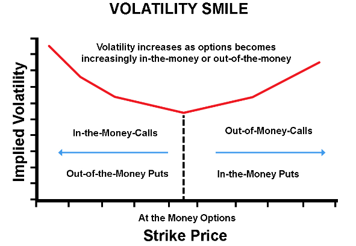

Options trading is a multifaceted financial domain where the dynamics of pricing and volatility interplay critically define market activities. At the heart of this relationship lies the volatility smile, a graphical representation revealing variations in implied volatility across various strike prices. This pattern, typically forming a U-shaped curve, reflects nuances in market expectations that diverge significantly from the constant volatility assumed by the classical Black-Scholes model.

In the context of options pricing, the Black-Scholes model has traditionally served as a foundational tool. However, its assumption of constant volatility often fails to capture real-world complexities, thereby leading to discrepancies that manifest as the volatility smile. Traders and financial analysts find the volatility smile particularly insightful, as it provides a unique lens through which both pricing anomalies and strategic opportunities can be identified.



The significance of the volatility smile extends beyond theoretical interest; it has profound implications for trading strategies. Understanding its formation and implications enables traders to better assess risk and potential returns, offering opportunities to develop strategies that capitalize on pricing inefficiencies. For example, the insights gleaned from volatility smiles can inform decisions related to hedging practices and the identification of mispriced options.

In algorithmic trading, where speed and precision are paramount, incorporating the understanding of volatility smiles becomes crucial. Trading algorithms relying on these patterns can be optimized for better prediction accuracy and risk management, thereby enhancing strategy effectiveness in a fast-paced market environment. Consequently, traders who grasp the complexities of the volatility smile are better positioned to navigate challenges and exploit opportunities that arise from the dynamic nature of financial markets.

## Table of Contents

## Understanding Options Pricing

Options pricing is a multifaceted area, influenced by several critical factors, including the underlying asset price, the strike price, and implied volatility. These elements collectively define an option's market value at any given moment. Among the various frameworks used to assess options, the Black-Scholes model stands as a foundational method for calculating theoretical option prices. Introduced by Fischer Black, Myron Scholes, and Robert Merton in the early 1970s, the model offers a mathematical approach to determine the price of European-style options.

### Black-Scholes Model

The Black-Scholes model is expressed by the following formula for a call option:

$$
C = S_0 N(d_1) - Xe^{-rt} N(d_2)
$$

And for a put option:

$$
P = Xe^{-rt} N(-d_2) - S_0 N(-d_1)
$$

Where:

- $C$ is the call option price
- $P$ is the put option price
- $S_0$ is the current stock price
- $X$ is the option's strike price
- $t$ is the time to expiration
- $r$ is the risk-free interest rate
- $N(d)$ denotes the cumulative distribution function of the standard normal distribution
- $d_1 = \frac{\ln(S_0/X) + (r + \sigma^2/2)t}{\sigma \sqrt{t}}$
- $d_2 = d_1 - \sigma \sqrt{t}$
- $\sigma$ is the volatility of the underlying asset

While the Black-Scholes model has been instrumental in understanding options pricing, it assumes constant [volatility](/wiki/volatility-trading-strategies) and risk-free [interest rate](/wiki/interest-rate-trading-strategies), and it primarily applies to European options that can only be exercised at expiration. These assumptions limit the model's applicability in real-world scenarios where market conditions fluctuate rapidly and various factors such as dividends or American-style options necessitate more complex valuation approaches.

### Implied Volatility

Implied volatility is a pivotal component in assessing options pricing and represents the market’s forecast of a likely movement in the asset price. Unlike historical volatility, which is derived from past price data, implied volatility is forward-looking and extracted from options prices themselves. It is the volatility level that, when plugged into an option pricing model like Black-Scholes, yields a theoretical value equal to the market price of the option.

The challenge in using implied volatility lies in its variability; it can change as market conditions evolve, impacting options pricing directly. High implied volatility typically increases option premiums, reflecting enhanced expectations of price movements.

### Implied Volatility Surface

The relationship between implied volatility and various factors, like strike prices and expiration dates, is often depicted in an implied volatility surface—a three-dimensional plot showing implied volatilities against multiple strike prices and times to expiration. This surface allows traders to visualize and analyze the implied volatility landscape.

Exploring the dimensions of the implied volatility surface offers traders insights into future price changes and market sentiment. By examining the shape and tendencies of the surface, traders can discern patterns such as "smirks" or "smiles" that indicate how implied volatilities differ across strikes for given maturities, providing a clearer picture of the market's expectations.

In practical applications, options traders use implied volatility and its surface to identify potential mispricings and make informed strategic decisions. By understanding these complexities, traders can gauge market dynamics more effectively, thus optimizing their trading approaches in a constantly evolving financial landscape.

## The Volatility Smile Phenomenon

A volatility smile emerges when implied volatility is plotted against various strike prices, generally forming a U-shaped curve. This pattern is notably inconsistent with the constant volatility assumption of the Black-Scholes model, which predicts a flat volatility surface. Instead, empirical observations reveal more dynamic volatility patterns, reflecting the diverse market expectations across different asset classes and option maturities.

The phenomenon of the volatility smile suggests that options with lower and higher strike prices (deep in-the-money and out-of-the-money options, respectively) tend to exhibit higher implied volatility compared to at-the-money options. This deviation from the Black-Scholes model is attributed to various market factors including investor behavior, demand and supply imbalances, and the risk of extreme price movements (tail risk). For instance, markets often price in higher volatility for deep out-of-the-money options due to their potential for substantial leverage in unexpected market conditions.

The volatility smile is crucial for options traders, impacting both the pricing of options and the strategies employed. Traders use the volatility smile to assess the market's view of future volatility, which is essential for setting their hedging positions and managing risk. For example, a pronounced smile indicates greater uncertainty or fear of large market moves, prompting traders to adjust their strategies accordingly.

Furthermore, understanding the volatility smile provides opportunities for traders to exploit mispriced options. When the implied volatility deviates from historical or expected future volatility, traders can identify pricing anomalies and engage in volatility [arbitrage](/wiki/arbitrage) strategies. By appreciating the intricacies of the volatility smile, traders are better equipped to make informed decisions, optimize their portfolios, and enhance potential returns while managing risk.

## Algorithmic Trading and Volatility Smiles

Algorithmic trading combines technological prowess with advanced financial theory to exploit market inefficiencies with precision and speed. A crucial aspect of developing effective trading algorithms is the ability to incorporate volatility smiles into their frameworks. Volatility smiles, which depict the market's expectation of volatility across different strike prices, are vital in adjusting algorithmic models to improve prediction accuracy and optimize risk management strategies.

**Modeling Volatility Smiles in Algorithms**

Precise modeling of market behaviors, particularly volatility smiles, enhances the performance of trading algorithms by addressing the inherent limitations of traditional pricing models, such as the Black-Scholes model. These models generally assume constant volatility, which often deviates from reality. Volatility smiles offer a more dynamic view, allowing algorithms to more accurately reflect market conditions.

By incorporating volatility smiles, algorithms can adjust their parameters based on the implied volatility across different options, leading to more accurate pricing and prediction models. Such adjustments allow traders to capitalize on pricing anomalies and optimize hedging strategies.

**Impact on Algorithmic Strategies**

Traders can use these volatility-informed algorithms to adjust their trading strategies in real-time, improving their accuracy in predicting market movements and managing risk. For example, by analyzing the shape and shifts in a volatility smile, algorithms can be tweaked to enhance prediction accuracy for specific market conditions, such as anticipating market drops or rallies.

Several case studies highlight the success of algorithmic traders in using volatility smiles to their advantage. For instance, traders often leverage regression models and [machine learning](/wiki/machine-learning) algorithms that utilize historical data to anticipate changes in volatility patterns. This enables them to refine their trading strategies, ensuring they remain profitable amidst fluctuating market conditions.

**Machine Learning and Volatility Smiles**

The integration of machine learning methods marks a significant advancement in utilizing volatility smiles. Machine learning algorithms, such as neural networks and random forests, can process vast amounts of historical data to detect subtle patterns and predict future shifts in volatility smiles. By continuously learning from new data inputs, these algorithms can dynamically adjust to evolving market conditions, offering traders a cutting-edge tool for maintaining a competitive edge.

Python's extensive libraries, such as `scikit-learn` for machine learning and `numpy` for numerical computations, are commonly employed to develop these models. For instance, a basic implementation could involve using a [neural network](/wiki/neural-network) to predict future volatility smile shifts based on historical data inputs:

```python
import numpy as np
from sklearn.model_selection import train_test_split
from sklearn.neural_network import MLPRegressor

# Example data, replace with actual historical volatility data
X = np.random.rand(1000, 5)  # Feature matrix, e.g., historical option prices
y = np.random.rand(1000)     # Target variable, e.g., future volatility smile shift

# Splitting the dataset into training and testing sets
X_train, X_test, y_train, y_test = train_test_split(X, y, test_size=0.2, random_state=42)

# Training a neural network model
model = MLPRegressor(hidden_layer_sizes=(100, 50), max_iter=1000, random_state=42)
model.fit(X_train, y_train)

# Predicting future shifts
predictions = model.predict(X_test)
```

This implementation of a neural network can help traders anticipate changes in the volatility smile, offering a strategic advantage in timing entry and [exit](/wiki/exit-strategy) points for trades.

In conclusion, leveraging volatility smiles through [algorithmic trading](/wiki/algorithmic-trading) and machine learning allows traders to refine their strategies and enhance their market performance. The continuous improvement of modeling techniques ensures that traders can effectively navigate the complexities of financial markets.

## Advanced Modeling Techniques

The Black-Scholes model is widely recognized for its foundational role in options pricing but is limited by its assumption of constant volatility. This assumption often fails to account for observed market phenomena such as volatility smiles, where implied volatility varies with different strike prices. To address these limitations, advanced modeling techniques have been developed, including stochastic volatility models and local volatility models, which better reflect real market conditions.

**Stochastic Volatility Models**

Stochastic volatility models introduce randomness into volatility itself, allowing it to change over time as a stochastic process. The Heston model is a prominent stochastic volatility framework, defined by the following stochastic differential equations:

$$
dS_t = \mu S_t dt + \sqrt{V_t} S_t dW_t^1
$$

$$
dV_t = \kappa (\theta - V_t) dt + \sigma \sqrt{V_t} dW_t^2
$$

where $S_t$ is the asset price, $V_t$ is the variance, $\mu$ is the drift rate, $\kappa$ is the rate at which variance reverts to the long-term mean $\theta$, $\sigma$ is the volatility of the volatility, and $dW_t^1$ and $dW_t^2$ are two Brownian motions with a correlation parameter $\rho$.

The flexibility of the Heston model lies in its ability to capture volatility smiles and skews, providing a more dynamic representation of market conditions than the constant volatility assumption of Black-Scholes.

**Local Volatility Models**

In contrast, local volatility models suggest that volatility is a deterministic function of the asset price and time. These models are derived from the implied volatility surface itself, and the most popular among them is the Dupire's Local Volatility model, which implies:

$$
\sigma_{\text{local}}(S_t, t) = \sqrt{2 \frac{\frac{\partial C}{\partial t} + rS_t \frac{\partial C}{\partial S} + rC}{S_t^2 \frac{\partial^2 C}{\partial S^2}}}
$$

Here, $\sigma_{\text{local}}(S_t, t)$ is the local volatility, $C$ is the value of the option, and $r$ is the risk-free interest rate.

Local volatility models capture the full range of possible future paths of an asset price, providing valuable insights for traders seeking to exploit market inefficiencies.

**SABR Model**

The SABR (Stochastic Alpha, Beta, Rho) model is another advanced technique that effectively handles volatility smiles. It is particularly suited for pricing and managing portfolios of interest rate options, characterized by its ability to model the dynamic properties of implied volatility. In the SABR model, the stochastic differential equation for forward rates is given by:

$$
dF_t = \alpha_t F_t^\beta dW_t^1
$$

$$
d\alpha_t = \nu \alpha_t dW_t^2
$$

where $\alpha_t$ is the volatility, $F_t$ is the forward rate, $\beta$ is a constant, and $\nu$ is the volatility of the volatility.

**Algorithmic Trading Implications**

In algorithmic trading, the incorporation of these advanced models enables more accurate representation of market conditions, enhancing the robustness of trading strategies. By integrating stochastic and local volatility models, traders can achieve refined predictions of market behaviors and craft strategies that better account for risk factors. Utilizing these advanced techniques allows for more precise modeling of volatility smiles, leading to optimized risk-adjusted returns.

In conclusion, the enhancement of traditional models through stochastic volatility, local volatility, and advanced models like Heston and SABR provides traders with sophisticated tools to more accurately navigate the complexities inherent in market volatility and ensure more effective trading outcomes.

## Practical Applications and Strategies

Understanding and exploiting volatility smiles can play a pivotal role in optimizing an options trader's strategy. A volatility smile occurs when the implied volatility plotted against various strike prices forms a U-shaped curve, offering insight into market sentiment and potential price movements. This asymmetric pattern can be leveraged to identify mispriced options, as deviations from expected volatility patterns might signal discrepancies in option valuations. Traders adept at recognizing such anomalies can capitalize on these discrepancies to achieve substantial profit opportunities.

### Identifying Mispriced Options
Volatility smiles reveal that options with the same expiration but different strike prices can have different implied volatilities. This provides astute traders with the chance to identify undervalued or overvalued options relative to the market. When traders spot options that deviate from their expected volatility patterns, they can execute trades designed to exploit these differences. For example, if an option is priced with lower implied volatility than the market suggests, purchasing it might yield significant returns should the market correct itself.

### Delta-Hedging and Volatility Arbitrage
Traders often employ delta-hedging and volatility arbitrage strategies to capitalize on volatility smiles. Delta-hedging involves creating a delta-neutral position that mitigates the risk of price movements in the underlying asset. This is achieved by adjusting the positions in options and underlying assets so that the overall delta—the sensitivity of the portfolio's value to changes in the price of the underlying asset—is zero.

Volatility arbitrage takes advantage of discrepancies between implied and realized volatility. Traders analyze historical volatility data against current implied volatility to identify mispricings. By constructing a portfolio of options and underlying assets, traders can capitalize on the anticipated convergence of implied and realized volatility values. Utilizing the volatility smile, traders can structure these portfolios strategically to maximize gains while minimizing risk.

### Case Studies
Case studies of successful traders highlight the importance of integrating volatility smiles into their trading arsenal. One notable case involves a [hedge fund](/wiki/hedge-fund-trading-strategies) utilizing volatility arbitrage strategies to detect and exploit anomalous volatility patterns in equity options. By carefully analyzing volatility smiles, the fund could pinpoint instances when implied volatility was undervalued, executing trades that resulted in outsized returns.

Another case study examines a [quantitative trading](/wiki/quantitative-trading) firm employing algorithmic strategies to continually update their volatility smile models based on real-time market data. These dynamic adjustments allowed them to better anticipate volatility shifts, refining their hedge tactics and enhancing profitability.

### Practical Guidance for Traders
For novice traders seeking to incorporate volatility smiles into their strategy, the key is continuous education and practice with simplified models. Start by familiarizing oneself with basic option pricing concepts and practicing with simulated trading platforms to understand how volatility impacts pricing. For more experienced traders, advanced modeling techniques such as stochastic and local volatility models can offer a nuanced understanding of volatility smiles, facilitating the development of robust strategies tailored to market conditions.

In Python, traders can leverage libraries such as NumPy and SciPy to model and analyze volatility smiles. Here’s a simple illustration to calculate the implied volatility for a range of strike prices:

```python
import numpy as np
from scipy.stats import norm

def black_scholes_call(S, K, T, r, sigma):
    d1 = (np.log(S / K) + (r + 0.5 * sigma**2) * T) / (sigma * np.sqrt(T))
    d2 = d1 - sigma * np.sqrt(T)
    call_price = S * norm.cdf(d1) - K * np.exp(-r * T) * norm.cdf(d2)
    return call_price

def implied_volatility(S, K, T, r, market_price):
    sigma = 0.2  # initial guess
    for _ in range(100):
        price = black_scholes_call(S, K, T, r, sigma)
        vega = S * norm.pdf((np.log(S / K) + (r + 0.5 * sigma**2) * T) / (sigma * np.sqrt(T))) * np.sqrt(T)
        sigma -= (price - market_price) / vega
    return sigma

# Example usage
strike_prices = [80, 90, 100, 110, 120]
market_prices = [15, 9, 5, 2, 1]  # hypothetical market prices
S, T, r = 100, 1, 0.05  # current price, time to expiration, risk-free rate

implied_vols = [implied_volatility(S, K, T, r, P) for K, P in zip(strike_prices, market_prices)]
print(implied_vols)
```

This script calculates implied volatility for various strike prices given market prices, facilitating the construction of a volatility smile and the identification of trading opportunities.

## Conclusion

The volatility smile plays an indispensable role in options trading, providing traders with crucial insights into market dynamics. As traders attempt to gauge market sentiment and predict future movements, the volatility smile serves as a visual representation that challenges traditional models such as the Black-Scholes model, which assumes constant volatility. Instead, it reflects the realities of market pricing, which often exhibits more complex and dynamic behavior.

For algorithmic traders, effectively incorporating volatility smiles into trading models can lead to optimized risk-adjusted returns. By understanding how volatility smiles affect option prices, traders can adjust their strategies to better predict market movements and manage risk. The use of advanced modeling techniques, such as stochastic volatility models and machine learning algorithms, further enhances the ability to interpret these patterns and adapt trading strategies accordingly.

The continual refinement of financial models and techniques is paramount in capturing the intricate nature of financial markets. Traditional models like Black-Scholes have been supplemented with more sophisticated approaches that account for volatility dynamics, thereby providing a more accurate reflection of market conditions. As technology continues to evolve, future advancements are poised to further boost the predictive power of volatility-based strategies. Algorithmic solutions will likely become even more adept at extracting actionable insights from complex volatility patterns, bolstering their utility in diverse market environments.

Ultimately, a robust understanding of volatility patterns equips traders with essential tools to navigate and capitalize on the opportunities within increasingly complex markets. By leveraging insights from the volatility smile, traders not only enhance their decision-making processes but also improve their ability to achieve consistent and profitable outcomes.

## References & Further Reading

### References & Further Reading

To deepen your understanding of volatility smiles and options pricing, consider the following resources:

1. **Black-Scholes Model**: 
   - **"The Pricing of Options and Corporate Liabilities"** by Fischer Black and Myron Scholes. This foundational paper introduces the Black-Scholes model, setting the groundwork for modern options pricing. [Link](https://www.jstor.org/stable/1831029)

2. **Stochastic Volatility Models**: 
   - **"A Closed-form Solution for Options with Stochastic Volatility with Applications to Bond and Currency Options"** by Steven L. Heston. The Heston model addresses some limitations of the Black-Scholes model by incorporating stochastic volatility.
   - **"The SABR Volatility Model"** by Patrick S. Hagan et al. This paper elaborates on the SABR model known for modeling the evolution of volatility over time.

3. **Algorithmic Trading Techniques**: 
   - **"Algorithmic Trading and DMA: An introduction to direct access trading strategies"** by Barry Johnson provides a comprehensive overview of algorithmic trading methods and their application to modern markets.
   - **"High-Frequency Trading: A Practical Guide to Algorithmic Strategies and Trading Systems"** by Irene Aldridge covers the application of algorithms in high-frequency trading environments, including how volatility smiles are integrated into trading systems.

4. **Machine Learning Applications in Options Trading**: 
   - Explore the use of machine learning in options pricing with **"Advances in Financial Machine Learning"** by Marcos López de Prado, highlighting algorithms and innovations in financial data analysis. 

These resources offer a blend of theoretical and practical insights critical for grasping the complexities of options trading and the volatility smile phenomenon. Readers are encouraged to access these works to further their knowledge and stay updated on new developments in the field.

