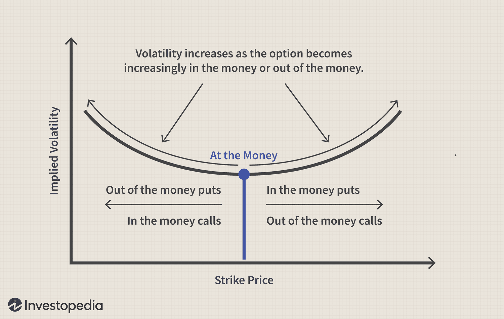

## Table of Contents

## What is the volatility smile?

The volatility smile is a pattern seen in the options market where the implied volatility of options increases as the options get further away from being at-the-money. Imagine you're looking at a graph where the x-axis shows the strike price of options and the y-axis shows their implied volatility. Instead of a flat line, you see a curve that looks like a smile. This happens because traders expect bigger price swings for stocks that are far from their current price, so they demand higher premiums for those options.

This pattern became famous after the stock market crash of 1987. Before that, people thought that options with different strike prices should have the same implied volatility. But after the crash, it was clear that this wasn't true. The volatility smile shows that the market is more worried about big moves in stock prices, and this worry affects how much people are willing to pay for options. It's a reminder that markets can be unpredictable, and traders need to be ready for anything.

## How does the volatility smile appear in option pricing?

The volatility smile shows up in option pricing when you look at how much people are willing to pay for options at different strike prices. Normally, if you draw a graph with the strike prices on one side and the implied volatility on the other, you'd expect to see a straight line. But with the volatility smile, the line curves up at both ends. This means that options that are far away from the current stock price (either much higher or much lower) have higher implied volatility. People are willing to pay more for these options because they think the stock might make a big move.

This pattern became really clear after the big stock market crash in 1987. Before that, people thought that all options should have about the same implied volatility no matter the strike price. But the crash showed that wasn't true. Now, when traders see a volatility smile, it tells them that the market thinks there's a bigger chance of the stock price making a big jump or drop. This affects how they price options, making those far-from-the-money options more expensive.

## What causes the volatility smile?

The volatility smile happens because people think there's a bigger chance of big price moves in the stock market. When options are far away from the current stock price, either really high or really low, people are willing to pay more for them. They think there's a higher chance the stock could jump to those prices, so they want to protect themselves or bet on those big moves. This makes the price, or premium, of those options go up, which shows up as higher implied volatility on a graph.

This pattern became really clear after the big stock market crash in 1987. Before that, people thought all options should have the same implied volatility no matter the strike price. But the crash showed that wasn't true. Now, when traders see a volatility smile, it tells them that the market thinks there's a bigger chance of the stock price making a big jump or drop. This affects how they price options, making those far-from-the-money options more expensive.

## How does the volatility smile differ from the volatility skew?

The volatility smile and the volatility skew are both patterns you can see when looking at how much people are willing to pay for options at different strike prices. The main difference is in the shape of these patterns. The volatility smile looks like a smile on a graph, with the implied volatility going up for options that are far away from the current stock price, both above and below it. This means people think there's a bigger chance of the stock making a big move in either direction.

On the other hand, the volatility skew is more like a line that slants. It usually shows higher implied volatility for options that are below the current stock price. This means people are more worried about the stock price going down than going up. The skew can happen because people think there's a bigger chance of a drop in the stock price, so they're willing to pay more for options that would make money if the stock falls.

Both the smile and the skew show that the market doesn't always think options should have the same implied volatility. They help traders understand what the market is thinking about future price moves and how much they should pay for options.

## Can you explain the historical context behind the discovery of the volatility smile?

The volatility smile was discovered after the big stock market crash in 1987. Before that, people thought that all options should have the same implied volatility no matter what the strike price was. They used a model called the Black-Scholes model, which said that the implied volatility should be the same for all options on the same stock. But when the stock market crashed, it showed that this wasn't true. People started looking at the prices of options and saw that the ones far away from the current stock price had higher implied volatility. This made a pattern on a graph that looked like a smile, and that's how the volatility smile was discovered.

After the crash, traders and researchers realized that the market was more worried about big moves in stock prices than they thought before. The volatility smile showed that people were willing to pay more for options that could make money if the stock price made a big jump or drop. This changed how people thought about option pricing and made them see that the market can be unpredictable. The discovery of the volatility smile was a big deal because it helped traders understand the market better and adjust how they priced options.

## What are the implications of the volatility smile for option pricing models?

The volatility smile showed that the old way of thinking about options, using the Black-Scholes model, wasn't right. This model said that all options on the same stock should have the same implied volatility, no matter the strike price. But after the 1987 stock market crash, people saw that options far away from the current stock price had higher implied volatility. This meant that the Black-Scholes model didn't fit what was happening in the market. Traders had to find new ways to price options that took into account this smile pattern.

Now, option pricing models have to consider the volatility smile to be more accurate. The smile shows that the market thinks there's a bigger chance of big price moves, so options far from the current stock price should cost more. This has led to the creation of new models that can handle different implied volatilities for different strike prices. These models help traders better understand what the market is thinking and make better decisions about how much to pay for options.

## How can the volatility smile be used in trading strategies?

The volatility smile can help traders make better trading plans. When they see the smile, they know that options far away from the current stock price might be more expensive because people think the stock could make a big move. Traders can use this information to buy or sell options that they think are priced right based on the smile. For example, if a trader thinks a stock might jump up a lot, they might buy options with a high strike price because those options are more expensive due to the smile.

Traders can also use the volatility smile to find good deals. If they see that the smile is bigger for some options than others, they might think those options are overpriced. They could sell those options and make money if the stock doesn't move as much as people think. On the other hand, if they think some options are underpriced, they might buy them and hope to make money if the stock makes a big move. By understanding the volatility smile, traders can make smarter choices about which options to trade.

## What are the mathematical models used to describe the volatility smile?

To describe the volatility smile, mathematicians have come up with different models. One popular model is the Stochastic Volatility Model. This model says that the volatility of a stock isn't just a fixed number, but it can change over time. This means that the price of options can change because the volatility changes, which helps explain why we see the smile. Another model is the Local Volatility Model, which looks at how the volatility changes with the stock price and time. This model can also show the smile because it says that the volatility isn't the same for all strike prices and times.

Another model that's used is the Jump-Diffusion Model. This model says that the stock price can make big jumps sometimes, not just small changes. These big jumps can make the price of options go up, especially for options far from the current stock price, which is what we see in the volatility smile. All these models help traders understand why the smile happens and how to price options better. They show that the market can be more complicated than just using one number for volatility.

## How does the volatility smile vary across different asset classes?

The volatility smile can look different depending on what kind of asset you're looking at. For example, in the stock market, the smile often shows up because people think there's a bigger chance of big price moves. After the big stock market crash in 1987, traders saw that options far away from the current stock price had higher prices, making the smile shape. In the stock market, the smile can be more pronounced for stocks that are seen as riskier or more likely to have big price swings.

In the currency markets, the volatility smile can also appear, but it might look a bit different. People trading currencies often worry about big changes in exchange rates, especially during times of economic uncertainty. This worry can make options far from the current exchange rate more expensive, creating a smile. But in the currency market, the smile might be less pronounced than in the stock market because currencies tend to be more stable over time. The volatility smile can vary a lot depending on the asset class, showing how different markets think about risk and price changes.

## What is the impact of market events on the shape of the volatility smile?

Market events can really change the shape of the volatility smile. When something big happens, like a big stock market crash or a sudden change in economic news, people get worried. They start thinking that the stock price might make a big move, either up or down. This makes them want to pay more for options that are far away from the current stock price. So, the smile gets bigger and more pronounced because people are more willing to pay for those options.

For example, after the big stock market crash in 1987, the volatility smile became really clear. Before that, people thought all options should have the same price no matter the strike price. But the crash showed that wasn't true. People started seeing that options far from the current stock price were more expensive, making the smile shape. So, big market events can make the smile bigger and show that the market is more worried about big price moves.

## How do advanced option pricing models like the stochastic volatility models account for the volatility smile?

Advanced option pricing models like the stochastic volatility models help explain the volatility smile by saying that the volatility of a stock isn't just one number, but it can change over time. These models think that the stock's volatility can go up and down, which means that the price of options can change too. When people see that the stock's volatility might be higher in the future, they're willing to pay more for options that are far away from the current stock price. This makes the smile shape on the graph because those options get more expensive.

These models are better than the old Black-Scholes model because they can show why the smile happens. The Black-Scholes model thought that all options on the same stock should have the same implied volatility, no matter the strike price. But after the big stock market crash in 1987, people saw that this wasn't true. The stochastic volatility models help traders understand that the market can be more complicated, and they give a better way to price options that takes into account the changing volatility and the smile shape.

## What are the current research trends and future directions in understanding the volatility smile?

Right now, researchers are trying to understand the volatility smile even better. They're looking at new ways to make models that can explain why the smile happens. One big trend is using [machine learning](/wiki/machine-learning) and [artificial intelligence](/wiki/ai-artificial-intelligence) to study how the smile changes over time. These new tools can help find patterns in the data that old models might miss. Researchers are also looking at how different markets and events affect the smile, trying to find out why it looks different in different places and times.

In the future, we might see even better models that can predict the smile more accurately. These models could help traders make better decisions about buying and selling options. Another direction is looking at how the smile changes in different types of markets, like stocks, currencies, and even cryptocurrencies. By understanding these differences, researchers can help traders know what to expect in different situations. The goal is to make option pricing more accurate and help traders manage their risks better.

## What is the concept of Understanding Volatility Smiles?

Implied volatility (IV) is a crucial metric in options pricing, reflecting the market's expectations of future volatility of the underlying asset. It significantly influences the premium of an options contract; higher implied volatility typically leads to higher option prices due to increased potential for substantial price movements, enhancing the likelihood of profit for options holders. 

The concept of a [volatility](/wiki/volatility-trading-strategies) smile emerges when plotting implied volatilities against various strike prices for options with the same expiry date. Contrary to the constant volatility assumption of the Black-Scholes model, where implied volatility is consistent across all strikes, empirical observations often reveal a U-shaped curve — the so-called "volatility smile." This pattern indicates that options that are deep in-the-money or out-of-the-money have higher implied volatilities compared to those that are at-the-money. Such deviation suggests that investors demand higher premiums for these riskier options, acknowledging the probability of extreme market movements.

In traditional Black-Scholes modeling, implied volatility is assumed constant, represented by the following equation for the Black-Scholes formula:

$$
C = S_0 N(d_1) - Xe^{-rt}N(d_2)
$$

where:
$$
d_1 = \frac{\ln(S_0/X) + (r + \sigma^2/2)t}{\sigma\sqrt{t}}
$$
$$
d_2 = d_1 - \sigma\sqrt{t}
$$

Here, $\sigma$ is the fixed volatility parameter. However, the presence of a volatility smile suggests that such constancy is a simplification of real-market behaviors, thus underscoring the model’s limitations.

To visually illustrate a volatility smile, consider the following Python code snippet for plotting:

```python
import matplotlib.pyplot as plt
import numpy as np

strike_prices = np.linspace(80, 120, 10)
implied_volatility = 0.2 + 0.1 * (strike_prices - 100)**2 / 1000

plt.plot(strike_prices, implied_volatility, marker='o')
plt.title("Volatility Smile")
plt.xlabel("Strike Price")
plt.ylabel("Implied Volatility")
plt.grid(True)
plt.show()
```

This graph clearly depicts the smile pattern, showcasing higher implied volatilities for options priced further from an at-the-market position, both in the money and out of the money.

Understanding the formation of volatility smiles is essential for traders and financial analysts, as it plays a significant role in risk assessment, premium setting, and ultimately, in the creation of more accurate pricing models. By recognizing these deviations from traditional models, traders can adapt and refine their strategies for better risk management and opportunity identification.

## What are the limitations of the Black-Scholes Model?

The Black-Scholes model, developed by Fischer Black and Myron Scholes, is a cornerstone in financial theory for options pricing. It provides a mathematical framework for determining the theoretical value of European-style options, assuming markets are efficient and frictionless, and that stock prices follow a geometric Brownian motion. A key assumption of the Black-Scholes model is that the volatility of the underlying asset is constant over the life of the option. This implies that regardless of changes in market conditions or the option's expiration date, the volatility remains unchanged.

The model calculates the price of a call option $C$ using the formula:

$$
C = S_0 N(d_1) - Xe^{-rT} N(d_2)
$$

where:

- $S_0$ is the current stock price,
- $X$ is the strike price of the option,
- $r$ is the risk-free interest rate,
- $T$ is the time to maturity,
- $N(\cdot)$ is the cumulative distribution function of the standard normal distribution,
- $d_1$ and $d_2$ are given by:

$$
d_1 = \frac{\ln(S_0 / X) + (r + \sigma^2 / 2) T}{\sigma \sqrt{T}}
$$

$$
d_2 = d_1 - \sigma \sqrt{T}
$$

where $\sigma$ is the volatility of the underlying asset.

Despite its elegance and simplicity, the Black-Scholes model exhibits notable limitations when applied to real-world markets. The assumption of constant volatility is particularly problematic. In practice, market-implied volatilities are not uniform and display term structures and patterns, such as the volatility smile, which the Black-Scholes model cannot accommodate.

A volatility smile is a graphical representation where implied volatility is plotted against strike prices for options with the same expiration. Instead of a flat line (constant volatility), the plot often resembles a smile, suggesting higher implied volatilities for deep in-the-money and out-of-the-money options compared to at-the-money options. This occurrence is due to several [factor](/wiki/factor-investing)s, including:

1. **Market Imperfections**: Real markets are subject to imperfections such as transaction costs, varying investor expectations, and liquidity constraints which the Black-Scholes model does not consider.

2. **Leverage Effects**: Changes in stock prices can lead to changes in leverage, affecting the implied volatility, something the static nature of the Black-Scholes model cannot capture.

3. **Fat Tails and Jumps**: Asset returns can exhibit fat tails and sudden jumps rather than following a smooth, continuous path, violating the underlying Brownian motion assumption of the Black-Scholes model.

The presence of volatility smiles illustrates that market participants often require more sophisticated models to accurately capture options pricing. These advanced models incorporate varying degrees of volatility, either as stochastic processes or functions of other state variables, accommodating for the dynamic nature of financial markets and providing a better fit to market data. This challenge in modeling suggests the need for approaches that recognize and adapt to the nuanced behavior of implied volatility, offering a compelling area for financial research and practical application in options trading.

## What are Advanced Modeling Techniques?

Stochastic volatility models have become pivotal in addressing the inadequacies of the Black-Scholes model, particularly the volatility smile phenomenon. These models incorporate the reality that volatility is not constant but varies over time, a factor neglected by the Black-Scholes assumptions. They aim to capture the nuanced dynamics of financial markets through more complex frameworks. 

The Heston model is a prominent example of a stochastic volatility model. It assumes that volatility follows a mean-reverting stochastic process. Unlike Black-Scholes, where implied volatility is a single fixed value, the Heston model's flexibility allows it to account for more of the subtle structures present in the volatility smile. The model parameters include the long-term mean of volatility, the speed of mean reversion, the volatility of volatility, and the correlation between the underlying asset's returns and volatility. This setup is better suited to mimic observable market behaviors, such as skewness and kurtosis in the distribution of returns.

Another advanced technique is the SABR (Stochastic Alpha, Beta, Rho) volatility model, which is especially useful for [interest rate](/wiki/interest-rate-trading-strategies) derivatives. The SABR model is defined by the stochastic differential equation (SDE):

$$

dF = \sigma F^\beta dW_1, 
$$

$$

d\sigma = \nu \sigma dW_2 
$$

where $\sigma$ is the volatility, and $F$ is the forward rate. The introduction of the $\beta$ parameter allows the model to capture different shapes of the smile—specifically, the transition from lognormal dynamics ($\beta = 1$) to normal dynamics ($\beta = 0$).

Local volatility models, such as the Dupire model, also address the smile by assuming volatility is a deterministic function of stock price and time, rather than a stochastic one. This achieves a closer fit to the observed market prices by directly computing the volatility surface from market call and put prices across different strikes and maturities. These models are simpler to implement and provide exact replication of market prices, yet may struggle to capture the forward-looking volatility dynamics effectively accounted for by stochastic models.

The advantages of these advanced models over the traditional Black-Scholes include their ability to incorporate the dynamic nature of volatility and provide a better fit to market data, thereby allowing traders and risk managers to price options more accurately and manage risk more effectively. In practice, implementing these models means traders can generate strategies that reflect the expected path of volatility, rather than rely on a constant volatility premise, leading to potentially more profitable trading decisions and enhanced risk management.

## References & Further Reading

[1]: Taleb, N. N., & Hagan, P. S. (2002). ["Managing Smile Risk."](https://www.researchgate.net/publication/235622441_Managing_Smile_Risk) Wilmott Magazine.

[2]: Gatheral, J. (2006). ["The Volatility Surface: A Practitioner's Guide."](https://books.google.com/books/about/The_Volatility_Surface.html?id=P7ASlvLRsKMC) John Wiley & Sons.

[3]: Heston, S. L. (1993). ["A Closed-Form Solution for Options with Stochastic Volatility with Applications to Bond and Currency Options."](https://www.jstor.org/stable/2962057) The Review of Financial Studies.

[4]: Black, F., & Scholes, M. (1973). ["The Pricing of Options and Corporate Liabilities."](https://www.cs.princeton.edu/courses/archive/fall09/cos323/papers/black_scholes73.pdf) Journal of Political Economy.

[5]: Hull, J., & White, A. (1987). ["The Pricing of Options on Assets with Stochastic Volatilities."](https://onlinelibrary.wiley.com/doi/full/10.1111/j.1540-6261.1987.tb02568.x) Journal of Finance.