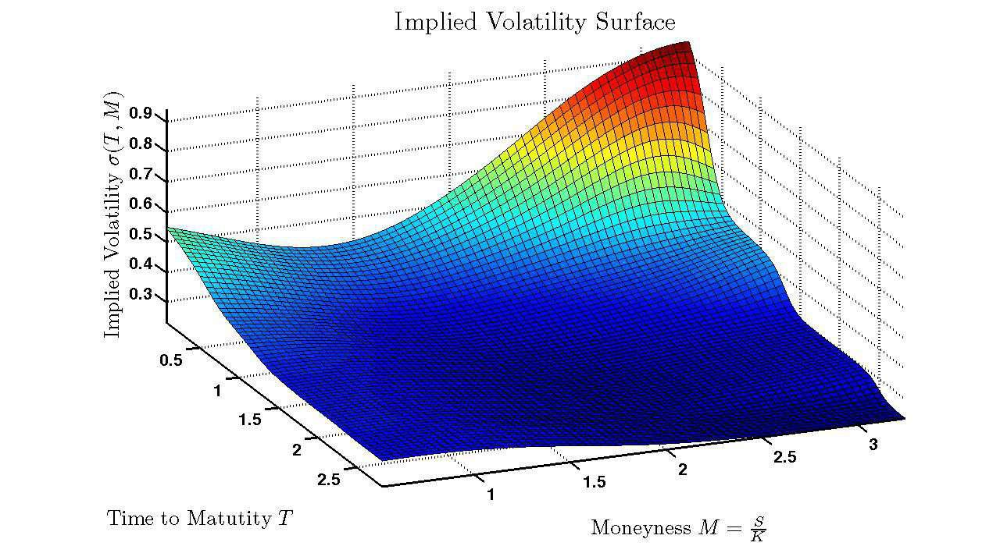

Financial derivatives are intricate financial instruments whose value is derived from one or more underlying assets. These instruments include options, futures, swaps, and other structured securities. They play a pivotal role in modern finance by offering a mechanism for risk management, speculation, and price discovery. Through allowing market participants to hedge against risks or speculate on asset price movements, derivatives contribute significantly to the liquidity and efficiency of financial markets around the globe.

One of the crucial elements in options pricing is understanding the volatility surface, which reflects the market's expectation of volatility across different strike prices and maturities. The volatility surface is comprised of key components such as the volatility skew and the term structure, both of which are vital for accurately pricing options. The shape of the volatility surface is influenced by supply and demand dynamics, market sentiment, and economic events, making it an essential tool for traders and risk managers in assessing fair value and developing trading strategies.



Automated trading, commonly known as algorithmic trading, has forged a strong relationship with derivatives. Algorithmic trading systems utilize financial derivatives to execute complex trading strategies at high speeds and volumes, which human traders cannot achieve. This relationship enhances market efficiency and liquidity but also introduces challenges such as increased volatility and systemic risk. Understanding how algorithms interact with derivatives is crucial for market participants aiming to navigate the modern financial landscape effectively.

This article aims to provide a comprehensive exploration of these intertwined financial concepts by examining financial derivatives, volatility surfaces, and algorithmic trading. It will cover the foundational aspects of these subjects and delve into their practical applications and implications in contemporary finance.

Grasping these financial concepts is critical for market participants, including traders, investors, risk managers, and policymakers, as they navigate and influence the ever-evolving financial markets. A sound understanding aids in making informed decisions, managing risks effectively, and capitalizing on opportunities presented by market dynamics.

## Table of Contents

## Understanding Financial Derivatives

Financial derivatives are financial instruments whose value is derived from the value of one or more underlying assets. These underlying assets can include stocks, bonds, commodities, interest rates, currencies, and market indices. Derivatives serve as powerful tools for managing various financial risks and can also be used for speculative purposes. The primary categories of financial derivatives include options, futures, and swaps, each with unique characteristics and applications.

### Types of Financial Derivatives

1. **Options**: Options are contracts that grant the buyer the right, but not the obligation, to purchase or sell an underlying asset at a predetermined price on or before a specified date. There are two main types of options: calls and puts. A call option gives the holder the right to buy, while a put option gives the holder the right to sell. Options are widely used for hedging and speculative purposes.

2. **Futures**: Futures contracts are agreements to buy or sell an asset at a predetermined future date and price. Unlike options, futures contracts oblige the parties to complete the transaction. They are primarily used for hedging against price fluctuations in commodities, interest rates, and currencies.

3. **Swaps**: Swaps are derivative contracts in which two parties exchange cash flows or financial instruments. The most common types are interest rate swaps and currency swaps. In an interest rate swap, parties exchange fixed and floating interest rate payments, while currency swaps involve exchanging cash flows in different currencies.

### Role in Risk Management and Speculation

Derivatives are instrumental in risk management by allowing stakeholders to hedge against unfavorable price movements in their assets. For instance, a farmer might use futures contracts to lock in a selling price for their crops, protecting against potential price declines. Similarly, a multinational corporation might use currency swaps to manage foreign exchange risk, ensuring more predictable cash flows.

Speculators, on the other hand, engage in derivative trading to profit from anticipated price movements without owning the underlying assets. While speculation can lead to significant profits, it also carries substantial risks.

### Significance in Global Financial Markets

Derivatives play a crucial role in the global financial markets, providing [liquidity](/wiki/liquidity-risk-premium), enabling price discovery, and allowing for the efficient allocation of risk. The notional value of derivative contracts far exceeds the value of the underlying assets, reflecting their extensive use across the financial system. The markets for derivatives, particularly those for interest rates and foreign exchange, are enormous and significantly influence global economic functioning.

### Applications in Various Industries

Derivatives find applications across various industries due to their versatility. In the energy sector, companies use commodity futures to hedge against fluctuations in oil and natural gas prices. In agriculture, futures contracts help stabilize farmers' incomes by locking in prices for crops and livestock. In finance, [interest rate](/wiki/interest-rate-trading-strategies) derivatives are essential for banks to manage exposure to changes in interest rates and to contribute to the stability of the financial system.

In conclusion, understanding financial derivatives is essential for market participants who wish to effectively manage risk and capitalize on market opportunities. Derivatives constitute a vital component of the modern financial landscape, enabling a dynamic interplay of risk and reward across global markets.

## Volatility Surface and Options Pricing

Volatility surfaces are critical tools in options pricing, capturing market sentiments about the underlying asset's future [volatility](/wiki/volatility-trading-strategies). The surface is a three-dimensional plot with axes representing strike price, time to maturity, and implied volatility. Two key components define this surface: the volatility skew and the term structure.

The volatility skew refers to the pattern of implied volatilities across different strike prices. Typically, this skew arises because out-of-the-money (OTM) options often display different implied volatilities than at-the-money (ATM) or in-the-money (ITM) options. The presence of skew indicates that market participants expect different levels of future volatility based on the option's moneyness. For instance, OTM put options may exhibit higher implied volatilities due to investor demand for insurance against downside risks.

The term structure of volatility describes how implied volatility varies with the option's time to maturity. This structure may be influenced by anticipated events, economic cycles, or market conditions, resulting in differing levels of expected volatility over various horizons. Understanding the term structure helps traders assess how volatility expectations change over time and adjust their strategies accordingly.

Implied volatility is derived from the market prices of options. It reflects the market's expectation of future volatility rather than historical volatility. Traders frequently use the Black-Scholes model to compute the implied volatility by inputting observed market prices and solving for volatility. Although the Black-Scholes model assumes constant volatility and normally distributed returns, implied volatility adjusts these assumptions according to real market data.

The Black-Scholes model revolutionized options pricing by providing a closed-form solution to estimate an option's theoretical price. The model relies on several assumptions, including constant volatility and interest rates, and no [arbitrage](/wiki/arbitrage) opportunities. The formula for a European call option price $C$ is:

$$
C = S_0 N(d_1) - X e^{-rT} N(d_2)
$$

where $d_1$ and $d_2$ are given by:

$$
d_1 = \frac{\ln(S_0 / X) + (r + \sigma^2 / 2)T}{\sigma \sqrt{T}}
$$
$$
d_2 = d_1 - \sigma \sqrt{T}
$$

Here, $S_0$ is the current stock price, $X$ is the strike price, $T$ is the time to maturity, $r$ is the risk-free rate, $\sigma$ is the volatility, and $N(\cdot)$ is the cumulative distribution function of the standard normal distribution.

Despite its widespread use, traditional options pricing models like Black-Scholes face several challenges and limitations. One significant limitation is the assumption of constant volatility, which contradicts market observations of volatility skew and term structure. Additionally, the assumption of normally distributed returns may not hold, as asset returns often exhibit skewness and fat tails. Furthermore, during periods of market stress, liquidity constraints and transaction costs are not captured by these models, affecting their accuracy.

In response to these limitations, practitioners have developed alternative models and adjustments, such as the use of stochastic volatility models and incorporating jumps in asset prices to better align with observed market behaviors. Nevertheless, a comprehensive understanding of traditional models remains foundational for interpreting advanced modeling techniques and market dynamics.

## The Impact of Algo Trading on Derivatives Markets

Algorithmic trading, commonly referred to as algo trading, represents a significant portion of trading activities in modern financial markets. It involves using computer algorithms to execute trades based on pre-defined strategies. The use of financial derivatives, such as options, futures, and swaps, within algo trading strategies is prevalent due to their ability to cater to both hedging and speculative purposes.

Algorithmic trading systems utilize derivatives for strategy execution by automatically assessing complex risk exposures and adjusting positions efficiently. These strategies often revolve around various models and indicators that evaluate market conditions in real-time, allowing traders to capitalize on fleeting opportunities. For example, an algorithm may use options to implement a delta-neutral strategy whereby the algorithm continuously rebalances the portfolio to hedge against market movements while attempting to profit from changes in volatility.

High-frequency trading ([HFT](/wiki/high-frequency-trading-strategies)), a subset of [algorithmic trading](/wiki/algorithmic-trading), has a pronounced impact on market volatility and liquidity. By executing trades at exceptionally high speeds, HFT strategies contribute to narrowing bid-ask spreads, enhancing market liquidity. However, they can also amplify market volatility, particularly in situations of systemic stress or abrupt market movements, as evident during the 2010 Flash Crash.

Risk management in algo trading, especially when involving derivatives, requires sophisticated models to assess market risks and counterparty risks. Techniques such as Value-at-Risk (VaR) calculations, stress testing, and scenario analysis are widely employed to ensure that the strategies remain aligned with the defined risk appetite. For derivatives, Greeks, such as Delta, Gamma, Theta, and Vega, are crucial in measuring sensitivity to various market parameters and aiding in dynamic hedging strategies.

Several case studies exemplify the use of algorithmic trading strategies involving options and derivatives. One such example includes the implementation of [statistical arbitrage](/wiki/statistical-arbitrage) strategies. These strategies often involve pairs trading, where algorithms detect anomalies in price relationships between derivative instruments and their underlying assets. Another strategy involves volatility arbitrage, wherein options are bought or sold based on discrepancies between the implied volatility of options and the trader's forecast of future realized volatility.

In practice, algo trading strategies may incorporate Python scripts that interface with trading platforms to execute strategies based on these quantitative models. For instance, Python libraries such as Pandas and NumPy can be used to analyze historical data, calculate metrics like moving averages or RSI (Relative Strength Index), and automate trade execution via APIs provided by trading platforms.

```python
import numpy as np
import pandas as pd
import trading_api

# Sample code to calculate implied volatility and execute trades
def calculate_implied_vol(option_prices, strike_prices, expiration_dates, interest_rate):
    # Simulated function to calculate implied volatility
    implied_vols = np.abs(np.random.normal(loc=0.2, scale=0.05, size=len(option_prices)))
    return implied_vols

def execute_trade(strategy, api):
    for asset in strategy.tradable_assets:
        # Algorithm to determine buy/sell based on strategy
        decision = "buy" if strategy.signal(asset) else "sell"
        api.place_order(asset, decision)

# Assuming we have access to option prices and other data
option_data = pd.read_csv('option_prices.csv')
implied_vols = calculate_implied_vol(option_data['price'], option_data['strike'], 
                                     option_data['expiration'], 0.01)

api = trading_api.TradingAPI()
strategy = YourStrategy(parameters)
execute_trade(strategy, api)
```

This simplistic representation underscores the typical workflow in algo trading, where data analysis seamlessly integrates with automated execution to implement derivative-based strategies effectively.

## Advancements and Innovations in Derivatives Trading

Recent years have seen significant progress in the field of derivatives trading, marked by innovations in options pricing and the management of the volatility surface as well as technological advancements transforming trading platforms. These advancements have led to more efficient, accurate, and sophisticated methods for evaluating and trading derivatives.

### Innovations in Options Pricing and Volatility Surface Management

The pricing of options and management of the volatility surface have evolved considerably, driven by new quantitative techniques and computational capabilities. Innovations such as stochastic volatility models, like the Heston model, have provided more flexible frameworks for capturing the dynamics of volatility smiles and skews, which are essential for accurate options pricing. These models go beyond the assumption of constant volatility in traditional models like Black-Scholes, allowing for more realistic market scenarios. Machine learning algorithms have also been increasingly employed to enhance model calibration and forecast market volatility patterns more precisely.

### Technological Advancements in Derivatives Trading Platforms

The transformation of derivatives trading platforms has been propelled by emerging technologies that enhance speed, accessibility, and transparency. The implementation of blockchain technology is a noteworthy development, offering increased security and reduced settlement times through smart contracts. Additionally, the integration of cloud computing enables scalable data processing capabilities, allowing platforms to process large volumes of trades and store historical data efficiently.

### Artificial Intelligence and Machine Learning in Trading Derivatives

Artificial intelligence (AI) and [machine learning](/wiki/machine-learning) have introduced new dimensions to derivatives trading by enabling intelligent, data-driven strategies. These technologies empower traders to analyze complex datasets, uncover hidden patterns, and optimize trading decisions. For example, [reinforcement learning](/wiki/reinforcement-learning) algorithms can dynamically adjust trading strategies in response to market changes, while natural language processing (NLP) tools analyze news and sentiment data to predict market movements. Python, with libraries such as TensorFlow and PyTorch, plays a crucial role in developing these advanced models:

```python
import numpy as np
import tensorflow as tf

# Simple neural network model for predicting option prices
model = tf.keras.Sequential([
    tf.keras.layers.Dense(64, activation='relu', input_shape=(num_features,)),
    tf.keras.layers.Dense(64, activation='relu'),
    tf.keras.layers.Dense(1)
])

model.compile(optimizer='adam', loss='mse')
# model.fit(train_data, train_labels, epochs=10, batch_size=32)
```

### Future Prospects and Emerging Trends

Looking ahead, the derivatives markets are poised to further embrace cutting-edge technologies and methodologies. Quantum computing is anticipated to revolutionize derivatives pricing by solving complex computations exponentially faster than classical computers. Moreover, decentralized finance (DeFi) is expected to gain traction, potentially reshaping how derivatives are issued, traded, and settled without traditional intermediaries. As the landscape continues to evolve, market participants must stay informed and agile to capitalize on emerging opportunities and mitigate associated risks.

In conclusion, the continual advancements in the pricing, execution, and trading infrastructure of derivatives signal a transformative period in financial markets. Enhanced computational techniques, AI, and distributed ledger technology are pivotal to this evolution, offering promising avenues for efficiency and innovation.

## Conclusion

In this exploration of financial derivatives, volatility surfaces, and algorithmic trading, we have underscored the complexity and significance of these concepts within modern finance. Financial derivatives, including options, futures, and swaps, are critical tools for managing risk and leveraging financial opportunities across diverse markets. These instruments, while complex, offer considerable utility for both hedging and speculative purposes.

Understanding the volatility surface is crucial in options pricing, providing insight into how market perceptions of volatility impact the value of options. Traditional models like the Black-Scholes have historically provided a framework for pricing options; however, they come with inherent limitations that new models and advanced computing methods strive to overcome.

Algorithmic trading has further amplified the role of derivatives in financial markets by enhancing efficiency and contributing to market liquidity. Through the utilization of advanced algorithms and high-frequency trading strategies, market participants can capitalize on these financial instruments more effectively. The drive toward automation in trading highlights the necessity for robust risk management strategies to mitigate potential market impacts.

As the financial landscape continues to evolve, advancements in technology, including [artificial intelligence](/wiki/ai-artificial-intelligence) and machine learning, are reshaping derivatives trading platforms. These innovations promise to enhance the precision and efficiency of trading strategies, paving the way for future developments in the derivatives market.

It is imperative for market participants to maintain a robust understanding of these financial concepts. A comprehensive grasp of derivatives and volatility, coupled with a willingness to explore new algorithmic trading strategies, will be essential for success in an increasingly dynamic market environment. Continued education and awareness of financial innovations will ensure that traders and investors can navigate and thrive amidst the complexities of today's financial markets.

## References & Further Reading

[1]: Derman, E. (1999). ["Volatility and the Volatility Smile."](https://scholar.google.com/citations?user=NaHduskAAAAJ&hl=en) Goldman Sachs Quantifying Derivatives publication.

[2]: Hull, J. C. (2014). ["Options, Futures, and Other Derivatives."](https://books.google.com/books/about/Options_Futures_and_Other_Derivatives_eB.html?id=2iopDwAAQBAJ) Pearson Education. 

[3]: Gatheral, J. (2006). ["The Volatility Surface: A Practitioner's Guide."](https://onlinelibrary.wiley.com/doi/book/10.1002/9781119202073) Wiley.

[4]: Mackenzie, D. (2008). ["An Engine, Not a Camera: How Financial Models Shape Markets."](https://academic.oup.com/mit-press-scholarship-online/book/20588) MIT Press.

[5]: Heston, S. L. (1993). ["A Closed-Form Solution for Options with Stochastic Volatility with Applications to Bond and Currency Options."](https://wwwf.imperial.ac.uk/~ajacquie/IC_Num_Methods/IC_Num_Methods_Docs/Literature/Heston.pdf) The Review of Financial Studies, 6(2), 327-343.

[6]: Cont, R., & Fonseca, J. da. (2002). ["Dynamics of Implied Volatility Surfaces."](https://www.semanticscholar.org/paper/Dynamics-of-implied-volatility-surfaces-Cont-Fonseca/a55be404fc04280bd01820fe4142e827d9ba6d5d) The Review of Financial Studies, 16(4), 1321-1357. 

[7]: Lopez de Prado, M. (2018). ["Advances in Financial Machine Learning."](https://www.amazon.com/Advances-Financial-Machine-Learning-Marcos/dp/1119482089) Wiley. 

[8]: Chan, E. P. (2009). ["Quantitative Trading: How to Build Your Own Algorithmic Trading Business."](https://github.com/ftvision/quant_trading_echan_book) Wiley.