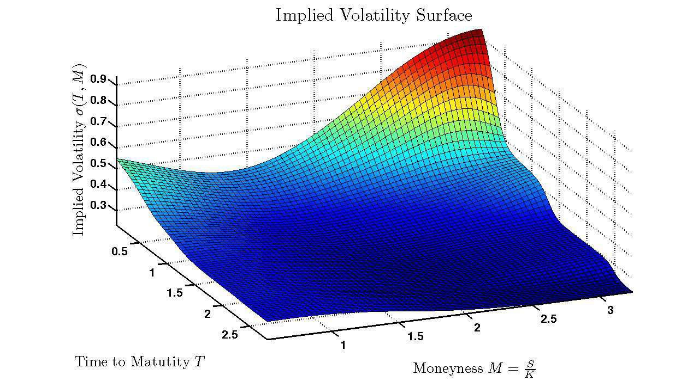

Volatility surface modeling is critically important in the field of derivatives trading, particularly when working with exotic options. These instruments often have complex payoffs that render the assumption of constant volatility insufficient. A volatility surface provides a more accurate reflection of market conditions by illustrating how implied volatility varies with strike prices and times to maturity. Such a model allows traders to see the nuanced structure of market expectations across different scenarios, enhancing their ability to make informed decisions.

Python, along with its extensive libraries for data handling and analysis, plays a pivotal role in constructing these volatility surfaces. Tools such as `yfinance` for data extraction, `scipy` for mathematical computations, and `matplotlib` for visualization are instrumental in building these models. By applying these resources, traders and analysts can generate detailed volatility surfaces that aid in both option pricing and risk management efforts.



Stochastic models augment this process by providing a framework for capturing the unpredictable nature of market volatility. Models such as the Heston or SABR add perceptive depth to how volatility is interpreted and predicted. These models enable traders to thoroughly assess market volatility and adapt their strategies accordingly, ensuring that their trading decisions are data-driven and strategically sound.

This article serves as a guide to understanding volatility surface modeling, with a particular focus on how modern computational tools enhance this analysis. The insights gained from these models are essential for successful algorithmic trading, as they provide traders with significant advantages in predicting and reacting to market changes. Through sophisticated analytical techniques, traders can better anticipate market movements, manage risks more effectively, and seize trading opportunities with confidence.

## Table of Contents

## Understanding Volatility Surfaces

A volatility surface is a crucial concept in options trading that provides a three-dimensional representation of implied volatility as it varies with strike price and expiration date. This surface encapsulates market expectations regarding future volatility and plays a pivotal role in constructing pricing strategies and performing risk assessments for options.

Implied volatility is a measure derived from the market prices of options, reflecting the market's view on the future volatility of the underlying asset. It is a core component of the volatility surface, providing insights into the perceived risk and price fluctuations. The strike price, another critical element, is the fixed price at which the holder of the option can buy or sell the underlying asset. Expiration date marks the time until which the option is valid, influencing how volatility expectations are shaped over different time horizons.

Differences in implied [volatility](/wiki/volatility-trading-strategies) across various strike prices and expiration dates generate patterns known as volatility skew and term structure. The skew refers to the observed variation in implied volatility across different strike prices for options with the same expiration date. Typically, this results in a "smile" or "smirk" shape, highlighting the market's sentiment towards the likelihood of extreme price movements. Term structure, on the other hand, describes the variation in implied volatility over different expiration dates for options with the same strike price. It reflects how volatility is anticipated to evolve over time.

Building a reliable volatility surface begins with collecting comprehensive market data, which includes the prices of options across a range of strike prices and expiration dates. This data is used to calculate implied volatility for each option, relying on models such as Black-Scholes or its refinements to reverse-engineer the volatility implied by market prices. Once the data is available, models are fitted to observed prices to approximate the volatility surface. These models can range from simple parametric forms to complex stochastic models, each offering varying degrees of accuracy and computational complexity.

The fitting process involves optimizing the model parameters so that the difference between the market prices of options and the model-predicted prices is minimized. This process often requires sophisticated mathematical tools and techniques to ensure that the resulting volatility surface accurately reflects market realities and can be used reliably in option pricing and risk management.

In conclusion, understanding and constructing a volatility surface is indispensable for capturing the nuanced perspective of market expectations in options trading. It provides a comprehensive framework for analyzing how market conditions and expectations influence option prices, aiding traders in making informed decisions.

## Practical Applications of Volatility Surfaces

Volatility surfaces are crucial tools in the accurate pricing of options as they reflect current market conditions within models such as Black-Scholes. They offer a multidimensional representation of implied volatility against varying strike prices and expiration dates, aiding in more precise option valuation. By analyzing these surfaces, traders and risk managers can gain insights into market sentiments and expectations.

In risk management, understanding the dynamics of volatility surfaces is essential. Variations in the surface can significantly impact the valuation of options under different market scenarios. For instance, when scenarios such as economic policy changes or geopolitical events are anticipated, the resulting shifts can be modeled and analyzed using modified volatility surfaces. This allows institutions to predict potential impacts on their portfolios, facilitate strategic adjustments, and mitigate risks effectively.

Moreover, volatility surfaces provide opportunities for [arbitrage](/wiki/arbitrage) by identifying discrepancies between the expected and actual market prices. When observed market conditions deviate from the expected volatility surface, traders can detect and exploit these differences to achieve profitable trades. The accuracy of these assessments depends heavily on the precision of the constructed surfaces and the real-time data feeding them.

Scenario analysis becomes more robust with volatility surfaces, allowing financial institutions to model potential market conditions and assess their impacts ahead of time. By adjusting variables such as strike prices and expirations, different market scenarios can be simulated, enabling predictions of portfolio impacts and facilitating proactive decision-making.

Traders and analysts rely heavily on specialized software and services to analyze and construct volatility surfaces effectively. Platforms like IVolatility and OptionMetrics provide comprehensive datasets and analytical tools for this purpose. These services offer functionalities for extracting market data, calculating implied volatilities across different dimensions, and visualizing the results. Their integration with programming environments like Python further enhances the potential for customized analysis and strategic insights in trading operations.

Overall, the practical applications of volatility surfaces extend beyond mere theoretical analysis, influencing real-world trading and risk management strategies by providing a nuanced understanding of market volatility.

## Building a Volatility Surface Using Python

Constructing a volatility surface using Python requires a structured approach leveraging several powerful libraries designed for data extraction, mathematical computation, and visualization. This process begins with acquiring market data. The `yfinance` library is an excellent tool for downloading historical price data of stocks and options from Yahoo Finance. With this data, the next step involves calculating implied volatilities.

Implied volatility can be computed by inverting an option pricing model like the Black-Scholes model. Python's `scipy` library provides functionalities for numerical methods and optimization that help solve for implied volatility. Specifically, `scipy.optimize` can be used to minimize the difference between actual market prices and model prices, allowing us to back out implied volatilities that are consistent with observed market prices.

```python
from scipy.optimize import brentq
from scipy.stats import norm
import numpy as np
import yfinance as yf

def black_scholes_call(S, K, T, r, sigma):
    d1 = (np.log(S / K) + (r + 0.5 * sigma ** 2) * T) / (sigma * np.sqrt(T))
    d2 = d1 - sigma * np.sqrt(T)
    return S * norm.cdf(d1) - K * np.exp(-r * T) * norm.cdf(d2)

def implied_volatility(S, K, T, r, market_price):
    def objective_function(sigma):
        return black_scholes_call(S, K, T, r, sigma) - market_price
    return brentq(objective_function, 1e-6, 1)

# Example to fetch data and compute implied volatility
ticker = "AAPL"
data = yf.Ticker(ticker)
opt = data.option_chain('YYYY-MM-DD') # Add appropriate expiration date
S = data.history(period='1d')['Close'][-1] # Latest stock price
K = opt.calls['strike'].iloc[0] # Example strike price
market_price = opt.calls['lastPrice'].iloc[0]
T = ... # Time to expiration in years
r = 0.01 # Risk-free rate

sigma = implied_volatility(S, K, T, r, market_price)
```

Once implied volatilities for different strike prices and maturities are procured, they can be visualized using the `matplotlib` library. The visual representation of this data forms a conceptual three-dimensional volatility surface.

```python
import matplotlib.pyplot as plt
from mpl_toolkits.mplot3d import Axes3D

# Example plotting
fig = plt.figure()
ax = fig.add_subplot(111, projection='3d')
X, Y = np.meshgrid(strike_prices, maturities)
Z = implied_volatilities_matrix
ax.plot_surface(X, Y, Z, cmap='viridis')
ax.set_xlabel('Strike Price')
ax.set_ylabel('Time to Maturity')
ax.set_zlabel('Implied Volatility')
plt.show()
```

Advanced modeling incorporates stochastic volatility models such as the Heston model. These models accommodate random changes in volatility over time, offering a more nuanced insight into market dynamics. Python libraries like `QuantLib` and specialized modules for stochastic differential equations facilitate the implementation of the Heston model.

Machine learning adds sophistication to volatility surface modeling. Techniques such as regression or neural networks can be applied to forecast volatility surfaces based on historical data and market factors. These methods can uncover patterns that traditional models may overlook, thereby enhancing accuracy in predicting future market conditions.

Implementing a well-constructed volatility surface in Python enables traders and analysts to better appreciate the complexities of market volatility, thereby enhancing both risk assessment and options pricing strategies.

## Advanced Modeling Techniques

Stochastic models, such as the SABR and Heston models, provide enhanced methodologies for capturing the complex dynamics of volatility beyond what the traditional Black-Scholes framework can accommodate. These models are crucial for accurately reflecting market conditions, especially when dealing with exotic derivatives.

The Heston model is a well-regarded approach in this context, as it incorporates stochastic processes directly into volatility, allowing for more realistic depictions of market behavior. Unlike constant volatility models, the Heston model assumes that volatility follows a stochastic process, typically described by the following set of stochastic differential equations (SDEs):

$$

dS_t = \mu S_t dt + \sqrt{v_t} S_t dW_t^S 
$$

$$

dv_t = \kappa (\theta - v_t) dt + \sigma \sqrt{v_t} dW_t^v 
$$

Here, $S_t$ represents the asset price, $v_t$ is the variance (volatility squared), $\mu$ is the drift rate, $\kappa$ is the rate at which $v_t$ reverts to the long-term mean $\theta$, $\sigma$ describes the volatility of the variance process, and $dW_t^S$ and $dW_t^v$ are correlated Wiener processes with correlation $\rho$. This model's ability to accommodate time-varying volatility makes it suitable for pricing exotic options, where standard models fall short.

The advent of [machine learning](/wiki/machine-learning) techniques has further expanded the horizons of volatility surface modeling. Neural networks, with their ability to model nonlinear relationships, are particularly promising for capturing the intricate patterns present in volatility surfaces. These networks can learn from vast amounts of market data to identify underlying structures that traditional models may overlook. The flexibility of machine learning models allows for adaptive prediction and generation of volatility surfaces, accommodating sudden shifts in market dynamics.

Precise modeling with these advanced techniques necessitates rigorous calibration and validation processes. Calibration involves fine-tuning model parameters so that the theoretical prices generated align with market data. This process often employs optimization algorithms to minimize the difference between observed market prices and model outputs. Validation ensures the model's robustness and reliability, confirming that it performs well across various datasets and market conditions.

By employing sophisticated stochastic methods and leveraging machine learning advancements, traders gain significant insights into market volatility. Such powerful modeling tools enable dynamic decision-making, allowing for rapid adaptation to evolving market scenarios and uncovering strategic advantages that static models cannot provide. The continuous refinement of these techniques serves as a vital component for successful trading and risk management strategies in modern financial markets.

## Conclusion

Volatility surface modeling is a cornerstone tool in derivatives trading, essential for providing comprehensive insights into market volatility through the use of advanced analytical techniques. The seamless integration of Python and sophisticated stochastic models empowers traders to accurately price exotic options and adeptly manage associated risks. With the continuous evolution of financial markets, the methodologies employed for their analysis must also advance, and volatility surfaces are vital in this analytical evolution.

The adoption of both traditional and modern computational techniques facilitates a profound understanding of market dynamics, offering traders and risk managers a competitive advantage in forecasting market trends. The ongoing development and refinement of volatility modeling techniques are expected to remain fundamental aspects of effective [algorithmic trading](/wiki/algorithmic-trading) strategies. This advancement ensures that traders can adapt to the changing market landscape, enhance precision in their trading decisions, and maintain a proactive approach to risk assessment and opportunity exploitation.

## References & Further Reading

[1]: Gatheral, J. (2006). ["The Volatility Surface: A Practitioner's Guide"](https://books.google.com/books/about/The_Volatility_Surface.html?id=P7ASlvLRsKMC). Wiley Finance.

[2]: Heston, S. L. (1993). ["A Closed-Form Solution for Options with Stochastic Volatility with Applications to Bond and Currency Options."](https://wwwf.imperial.ac.uk/~ajacquie/IC_Num_Methods/IC_Num_Methods_Docs/Literature/Heston.pdf) The Review of Financial Studies, 6(2), 327-343.

[3]: Andreasen, J., & Huge, B. (2011). ["Volatility Interpolation"](https://www.researchgate.net/profile/Jesper-Andreasen/publication/228290986_Volatility_Interpolation/links/5de642bf4585159aa45d15ae/Volatility-Interpolation.pdf?origin=publication_detail). Risk Magazine.

[4]: Wilmott, P. (2006). ["Paul Wilmott Introduces Quantitative Finance"](https://www.amazon.com/Paul-Wilmott-Introduces-Quantitative-Finance/dp/0470319585). Wiley.

[5]: Hansen, P. R. (2005). ["A Winner for Harambee: The Black-Scholes Formula"](https://journals.sagepub.com/doi/10.1177/0886368702034005010). International Finance, 8(3), 393-406.

[6]: Jäckel, P. (2002). ["Monte Carlo Methods in Finance"](https://www.wiley.com/en-us/Monte+Carlo+Methods+in+Finance-p-9780471497417). Wiley Finance.

[7]: "Understanding SABR Model Parameters for Implied Volatility: A Practical Guide" by Fabrice Douglas Rouah. Quantitative Finance.

[8]: "Python for Finance: Mastering Data-Driven Finance" by Yves Hilpisch. (2020), O'Reilly Media.