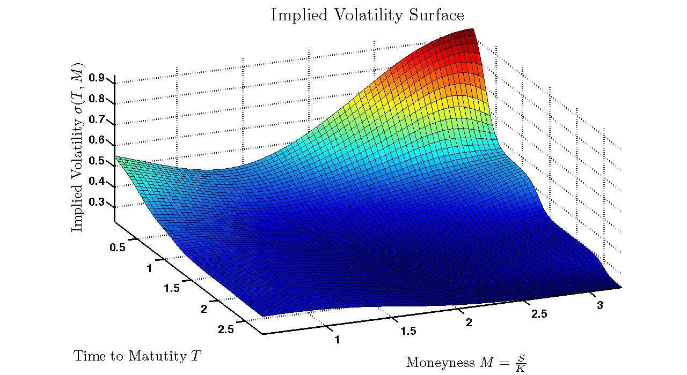

Volatility surface modeling is an essential aspect of algorithmic trading and financial modeling. It involves the visualization and analysis of implied volatility dynamics, which vary with both strike prices and expiration dates, creating a three-dimensional surface. This surface serves as a crucial tool in the financial markets by offering insights into how the market anticipates future movements in asset prices. Traders and financial analysts utilize these insights to price options accurately, manage the associated risks effectively, and identify arbitrage opportunities that may arise due to discrepancies in market expectations.

A volatility surface is represented as a graph where the axes typically consist of the strike price, expiration date, and implied volatility. Implied volatility reflects the market's forecast of a security's potential price fluctuation and is a key input in options pricing models such as Black-Scholes. By comprehending the shape and nuances of the volatility surface, market participants can make more informed decisions, optimizing trading strategies and enhancing portfolio management.



This article presents a comprehensive examination of volatility surface modeling, addressing the foundational concepts, constituent components, and practical applications in the context of algorithmic trading. Understanding these elements is integral for professionals involved in options trading and risk management, enabling them to leverage volatility surface models for improved strategic outcomes in the constantly evolving financial markets.

## Table of Contents

## Understanding Volatility Surface

Implied volatility is a pivotal metric in understanding market expectations of future asset price movements. It represents the market's forecast of a security's potential price fluctuations, often derived from the prices of options in the market. Higher implied volatility usually indicates more significant expected price movements, while lower implied volatility suggests more stability.

Strike prices play a crucial role in influencing implied volatility and the resultant shape of the volatility surface. Implied volatility is generally not constant across all strike prices, leading to a phenomena known as the volatility skew or smile. For instance, options that are deep in or out of the money tend to exhibit higher implied volatilities compared to those at-the-money, leading to a curved shape on the volatility surface when plotted against strike prices.

Expiration dates significantly contribute to the configuration of the volatility surface as they introduce the element of time. As the time to expiration increases, the level of uncertainty tends to rise, often resulting in more pronounced fluctuations in implied volatility. This gives rise to the term structure of volatility, where implied volatilities vary across different expiration dates.

The primary components of the [volatility](/wiki/volatility-trading-strategies) surface encompass skew, term structure, and surface fitting. The volatility skew addresses the variations in implied volatility across different strike prices, capturing the market's perception of risk asymmetry. Term structure outlines how implied volatility changes with varying expiration dates, reflecting temporal market uncertainties. Finally, surface fitting is the process of constructing a smooth and continuous volatility surface using mathematical models and techniques such as spline interpolation or advanced methods like the SABR model. These components are essential for accurately modeling and interpreting volatility surfaces to better inform trading strategies and risk management.

## Components of Volatility Surface

Volatility surfaces are intricate constructs, encapsulating the nuances of financial markets by capturing implied volatilities as they vary with both strike prices and expiration dates. They play a foundational role in various aspects of financial modeling and options pricing. Key components of the volatility surface include volatility skew, term structure, and surface fitting techniques.

### Volatility Skew

Volatility skew refers to the pattern observed when plotting implied volatilities against different strike prices at a fixed expiration date. Typically, options that are either deep in-the-money or out-of-the-money exhibit different implied volatilities than at-the-money options. This phenomenon arises due to market sentiment and the distribution of future asset prices. For instance, if there's a higher demand for protective puts, this can lead to higher implied volatilities for out-of-the-money puts, resulting in a skewed volatility curve.

Mathematically, the skew can be characterized as the deviation of implied volatilities from a flat curve. The skew can be measured using the following formula:

$$
\text{Skew} = \sigma_{\text{OTM}} - \sigma_{\text{ATM}}
$$

where $\sigma_{\text{OTM}}$ is the implied volatility of out-of-the-money options and $\sigma_{\text{ATM}}$ is the implied volatility of at-the-money options.

### Term Structure

The term structure of volatility is the variation of implied volatility observed across different expiration dates. Typically, this structure depicts how market uncertainty changes over time. Short-term options might reflect immediate market conditions, while long-term options incorporate broader economic prospects and uncertainties. 

The term structure can be expressed in a function form of implied volatility $\sigma(T)$ where $T$ represents time to expiration. A steep term structure might indicate expectations of increasing volatility, while a flatter or downward-sloping curve could be indicative of expected stability or decreasing volatility.

### Surface Fitting Techniques

Constructing a continuous volatility surface from discrete data points of implied volatilities involves surface fitting techniques. These techniques are essential to ensure smoothness and accuracy, aiding in further analysis and options pricing.

One common method is **spline interpolation**, which uses piecewise polynomial functions to interpolate the given data points smoothly. This method ensures that the transitions between intervals are smooth, maintaining continuity in the first and second derivatives.

Another advanced model is the **SABR (Stochastic Alpha, Beta, Rho) model**, which is particularly adept at capturing the dynamic aspects of volatility surfaces. The SABR model is defined by the following stochastic differential equations:

$$
dF_t = \sigma_t F_t^\beta dW_t
$$
$$
d\sigma_t = \alpha \sigma_t dZ_t
$$

where $F_t$ is the forward price, $\sigma_t$ is the volatility, $\beta$ measures the elasticity of the forward price, $\alpha$ is the volatility of volatility, and $W_t$ and $Z_t$ are correlated Brownian motions with correlation $\rho$.

The choice of technique often depends on the specific characteristics of the market data and the desired properties of the fitted surface.

Overall, understanding these components and employing appropriate fitting techniques are crucial for creating a reliable volatility surface, enabling accurate option pricing and effective risk management strategies.

## Practical Applications of Volatility Surface

Volatility surfaces are invaluable tools in financial markets, particularly for options pricing, risk management, identifying [arbitrage](/wiki/arbitrage) opportunities, and conducting scenario analysis. These applications leverage the detailed insights provided by the three-dimensional representation of implied volatilities across various strike prices and expiration dates.

In options pricing, volatility surfaces enhance the accuracy of models such as Black-Scholes. The Black-Scholes model traditionally assumes constant volatility; however, in practice, implied volatility varies across different options. A volatility surface reflects these variations, allowing for more precise option pricing. By incorporating the specific implied volatilities from a surface, the Black-Scholes model can be adapted as follows:

$$
C(S, t) = N(d_1)S - N(d_2)Ke^{-r(T-t)}
$$

Where:
- $N$ is the cumulative distribution function of the standard normal distribution
- $S$ is the current stock price
- $K$ is the strike price
- $r$ is the risk-free interest rate
- $T-t$ is the time to expiration
- $d_1$ and $d_2$ are calculated using the implied volatility specific to each option and maturity obtained from the volatility surface.

Risk management also benefits significantly from volatility surfaces by providing a comprehensive view of market volatility dynamics. Traders can use the surface to assess potential risks over various outcomes and track changes in implied volatility that may indicate market stress or instability. These insights enable more informed decision-making regarding hedging strategies and portfolio management.

Volatility surfaces also play a crucial role in identifying arbitrage opportunities. Mispricing of options can occur when the market price diverges from the theoretical price suggested by volatility surfaces. By analyzing these discrepancies, traders can exploit arbitrage strategies, buying undervalued options and selling overvalued ones for a profit. This requires a detailed assessment of the implied volatility against market expectations represented by the surface.

Scenario analysis is another practical application, which involves using volatility surfaces to simulate different market conditions and predict their impact on option pricing and risk exposure. By tweaking variables such as strike prices and expirations while observing changes in implied volatility, traders can better anticipate shifts in market sentiment and prepare strategic responses.

Python code can be utilized to further illustrate the practical application of volatility surfaces:

```python
import numpy as np
from scipy.stats import norm

def black_scholes_price(S, K, T, r, sigma, option_type='call'):
    d1 = (np.log(S / K) + (r + 0.5 * sigma ** 2) * T) / (sigma * np.sqrt(T))
    d2 = d1 - sigma * np.sqrt(T)
    if option_type == 'call':
        price = S * norm.cdf(d1) - K * np.exp(-r * T) * norm.cdf(d2)
    else:
        price = K * np.exp(-r * T) * norm.cdf(-d2) - S * norm.cdf(-d1)
    return price

# Example usage for implied volatility obtained from a surface
S = 100  # Current stock price
K = 105  # Strike price
T = 1    # Time to expiration in years
r = 0.05 # Risk-free interest rate
sigma = 0.2 # Implied volatility from the surface

call_price = black_scholes_price(S, K, T, r, sigma, option_type='call')
print(f"Call option price: {call_price:.2f}")
```

In conclusion, volatility surfaces are critical for precise option pricing, strategic risk management, spotting arbitrage opportunities, and simulating market conditions effectively. Their application underscores the importance of understanding and modeling implied volatility comprehensively in modern financial markets.

## Building a Volatility Surface

Building a volatility surface involves several key steps that require careful data processing and analysis to accurately model implied volatility across different strike prices and expiration dates. 

The first step in building a volatility surface is data collection. This involves gathering comprehensive market data on options prices, typically from exchange feeds or financial data providers. The data should cover a range of strike prices and expiration dates to create a complete picture of the market’s expectations about future volatility.

Once the data is collected, the next step is calculating implied volatility. This can be achieved using models such as the Black-Scholes equation, which is a foundational tool in options pricing. The Black-Scholes model requires inputs including the current stock price $S_0$, the option strike price $K$, the time to expiration $T$, the risk-free [interest rate](/wiki/interest-rate-trading-strategies) $r$, and the option’s market price. Implied volatility $\sigma$ is extracted by iteratively solving the Black-Scholes formula, which is given by:

$$
C = S_0 N(d_1) - Ke^{-rT} N(d_2)
$$

where:
$$
d_1 = \frac{\ln(S_0/K) + (r + \sigma^2/2)T}{\sigma \sqrt{T}},
$$
$$
d_2 = d_1 - \sigma \sqrt{T},
$$
and $N(\cdot)$ is the cumulative distribution function of the standard normal distribution.

After calculating implied volatilities, interpolation and extrapolation methods are employed to develop a smooth volatility surface. Common interpolation techniques include cubic splines and linear interpolation. These methods fill in gaps between the observed market data points to ensure continuity and smoothness of the surface. Extrapolation is applied to estimate volatility in regions where direct data may be sparse, such as extreme strikes or expirations.

Calibration of the volatility surface is necessary to ensure it accurately represents market conditions. This involves fine-tuning the parameters and methods used in interpolation and extrapolation to align the modeled surface with observed market prices. Calibration is often conducted using optimization techniques that minimize the difference between the theoretical prices generated by the volatility surface model and the observed market prices.

Lastly, validation processes are essential to confirm the reliability and accuracy of the constructed volatility surface. This can involve [backtesting](/wiki/backtesting), where the model's predictions are compared against historical market outcomes, and statistical testing to assess the model’s performance across different market scenarios.

These steps of data collection, calculation of implied volatility, interpolation, extrapolation, calibration, and validation together form the foundation for constructing an accurate and trustworthy volatility surface, which is integral for pricing options and assessing market risks effectively.

## Advanced Techniques and Models

The SABR (Stochastic Alpha, Beta, Rho) and Heston models are prominent tools in capturing dynamic volatility structures. The SABR model is frequently used for modeling the implied volatility of options due to its capacity to incorporate stochastic volatility and leverage, represented by its parameters: alpha (volatility of volatility), beta (elasticity of volatility with respect to the underlying asset), and rho (correlation between the asset price and volatility). The SABR model is governed by the following stochastic differential equations:

1. $dF_t = \sigma_t F_t^\beta dW_t$
2. $d\sigma_t = \alpha \sigma_t dZ_t$
3. $dW_t dZ_t = \rho dt$

Here, $F_t$ represents the forward price, $\sigma_t$ represents the volatility, and $dW_t$ and $dZ_t$ are Brownian motions. The model's flexibility allows for an accurate description of the volatility smile typically observed in financial markets.

The Heston model, another stochastic volatility model, addresses the shortcomings of constant volatility assumed by simpler models like the Black-Scholes. It posits that volatility follows a mean-reverting square-root process:

1. $dS_t = \mu S_t dt + \sqrt{v_t} S_t dW_t$
2. $dv_t = \kappa(\theta - v_t) dt + \xi \sqrt{v_t} dZ_t$
3. $dW_t dZ_t = \rho dt$

Where $S_t$ is the asset price, $v_t$ the variance, $\kappa$ the rate of mean reversion, $\theta$ the long-term variance, $\xi$ the volatility of volatility, and $\rho$ the correlation between the underlying asset price and its volatility. The Heston model's incorporation of stochastic processes for the volatility allows it to capture various empirical features of financial data, such as the volatility smile and skew.

Machine learning techniques, particularly neural networks, offer innovative methods for modeling volatility surfaces. Neural networks can identify complex patterns in historical data that traditional statistical models might overlook. These networks consist of interconnected layers of neurons, allowing them to learn representations from input data. A typical approach might employ feedforward neural networks, where inputs such as historical prices, strike prices, and expiration dates are passed through multiple layers to output a volatility prediction.

Python provides robust libraries for implementing these models. A simple [neural network](/wiki/neural-network) for volatility prediction can be constructed using Keras and TensorFlow:

```python
from keras.models import Sequential
from keras.layers import Dense

# Define a simple neural network model
model = Sequential()
model.add(Dense(32, input_dim=input_dim, activation='relu'))
model.add(Dense(64, activation='relu'))
model.add(Dense(32, activation='relu'))
model.add(Dense(1, activation='linear'))

# Compile the model
model.compile(optimizer='adam', loss='mean_squared_error')

# Train the model on training data
model.fit(X_train, y_train, epochs=100, batch_size=10, validation_data=(X_val, y_val))
```

The advanced modeling techniques discussed leverage both stochastic processes and [machine learning](/wiki/machine-learning) to improve the accuracy of volatility surface predictions. These methodologies address the complexities inherent in financial markets and allow for more accurate pricing of derivatives, better risk management, and enhanced trading strategies. As computational power and data availability continue to rise, these models will likely evolve, further refining our understanding of market dynamics.

## Real-World Examples and Companies

Several companies have emerged as leaders in providing volatility data and analytics, which are essential for constructing and analyzing volatility surfaces in [algorithmic trading](/wiki/algorithmic-trading). Among these, IVolatility, OptionMetrics, and OptionVue are prominent examples, each offering unique tools and insights for traders and financial analysts.

### IVolatility

IVolatility is renowned for its comprehensive database that offers extensive volatility data, including historical and real-time implied volatilities across a wide range of financial instruments. This data is critical for constructing volatility surfaces as it forms the foundation upon which further modeling is built. IVolatility's services include implied volatility indexes, detailed options data, and analytics. The platform provides tools that help traders examine the skew and term structure of volatility, enabling them to better understand market sentiment and potential future movements.

### OptionMetrics

OptionMetrics provides extensive historical options data and analytics, which are pivotal for modeling volatility surfaces. Their flagship product, IvyDB, delivers end-of-day implied volatilities, derived from option prices across various underlying assets. OptionMetrics employs sophisticated algorithms to ensure the accuracy and reliability of their volatility estimates. By offering datasets that include both short-maturity and long-maturity options, they allow analysts to construct detailed volatility surfaces that reflect market expectations over different time horizons. This capability is crucial for precise options pricing and risk management strategies.

### OptionVue

OptionVue is a software package designed for options analysis, trading, and strategies. It goes beyond data provision by integrating analytical tools directly into its platform, aiding traders in constructing and evaluating volatility surfaces. OptionVue incorporates features such as backtesting, real-time quotes, and forecast modeling, which allow users to simulate various market scenarios. Its robust algorithms assist in evaluating the sensitivity of options prices to changes in volatility, providing a deeper understanding of how implied volatility adjustments can impact pricing.

### Integrating Tools and Platforms

Trading platforms and analytical tools, such as those provided by the aforementioned companies, significantly enhance the ability to construct and analyze volatility surfaces. These platforms typically offer data visualization capabilities, where traders can manipulate different variables, such as strike prices and expiration dates, to observe changes in the volatility surface. Advanced charting tools allow for the graphical representation of the volatility surface, providing intuitive insights into market trends. Additionally, APIs and data feeds facilitate real-time data integration into custom trading strategies, ensuring that traders operate with the most current information.

These companies exemplify the critical role of robust data and sophisticated analytical tools in the effective modeling and utilization of volatility surfaces. By leveraging these resources, traders are better equipped to make data-driven decisions, optimize their trading strategies, and exploit market inefficiencies.

## Conclusion

Volatility surface modeling plays a pivotal role in algorithmic trading and options markets. By providing a comprehensive view of implied volatilities across different strike prices and expiration dates, volatility surfaces allow traders to more accurately price options and evaluate potential risks. This understanding is vital for crafting effective trading strategies, as it helps market participants anticipate asset price movements and manage their exposure accordingly. Mastery of volatility surfaces can significantly enhance decision-making processes, enabling traders to identify and exploit arbitrage opportunities while minimizing risk.

The future of volatility surface modeling is promising, particularly with the integration of advanced technologies and real-time data analytics. Emerging machine learning models, such as neural networks, coupled with sophisticated statistical methods, are expected to improve the prediction accuracy of volatility surfaces. Furthermore, the deployment of real-time data analytics can facilitate the rapid adjustment of volatility models in response to market changes, thereby improving their relevance and reliability.

Continued advancements in computing power and algorithm development will likely yield more refined and dynamic models, such as the Stochastic Alpha, Beta, Rho (SABR) and Heston models, which can capture complex volatility structures more effectively. As these technologies advance, the ability to construct and analyze volatility surfaces will become increasingly crucial, providing traders with richer insights and a competitive edge in financial markets.

## References & Further Reading

[1]: Andreasen, J., & Huge, B. (2011). ["Volatility Interpolation."](https://papers.ssrn.com/sol3/papers.cfm?abstract_id=1694972) Journal of Risk.

[2]: Gatheral, J. (2006). ["The Volatility Surface: A Practitioner's Guide."](https://onlinelibrary.wiley.com/doi/book/10.1002/9781119202073) Wiley Finance.

[3]: Hull, J. C., & White, A. (1987). ["The Pricing of Options on Assets with Stochastic Volatilities."](https://onlinelibrary.wiley.com/doi/full/10.1111/j.1540-6261.1987.tb02568.x) Journal of Finance.

[4]: Hagan, P. S., Kumar, D., Lesniewski, A. S., & Woodward, D. E. (2002). ["Managing Smile Risk."](https://www.researchgate.net/publication/235622441_Managing_Smile_Risk) Wilmott Magazine.

[5]: Schoenbucher, P. J. (1998). ["Term Structure Modelling of Defaultable Bonds."](https://link.springer.com/article/10.1007/BF01531334) Princeton University Press. 

[6]: Jäckel, P. (2002). ["Monte Carlo Methods in Finance."](https://www.amazon.com/Monte-Carlo-Methods-Finance-Jaeckel/dp/047149741X) Wiley. 

[7]: Black, F., & Scholes, M. (1973). ["The Pricing of Options and Corporate Liabilities."](https://www.cs.princeton.edu/courses/archive/fall09/cos323/papers/black_scholes73.pdf) Journal of Political Economy.

[8]: ["Quantitative Finance: Volatility Modelling."](https://ocw.mit.edu/courses/18-s096-topics-in-mathematics-with-applications-in-finance-fall-2013/32f868169964ba3cf5015de880cf2172_MIT18_S096F13_lecnote9.pdf) QuantLib Documentation. 

[9]: ["IVolatility.com - Tools and Data for Options Trading."](https://www.ivolatility.com/) 

[10]: ["OptionMetrics](https://optionmetrics.com/) - Providing Quality Options Data for Institutional Investors."