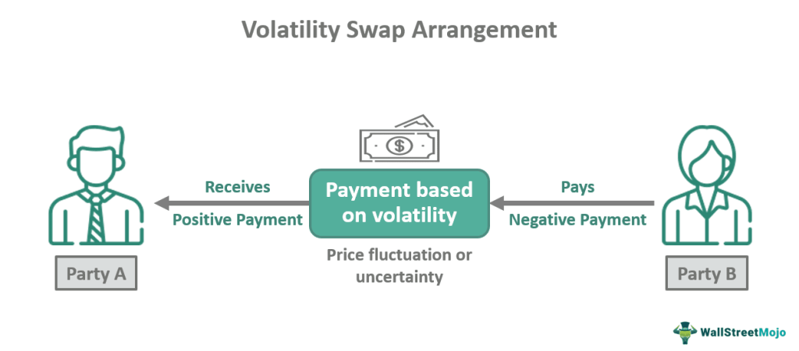

## Table of Contents

## What is a volatility swap?

A volatility swap is a financial contract where two parties agree to exchange the realized volatility of an asset for a fixed volatility level over a certain period. In simpler terms, it's a bet on how much the price of an asset, like a stock or commodity, will fluctuate in the future. If you think the price will swing a lot, you might enter into a volatility swap to benefit from those big movements.

The way it works is that at the end of the contract, the difference between the realized volatility and the fixed volatility agreed upon at the start is calculated. If the realized volatility is higher than the fixed level, the seller of the swap pays the buyer. If it's lower, the buyer pays the seller. This makes volatility swaps useful for investors who want to hedge against or speculate on future volatility without directly trading the underlying asset.

## How does a volatility swap differ from other types of swaps?

A volatility swap is different from other swaps because it focuses on the ups and downs of an asset's price, not the price itself. For example, in an interest rate swap, two parties might exchange fixed interest payments for floating ones. But in a volatility swap, they're betting on how much the price will move around. This makes it unique because it's all about volatility, not the level of the asset's price.

Compared to other swaps like currency swaps or commodity swaps, which are about exchanging cash flows in different currencies or based on commodity prices, a volatility swap doesn't care about the actual price of the asset. Instead, it's about how much that price changes. This can be useful for someone who wants to bet on or protect against big swings in the market without worrying about whether the price goes up or down.

## What are the key components of a volatility swap?

A volatility swap has a few main parts that make it work. First, there's the realized volatility, which is how much the price of the asset actually moves up and down during the time of the swap. This is figured out by looking at the price changes every day and then finding the average. Second, there's the fixed volatility level, which is decided at the start of the swap. This is the number that the realized volatility gets compared to at the end.

The other big part is the payment at the end of the swap. If the realized volatility turns out to be higher than the fixed level, the person who sold the swap has to pay the buyer. If it's lower, the buyer pays the seller. This payment is based on the difference between these two numbers. So, the whole idea is to bet on whether the price will move a lot or a little, and the swap helps you do that without actually trading the asset itself.

## Who typically uses volatility swaps and why?

Volatility swaps are mostly used by investors and traders who want to make money from or protect against big price swings in the market. These could be people working for big investment firms, hedge funds, or even some banks. They use volatility swaps because they think they can guess how much an asset's price will move better than others. For example, if they think a stock will have big ups and downs, they might buy a volatility swap to profit from those movements.

On the other hand, some users might want to use volatility swaps to protect their investments. If someone owns a lot of a certain stock and they're worried about big price swings hurting their portfolio, they might use a volatility swap to balance things out. By doing this, they can feel safer knowing that even if the stock price jumps around a lot, the swap could help cover some of the losses. So, whether it's to make money or to feel more secure, volatility swaps are a tool that helps people deal with the uncertainty in the market.

## How is the volatility measured in a volatility swap?

In a volatility swap, the volatility is measured by looking at how much the price of the asset changes every day during the time of the swap. This is called the realized volatility. To find it, you take the daily price changes, square them to make sure all changes are positive, and then find the average of these squared changes. After that, you take the square root of that average to get the realized volatility. This number shows how much the price has been moving around, and it's what gets compared to the fixed volatility level at the end of the swap.

The fixed volatility level is decided at the start of the swap. It's a guess about how much the price will move, and it stays the same throughout the swap. When the swap ends, you compare this fixed level to the realized volatility. If the realized volatility is higher, it means the price moved more than expected, and the seller of the swap has to pay the buyer. If it's lower, the price moved less than expected, and the buyer has to pay the seller. This way, the swap helps people bet on or protect against how much the price will change, not the price itself.

## What is the payoff structure of a volatility swap?

The payoff of a volatility swap depends on how much the price of an asset moves around. At the start of the swap, two people agree on a fixed level of volatility. This is a guess about how much the price will change. During the swap, they keep track of the actual ups and downs of the price, which is called the realized volatility. When the swap ends, they compare the realized volatility to the fixed level.

If the realized volatility is higher than the fixed level, it means the price moved more than they thought it would. In this case, the person who sold the swap has to pay the buyer. The payment is based on the difference between the two volatility levels. If the realized volatility is lower than the fixed level, it means the price didn't move as much as expected. Then, the buyer has to pay the seller. The payoff is all about the difference between the guessed and actual volatility, helping people bet on or protect against price swings.

## How are volatility swaps priced?

Pricing a volatility swap is a bit tricky because it's not about the price of the asset itself but about how much that price moves around. To figure out the price, you need to guess how much the asset's price will change in the future. This guess is called the implied volatility, and it's based on what people in the market think will happen. You also look at the current price of the asset and how long the swap will last. All these things help you come up with a fair price for the swap.

Once you have an idea of the implied volatility, you compare it to the fixed volatility level that's set at the start of the swap. The difference between these two numbers is what the swap is all about. If you think the price will move a lot more than the fixed level, you might be willing to pay more for the swap because you think you'll get paid at the end. If you think the price won't move much, you might want to sell the swap and get paid if the price stays calm. So, the price of a volatility swap is really about betting on how much the price will change, not the price itself.

## What are the risks associated with volatility swaps?

Using volatility swaps can be risky because they depend a lot on how much the price of an asset will move around. If you guess wrong about how much the price will change, you could lose money. For example, if you buy a volatility swap thinking the price will swing a lot, but it stays calm, you'll have to pay the person who sold you the swap. This can be a big loss if the difference between what you thought would happen and what actually happened is large.

Another risk is that it can be hard to figure out the right price for a volatility swap. You need to make a good guess about future volatility, which isn't easy. If you get the price wrong, you might end up paying more than you should or getting less than you hoped for. Also, because volatility swaps are not as common as other types of swaps, it can be harder to find someone to trade with, which adds another layer of risk.

## Can you explain the concept of realized volatility in the context of volatility swaps?

Realized volatility is a way to measure how much the price of an asset, like a stock, moves up and down over time. In the context of a volatility swap, it's really important because it's what you compare to the fixed volatility level that you set at the start of the swap. To find the realized volatility, you look at the price of the asset every day during the swap. You see how much it changes from one day to the next, square those changes to make sure they're all positive, and then find the average of those squared changes. Finally, you take the square root of that average, and that's your realized volatility.

In a volatility swap, the realized volatility is what decides if you make money or lose money. If the realized volatility, which is the actual ups and downs of the price, is higher than the fixed level you agreed on at the start, then the person who sold the swap has to pay you. This is because the price moved more than you thought it would. But if the realized volatility is lower than the fixed level, then you have to pay the person who sold you the swap because the price didn't move as much as you expected. So, realized volatility is all about comparing what actually happened to what you thought would happen.

## How do market participants hedge volatility swaps?

Market participants hedge volatility swaps to protect themselves from losing too much money if the price of an asset doesn't move the way they thought it would. One common way to hedge is by using other financial products that also depend on how much the price changes. For example, they might buy or sell options, which give them the right to buy or sell an asset at a certain price. Options can be used to make money if the price moves a lot, which can help cover any losses from the volatility swap if the price stays calm.

Another way to hedge is by using variance swaps, which are similar to volatility swaps but focus on the square of the price changes instead of the price changes themselves. By trading variance swaps, market participants can balance out their exposure to big price swings. This means if they lose money on the volatility swap because the price didn't move enough, they might make money on the variance swap, helping to reduce their overall risk. Hedging like this helps them feel more secure, even if the market doesn't act the way they expected.

## What are some common strategies involving volatility swaps?

One common strategy involving volatility swaps is to use them to bet on big price swings in the market. If someone thinks a stock or another asset will move a lot in the future, they might buy a volatility swap. This way, if the price does swing a lot, they can make money from the swap. For example, if there's news coming up that might shake up the market, like an election or a big company's earnings report, someone might use a volatility swap to try to profit from the expected ups and downs.

Another strategy is to use volatility swaps to protect against big price changes. If someone owns a lot of a stock and is worried that the price might jump around a lot, they might buy a volatility swap to balance out their risk. This can help them feel safer because if the price does move a lot, the money they make from the swap can help cover any losses from the stock. It's like an insurance policy against big market swings, helping them keep their investments more stable.

## How have volatility swaps evolved over time and what is their current market status?

Volatility swaps have been around since the late 1990s, and they started as a way for investors to bet on or protect against big price swings without having to trade the actual asset. At first, they were mostly used by big investment firms and hedge funds who wanted to take advantage of their guesses about how much the market would move. Over time, as more people learned about them and how they could be useful, volatility swaps became more popular. They got more complicated too, with new ways to measure and trade them, making them a bigger part of the financial world.

Today, volatility swaps are still mostly used by big investors and traders, but they're more common than they used to be. They're seen as a useful tool for managing risk and trying to make money from market ups and downs. The market for volatility swaps is still pretty specialized, and it's not as big as markets for other types of swaps like interest rate swaps or currency swaps. But they keep growing as more people see the value in betting on or protecting against volatility, especially in times when the market is really unpredictable.

## What are Volatility Swaps and how are they explained?

Volatility swaps are financial derivatives that enable traders to gain exposure to the [volatility](/wiki/volatility-trading-strategies) of an underlying asset, such as a stock, index, or currency, without directly trading the asset itself. This instrument provides a mechanism for investors to speculate on or hedge against changes in market volatility.

At the core of a volatility swap is the payoff structure, which is contingent upon the difference between the realized volatility of the underlying asset and a predetermined strike volatility, often referred to as the "volatility strike." The realized volatility is calculated over a specified period, typically using the standard deviation of the logarithmic returns of the asset.

$$
\text{Realized Volatility} = \sqrt{\frac{252}{n} \sum_{i=1}^{n} (r_i - \bar{r})^2}
$$

where $n$ is the number of trading days, $r_i$ represents the daily logarithmic return, and $\bar{r}$ is the average daily return over the period.

The payoff of a volatility swap can be expressed as:

$$
\text{Payoff} = (\text{Realized Volatility} - \text{Volatility Strike}) \times \text{Notional Value}
$$

This formula highlights that volatility swaps differ from traditional swaps where periodic cash flows are exchanged. Instead, volatility swaps focus exclusively on the realized volatility metric. If the realized volatility exceeds the volatility strike, the buyer of the swap profits, while the seller gains if the realized volatility falls below the strike.

Volatility swaps are particularly advantageous because they provide direct exposure to volatility without being affected by directional price movements of the underlying asset. This feature makes them attractive for volatility-focused strategies, especially in environments marked by significant uncertainty or expected volatility spikes.

Given their unique properties, volatility swaps are used both for speculative purposes and as a hedging tool. Market participants might use these swaps to stabilize portfolios against potential volatility shocks or to profit from anticipated changes in market behavior.

## References & Further Reading

[1]: John Hull. ["Options, Futures, and Other Derivatives"](https://www.amazon.com/Options-Futures-Other-Derivatives-10th/dp/013447208X) by John Hull

[2]: Volatility Trading, Euan Sinclair, Wiley Trading, 2nd edition, 2013. [ISBN: 978-1118362419](https://www.wiley.com/en-us/Volatility+Trading%2C+%2B+Website%2C+2nd+Edition-p-9781118416723)

[3]: Marcos López de Prado. ["Advances in Financial Machine Learning"](https://www.amazon.com/Advances-Financial-Machine-Learning-Marcos/dp/1119482089)

[4]: Ernest P. Chan. ["Algorithmic Trading: Winning Strategies and Their Rationale"](https://www.wiley.com/en-us/Algorithmic+Trading%3A+Winning+Strategies+and+Their+Rationale-p-9781118460146)

[5]: Rama Cont and Peter Tankov. ["Financial Modelling With Jump Processes"](https://archive.org/details/financialmodelli0000cont), Chapman and Hall/CRC, 2004

[6]: Narang, R. (2009). ["Inside the Black Box: The Simple Truth About Quantitative Trading"](https://onlinelibrary.wiley.com/doi/book/10.1002/9781118267738). 

[7]: Alexander, C. (2008). ["Market Risk Analysis, Volume IV: Value at Risk Models"](https://pdfs.semanticscholar.org/afba/364297b19e15f646f9964a7f319225984fe9.pdf). 

[8]: Lhabitant, F.-S. (2004). ["Hedge Funds: Quantitative Insights"](https://www.wiley.com/en-us/Hedge+Funds%3A+Quantitative+Insights-p-9780470687772).