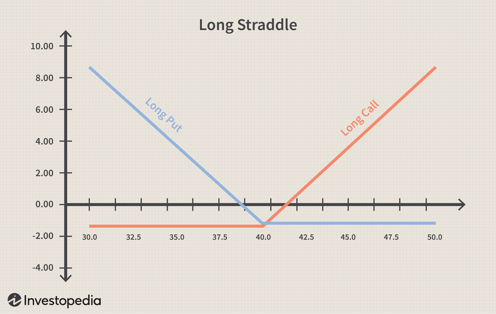

## Table of Contents

## What is volatility in financial markets?

Volatility in financial markets refers to how much and how quickly the price of an asset, like a stock or a currency, changes over time. If the price of an asset moves up and down a lot in a short period, we say it has high volatility. On the other hand, if the price stays pretty steady without big swings, it has low volatility. Traders and investors pay close attention to volatility because it can affect their decisions on whether to buy or sell an asset.

Understanding volatility is important because it helps people gauge the risk involved in investing in a particular asset. High volatility means there's a higher chance of big price swings, which can lead to bigger gains but also bigger losses. Low volatility might mean more stable returns but usually smaller gains. By looking at how volatile an asset is, investors can decide if it fits with their investment goals and how much risk they're willing to take.

## Why is understanding volatility important for traders?

Understanding volatility is key for traders because it helps them know how much risk they're taking on. If a stock or currency has high volatility, it means its price can go up and down a lot in a short time. This can be good if the price goes up, because traders can make more money. But, it can also be bad if the price goes down a lot, because they could lose more money. So, by knowing how volatile an asset is, traders can decide if they're okay with the risk or if they should look for something less risky.

Also, knowing about volatility helps traders plan their moves better. For example, if they see that a stock is usually calm but suddenly starts moving a lot, they might think something big is happening. They could use this info to buy or sell at the right time. Plus, traders can use tools like options and futures to either protect themselves from big price swings or to bet on them. Understanding volatility makes it easier to use these tools the right way.

## What are the basic types of volatility trading strategies?

One common type of volatility trading strategy is called a straddle. In a straddle, a trader buys both a call option and a put option on the same asset with the same expiration date and strike price. The idea is to make money if the asset's price moves a lot in either direction. If the price goes up a lot, the call option becomes valuable. If it goes down a lot, the put option becomes valuable. Traders use this strategy when they think there will be big price swings but aren't sure which way the price will go.

Another strategy is called a strangle. This is similar to a straddle but involves buying a call option with a higher strike price and a put option with a lower strike price. Like a straddle, the goal is to profit from big price movements, but a strangle is cheaper because the options are out-of-the-money. Traders might choose a strangle when they expect high volatility but want to spend less money upfront.

Lastly, there's the iron condor strategy, which is used when traders think the market will stay pretty calm. In an iron condor, a trader sells an out-of-the-money call and an out-of-the-money put, and then buys a further out-of-the-money call and put to limit risk. The goal is to make money from the premiums of the options sold, hoping the asset's price stays within a certain range until the options expire. This strategy is all about betting on low volatility.

## How can beginners start trading volatility?

Beginners can start trading volatility by first learning the basics of options trading. Options are contracts that give you the right to buy or sell an asset at a certain price before a certain date. To trade volatility, beginners should focus on strategies like straddles and strangles. A straddle involves buying a call option and a put option with the same strike price and expiration date. This works well if you think the price will move a lot but you're not sure which way. A strangle is similar, but you buy options with different strike prices, which is cheaper but needs a bigger price move to make money.

After learning these strategies, beginners should practice with a demo account before using real money. Many online platforms offer demo accounts where you can trade with fake money to get the hang of things. It's also important to start small and only use money you can afford to lose. As you get more comfortable, you can try more complex strategies like the iron condor, which involves selling and buying options to bet on the market staying calm. Remember, trading volatility can be risky, so always do your research and maybe even talk to a financial advisor before you start.

## What are the key indicators used in volatility trading?

In volatility trading, one key indicator is the Volatility Index, often called the VIX. The VIX measures how much people expect the stock market to move around in the next 30 days. Traders watch the VIX to see if the market might get more or less risky. If the VIX goes up, it means people are expecting bigger price swings, so it might be a good time to use strategies that can make money from big moves. If the VIX goes down, it means the market might stay calm, and traders might choose strategies that work well when prices don't change much.

Another important indicator is the Average True Range (ATR). The ATR shows how much the price of an asset usually moves up and down over a certain time, like a day or a week. Traders use the ATR to see if an asset is getting more or less volatile. If the ATR is going up, it means the asset's price is moving more than usual, which could be a sign to use strategies that bet on big price changes. If the ATR is going down, it means the price is moving less, and traders might choose strategies that work better in a calm market.

## What is the difference between historical and implied volatility?

Historical volatility, also known as realized volatility, is a measure of how much the price of an asset has moved around in the past. It looks at the actual price changes over a specific period, like the last 30 days or the last year. Traders use historical volatility to understand how much an asset's price has been swinging up and down. This can help them guess how much it might move in the future based on what it did before. 

Implied volatility, on the other hand, is a forward-looking measure. It shows what the market thinks the future volatility of an asset will be. This is figured out from the prices of options on that asset. When people buy options, they're betting on how much the price might move, and the price they're willing to pay for those options tells us about their expectations for future volatility. So, implied volatility is all about what might happen next, not what already happened.

## How can options be used in volatility trading strategies?

Options are important tools for trading volatility because they let traders bet on how much an asset's price might move, not just which way it will go. A common strategy is the straddle, where a trader buys both a call option and a put option on the same asset with the same expiration date and strike price. This works well if you think the price will move a lot but you're not sure if it will go up or down. If the price goes up a lot, the call option becomes valuable. If it goes down a lot, the put option becomes valuable. So, no matter which way the price moves, you can make money if the move is big enough.

Another strategy is the strangle, which is like a straddle but cheaper. In a strangle, you buy a call option with a higher strike price and a put option with a lower strike price. This strategy is good when you expect big price swings but want to spend less money upfront. If the price moves a lot in either direction, one of the options will become valuable, and you can make a profit. Both straddles and strangles are ways to use options to bet on high volatility.

For betting on low volatility, traders can use the iron condor strategy. In an iron condor, you sell an out-of-the-money call and an out-of-the-money put, and then buy a further out-of-the-money call and put to limit your risk. The goal is to make money from the premiums of the options you sold, hoping the asset's price stays within a certain range until the options expire. This strategy is all about making money when the market stays calm. Options give traders a lot of flexibility to make different kinds of bets on volatility, whether they think the market will be wild or quiet.

## What are volatility ETFs and how do they work?

Volatility ETFs, or Exchange Traded Funds, are special funds that let you invest in how much the market might move around. Instead of betting on whether a stock or the market will go up or down, these ETFs let you bet on how much prices will swing. The most famous one is the VIX ETF, which tracks the Volatility Index, also called the VIX. The VIX measures how much people expect the stock market to move in the next 30 days. So, if you think the market will get more risky and prices will swing a lot, you might buy a VIX ETF to make money from that.

These ETFs work by using different financial tools like futures and options to try to match the performance of the volatility index they're tracking. For example, a VIX ETF will buy and sell VIX futures to try to follow the VIX as closely as possible. But, it's important to know that these ETFs can be tricky to trade. They can be very volatile themselves, and they might not always track the index perfectly. So, they're often used by more experienced traders who understand the risks and how these ETFs work.

## What are some advanced volatility trading strategies?

One advanced volatility trading strategy is called the butterfly spread. This strategy involves buying and selling options at three different strike prices. You buy one option at a lower strike price, sell two options at a middle strike price, and buy another option at a higher strike price. All the options should have the same expiration date. The goal of a butterfly spread is to make money if the price of the asset stays close to the middle strike price. It's a bit like betting that the market will stay calm, but it's more complex than just buying or selling options.

Another advanced strategy is the calendar spread, also known as a time spread. In this strategy, you buy and sell options on the same asset with the same strike price but different expiration dates. You might buy a long-term option and sell a short-term option. The idea is to make money from the difference in how fast the options lose their value over time. If you think the price of the asset won't move much in the short term but might move more later, a calendar spread could work well. It's a way to bet on how volatility might change over time, making it a more advanced way to trade volatility.

## How can traders manage risk when trading volatility?

Traders can manage risk when trading volatility by using stop-loss orders. A stop-loss order is like a safety net that automatically sells your trade if the price goes down to a certain level. This helps stop you from losing too much money if the market moves against you. Another way to manage risk is by not putting all your money into one trade. Instead, spread your money across different trades. This way, if one trade goes bad, you won't lose everything.

Another important way to manage risk is to always know how much you could lose before you start a trade. This means doing your homework and understanding the risks of the strategies you're using. For example, if you're trading options, you should know how much the options might lose value if the market doesn't move the way you expect. By understanding the risks and setting clear limits on how much you're willing to lose, you can trade volatility more safely.

## What role does market sentiment play in volatility trading?

Market sentiment is how people feel about the market. It can make the market move a lot or stay calm. If everyone is feeling worried or excited, the market might get more volatile. Traders who trade volatility pay close attention to how people feel because it can help them guess if the market will start moving a lot. For example, if there's bad news that makes everyone nervous, traders might expect the market to get more volatile and use strategies that can make money from big price swings.

Understanding market sentiment can also help traders decide when to use certain strategies. If the market sentiment is calm and most people think prices won't change much, traders might use strategies that work well in a calm market, like an iron condor. But if the sentiment is all over the place and people are unsure, traders might use strategies like straddles or strangles that can make money if the market moves a lot. By keeping an eye on how people feel, traders can pick the right strategies to manage their risk and maybe make more money.

## How can algorithmic trading be applied to volatility strategies?

Algorithmic trading can be used in volatility strategies to help traders make decisions faster and more accurately. Traders can set up computer programs, called algorithms, to look at lots of data about how much the market is moving. These algorithms can spot patterns and changes in volatility that might be hard for a person to see. For example, an algorithm might notice that the market is starting to move more than usual and suggest using a straddle strategy, which can make money if the market keeps moving a lot. This way, traders can act quickly on these changes without having to watch the market all the time.

Using algorithms also helps traders manage risk better when trading volatility. The programs can be set to automatically put in stop-loss orders, which sell a trade if it starts losing too much money. This helps traders avoid big losses if the market moves against them. Algorithms can also spread out trades across different assets to reduce risk. By using these tools, traders can make more informed decisions and handle the ups and downs of the market more smoothly.

## How can we plot the results?

plt.figure(figsize=(10, 5))
plt.plot(prices, total_payoff, label='Long Straddle Payoff')
plt.xlabel('Stock Price at Expiration')
plt.ylabel('Profit / Loss')
plt.title('Long Straddle Payoff at Expiration')
plt.axhline(0, color='black', lw=1)
plt.axvline(call_strike, color='r', linestyle='--', label='Strike Price')
plt.legend()
plt.grid(True)
plt.show()

```

The mathematical representation of the profit ($\Pi$) from a long straddle at expiration is given by:

$$
\Pi = \begin{cases}
P - S + C_{0} - P_{0}, & \text{if } S < K \\
C - S + C_{0} - P_{0}, & \text{if } S > K \\
-C_{0} - P_{0}, & \text{if } S = K
\end{cases}
$$

where:

- $S$ is the stock price at expiration,
- $K$ is the strike price,
- $C_{0}$ and $P_{0}$ are the initial premiums paid for the call and put options respectively,
- $C$ and $P$ are the intrinsic values of the call and put options at expiration.

## References & Further Reading

[1]: ["Option Volatility & Pricing"](https://www.goodreads.com/book/show/119373.Option_Volatility_Pricing) by Sheldon Natenberg

[2]: ["Volatility Trading"](https://www.amazon.com/Volatility-Trading-Wiley-Book-611-ebook/dp/B00CGH01GI) by Euan Sinclair

[3]: ["Volatility and Correlation"](https://www.amazon.com/Volatility-Correlation-Perfect-Hedger-Fox/dp/0470091398) by Riccardo Rebonato

[4]: ["Trading Volatility: Trading Volatility, Correlation, Term Structure and Skew"](https://www.amazon.com/Trading-Volatility-Correlation-Term-Structure/dp/1461108756) by Colin Bennett

[5]: ["Dynamic Hedging"](https://www.amazon.com/Dynamic-Hedging-Managing-Vanilla-Options/dp/0471152803) by Nassim Nicholas Taleb