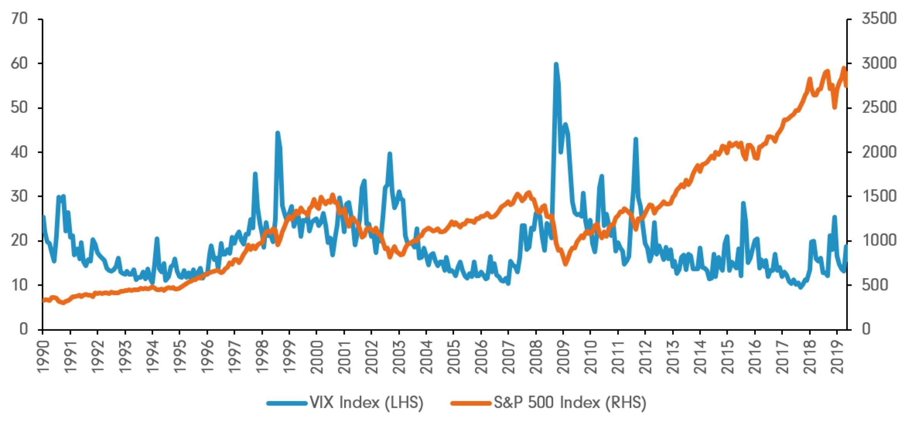

In financial markets, understanding and managing volatility is crucial for traders. Central to this understanding is the VIX, or CBOE Volatility Index, often referred to as the "fear gauge" of Wall Street. The VIX serves as a forward-looking measure, capturing the market's expectations of volatility over the coming 30 days based on S&P 500 index options. A high VIX value is indicative of increased market uncertainty and potential turmoil, while a lower VIX suggests a period of relative calm or stability.

Algorithmic trading has transformed trading practices by leveraging sophisticated computer algorithms that can process vast amounts of data at high speed. In this context, the VIX plays a significant role by providing data-driven insights that traders can use to better anticipate market movements. By incorporating the VIX into their algorithms, traders can develop more robust risk management strategies and optimize their trading performance.



Understanding the mechanics of the VIX allows investors to assess market sentiment effectively and manage their portfolios to mitigate potential risks. This process not only helps in optimizing trading strategies but also in enhancing overall trading performance by making informed decisions based on quantified risk expectations. Thus, the VIX becomes an indispensable tool for traders aiming to navigate the complexities of market dynamics efficiently.

## Table of Contents

## What is the VIX?

The VIX, or the Chicago Board Options Exchange (CBOE) Volatility Index, was introduced in 1993 as a barometer for gauging market volatility. It specifically measures the 30-day forward-looking volatility expected by the market, derived from the prices of S&P 500 index options. The VIX is calculated using the implied volatilities of a broad spectrum of both put and call options on the S&P 500. 

The formula to calculate the VIX involves several components, including the strike prices, option mid-prices, and the time to expiration of the options. By incorporating options across different strike prices, the VIX offers a balanced view of market expectations regarding future volatility. Typically, higher values of the VIX suggest increased uncertainty or fear among market participants, signaling potential turbulence ahead. Conversely, lower VIX values imply market stability and reduced anxiety about upcoming swings.

For traders and investors, the VIX provides a valuable snapshot of predicted market volatility. It serves as a key tool for making informed decisions, managing risk, and optimizing portfolios. By understanding the VIX, traders can better interpret market sentiment and adjust their strategies accordingly to navigate potential challenges.

## Mechanics of the VIX

The VIX, or CBOE Volatility Index, serves as a barometer of market [volatility](/wiki/volatility-trading-strategies) by leveraging the price fluctuations of S&P 500 index options. The VIX's calculation methodology focuses on a time horizon of 23 to 37 days, aiming to capture near-term expectations of market changes. It employs a model that considers both call and put options to offer a balanced view of market sentiment.

Central to its calculation is the formula that integrates various components such as strike prices, option midprices, and the time remaining to expiration. These elements are crucial as they represent the prevailing market assumptions about volatility over the forthcoming month. The incorporation of both types of options – calls and puts – ensures that the VIX reflects a comprehensive estimate of the market's expected price swings. In mathematical terms, the VIX can be represented as such:

$$
\text{VIX} = 100 \times \sqrt{\frac{2}{T} \sum K_i e^{RT} Q(K_i) \frac{\Delta K_i}{K_i^2} - \frac{1}{T} \left(\frac{F}{K_0} - 1\right)^2}
$$

In this formula, $K_i$ represents the strike prices, $Q(K_i)$ refers to a certain weighting of each option price, $\Delta K_i$ is the interval between strike prices, $F$ is the forward index level derived from the option prices, $R$ is the risk-free [interest rate](/wiki/interest-rate-trading-strategies), and $T$ is the time to expiration.

Higher values of the VIX generally indicate increased uncertainty or greater expected market volatility. Such conditions often reflect heightened investor fears, potentially triggered by economic instability or geopolitical events. Conversely, lower VIX readings suggest calmer market conditions with less expected volatility.

For traders, the VIX is an instrumental tool in portfolio management. It provides a forward-looking perspective, enabling them to implement protective strategies such as hedging when anticipating market corrections. This information can lead to decisions to rebalance portfolios, employ stop-loss orders, or adjust exposure to riskier assets, thereby safeguarding investments against adverse market movements. By interpreting the VIX effectively, traders improve their ability to mitigate losses and navigate financial markets more prudently.

## Using VIX in Algorithmic Trading

Algorithmic trading harnesses computer algorithms to execute trades rapidly by leveraging diverse data inputs, including the VIX. The VIX, or CBOE Volatility Index, offers traders valuable insights into market sentiment and volatility, which are crucial for anticipating market movements. By monitoring VIX levels, traders can dynamically adjust their trading parameters to optimize strategies in response to predicted market conditions. 

One of the primary advantages of integrating the VIX into [algorithmic trading](/wiki/algorithmic-trading) strategies is the ability to assess market sentiment quantitatively. The VIX serves as a gauge for investor anxiety, with higher values indicating increased market uncertainty and potential price fluctuations. Algorithmic systems can process these signals to fine-tune trading decisions, such as altering the aggressiveness of orders or repositioning portfolios to mitigate anticipated risks.

Backtesting plays a pivotal role in algorithmic trading strategies that use the VIX. This process involves evaluating trading strategies using historical VIX data to simulate performance under past market conditions. Historical data enables traders to identify correlations between VIX movements and market behavior, helping them to develop models that predict future conditions. Key performance metrics, such as the Sharpe ratio, are used in [backtesting](/wiki/backtesting) to measure the risk-adjusted returns of these strategies, providing a robust foundation for strategy refinement.

The integration of the VIX into an algorithmic trading framework enhances decision-making by providing a systematic approach to risk management. In essence, the VIX acts as an early warning system allowing algorithms to trigger protective measures when volatility spikes are expected. This can include hedging positions with options or reallocating assets to less volatile classes, thus preserving capital during turbulent periods.

By incorporating the VIX's predictive capability, traders can develop more adaptive and resilient trading algorithms. Python, with its extensive libraries such as pandas and numpy, is often used in algorithmic trading for data analysis and strategy development. Here's a simple example in Python that illustrates how one might incorporate VIX data into a trading algorithm:

```python
import pandas as pd
import numpy as np

# Load historical VIX data
vix_data = pd.read_csv('historical_vix.csv')

# Define a simple trading strategy based on VIX levels
def trading_signal(vix_value, threshold=20):
    if vix_value > threshold:
        return 'Reduce risk, hedge positions'
    else:
        return 'Normal trading conditions'

# Apply the strategy and check performance
vix_data['Strategy'] = vix_data['VIX'].apply(trading_signal)
performance = vix_data.groupby('Strategy').mean()

print(performance)
```

Incorporating the VIX into algorithmic frameworks facilitates strategy refinement and robust risk management, ultimately enhancing a trader's ability to navigate complex market dynamics and optimize returns.

## Backtesting VIX-based Strategies

Backtesting is an essential process for evaluating the effectiveness of trading strategies by applying them to historical data. When it comes to VIX-based strategies, backtesting can uncover relationships between VIX fluctuations and market behavior, providing traders valuable insights into prospective performance during similar future conditions.

The process begins by accumulating historical data on the VIX to analyze how its movements correlate with overall market trends. This data serves as the foundation for simulating trading strategies under different volatility environments. Traders often employ key performance metrics, such as the Sharpe ratio, to quantify the risk-adjusted return of a given strategy. The Sharpe ratio is calculated as:

$$
\text{Sharpe Ratio} = \frac{E[R_p - R_f]}{\sigma_p}
$$

where $E[R_p - R_f]$ is the expected return of the portfolio minus the risk-free rate, and $\sigma_p$ is the standard deviation of the portfolio's excess return.

By measuring how a strategy would have performed given past VIX levels, traders can assess its potential reliability and stability. This historical simulation serves as a feedback loop that enables traders to fine-tune their strategies by adjusting key parameters or algorithmic rules for different market conditions. For instance, a strategy that performs well during periods of low volatility might need adjustment to mitigate risks during high volatility phases indicated by increased VIX levels.

Python, with its robust libraries like `pandas` and `numpy`, is commonly used for the backtesting process. Here's a simplified example to calculate the Sharpe ratio using historical VIX data and a hypothetical portfolio's returns:

```python
import numpy as np
import pandas as pd

# Load historical data
vix_data = pd.read_csv('historical_vix_data.csv')  # A CSV file containing VIX index data
portfolio_returns = pd.read_csv('portfolio_returns.csv')  # A CSV file containing portfolio returns

# Calculate excess returns
risk_free_rate = 0.01  # Example risk-free rate
excess_returns = portfolio_returns - risk_free_rate

# Calculate Sharpe Ratio
sharpe_ratio = excess_returns.mean() / excess_returns.std()

print(f'Sharpe Ratio: {sharpe_ratio}')
```

Through backtesting, traders refine their algorithmic strategies, improving their capacity to predict future market movements and effectively manage associated risks. Enhancing these strategies based on historical results is crucial for optimizing decision-making and reinforcing risk management practices. This iterative process not only polishes the predictive abilities of trading algorithms but also bolsters a trader's ability to adapt to evolving market dynamics, thus increasing potential returns while mitigating risks.

## Conclusion

The VIX serves as an indispensable tool for traders by offering critical insights into market sentiment and anticipated volatility levels. Its role becomes particularly valuable when integrated into algorithmic trading strategies, where it aids traders in effectively navigating complex market dynamics. Given its ability to quantify fear and uncertainty, understanding fluctuations in the VIX enables traders to make informed adjustments to their portfolios. This adaptability is crucial for mitigating risks associated with abrupt market swings.

By leveraging the VIX's predictive capabilities, traders can refine their strategies, enhancing both decision-making and risk management. Algorithmic frameworks that incorporate VIX data can be calibrated to interpret market signals more accurately, thereby improving the overall efficacy of trading algorithms. Such improvements are not just theoretical; they translate into tangible benefits in terms of risk management and return maximization. Ultimately, the VIX allows traders to anticipate and react to market conditions more precisely, leading to optimized trading outcomes and improved risk-adjusted returns.

## References & Further Reading

- Whaley, R. E. (2009). "Understanding the VIX." The Journal of Portfolio Management. This article provides an in-depth analysis of the VIX, outlining its historical development and the mathematical framework used to derive its calculations. It discusses the role of the VIX in indicating market sentiment and its application in risk management.

- Simon, D. P. (2003). "The Nasdaq Volatility Index During and After the Bubble." The Journal of Derivatives. Simon's work examines the behavior of volatility indices, with a focus on the Nasdaq, comparing market conditions before and after the dot-com bubble. It provides insights into how volatility indices can reflect changing market dynamics.

- Sinclair, E. (2010). "Volatility Trading." John Wiley & Sons. This book is a comprehensive guide on trading strategies that revolve around volatility. Sinclair discusses the use of the VIX in trading, elaborating on various techniques that traders can employ to capitalize on volatility changes, with practical examples and strategies.

- CBOE Volatility Index (VIX). CBOE. The CBOE provides extensive resources and real-time data on the VIX. Their website is a valuable reference for understanding the technicalities of the VIX, its methodology, calculations, and its applications in financial markets.

- Wiggins, J. B. (1992). "Option Values under Stochastic Volatility: Theory and Empirical Estimates." The Journal of Financial Economics. Wiggins discusses the valuation of options in environments of stochastic volatility, offering theoretical insights and empirical data that enhance understanding of how options pricing models integrate with variable volatility metrics, such as those measured by the VIX.

