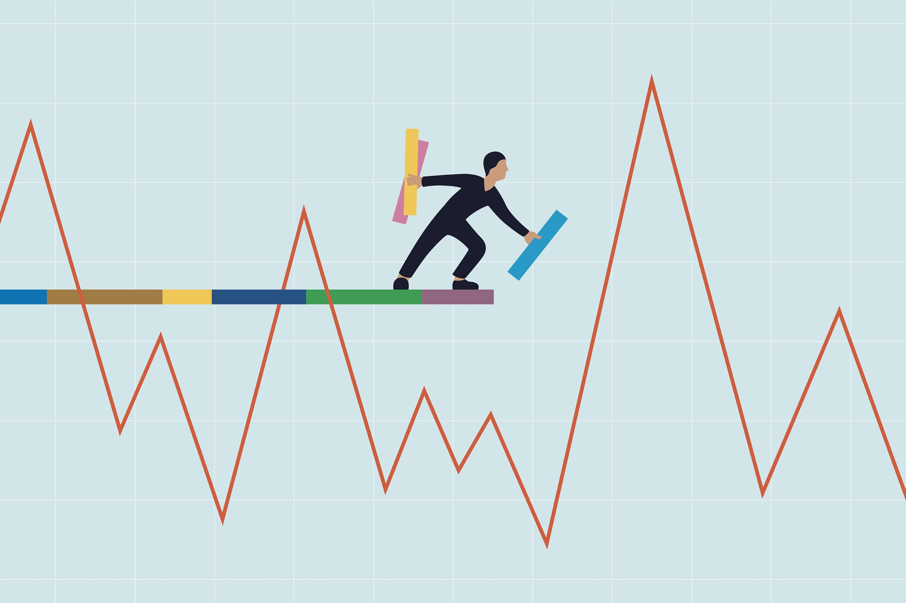

## Table of Contents

## What is volatility in the context of finance and investing?

Volatility in finance and investing refers to how much and how quickly the price of an investment, like a stock or a bond, goes up and down over time. It's a measure of the uncertainty or risk related to the size of changes in the investment's value. If an investment is very volatile, its price can change a lot in a short time, which can be both exciting and scary for investors. On the other hand, if an investment has low volatility, its price doesn't change much, making it more predictable but possibly less exciting.

Understanding volatility is important for investors because it helps them decide how much risk they're willing to take. For example, if someone doesn't like big surprises, they might choose investments with lower volatility to keep their money safer. But if someone is okay with more risk and wants the chance for bigger rewards, they might go for investments with higher volatility. By knowing about volatility, investors can make smarter choices that match their goals and how much risk they can handle.

## How is volatility measured in financial markets?

Volatility in financial markets is often measured using something called standard deviation. This is a way to see how much the price of an investment, like a stock, moves away from its average price over time. If the standard deviation is big, it means the price of the investment can change a lot, so it's more volatile. If it's small, the price doesn't change much, so it's less volatile. Investors use this information to understand how risky an investment might be.

Another common way to measure volatility is by using the VIX, which is also known as the "fear index." The VIX looks at the prices of options on the S&P 500, which is a big group of stocks, to guess how much the market might move in the next 30 days. When the VIX is high, it means people think the market will be more volatile, and when it's low, they think it will be calmer. This helps investors get a sense of the overall mood of the market and adjust their plans accordingly.

## What are the common indicators used to assess volatility?

One common way to assess volatility is by using standard deviation. This measures how much the price of an investment, like a stock, changes from its average price over a certain time. If the standard deviation is high, it means the price can swing a lot, making the investment more volatile. If it's low, the price stays pretty steady, so the investment is less volatile. Investors look at standard deviation to understand how risky an investment might be and to help them decide if it's a good fit for their goals.

Another popular indicator is the VIX, often called the "fear index." The VIX looks at the prices of options on the S&P 500, which is a big group of stocks, to predict how much the market might move in the next 30 days. When the VIX is high, it means people think the market will be more unpredictable and volatile. When it's low, they expect the market to be calmer. The VIX helps investors get a sense of the overall mood of the market and can guide them in adjusting their investment strategies accordingly.

## Why is volatility important for investors and traders?

Volatility is important for investors and traders because it tells them how much risk they are taking with their money. When an investment is very volatile, its price can go up and down a lot in a short time. This means there's a bigger chance of losing money, but also a bigger chance of making money. Investors need to know about volatility so they can pick investments that match how much risk they're okay with. If someone doesn't like big surprises, they might choose investments with lower volatility to keep their money safer. But if someone is okay with more risk and wants the chance for bigger rewards, they might go for investments with higher volatility.

Traders also use volatility to make their trading plans. They look at how much the price of an investment moves to decide when to buy and sell. High volatility can mean more chances to make money quickly, but it also means the market can be unpredictable. Traders often use tools like the VIX to guess how the market might move in the future. This helps them adjust their strategies to take advantage of big price swings or to protect themselves from sudden drops. Understanding volatility helps traders and investors make smarter choices and manage their money better.

## How does volatility affect investment strategies?

Volatility plays a big role in shaping investment strategies. When the market is very volatile, it means prices can change a lot in a short time. This can be good for some investors who like to take risks and want to make quick profits. They might choose to invest in things like stocks or options that can go up and down a lot, hoping to buy low and sell high. But for investors who don't like big surprises, high volatility can be scary. They might decide to stick with safer investments like bonds or mutual funds that don't change as much. Knowing how much risk you're okay with is important when [picking](/wiki/asset-class-picking) an investment strategy that fits your goals.

Volatility also affects how investors plan for the long term. If someone is saving for something far in the future, like retirement, they might not worry too much about short-term ups and downs. They might still choose to invest in stocks, even if they're volatile, because over many years, the market tends to grow. But if someone needs their money soon, they'll want to avoid big drops in value. They might choose investments with lower volatility to make sure their money is there when they need it. By understanding volatility, investors can make smarter choices that match their time frame and how much risk they can handle.

## What is the difference between historical and implied volatility?

Historical volatility is about looking back at how much the price of an investment, like a stock, has changed in the past. It's like checking the weather report for the last month to see how stormy or calm it was. Investors use historical volatility to understand how risky an investment has been. If the price went up and down a lot, it means the investment was very volatile. If it stayed pretty steady, it was less volatile. This helps investors guess how the investment might behave in the future, based on what happened before.

Implied volatility, on the other hand, is about guessing how much the price of an investment might change in the future. It's like trying to predict if it's going to rain or be sunny next week. Implied volatility comes from looking at the prices of options, which are contracts that let you buy or sell something at a set price in the future. If people think the price will move a lot, they'll pay more for options, which makes implied volatility high. If they think the price will stay the same, implied volatility will be low. This helps traders and investors make plans based on what they think might happen next.

## Can you explain the concept of volatility smile and its implications?

The volatility smile is a pattern that shows up when you look at the implied volatility of options at different strike prices. Imagine a graph where the x-axis is the strike price and the y-axis is the implied volatility. Normally, you might expect the implied volatility to be the same for all strike prices, but sometimes it forms a smile shape instead. This happens because people think that big price moves, either up or down, are more likely than what normal models predict. So, they're willing to pay more for options that are far away from the current price, making the implied volatility higher for those options.

The implications of the volatility smile are important for traders and investors. It tells them that the market might not behave as simply as some models expect. If you see a volatility smile, it means people are expecting bigger swings in the price of the investment. This can affect how much people are willing to pay for options and how they plan their trades. Traders might adjust their strategies to take advantage of these expected big moves or to protect themselves from them. Understanding the volatility smile helps investors make better guesses about future price movements and manage their risks more effectively.

## How do options pricing models incorporate volatility?

Options pricing models use volatility to figure out how much an option should cost. The most famous model is the Black-Scholes model, which says that the price of an option depends a lot on how much the price of the underlying investment, like a stock, might change in the future. This future change is what we call implied volatility. If people think the price of the stock will move a lot, the implied volatility goes up, and so does the price of the option. On the other hand, if they think the price won't move much, the implied volatility goes down, and the option costs less. This is because options are like bets on where the price will go, and bigger bets cost more when the outcome is more uncertain.

Another way options pricing models use volatility is by looking at historical volatility. This is the past ups and downs of the stock's price. Some models, like the binomial model, use this historical data to guess how the stock might move in the future. By understanding how much the stock has moved in the past, these models can better predict how much the option should be worth. Both implied and historical volatility help these models give a fair price for options, making it easier for traders and investors to make smart choices about buying and selling them.

## What are some strategies to manage or profit from high volatility?

When the market is really jumpy, or has high volatility, there are ways to handle it or even make some money from it. One way is to use options. Options are like bets on where the price of something, like a stock, will go. If you think the price will move a lot but you're not sure which way, you can buy options that let you make money whether the price goes up or down. This is called a straddle or a strangle. Another way is to buy stocks when they're cheap during big drops and sell them when they go back up. This is called buying the dip. It's a bit risky, but if you guess right, you can make a good profit.

Another strategy is to use stop-loss orders. These are like safety nets that automatically sell your investment if the price drops too much. This can help you limit how much money you lose when the market is acting wild. Some people also like to diversify their investments, which means spreading their money across different things like stocks, bonds, and maybe even gold. This way, if one thing goes down a lot, the others might not, so your overall loss isn't as bad. By using these strategies, you can better handle the ups and downs of a volatile market and maybe even turn those big swings into opportunities to make money.

## How does volatility impact portfolio diversification and risk management?

Volatility can really change how you spread out your investments and manage risk. When the market is jumping around a lot, it's a good idea to have a mix of different kinds of investments. This is called diversification. If you put all your money in one thing and it goes down a lot because of high volatility, you could lose a lot. But if you spread your money across different things like stocks, bonds, and maybe even gold, the ups and downs of one won't hurt your whole portfolio as much. This way, you can handle the wild swings of the market better and keep your money safer.

Managing risk in a volatile market also means thinking about how much risk you're okay with. If you don't like big surprises, you might want to stick with investments that don't change as much, like bonds. But if you're okay with more risk and want the chance to make more money, you might choose to invest in things like stocks that can go up and down a lot. Using tools like stop-loss orders can also help. These are like safety nets that automatically sell your investment if the price drops too much, so you don't lose more than you're comfortable with. By understanding and managing volatility, you can make smarter choices about how to spread out your investments and keep your money safe.

## What role does volatility play in market sentiment and economic forecasts?

Volatility is like a thermometer for how people feel about the market. When prices are jumping around a lot, it usually means people are worried or excited about something big happening. This can be because of news about the economy, big events, or just because a lot of people are buying and selling at the same time. When the market is very volatile, it can make people feel nervous, and they might start selling their investments to avoid losing money. On the other hand, if the market is calm and prices aren't moving much, people might feel more confident and be more willing to invest.

Volatility also helps people guess what might happen in the economy in the future. Economists and investors look at how much prices are moving to make their predictions. If volatility is high, it might mean they expect big changes in the economy, like a boom or a bust. This can affect how they plan and make decisions. For example, if they think the economy might get worse, they might be more careful with their money. Understanding volatility helps everyone get a better picture of what might happen next and plan accordingly.

## How can advanced statistical models be used to predict and analyze volatility?

Advanced statistical models help predict and analyze volatility by looking at lots of data from the past. These models, like the GARCH model, use math to see how much prices have moved before and try to guess how much they might move in the future. They can spot patterns and changes in how volatile the market is, which helps investors and traders make better guesses about what might happen next. By understanding these patterns, people can make smarter choices about when to buy or sell their investments.

These models also help break down what causes volatility. They can look at things like news events, economic reports, and even how people are feeling about the market to see what makes prices go up and down. By figuring out these causes, the models can give a clearer picture of what's driving volatility. This helps investors and traders not just react to what's happening now, but also plan for what might happen later. Using advanced statistical models makes it easier to handle the ups and downs of the market and make more informed decisions.

## What is the understanding of volatility in financial markets?

Volatility in financial markets is a statistical measure that quantifies the [dispersion](/wiki/dispersion-trading) of returns for a given asset or market index. In simpler terms, it represents the degree of variation in trading prices over a certain period. High volatility often indicates large price swings, while low volatility signifies more stable price movements. The standard deviation is commonly used to represent volatility, providing a numerical gauge of how much asset prices deviate from their average price.

$$
\sigma = \sqrt{\frac{1}{N} \sum_{i=1}^{N} (R_i - \bar{R})^2}
$$

Where $\sigma$ is the standard deviation of returns, $R_i$ is the return on the i-th observation, $\bar{R}$ is the average return, and $N$ is the number of observations.

Several factors contribute to market [volatility](/wiki/volatility-trading-strategies):

1. **Macroeconomic Announcements**: Data releases, such as GDP reports, employment figures, and inflation rates, can lead to rapid price adjustments as market participants reassess their expectations.

2. **Geopolitical Events**: Political instability, wars, and other geopolitical factors can generate uncertainty, causing price fluctuations as investors react to perceived risks.

3. **Market Sentiment**: Changes in investor sentiment, often fueled by news and speculation, can prompt rapid buying or selling, increasing volatility.

4. **Interest Rates**: Central bank policies and interest rate changes can influence investor behavior, as they affect borrowing costs and economic growth expectations.

5. **Corporate Earnings**: Quarterly earnings reports can cause significant price swings for individual stocks as companies report performance compared to expectations.

Although all financial markets are exposed to volatility, some are inherently more volatile than others. For example, emerging markets tend to exhibit higher volatility due to less predictable economic conditions and political factors. In the same vein, assets like cryptocurrencies are known for their extreme price fluctuations due to the speculative nature of the market and regulatory uncertainties.

A high-profile example of market volatility is the stock market crash of 2008, where the global financial crisis led to severe price swings across almost all asset classes. More recently, the COVID-19 pandemic triggered significant volatility as investors grappled with the economic implications of global shutdowns.

Understanding the nature and drivers of market volatility is critical for investors and traders who need to manage risk and seize opportunities in fluctuating markets. By recognizing these contributing factors, they can make informed decisions that align with their risk tolerance and investment objectives.

## How can we measure volatility?

Volatility in financial markets represents the degree of variation in the price of a financial instrument over time. It is a crucial aspect for traders and investors as it can signify the risk associated with the underlying asset. Understanding and measuring volatility allows market participants to manage risk and make informed decisions. 

**Common Metrics and Methods**

One of the most common ways to measure volatility is through statistical metrics such as standard deviation and variance. The standard deviation ($\sigma$) of a security’s returns provides an estimate of how much the asset's price deviates from its mean over a certain period. It is calculated as follows:

$$
\sigma = \sqrt{\frac{1}{N-1}\sum_{i=1}^{N}(R_i - \bar{R})^2}
$$

Where:
- $R_i$ is the return at time $i$,
- $\bar{R}$ is the average return over $N$ periods,
- $N$ is the number of observations.

Another measure of volatility is the historical volatility, which refers to the realized volatility of a security's returns based on past prices. Implied volatility, typically derived from options pricing models such as the Black-Scholes model, reflects the market's expectations of future volatility.

**Tools and Platforms**

Numerous financial platforms provide volatility data, aiding traders and investors. Bloomberg Terminal and Reuters Eikon are popular tools for professional traders, offering comprehensive data analytics and visualization capabilities. Additionally, online platforms such as Yahoo Finance and Google Finance provide free access to basic volatility information.

Quantitative traders often use programming languages, primarily Python, to calculate and visualize volatility. Libraries such as NumPy and pandas are integral for data manipulation and statistical calculations. Here is a simple example in Python to calculate the standard deviation of a stock’s daily returns using pandas:

```python
import pandas as pd

# Sample data
data = {'Date': ['2023-01-01', '2023-01-02', '2023-01-03'],
        'Price': [150, 152, 148]}
df = pd.DataFrame(data)
df['Return'] = df['Price'].pct_change()

# Calculate standard deviation and mean return
std_dev = df['Return'].std()
mean_return = df['Return'].mean()

print('Standard Deviation:', std_dev)
print('Mean Return:', mean_return)
```

**The Role of Volatility Indices**

Volatility indices serve as benchmarks for market sentiment and expectations regarding future volatility. The most renowned index is the Chicago Board Options Exchange's Volatility Index (VIX), often referred to as the "fear gauge." The VIX measures the market's expectation of 30-day volatility implied by S&P 500 index options, providing a statistical estimate rather than a direct bond to historical volatility.

These indices are crucial for both hedging and speculative purposes. For example, investors might use VIX futures and options to hedge against or speculate on market volatility. High VIX values typically indicate heightened investor fear or uncertainty, while lower values suggest complacency.

In summary, the tools and metrics for measuring volatility are essential resources for risk assessment in financial markets, assisting traders in devising effective strategies amidst rapid price movements.

## References & Further Reading

[1]: Lopez de Prado, M. (2018). ["Advances in Financial Machine Learning"](https://www.amazon.com/Advances-Financial-Machine-Learning-Marcos/dp/1119482089). Wiley.

[2]: Aronson, D. R. (2006). ["Evidence-Based Technical Analysis: Applying the Scientific Method and Statistical Inference to Trading Signals"](https://www.amazon.com/Evidence-Based-Technical-Analysis-Scientific-Statistical/dp/0470008741). Wiley.

[3]: Jansen, S. (2020). ["Machine Learning for Algorithmic Trading: Predictive models to extract signals from market and alternative data for systematic trading strategies with Python"](https://www.amazon.com/Machine-Learning-Algorithmic-Trading-alternative/dp/1839217715). Packt Publishing.

[4]: Chan, E. P. (2008). ["Quantitative Trading: How to Build Your Own Algorithmic Trading Business"](https://github.com/ftvision/quant_trading_echan_book). Wiley.

[5]: Aldridge, I. (2010). ["High-Frequency Trading: A Practical Guide to Algorithmic Strategies and Trading Systems"](https://www.wiley.com/en-us/High+Frequency+Trading%3A+A+Practical+Guide+to+Algorithmic+Strategies+and+Trading+Systems-p-9780470579770). Wiley.

[6]: Engle, R. (2001). ["GARCH 101: The Use of ARCH/GARCH Models in Applied Econometrics"](https://pubs.aeaweb.org/doi/pdfplus/10.1257/jep.15.4.157). Journal of Economic Perspectives, 15(4), 157-168.