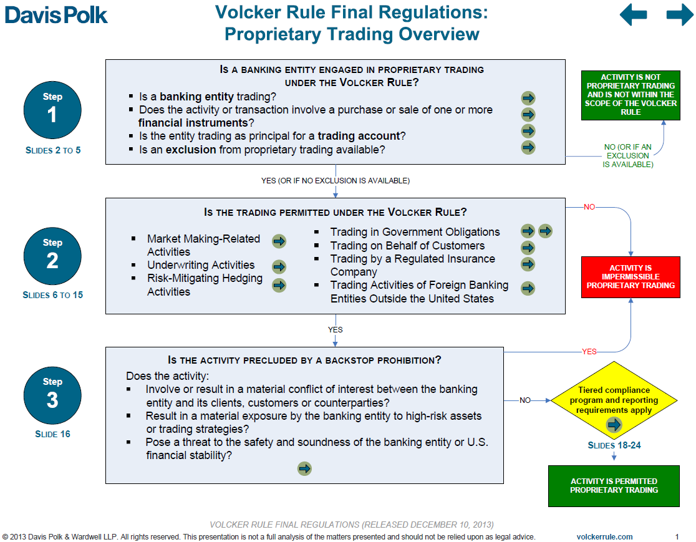

The financial world has witnessed significant reforms over the past decades, aimed at enhancing stability and protecting consumers. Among these reforms, the Volcker Rule has emerged as a pivotal regulation, fundamentally reshaping the landscape of banking activities. Named after Paul Volcker, who served as Chair of the Federal Reserve from 1979 to 1987, the Volcker Rule was introduced as an integral part of the Dodd-Frank Wall Street Reform and Consumer Protection Act enacted in response to the financial crisis of 2007-2008. This regulatory measure was designed to prevent the kinds of excessive risk-taking behaviors that contributed to the crisis, particularly those involving speculative trading practices.

The Volcker Rule specifically targets proprietary trading and certain types of investment activities by banking entities, setting boundaries to separate them from high-risk profit-seeking ventures. By curbing these speculative activities, the rule seeks to diminish systemic risks while safeguarding consumer deposits and maintaining confidence within the financial system. Beyond its direct regulations, the Volcker Rule interacts with modern trading practices, such as algorithmic trading, further influencing how financial institutions operate in rapidly evolving markets. This article explores the nuances of the Volcker Rule, its implications on banking laws, and its intersection with algorithmic trading, shedding light on one of the most significant regulatory measures in modern banking history.

## Table of Contents

## Understanding the Volcker Rule

The Volcker Rule was established to curtail the risk-taking behaviors commonly observed within large financial institutions, primarily focusing on reducing the potential for banks to engage in activities that could jeopardize their stability and the wider financial system. Central to this rule is the prohibition of proprietary trading, defined as banks trading stocks, bonds, commodities, or other financial instruments for their own profit, instead of on behalf of their clients. This type of trading can lead to significant conflicts of interest, as banks could prioritize their profit-making opportunities over the financial security and interests of their customers.

The Volcker Rule's restrictions extend further to the involvement of banks in hedge funds and private equity funds. Such investments are limited because they inherently carry higher risks, which could leverage federally insured deposits for high-risk ventures, thus threatening the safety of those deposits and potentially magnifying financial instability. By imposing these constraints, the rule aims to mitigate systemic risks and safeguard the financial system from the speculative trading practices that contributed to the financial crisis of 2007-2008.

At the core, the Volcker Rule seeks to limit banks' ability to engage in speculative trading that does not directly benefit their client base, ensuring that financial institutions maintain a focus on traditional banking activities, like lending and deposit-taking, which are crucial for economic stability. The rule mandates heightened compliance and risk management protocols, serving as a preventative measure against future financial crises by curbing excessive risk and aligning banks' operations with a more prudent and risk-averse framework.

## Proprietary Trading and Covered Funds

The Volcker Rule's core principle is the prohibition of proprietary trading by banking entities. This prohibition is designed to prevent banks from engaging in short-term buying and selling of financial instruments for their own profit, rather than to benefit clients or facilitate market operations. By restricting proprietary trading, the rule seeks to reduce the risk associated with speculative activities that could endanger a bank's stability and the security of customer deposits.

Additionally, the Volcker Rule imposes restrictions on banks' investments in covered funds. Covered funds primarily include hedge funds and private equity funds. The rationale behind this limitation is to prevent banks from using federally insured deposits to finance high-risk trading ventures that have no direct benefit to depositors. By investing in or sponsoring such funds, banks might expose themselves—and by extension, their depositors—to significant financial risks in pursuit of substantial private gains.

These policies are informed by the underlying concern that banks, motivated by the potential for considerable returns, could leverage government-backed deposits to support speculative investments. This could lead to a misalignment of priorities, where the protection of depositor interests and the overall stability of the financial institution are compromised for profit. Therefore, the restrictions on proprietary trading and investments in covered funds are aimed at ensuring that banking operations remain aligned with the broader goal of preserving financial stability and consumer protection.

## Impact on Banking Operations

The implementation of the Volcker Rule necessitates that banks establish rigorous compliance measures to monitor and report their adherence effectively. This entails a comprehensive overhaul of banking operations, prompting many institutions to reassess their business models. A significant outcome of the rule has been the reduction or total closure of proprietary trading desks within banks, as these desks engaged in trading for direct financial profits, contrary to the provisions outlined by the rule.

As banks navigate these regulatory constraints, there is a need to prioritize the detection and prevention of any activities that might contravene the Volcker Rule's requirements. This involves an extensive system of reporting that not only tracks compliance but also facilitates transparency in banks' operational processes, including their investment strategies.

While the rule primarily targets risk mitigation in banking operations, it has also instigated a broader debate regarding its effect on market [liquidity](/wiki/liquidity-risk-premium). Market liquidity pertains to the ease with which assets can be bought or sold in the market without impacting their price. Critics of the Volcker Rule argue that by limiting banks' proprietary trading activities, the rule inadvertently hampers liquidity, thus complicating the banks' ability to perform essential market-making functions. Market-making activities are crucial, as they involve providing liquidity to markets by being ready to buy or sell at publicly quoted prices, thereby facilitating market operations.

In response to these challenges, banks are compelled to innovate and adapt alternative strategies to maintain their market position while ensuring compliance. This involves the development of advanced algorithms and sophisticated trading technologies that comply with the Volcker Rule but still allow banks to offer competitive market-making services.

The broader implications of the Volcker Rule on banking operations underscore the delicate balance between ensuring financial stability and maintaining an adequately liquid market. As financial institutions continue to adjust, ongoing dialogue persists on refining the rule to optimize both safety and efficiency within the financial markets.

## Algorithmic Trading and the Volcker Rule

Algorithmic trading, commonly referred to as algo trading, has transformed the landscape of modern financial markets by utilizing sophisticated computer algorithms to execute trades with incredible speed and precision. These algorithms can process vast amounts of data in real-time and make decisions based on complex mathematical models, allowing traders to capitalize on market inefficiencies.

The Volcker Rule specifically targets proprietary trading activities, including those executed through algorithmic strategies. It imposes restrictions designed to curb excessive risk-taking, particularly in high-frequency trading contexts. High-frequency trading, which involves executing a large number of orders at extremely fast speeds, can potentially exacerbate market [volatility](/wiki/volatility-trading-strategies) and pose systemic risks, a concern that the Volcker Rule seeks to address.

Under the rule, banks participating in [algorithmic trading](/wiki/algorithmic-trading) must adhere to several compliance measures to mitigate risk. These include the development and implementation of robust risk management systems, rigorous monitoring of trading activities, and ensuring transparency in their operations. The complexity and scale of algorithmic trading necessitate a high level of scrutiny and control processes to prevent breaches of the Volcker Rule's provisions.

Moreover, banks are required to differentiate clearly between permissible market-making activities and illicit proprietary trading. Market-making, which involves banks facilitating trade by providing liquidity through buying and selling securities, is generally allowed under the rule. However, banks must demonstrate that their algorithmic trading strategies align with market-making rather than speculative in nature, to comply with regulatory expectations.

Compliance with the Volcker Rule in the context of algorithmic trading also involves regular reporting to regulatory bodies to ensure that banks maintain appropriate risk thresholds. This requires a combination of technological capability and comprehensive policy frameworks to effectively govern algorithmic trading activities.

In summary, while algorithmic trading continues to be a critical aspect of financial markets, the Volcker Rule plays a crucial role in moderating the risks associated with high-frequency proprietary trading. By establishing a stringent regulatory framework, it ensures that banks engage in algorithmic trading with due diligence, aligning their strategies with broader financial stability and consumer protection goals.

## Criticism and Future of the Volcker Rule

The Volcker Rule has been subject to significant criticism since its inception. One of the primary concerns raised by critics is that it reduces liquidity in financial markets, as the restrictions on proprietary trading and ownership of hedge funds and private equity funds limit the ability of banks to engage in market-making activities. Market-making is crucial for ensuring that there is sufficient liquidity in markets, allowing for the smooth execution of trades and reducing the costs associated with buying or selling financial instruments. By curbing banks' capacity to act as intermediaries, the rule could potentially impact the fluidity of market transactions, leading to wider bid-ask spreads and higher transaction costs for investors.

Moreover, opponents argue that the Volcker Rule may inadvertently affect legitimate trading activities that are essential for the efficient functioning of financial markets. For example, activities such as underwriting and hedging, which are pivotal for risk management and providing clients with tailored financial solutions, could be constrained by the broad scope of the rule. This could, in turn, result in reduced availability of financial products and services, thereby affecting market efficiency and the ability to manage financial risks effectively.

Despite these criticisms, the Volcker Rule remains a cornerstone of post-crisis financial regulation. It underscores a commitment to reducing systemic risk and protecting consumers by minimizing the likelihood of banks engaging in speculative activities using insured deposits. However, the evolving nature of financial markets necessitates a continuous reassessment of the rule's impact and effectiveness. Policymakers and financial institutions are engaged in ongoing discussions to refine the rule, aiming to strike a balance between rigorous risk management and maintaining market vitality. This discourse involves evaluating potential adjustments that could enhance the rule's flexibility while upholding its fundamental objectives of financial stability and consumer protection.

As the financial sector continues to adapt to technological advancements and global market shifts, the future of the Volcker Rule may involve regulatory innovations that accommodate growing complexities and ensure a robust regulatory framework. These discussions are essential to ensure that the rule remains effective in mitigating risks without stifling legitimate market activities that contribute to economic growth and stability.

## Conclusion

The Volcker Rule marks a crucial development in banking regulations by instituting stringent constraints on risk-laden trading activities within financial institutions. Emerging in the wake of the financial crisis of 2007-2008, this rule represents a thoughtful effort to strengthen the financial sector against future crises, protecting consumers and preserving the integrity of financial markets. By curbing proprietary trading and limiting investments in hedge funds and private equity, the Volcker Rule endeavors to mitigate risky financial behaviors that could compromise the safety of federally insured deposits.

As the financial environment continues to evolve amid technological advancements and changing market dynamics, the Volcker Rule remains a pivotal element in the broader discourse surrounding financial regulation. Its role in promoting a stable financial system underscores the necessity of maintaining a balance between innovation and prudence in banking operations. The regulation's ongoing impact and potential refinements will continue to shape financial practices, aiming to secure a resilient and robust global economic framework for future generations.

## References & Further Reading

[1]: Volcker, P. A., & Blinder, A. S. (2008). ["The Financial Crisis and the Policy Responses: An Empirical Analysis of What Went Wrong."](https://www.nber.org/papers/w14631) Princeton University.

[2]: ["Dodd-Frank Wall Street Reform and Consumer Protection Act."](https://en.wikipedia.org/wiki/Dodd%E2%80%93Frank_Wall_Street_Reform_and_Consumer_Protection_Act) Pub.L. 111–203, H.R. 4173.

[3]: McKinsey & Company. (2020). ["Revisiting bank regulation for the digital age."](https://www.mckinsey.com/quarterly/the-magazine/2020-issue-3-mckinsey-quarterly)

[4]: Zaring, D. (2012). ["Regulatory Reform: The New Banking,"](https://www.gwlr.org/wp-content/uploads/2012/08/78-1-Cunningham-Zaring.pdf) University of Pennsylvania Journal of Business Law.

[5]: Bouveret, A. (2011). ["Can the Volcker Rule impact the liquidity in financial markets?"](https://accountinginsights.org/the-volcker-rule-provisions-impact-and-global-insights/) Banque de France.

[6]: Appelbaum, B. (2010). ["Volcker Rule Bans Proprietary Trading by Banks."](https://sgp.fas.org/crs/misc/R41298.pdf) The New York Times.