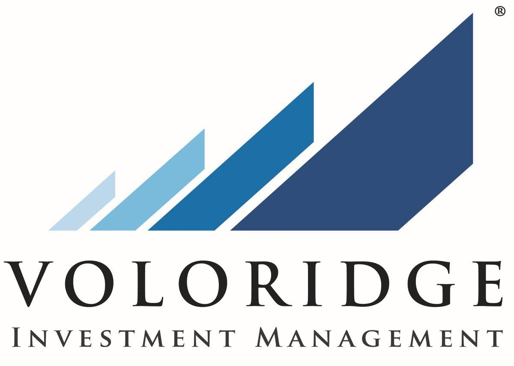

## Table of Contents

## What is Voloridge Investment Management?

Voloridge Investment Management is a company that invests money for other people. They use computers and math to decide where to put the money, hoping to make more money for their clients. The company was started by a man named Jon Wood and is based in Florida. They focus on trading stocks and other financial things quickly, often holding them for just a short time.

The way Voloridge works is a bit like a secret recipe. They use special computer programs to look at lots of information and make quick decisions. This method is called quantitative investing. It's different from traditional investing where people might pick stocks based on what they think or feel about a company. Instead, Voloridge lets the computers do the thinking, trying to find the best opportunities to make money.

## When was Voloridge Investment Management founded?

Voloridge Investment Management was started in 2009. It was founded by Jon Wood, who used to work at another big investment company called Renaissance Technologies. Jon wanted to create his own company where he could use computers and math to make smart investment choices.

The company is based in Florida and focuses on trading stocks and other financial things quickly. They use special computer programs to look at a lot of information and make quick decisions about where to invest money. This way of investing is called quantitative investing, and it's different because it relies on computers instead of people's opinions.

## Who founded Voloridge Investment Management?

Jon Wood founded Voloridge Investment Management. He used to work at a big company called Renaissance Technologies before he started his own company in 2009. Jon wanted to use computers and math to make smart choices about where to invest money.

Voloridge is based in Florida and focuses on trading stocks and other financial things quickly. They use special computer programs to look at a lot of information and make quick decisions. This way of investing is called quantitative investing, and it's different because it relies on computers instead of people's opinions.

## What is the primary focus of Voloridge Investment Management?

The main thing Voloridge Investment Management does is invest money for other people. They use computers and math to decide where to put the money, hoping to make more money for their clients. The company was started by Jon Wood and is based in Florida. They focus on trading stocks and other financial things quickly, often holding them for just a short time.

The way Voloridge works is a bit like a secret recipe. They use special computer programs to look at lots of information and make quick decisions. This method is called quantitative investing. It's different from traditional investing where people might pick stocks based on what they think or feel about a company. Instead, Voloridge lets the computers do the thinking, trying to find the best opportunities to make money.

## How does Voloridge Investment Management approach investing?

Voloridge Investment Management uses computers and math to decide where to invest money. They look at a lot of information quickly and make choices based on what the computers tell them. This way of investing is called quantitative investing. It's different from the usual way where people might pick stocks because they like a company or think it will do well. Instead, Voloridge lets the computers do the thinking, trying to find the best opportunities to make money.

The company was started by Jon Wood and is based in Florida. They focus on trading stocks and other financial things quickly, often holding them for just a short time. This quick trading is part of their strategy to make money for their clients. By using special computer programs, Voloridge can look at lots of data and make decisions faster than people could on their own.

## What types of investment strategies does Voloridge use?

Voloridge Investment Management uses a strategy called quantitative investing. This means they use computers and math to decide where to put money. They look at a lot of information quickly and make choices based on what the computers tell them. This is different from the usual way where people might pick stocks because they like a company or think it will do well. Instead, Voloridge lets the computers do the thinking, trying to find the best opportunities to make money.

The company focuses on trading stocks and other financial things quickly. They often hold these investments for just a short time. This quick trading is part of their strategy to make money for their clients. By using special computer programs, Voloridge can look at lots of data and make decisions faster than people could on their own. This approach helps them try to find the best times to buy and sell investments.

## What are the key performance metrics of Voloridge Investment Management?

Voloridge Investment Management looks at how well they are doing by checking things like how much money they make and how much risk they take. They use numbers to see if they are making more money than they are losing. This is important because it shows if their way of using computers and math to pick investments is working well. They also look at how their investments do compared to other ways of investing, like the stock market as a whole.

Another thing they check is how steady their returns are. They want to see if they can keep making money over time, not just sometimes. This helps them know if their quick trading and using computers to make choices is a good plan. By looking at these numbers, Voloridge can see if they are doing a good job for the people who give them money to invest.

## How has Voloridge Investment Management performed compared to market benchmarks?

Voloridge Investment Management has done well compared to the overall stock market. They use computers and math to pick investments, and this has helped them make more money than the market average in many years. For example, if the stock market goes up by 10%, Voloridge might go up by more than that. This shows that their way of using technology to invest is working well.

However, like all investments, Voloridge's performance can go up and down. Some years, they might not do as well as the market, but over time, they have been able to beat the market more often than not. This is important because it means that their quick trading and computer-based choices are generally good at finding the best times to buy and sell investments.

## What are the technological tools and systems used by Voloridge in their investment process?

Voloridge Investment Management uses special computer programs to help them decide where to invest money. These programs look at a lot of information very quickly. They use math to find patterns and make choices about buying and selling stocks. This is called quantitative investing. The computers help Voloridge make decisions faster than people could on their own.

The company also uses big computers to store and process all the data they need. These computers can handle a lot of information at once, which is important for their quick trading strategy. By using these technological tools, Voloridge can look at the market and make smart choices about where to put money, trying to make more money for their clients.

## What is the organizational structure of Voloridge Investment Management?

Voloridge Investment Management is run by Jon Wood, who started the company. He used to work at another big investment company called Renaissance Technologies. At Voloridge, Jon is in charge and makes sure everything runs smoothly. The company has different teams that work together. There are people who work on the computer programs, people who look at the data, and people who handle the money that clients give them to invest.

The company is based in Florida and has a team of smart people who know a lot about math and computers. They all work together to use the special computer programs to make investment choices. This way, they can look at a lot of information quickly and decide where to put money to try to make more money for their clients. Everyone at Voloridge has a job that helps the company use technology to invest well.

## How does Voloridge Investment Management handle risk management?

Voloridge Investment Management uses computers and math to manage risk. They look at a lot of information to see how risky an investment might be. If the computer says an investment is too risky, they might not put money into it. They also spread out their money across many different investments. This way, if one investment does badly, it won't hurt them too much because they have other investments that might do well.

They also keep an eye on how their investments are doing all the time. If something starts to look too risky, they can quickly sell it and buy something else. This quick trading helps them manage risk because they can change their investments fast. By using special computer programs, Voloridge can make smart choices about risk and try to keep their clients' money safe while still trying to make more money.

## What are the future plans or expansions of Voloridge Investment Management?

Voloridge Investment Management wants to keep growing and getting better at using computers and math to invest money. They plan to keep working on their special computer programs to make them even smarter. This way, they can look at more information and make even better choices about where to put money. They also want to find new ways to invest that can help them make more money for their clients.

The company might also start investing in new kinds of things, not just stocks. They could look into things like bonds or other financial stuff. By doing this, they can spread out their investments even more and try to make money in different ways. Voloridge wants to keep being a leader in using technology to invest and help their clients make more money.

## References & Further Reading

[1]: Asness, C. S., Liew, J. M., & Stevens, R. L. (1997). ["Parsimony in Practice: An Asset Allocation Framework."](https://pages.stern.nyu.edu/~lpederse/papers/ValMomEverywhere.pdf) Financial Analysts Journal.

[2]: ["Automated Trading with R: Quantitative Research and Platform Development"](https://link.springer.com/book/10.1007/978-1-4842-2178-5) by Chris Conlan

[3]: Kearns, M., & Nevmyvaka, Y. (2013). ["Machine Learning for Market Microstructure and High Frequency Trading."](https://www.cis.upenn.edu/~mkearns/papers/KearnsNevmyvakaHFTRiskBooks.pdf) In: Bourlard, H., & Bengio, S. (eds) High-Frequency Trading, Cambridge University Press.

[4]: ["Algorithmic and High-Frequency Trading"](https://assets.cambridge.org/97811070/91146/frontmatter/9781107091146_frontmatter.pdf) by Álvaro Cartea, Sebastian Jaimungal, and José Penalva

[5]: Chincarini, L. B., & Kim, D. (2006). ["Quantitative Equity Portfolio Management."](https://www.mhebooklibrary.com/doi/book/10.1036/9781264268931) McGraw-Hill Education.