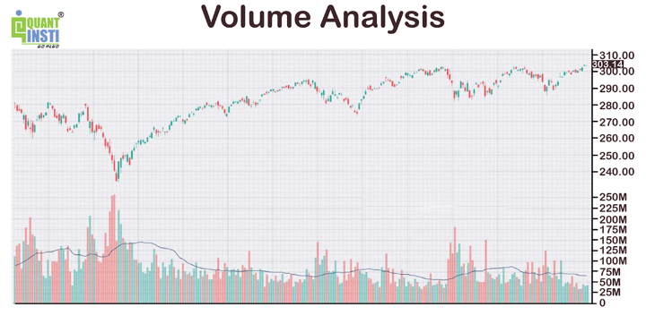

## Table of Contents

## What is volume analysis in the context of financial markets?

Volume analysis in financial markets is about looking at how many shares or contracts are traded in a certain time period, like a day or an hour. It helps traders and investors understand how strong a price movement is. If a stock's price goes up and the trading volume is high, it suggests that many people believe the price will keep going up. On the other hand, if the price goes up but the volume is low, it might mean the price increase is not very strong and could reverse soon.

Traders use volume analysis to make better decisions. For example, they might look for times when the volume is much higher than usual, which could signal that something important is happening with the stock. Volume can also help confirm trends. If a stock is in an uptrend and the volume is increasing as the price goes up, it supports the idea that the uptrend is strong. But if the volume starts to decrease while the price is still going up, it might be a warning sign that the trend is losing steam.

## How does volume relate to price movements in trading?

Volume is like a popularity contest for a stock's price movement. When the price of a stock goes up and the volume is high, it means a lot of people are buying the stock, which shows that the price increase is strong and more people believe the price will keep going up. If the price goes up but the volume is low, it's like only a few people are interested, so the price increase might not last long and could go back down soon.

On the other hand, when the price of a stock goes down and the volume is high, it means a lot of people are selling the stock, showing that the price decrease is strong and more people think the price will keep falling. If the price goes down with low volume, it suggests that not many people are selling, so the price drop might not be very important and could turn around soon. By looking at volume along with price, traders can get a better idea of how strong a price movement really is and make smarter trading decisions.

## What are the basic indicators used in volume analysis?

In volume analysis, one of the basic indicators is the Volume itself. It shows the total number of shares or contracts traded in a specific time period, like a day or an hour. Traders look at the volume to see if a price move is strong or weak. If a stock's price goes up and the volume is high, it means many people are buying, which is a sign of a strong upward move. If the volume is low when the price goes up, it might mean the move is not very strong and could reverse soon.

Another basic indicator is the On-Balance Volume (OBV). OBV adds the day's volume to a running total when the price goes up and subtracts it when the price goes down. It helps traders see if volume is supporting the price trend. If the OBV is going up while the price is going up, it means the trend is strong because more people are buying. If the OBV is going down or staying flat while the price is going up, it might mean the trend is weak and could change direction.

The Accumulation/Distribution Line is also a key volume indicator. It looks at where the stock's price closes within its daily range and combines this with the volume to see if the stock is being accumulated (bought) or distributed (sold). If the line is going up, it means the stock is being accumulated, which is a good sign for the price. If the line is going down, it means the stock is being distributed, which could be a warning sign for the price.

## How can volume analysis help in identifying market trends?

Volume analysis helps traders see how strong a market trend is by looking at how many shares or contracts are traded. When the price of a stock goes up and the trading volume is high, it means a lot of people are buying the stock. This shows that the upward trend is strong and more people believe the price will keep going up. On the other hand, if the price goes up but the volume is low, it might mean the upward trend is not very strong and could reverse soon. By watching the volume, traders can tell if a trend has enough support to keep going or if it might be about to change direction.

Volume can also help confirm if a trend is real or just a short-term move. For example, if a stock is in an uptrend and the volume keeps getting higher as the price goes up, it supports the idea that the uptrend is strong and likely to continue. But if the volume starts to decrease while the price is still going up, it might be a warning sign that the trend is losing steam and could soon reverse. By paying attention to these volume changes, traders can make better decisions about when to buy or sell a stock.

## What is the significance of volume spikes, and how should they be interpreted?

Volume spikes are when there's a big jump in the number of shares or contracts traded compared to normal days. This can be really important because it often means something big is happening with the stock. For example, if there's good news about a company and the stock price goes up with a volume spike, it shows that a lot of people believe in the good news and are buying the stock. On the other hand, if there's bad news and the stock price drops with a volume spike, it means a lot of people are selling the stock because they're worried about the bad news.

Interpreting volume spikes can help traders make better decisions. If you see a volume spike when the price is going up, it's a sign that the upward move is strong and might keep going. This could be a good time to buy the stock if you think the trend will continue. But if you see a volume spike when the price is going down, it's a sign that the downward move is strong and might keep going too. This could be a good time to sell the stock or stay away from it if you think the trend will continue. By watching volume spikes, traders can get a better idea of what's happening with a stock and make smarter choices.

## Can volume analysis be used to predict price reversals?

Volume analysis can help predict price reversals by showing if the current trend is strong or weak. When the price of a stock is going up, but the volume is getting lower, it might mean that fewer people are buying the stock. This can be a warning sign that the upward trend might not last and the price could start going down soon. On the other hand, if the price is going down but the volume is also getting lower, it might mean that not many people are selling the stock. This could be a sign that the downward trend is losing strength and the price might start going up again.

Traders often look for specific patterns in volume to predict reversals. One common pattern is when the price makes a new high or low, but the volume is lower than during the last high or low. This is called a divergence, and it can be a strong sign that the price is about to reverse. For example, if a stock's price reaches a new high but the volume is much lower than the last time it hit a high, it might mean the upward trend is running out of steam and the price could soon start going down. By watching these volume patterns, traders can get a better idea of when a price reversal might happen and make smarter trading decisions.

## How do volume profiles assist in understanding market dynamics?

Volume profiles help traders understand market dynamics by showing where most of the trading happens at different price levels over a period of time. It's like a map that tells you where a lot of people bought or sold a stock. If you see a lot of volume at a certain price, it means that price is important to many traders. This can help traders see where the stock might find support or resistance, which are levels where the price might stop going down or up.

By looking at volume profiles, traders can also see if the market is balanced or if it's leaning more towards buying or selling. If the volume is spread out evenly across different prices, it means the market is balanced, and the price might not move much. But if there's a lot of volume at higher prices, it might mean more people are buying and the price could go up. On the other hand, if there's a lot of volume at lower prices, it might mean more people are selling and the price could go down. Understanding these patterns helps traders make better decisions about when to buy or sell a stock.

## What advanced techniques exist for integrating volume with other technical indicators?

One advanced technique for integrating volume with other technical indicators is using the Volume Weighted Average Price (VWAP). VWAP takes the average price of a stock and weighs it by the volume traded at each price level. This helps traders see if a stock is trading above or below its average price for the day. If the stock price is above the VWAP, it might mean the stock is overvalued and could go down soon. If the stock price is below the VWAP, it might mean the stock is undervalued and could go up soon. By combining VWAP with other indicators like moving averages or RSI, traders can get a better idea of when to buy or sell a stock.

Another technique is using volume with the Relative Strength Index (RSI). RSI measures how fast the price of a stock is going up or down and if it's overbought or oversold. When you see a high volume and the RSI is overbought (above 70), it might mean the stock is due for a price drop. On the other hand, if you see high volume and the RSI is oversold (below 30), it might mean the stock is due for a price increase. By looking at volume along with the RSI, traders can spot potential price reversals and make better trading decisions.

A third technique involves using volume with chart patterns, like head and shoulders or double tops and bottoms. When these patterns form with high volume, it makes them more reliable. For example, if a head and shoulders pattern forms with a big increase in volume at the right shoulder, it's a strong sign that the price might go down soon. By combining volume with these chart patterns, traders can confirm the strength of the pattern and predict future price movements more accurately.

## How does volume analysis differ across various asset classes like stocks, forex, and commodities?

Volume analysis can be used in different ways depending on the asset class, like stocks, forex, and commodities. For stocks, volume is straightforward because it directly shows the number of shares traded. This helps traders see if a price move is strong or weak. If a stock's price goes up and the volume is high, it means a lot of people are buying the stock, which is a good sign for the price. In forex markets, volume is a bit different because it's not just about the number of trades but also about the size of each trade. Forex volume can help traders see how much money is moving in and out of currencies, which can show how strong a currency trend is.

In commodities markets, volume analysis can be trickier because there are different types of contracts, like futures and options, that traders need to look at. Volume in commodities can help traders see how much interest there is in a certain commodity and if the price move is backed by a lot of trading. For example, if the price of oil goes up and the volume of oil futures contracts traded is high, it means a lot of people are betting on higher oil prices. By understanding how volume works in each asset class, traders can make better decisions about when to buy or sell.

## What are common pitfalls and misconceptions about volume analysis?

One common pitfall in volume analysis is thinking that high volume always means a strong price move. Sometimes, high volume can happen because of a news event or a big trade, but it doesn't always mean the price will keep going in the same direction. For example, if a stock's price goes up with high volume but then goes back down the next day, it shows that the high volume didn't mean the price move was strong. Traders need to look at other things, like the trend and other indicators, to see if the volume is really supporting the price move.

Another misconception is that low volume always means a weak price move. Sometimes, low volume can happen when the market is calm, and the price can still keep going in the same direction. For example, if a stock is in a strong uptrend and the volume is low but the price keeps going up, it doesn't mean the trend is weak. It might just mean that not many people are trading, but the ones who are trading believe in the trend. Traders need to be careful and not just look at volume alone but also at the bigger picture of what's happening with the stock.

## How can algorithmic trading strategies incorporate volume analysis?

Algorithmic trading strategies can use volume analysis to make better decisions about when to buy or sell a stock. One way to do this is by setting up rules that look at volume along with the price. For example, an algorithm might be programmed to buy a stock when the price goes up and the volume is higher than usual. This can help the algorithm catch strong upward moves that are more likely to keep going. On the other hand, the algorithm might be set to sell a stock when the price goes down and the volume is high, which can help it avoid big losses if the price keeps falling.

Another way to use volume in algorithmic trading is by combining it with other indicators like moving averages or RSI. An algorithm might look for times when the price is above a moving average and the volume is increasing, which can be a sign of a strong trend. If the RSI is also showing that the stock is not overbought, the algorithm might decide to buy the stock. By using volume along with other indicators, the algorithm can make smarter decisions and improve its chances of making money.

## What are the latest research findings on the effectiveness of volume analysis in modern markets?

Recent research shows that volume analysis is still very useful in modern markets. A study by the Journal of Financial Markets found that volume can help predict short-term price movements better than just looking at the price alone. The study looked at a lot of data from different stocks and found that when the volume was high, the price moves that happened next were more likely to keep going in the same direction. This means that traders who use volume analysis can make better decisions about when to buy or sell a stock.

Another study in the Review of Financial Studies looked at how volume can help find trends in the market. The researchers found that volume can show if a trend is strong or weak. For example, if a stock's price is going up and the volume is also going up, it's a sign that the upward trend is strong and likely to keep going. But if the volume starts to go down while the price is still going up, it might mean the trend is losing strength and could reverse soon. By understanding these patterns, traders can use volume analysis to spot trends and make smarter trading choices.

## What are Key Volume Indicators?

Two widely utilized volume indicators in financial markets are On-Balance Volume (OBV) and Volume-Weighted Average Price (VWAP). These indicators provide crucial insights into market dynamics, aiding traders in making informed decisions.

On-Balance Volume (OBV) is a cumulative indicator that monitors volume changes to help determine market sentiment, particularly in identifying whether buying or selling pressure dominates. Developed by Joseph Granville in the 1960s, OBV is calculated by adding the current day's volume to a cumulative total when the closing price is higher than the previous day's closing price; conversely, subtracting the volume when the closing price is lower. The formula can be summarized as follows:

$$

\text{OBV} = \begin{cases} 
\text{OBV}_{\text{previous}} + \text{Volume} & \text{if } \text{Close}_{\text{today}} > \text{Close}_{\text{yesterday}} \\
\text{OBV}_{\text{previous}} - \text{Volume} & \text{if } \text{Close}_{\text{today}} < \text{Close}_{\text{yesterday}} \\
\text{OBV}_{\text{previous}} & \text{if } \text{Close}_{\text{today}} = \text{Close}_{\text{yesterday}} 
\end{cases}
$$

This indicator helps in detecting trends, with rising OBV indicating accumulation and falling OBV suggesting distribution.

Volume-Weighted Average Price (VWAP) differs in its approach, focusing on the average price of a security over a specified time period, weighted by volume. VWAP is primarily used by institutional traders as a benchmark to gauge trade execution efficiency. The formula for VWAP is:

$$

\text{VWAP} = \frac{\sum_{i}(P_i \times Q_i)}{\sum_{i} Q_i} 
$$

where $P_i$ is the price of the trade, $Q_i$ is the quantity of the trade, and the summation runs over all trades in the specified period.

VWAP serves as a tool to evaluate if a security is traded below or above its average price, aiding in making buy or sell decisions. When the current price is below VWAP, it may be considered undervalued, and overvalued if above it. This makes VWAP a reliable indicator for determining support and resistance levels within a trading session.

Both OBV and VWAP are integral to trading strategies, providing insights into market strength and trend confirmations. Their application assists traders in evaluating market conditions, with OBV highlighting the direction of volume flow and VWAP offering a price benchmark enhanced by volume weighting.

## How do you calculate volume indicators?

To calculate On-Balance Volume (OBV), begin by comparing the current day's closing price with the previous day's closing price. If the current closing price is higher, add the current day's volume to the OBV of the previous day. Conversely, if the current closing price is lower, subtract the current day's volume from the previous day's OBV. If the closing prices are the same, the OBV remains unchanged. This process results in a cumulative total that helps identify whether buying or selling pressure is dominating the market.

Mathematically, OBV can be expressed as:

$$
\text{OBV}_{\text{today}} = 
\begin{cases} 
\text{OBV}_{\text{yesterday}} + \text{Volume}_{\text{today}}, & \text{if } \text{Close}_{\text{today}} > \text{Close}_{\text{yesterday}} \\
\text{OBV}_{\text{yesterday}} - \text{Volume}_{\text{today}}, & \text{if } \text{Close}_{\text{today}} < \text{Close}_{\text{yesterday}} \\
\text{OBV}_{\text{yesterday}}, & \text{if } \text{Close}_{\text{today}} = \text{Close}_{\text{yesterday}}
\end{cases}
$$

In Python, the OBV can be computed using:

```python
def calculate_obv(prices, volumes):
    obv = [0]  # Starting with an OBV of 0
    for i in range(1, len(prices)):
        if prices[i] > prices[i - 1]:
            obv.append(obv[-1] + volumes[i])
        elif prices[i] < prices[i - 1]:
            obv.append(obv[-1] - volumes[i])
        else:
            obv.append(obv[-1])
    return obv
```

For the Volume-Weighted Average Price (VWAP), the calculation begins by multiplying the price by the volume for each trade throughout the specified period. The products are summed together, and the total is divided by the sum of the volumes traded during the same time frame. This provides a single price average, adjusted for volume, indicating the true mean price at which the security traded over that period.

The formula for VWAP is:

$$
\text{VWAP} = \frac{\sum (\text{Price} \times \text{Volume})}{\sum \text{Volume}}
$$

Below is a Python function to compute VWAP:

```python
def calculate_vwap(prices, volumes):
    total_volume_price = 0
    total_volume = 0
    for price, volume in zip(prices, volumes):
        total_volume_price += price * volume
        total_volume += volume
    return total_volume_price / total_volume if total_volume != 0 else 0
```

Both OBV and VWAP are essential tools in assessing market sentiment and average trading levels, offering insights into potential buying and selling pressure at various price points. Utilizing these volume indicators allows traders to make more informed decisions based on market activity.

## References & Further Reading

[1]: ["Technical Analysis of the Financial Markets: A Comprehensive Guide to Trading Methods and Applications"](https://www.amazon.com/Technical-Analysis-Financial-Markets-Comprehensive/dp/0735200661) by John J. Murphy

[2]: Granville, J. E. (1963). ["Granville's New Key to Stock Market Profits"](https://archive.org/details/newkeytostockmar0000gran).

[3]: Buff, A. (2001). ["The Complete Guide to Volume Price Analysis: Understanding Price Action for Improving Stock Selection"](https://sobrief.com/books/a-complete-guide-to-volume-price-analysis)

[4]: Chan, E. P. (2009). ["Quantitative Trading: How to Build Your Own Algorithmic Trading Business"](https://github.com/ftvision/quant_trading_echan_book)

[5]: Aronson, D. R. (2011). ["Evidence-Based Technical Analysis: Applying the Scientific Method and Statistical Inference to Trading Signals"](https://www.amazon.com/Evidence-Based-Technical-Analysis-Scientific-Statistical/dp/0470008741)

[6]: Lopez de Prado, M. (2018). ["Advances in Financial Machine Learning"](https://www.amazon.com/Advances-Financial-Machine-Learning-Marcos/dp/1119482089)

[7]: Jansen, S. (2020). ["Machine Learning for Algorithmic Trading: Predictive models to extract signals from market and alternative data for systematic trading strategies with Python"](https://www.amazon.com/Machine-Learning-Algorithmic-Trading-alternative/dp/1839217715)