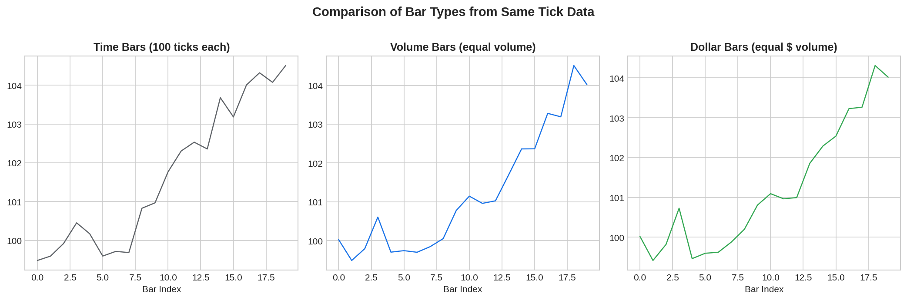
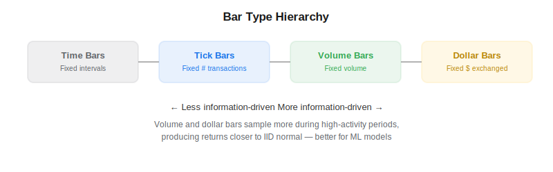

Volume bars and dollar bars are alternative data sampling methods introduced by Marcos Lopez de Prado in *Advances in Financial Machine Learning* (2018) that replace fixed-time intervals with fixed-activity intervals. Instead of creating one bar every minute or hour, volume bars create a new bar every time a fixed number of shares are traded, and dollar bars create a new bar every time a fixed dollar amount is exchanged. This produces return series that are closer to IID normal — a key requirement for most ML models in [algorithmic trading](https://paperswithbacktest.com/wiki/systematic-trading-strategies).

## Why Time Bars Are Problematic

Standard time bars (1-min, daily, etc.) have well-known statistical problems. Trading activity varies enormously throughout the day — the open and close are far more active than midday — and across days. This means time bars over-sample quiet periods and under-sample active ones. The result is returns that exhibit strong serial correlation, heteroscedasticity, and non-normality.



## Volume Bars

A volume bar is formed every time a cumulative total of $V$ shares (or contracts) have been traded. During high-activity periods, bars form quickly; during quiet periods, they form slowly. This synchronizes sampling with market activity.

$$\text{New bar when } \sum_{t=t_0}^{t_k} v_t \geq V$$

where $v_t$ is the volume of each transaction and $V$ is the bar threshold.

## Dollar Bars

Dollar bars extend the idea by normalizing for price changes. A dollar bar forms every time a cumulative dollar volume of $D$ has been exchanged:

$$\text{New bar when } \sum_{t=t_0}^{t_k} p_t \cdot v_t \geq D$$

This is especially useful for instruments whose price changes significantly over time — a stock that doubles in price sees twice the activity per share in dollar terms, and dollar bars account for this.



## Python Implementation

```python
import numpy as np
import pandas as pd

def make_volume_bars(ticks, volume_threshold):
    bars = []
    cum_vol = 0
    open_p = ticks.iloc[0]["price"]
    high_p = low_p = open_p
    for _, row in ticks.iterrows():
        cum_vol += row["volume"]
        high_p = max(high_p, row["price"])
        low_p = min(low_p, row["price"])
        if cum_vol >= volume_threshold:
            bars.append({"open": open_p, "high": high_p, "low": low_p,
                         "close": row["price"], "volume": cum_vol})
            cum_vol = 0
            open_p = row["price"]
            high_p = low_p = open_p
    return pd.DataFrame(bars)

def make_dollar_bars(ticks, dollar_threshold):
    bars = []
    cum_dol = 0
    cum_vol = 0
    open_p = ticks.iloc[0]["price"]
    high_p = low_p = open_p
    for _, row in ticks.iterrows():
        cum_dol += row["price"] * row["volume"]
        cum_vol += row["volume"]
        high_p = max(high_p, row["price"])
        low_p = min(low_p, row["price"])
        if cum_dol >= dollar_threshold:
            bars.append({"open": open_p, "high": high_p, "low": low_p,
                         "close": row["price"], "volume": cum_vol, "dollar_vol": cum_dol})
            cum_dol = cum_vol = 0
            open_p = row["price"]
            high_p = low_p = open_p
    return pd.DataFrame(bars)
```

## Key Parameters

| Bar Type | Threshold | How to Calibrate |
|---|---|---|
| Volume bars | $V$ shares | Target ~50 bars/day: $V \approx \text{avg daily volume} / 50$ |
| Dollar bars | $D$ dollars | Target ~50 bars/day: $D \approx \text{avg daily dollar volume} / 50$ |
| Tick bars | $T$ ticks | Target ~50 bars/day: $T \approx \text{avg daily ticks} / 50$ |

## Statistical Properties

Lopez de Prado demonstrates that volume and dollar bar returns are closer to normally distributed than time bar returns. Specifically, they exhibit lower serial correlation, more stable variance, and higher Jarque-Bera normality test p-values. These properties make them better inputs for ML models that assume (approximate) normality.

## Limitations and Risks

Volume and dollar bars require tick-level or at minimum trade-level data, which is more expensive and harder to store than daily bars. The threshold $V$ or $D$ must be recalibrated periodically as average daily volume changes. Additionally, these bars eliminate the time dimension — merging them with time-based features (like time-of-day effects) requires care.

## Conclusion

Volume bars and dollar bars are a simple but high-impact improvement over standard time bars. By sampling in proportion to market activity, they produce more statistically well-behaved data that leads to better ML model performance. Combined with [information-driven bars](https://paperswithbacktest.com/wiki/information-driven-bars) like [tick imbalance bars](https://paperswithbacktest.com/wiki/tick-imbalance-bars-tibs), they form the data foundation of the AFML pipeline.

---

**Explore further on PapersWithBacktest:**
- Browse [backtested strategies](https://paperswithbacktest.com/strategies) with Python code and performance metrics
- Access [clean historical market data](https://paperswithbacktest.com/datasets) for equities, crypto, and futures
- Take the [algo trading course](https://paperswithbacktest.com/course) — 60+ video lessons and notebooks
- Related wiki pages: [Tick Imbalance Bars](https://paperswithbacktest.com/wiki/tick-imbalance-bars-tibs) · [Information-Driven Bars](https://paperswithbacktest.com/wiki/information-driven-bars) · [Tick Data](https://paperswithbacktest.com/wiki/tick-data)
