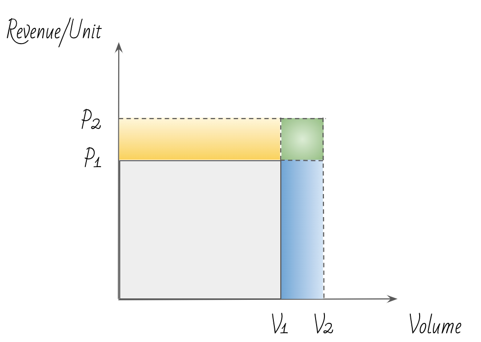

## Table of Contents

## What is the volume effect in the context of materials science?

The volume effect in materials science refers to how the size or volume of a material can change its properties. Imagine you have a small piece of metal and a big piece of the same metal. Even though they are made of the same stuff, the bigger piece might behave differently when you heat it, stretch it, or try to break it. This happens because larger volumes can have more flaws or imperfections inside them, which can affect how the material acts under different conditions.

For example, if you're testing the strength of a material, a tiny sample might seem very strong because it has fewer flaws. But if you test a larger sample, it might break more easily because it has more flaws spread throughout it. This is important for engineers and scientists to know because they need to predict how materials will perform in real-world applications, where the size of the material can make a big difference.

## How does the volume effect influence the properties of materials?

The volume effect can change how strong or tough a material is. When a material is small, it might seem very strong because it has fewer weak spots or flaws. But when the same material is made bigger, it can have more flaws inside it. These flaws can make the material break more easily. So, if you're using a material in a big structure like a bridge or a building, you need to think about how its size might make it weaker than you expected.

This effect is also important when you heat or cool a material. A small piece might handle temperature changes well, but a big piece might crack or expand differently. This happens because the heat can spread through the material in different ways depending on its size. Engineers need to know about the volume effect to make sure that materials will work safely and reliably in all kinds of situations, from tiny parts in electronics to huge parts in construction.

## Can you explain the basic principles behind the volume effect?

The volume effect is all about how the size of a material can change how it behaves. When a material is small, it might seem really strong because it doesn't have many weak spots or flaws inside it. But when you make the same material bigger, it can have more of these flaws. These flaws can make the material break more easily. So, if you're using a material in something big like a bridge or a building, you need to think about how its size might make it weaker than you thought.

This effect is also important when you heat or cool a material. A small piece might handle temperature changes well, but a big piece might crack or expand differently. This happens because the heat can spread through the material in different ways depending on its size. Engineers need to know about the volume effect to make sure that materials will work safely and reliably in all kinds of situations, from tiny parts in electronics to huge parts in construction.

## What are some common examples of the volume effect in everyday materials?

One common example of the volume effect is in glass. If you have a small glass ornament, it might be able to handle being dropped without breaking. But if you have a large glass window, it's much more likely to shatter if something hits it. This is because the larger piece of glass has more flaws inside it, making it weaker overall.

Another example is in metal parts used in construction. A small metal bolt might be very strong and able to hold a lot of weight. But if you use a much larger piece of the same metal, like a big steel beam, it might not be as strong as you expect. The larger beam can have more tiny cracks or flaws inside it, which can make it break under stress.

These examples show how important it is to think about the size of materials when using them in everyday life. Whether it's glass, metal, or other materials, the volume effect can change how strong or tough they are, and this can affect everything from the safety of buildings to the durability of everyday objects.

## How is the volume effect measured and quantified in experiments?

Scientists measure the volume effect by testing materials of different sizes under the same conditions. They might stretch, bend, or break samples of different sizes to see how their strength changes. For example, they could take a small piece of metal and a big piece of the same metal and see how much force it takes to break each one. By comparing the results, they can see how the size of the material affects its strength. This helps them understand how flaws or imperfections inside the material grow with its size.

To quantify the volume effect, scientists use numbers to describe how much the strength of a material changes with its size. They might use a formula that shows the relationship between the volume of the material and its strength. For example, they could find that the strength of a material decreases by a certain percentage for every increase in volume. This information is important for engineers who need to predict how materials will behave in real-world situations, like in buildings or machines, where the size of the material can make a big difference.

## What role does the volume effect play in the design of composite materials?

When designing composite materials, the volume effect is really important. Composite materials are made from different materials mixed together, like how fiberglass is made from glass fibers and a plastic resin. The size of these materials can change how strong or tough the final composite is. If you use bigger pieces of the materials, the composite might have more flaws or weak spots inside it. This can make the whole thing weaker than if you used smaller pieces. So, engineers need to think about the size of the materials they are using to make sure the composite will be strong enough for what it needs to do.

In practice, this means that when engineers are designing something like an airplane wing or a car part made from composites, they have to carefully choose the size of the materials they use. They might do a lot of tests to see how different sizes affect the strength of the composite. By understanding the volume effect, they can make the composite stronger and more reliable. This is important because these parts need to be safe and last a long time, no matter how big or small they are.

## How does the volume effect impact the performance of electronic devices?

The volume effect can have a big impact on how well electronic devices work. Imagine a tiny chip inside a smartphone. This chip needs to be very strong and reliable because it's doing a lot of important work. If the chip is small, it might be able to handle heat and stress really well. But if you make the chip bigger, it might not work as well because it could have more flaws or weak spots inside it. These flaws can make the chip break or stop working when it gets hot or is under a lot of stress.

This is important for people who design electronic devices. They need to think about how big or small the parts inside the device should be. If they use bigger parts, they might need to do more tests to make sure the device will still work well. By understanding the volume effect, they can make sure that the electronic device, whether it's a phone, a computer, or something else, will be strong and reliable no matter how big or small it is.

## What are the theoretical models used to predict the volume effect in materials?

Scientists use different theoretical models to predict how the size of a material can change its strength. One common model is the Weibull distribution, which helps predict the chances of a material breaking based on its size. The idea is that bigger pieces of a material are more likely to have flaws inside them, which can make them break more easily. By using this model, scientists can guess how strong a material will be if they make it bigger or smaller. This is really useful for designing things like buildings or machines, where knowing how strong the materials will be is very important.

Another model that helps with this is the fracture mechanics approach. This model looks at how cracks grow inside a material and how the size of the material can affect this. It uses math to figure out how likely a crack is to grow and cause the material to break. By understanding how cracks behave in different sizes of materials, engineers can make better predictions about how strong a material will be. Both of these models help scientists and engineers make sure that the materials they use will be safe and strong, no matter how big or small they are.

## How do temperature and pressure affect the volume effect in different materials?

Temperature and pressure can change how the volume effect works in materials. When you heat up a material, it can expand and get bigger. If the material is small, it might handle this expansion well. But if it's a big piece, the heat might spread through it differently, and it could crack or break because of more flaws inside. This is important for things like metal parts in engines or glass in windows, where the material needs to stay strong even when it gets hot.

Pressure also plays a role. When you squeeze a material, it can change shape or even get smaller. A small piece of material might be able to handle this pressure without breaking. But a bigger piece might have more weak spots, and the pressure could make these flaws grow, causing the material to break. Engineers need to think about how temperature and pressure will affect the size and strength of materials when they design things like airplane parts or deep-sea equipment, where the conditions can be extreme.

## What advanced techniques are used to study the volume effect at the nanoscale?

At the nanoscale, scientists use special tools like scanning electron microscopes (SEMs) and transmission electron microscopes (TEMs) to study the volume effect. These microscopes can zoom in really close to see tiny flaws or imperfections inside very small pieces of material. By looking at these flaws, scientists can understand how the size of the material changes its strength. They can also use computer simulations to predict how these tiny pieces of material will behave under different conditions, like when they are stretched or heated.

Another technique is nanoindentation, which is like poking the material with a tiny needle to see how hard it is. This helps scientists measure the strength of very small pieces of material and see how it changes with size. By combining these techniques, scientists can get a better idea of how the volume effect works at the nanoscale. This is important for making tiny parts in things like computer chips or medical devices, where the material needs to be strong and reliable even when it's very small.

## How can the understanding of the volume effect lead to innovations in material engineering?

Understanding the volume effect can help engineers create new and better materials. By knowing how the size of a material changes its strength, engineers can design materials that are strong and reliable, no matter how big or small they are. For example, they might use smaller pieces of a material to make it stronger for use in tiny parts like those in electronics. Or they might find ways to reduce flaws in larger pieces of material, so they can be used safely in big structures like buildings or bridges. This knowledge helps engineers make materials that work better in all kinds of situations.

This understanding also leads to new ways of testing and improving materials. Engineers can use advanced tools like microscopes and computer simulations to study how flaws grow in materials of different sizes. With this information, they can develop new methods to make materials stronger and more durable. For instance, they might create new composite materials that are designed to have fewer flaws, or they might find new ways to treat materials to make them more resistant to breaking. By using the volume effect to guide their work, engineers can come up with innovative solutions that make our world safer and more efficient.

## What are the current research challenges and future directions in studying the volume effect?

One big challenge in studying the volume effect is figuring out how to measure and predict it accurately. Scientists need to find better ways to see and understand the tiny flaws inside materials, especially when those materials are very small. This is hard because the tools they use, like microscopes, need to be very precise. Another challenge is making sure that the models they use to predict the volume effect work well for all kinds of materials, from metals to plastics to composites. Right now, these models are good but not perfect, and scientists are working to make them better.

In the future, researchers hope to develop new materials that are designed to be strong no matter their size. They want to use what they learn about the volume effect to make materials with fewer flaws, so they can be used safely in everything from tiny electronic parts to huge construction projects. They also want to find new ways to test materials quickly and easily, so they can see how the volume effect works in real-world situations. By solving these challenges, scientists can help create safer and more reliable materials for all kinds of uses.

## References & Further Reading

[1]: Bergstra, J., Bardenet, R., Bengio, Y., & Kégl, B. (2011). ["Algorithms for Hyper-Parameter Optimization."](https://papers.nips.cc/paper_files/paper/2011/hash/86e8f7ab32cfd12577bc2619bc635690-Abstract.html) Advances in Neural Information Processing Systems 24.

[2]: ["Advances in Financial Machine Learning"](https://www.amazon.com/Advances-Financial-Machine-Learning-Marcos/dp/1119482089) by Marcos Lopez de Prado

[3]: ["Evidence-Based Technical Analysis: Applying the Scientific Method and Statistical Inference to Trading Signals"](https://www.wiley.com/en-gb/Evidence+Based+Technical+Analysis:+Applying+the+Scientific+Method+and+Statistical+Inference+to+Trading+Signals-p-9780470008744) by David Aronson

[4]: ["Machine Learning for Algorithmic Trading"](https://www.amazon.com/Machine-Learning-Algorithmic-Trading-intelligence/dp/9918608013) by Stefan Jansen

[5]: ["Quantitative Trading: How to Build Your Own Algorithmic Trading Business"](https://www.amazon.com/Quantitative-Trading-Build-Algorithmic-Business/dp/0470284889) by Ernest P. Chan